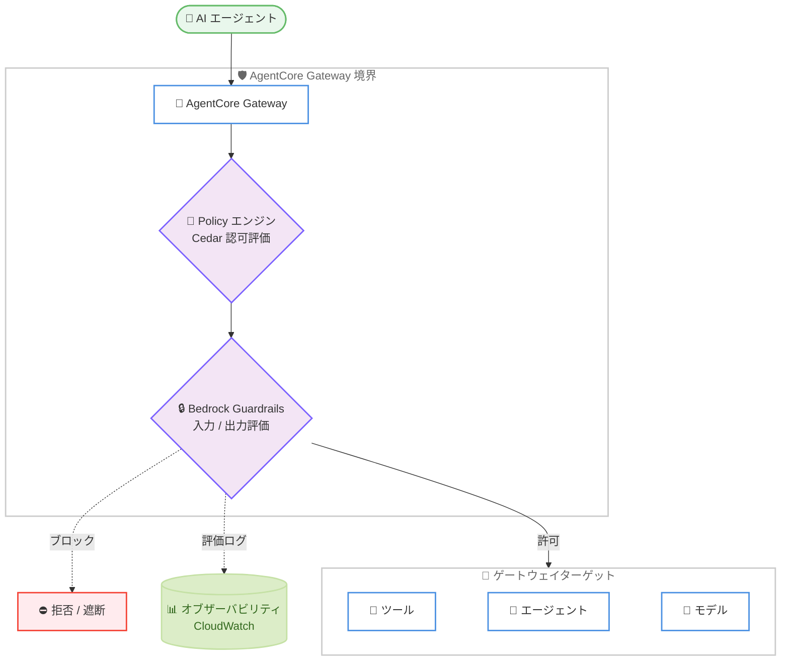

# Amazon Bedrock AgentCore - Policy での Bedrock Guardrails サポート

**リリース日**: 2026 年 6 月 17 日
**サービス**: Amazon Bedrock AgentCore
**機能**: Policy における Amazon Bedrock Guardrails 統合

📊 [このアップデートのインフォグラフィックを見る](https://takech9203.github.io/aws-news-summary/20260617-amazon-bedrock-agentcore-policy-guardrails-generally-available.html)

## 概要

Amazon Bedrock AgentCore の Policy 機能で、Amazon Bedrock Guardrails がサポートされるようになりました。これにより、AI エージェントを本番環境で大規模に展開する際の安全性とセキュリティの制御が強化されます。

AgentCore の Policy は、AI エージェントが実行できるアクションを制御する認可機能です。今回の統合により、Guardrails が AgentCore Gateway の境界 (perimeter) で、認可された各エージェントアクションの出力と、ゲートウェイターゲット (ツール、エージェント、モデル) への各呼び出しの入力をリアルタイムで評価します。評価はエージェントのコードの外側で実行されるため、エージェントの自律性の高さにかかわらず、一貫したポリシー適用が保証されます。

この機能は、プロンプトインジェクション攻撃や機密データの漏えいといった、AI エージェント特有の主要なセキュリティリスクから保護します。脅威が下流のシステムに到達する前に検出し、ブロックします。すべての評価は AgentCore のオブザーバビリティ機能を通じてログに記録され、監査と最適化に活用できます。

**アップデート前の課題**

- 以前は、エージェントのコード内にセキュリティ制御を個別に実装する必要があり、実装の一貫性を保つことが困難でした
- 以前は、プロンプトインジェクション攻撃や機密情報の漏えいに対して、エージェントごとに防御策を組み込む必要がありました
- 以前は、エージェントの操作がコードに依存していたため、エージェントの実装方法によってポリシーが回避されるリスクがありました

**アップデート後の改善**

- 今回のアップデートにより、Guardrails を AgentCore Gateway の境界で適用でき、エージェントのコードを変更せずに一貫したセキュリティ制御が可能になりました
- 今回のアップデートにより、プロンプトインジェクション、有害なコンテンツ、機密情報の漏えいをゲートウェイの境界で一元的に検出およびブロックできるようになりました
- 今回のアップデートにより、既存のゲートウェイデプロイメントでそのまま利用でき、新しいインフラストラクチャの構築が不要になりました

## アーキテクチャ図

エージェントからのすべてのトラフィックは AgentCore Gateway の境界を通過し、Policy エンジンによる認可評価と Bedrock Guardrails による入出力評価を経てから、ツールやモデルなどのターゲットに到達します。すべての評価結果はオブザーバビリティ機能を通じてログに記録されます。

## サービスアップデートの詳細

### 主要機能

1. **境界での Guardrails 評価**
   - 認可された各エージェントアクションの出力と、ゲートウェイターゲット (ツール、エージェント、モデル) への各呼び出しの入力をリアルタイムで評価します
   - 評価は AgentCore Gateway の境界で、エージェントのコードの外側で実行されます
   - エージェントの自律性の高さにかかわらず、一貫したポリシー適用が保証されます

2. **AI エージェント特有の脅威の検出とブロック**
   - プロンプトインジェクション攻撃を検出およびブロックします
   - 有害なコンテンツを検出します
   - 機密情報の漏えいを検出およびブロックします

3. **既存環境への統合**
   - 既存のゲートウェイデプロイメントでそのまま動作します
   - 新しいインフラストラクチャの構築は不要です
   - ポリシーは自然言語または policy-as-code (Cedar) で記述できます

4. **オブザーバビリティとの連携**
   - すべての評価は AgentCore のオブザーバビリティ機能を通じてログに記録されます
   - CloudWatch のメトリクスとログにより、監査と最適化に活用できます

## 技術仕様

### Policy の構成要素

| 項目 | 詳細 |
|------|------|
| ポリシー言語 | Cedar (オープンソースの認可ポリシー言語) |
| ポリシー記述方法 | Cedar による policy-as-code、または自然言語 (英語のプロンプト) |
| 評価ポイント | AgentCore Gateway の境界 (エージェントコードの外側) |
| 評価対象 | エージェントアクションの出力、ゲートウェイターゲットへの入力 |
| アクセス制御 | ユーザー ID とツールの入力パラメータに基づくきめ細かい制御 |
| モニタリング | CloudWatch のメトリクスおよびログとの統合 |
| 監査 | ポリシー判定の詳細なログを保持 |

### 自然言語によるポリシー記述

自然言語によるポリシー記述では、ユーザーの意図を解釈して候補となるポリシーを生成し、ツールスキーマに対して検証します。さらに自動推論 (Automated Reasoning) を用いて、過度に許可的なポリシー、過度に制限的なポリシー、または決して満たされない条件を含むポリシーを特定するなど、安全性条件をチェックします。これにより、ポリシーを適用する前にこれらの問題を発見できます。

### API 変更履歴

今回のアップデートに直接対応する awsapichanges.com の API 変更エントリは、確認時点では公開されていませんでした。

## 設定方法

### 前提条件

1. Amazon Bedrock AgentCore Gateway がデプロイされていること
2. AgentCore Gateway および Policy に必要な IAM 権限が付与されていること
3. 評価に使用する Amazon Bedrock Guardrails が作成されていること

### 手順

#### ステップ 1: ポリシーエンジンの作成

AgentCore でポリシーエンジンを作成します。ポリシーエンジンは、決定論的なポリシーを格納し、ゲートウェイに関連付けるためのコンテナとなります。

#### ステップ 2: ポリシーの作成と Guardrails の関連付け

Cedar 言語または自然言語でポリシーを記述し、ポリシーエンジンに格納します。Bedrock Guardrails を関連付けることで、入出力の評価を境界で実行できるようになります。

#### ステップ 3: ゲートウェイへの関連付けと検証

ポリシーエンジンを AgentCore Gateway に関連付けます。適用前にポリシーを検証およびテストし、意図したとおりにアクションが制御されることを確認します。詳細な設定手順は公式ドキュメントを参照してください。

## メリット

### ビジネス面

- **大規模な本番展開の安全性**: AI エージェントをエンタープライズ規模で安全に展開でき、セキュリティリスクを低減します
- **コンプライアンス対応**: すべてのポリシー判定がログに記録されるため、セキュリティおよびコンプライアンスチームがエージェントの挙動を監査および検証できます
- **追加インフラ不要**: 既存のゲートウェイデプロイメントで利用でき、導入コストと運用負荷を抑えられます

### 技術面

- **コード外でのセキュリティ制御**: セキュリティ制御をエージェントコードの外側に配置することで、開発者はエージェント機能の構築に集中できます
- **一貫した適用**: 境界で評価するため、エージェントの実装方法にかかわらず一貫したポリシー適用が保証されます
- **柔軟な記述方法**: Cedar による厳密な記述と自然言語による記述の両方をサポートし、習熟度の異なる開発者が利用できます

## デメリット・制約事項

### 制限事項

- 利用可能リージョンが限定されています (後述の「利用可能リージョン」を参照)
- 評価は AgentCore Gateway を経由するトラフィックに適用されます。ゲートウェイを経由しない経路には適用されません

### 考慮すべき点

- ポリシー評価には消費量ベースの料金が発生します。評価回数に応じたコストを見積もる必要があります
- 過度に制限的なポリシーは正当なエージェントアクションをブロックする可能性があるため、適用前の検証とテストが重要です

## ユースケース

### ユースケース 1: プロンプトインジェクション対策

**シナリオ**: 顧客対応を自動化する AI エージェントが、外部から受け取る入力に悪意あるプロンプトが含まれるリスクに直面している。

**効果**: ゲートウェイ境界で入力を評価し、プロンプトインジェクションを検出およびブロックすることで、下流のツールやモデルへの不正な操作を防止できます。

### ユースケース 2: 機密データ漏えいの防止

**シナリオ**: 複数のツールと連携するエージェントが、誤って個人情報や機密情報を出力してしまう懸念がある。

**効果**: 認可されたアクションの出力を境界で評価し、機密情報の漏えいを検出およびブロックすることで、データ保護を強化できます。

### ユースケース 3: エンタープライズ規模での一貫したガバナンス

**シナリオ**: 複数のチームが多数の自律エージェントを運用しており、組織全体で一貫したセキュリティ境界を維持する必要がある。

**効果**: 境界で一度ポリシーを設定すれば、すべてのエージェントとツールに一貫して適用され、すべての判定が CloudWatch にログ記録されるため、組織全体のガバナンスと監査性が向上します。

## 料金

Policy の評価には消費量ベースの料金 (consumption-based pricing) が適用されます。ポリシー評価の実行回数に応じて課金されます。最新の正確な料金については、公式の料金ページを参照してください。

## 利用可能リージョン

本機能は以下のリージョンで利用可能です。

- 米国東部 (バージニア北部)
- 欧州 (ロンドン)
- 欧州 (ストックホルム)
- アジアパシフィック (シドニー)
- アジアパシフィック (東京)

## 関連サービス・機能

- **Amazon Bedrock Guardrails**: エージェントの入出力に対する有害コンテンツ、プロンプトインジェクション、機密情報の検出を担う評価エンジン
- **Amazon Bedrock AgentCore Gateway**: エージェントとツール、モデル間のトラフィックを仲介し、ポリシー評価の境界となるコンポーネント
- **Cedar**: ポリシーを記述するためのオープンソースの認可ポリシー言語
- **Amazon CloudWatch**: ポリシー評価のメトリクスおよびログを記録し、監査と最適化に利用

## 参考リンク

- 📊 [インフォグラフィック](https://takech9203.github.io/aws-news-summary/20260617-amazon-bedrock-agentcore-policy-guardrails-generally-available.html)
- [公式発表 (What's New)](https://aws.amazon.com/about-aws/whats-new/2026/06/amazon-bedrock-agentcore-policy-guardrails-generally-available)
- [Amazon Bedrock AgentCore 製品ページ](https://aws.amazon.com/bedrock/agentcore/)
- [ドキュメント (Policy in Amazon Bedrock AgentCore)](https://docs.aws.amazon.com/bedrock-agentcore/latest/devguide/policy.html)

## まとめ

このアップデートにより、AI エージェントのセキュリティ制御をエージェントコードの外側、すなわち AgentCore Gateway の境界で一貫して適用できるようになりました。プロンプトインジェクションや機密データ漏えいといった主要なリスクに対し、既存のインフラストラクチャを変更せずに保護を追加できます。AI エージェントを本番環境で大規模に運用しているお客様は、ポリシーエンジンと Bedrock Guardrails の関連付けを検証環境で評価し、組織のセキュリティ要件に合わせた展開を検討することをお勧めします。
