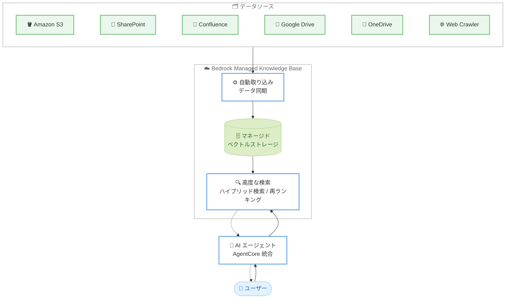

# Amazon Bedrock - Managed Knowledge Base

**リリース日**: 2026 年 6 月 17 日
**サービス**: Amazon Bedrock
**機能**: Amazon Bedrock Managed Knowledge Base (一般提供開始)

📊 [このアップデートのインフォグラフィックを見る](https://takech9203.github.io/aws-news-summary/20260617-amazon-bedrock-managed-knowledge-base.html)
<!-- INFOGRAPHIC_BASE_URL は環境変数から取得 -->

## 概要

AWS は、Amazon Bedrock Managed Knowledge Base の一般提供 (GA) を発表しました。これは、エンタープライズデータに基づいて根拠付けされた本番環境レベルの AI エージェントを構築できる、フルマネージドの検索拡張生成 (RAG) サービスです。開発者はベクトルデータベース、データパイプライン、検索インフラを自前で運用することなく、データの取り込み、ストレージ最適化、高度な検索を Amazon Bedrock に任せることができます。

このサービスは、プロトタイプから本番環境までの移行を高速化することを目的としています。従来の RAG 構築では、ベクトルストアの選定、埋め込み処理のパイプライン構築、検索精度のチューニングといった作業が必要でしたが、Managed Knowledge Base はこれらをマネージドサービスとして提供します。Amazon S3、SharePoint、Confluence、Google Drive、OneDrive、Web Crawler の 6 つのネイティブコネクタによる自動データ同期と、価格性能比に最適化されたマネージドベクトルストレージを備えています。

主な対象ユーザーは、社内向けの従業員アシスタント、カスタマーサポートの自動化、テキスト、動画、音声、画像を横断するマルチモーダルナレッジベースなどを構築したい開発者やソリューションアーキテクトです。Amazon Bedrock AgentCore とのネイティブ統合により、権限の自動生成とビルトインの可観測性も利用できます。

**アップデート前の課題**

- 以前は RAG アプリケーションを構築する際、ベクトルデータベースの選定、プロビジョニング、運用を利用者自身が行う必要がありました
- 以前はデータソースからの取り込み、埋め込み生成、同期処理のパイプラインを個別に実装する必要がありました
- 以前は複数のデータソースをまたぐ複雑なマルチホップクエリに対して、クエリプランニングや再ランキングを自前で組み込む必要がありました

**アップデート後の改善**

- 今回のアップデートにより、ベクトルストレージとデータパイプラインをマネージドサービスとして利用でき、インフラ運用が不要になりました
- 今回のアップデートにより、6 つのネイティブコネクタで主要なエンタープライズデータソースを自動同期できるようになりました
- 今回のアップデートにより、ハイブリッド検索、ドキュメントランキング、エージェント型検索 (Agentic Retrieval) による高度な検索が標準で利用できるようになりました

## アーキテクチャ図



データソースから取り込まれたデータがマネージドベクトルストレージに格納され、AI エージェントからの問い合わせに対して高度な検索を通じて根拠付けされた回答を返す流れを示しています。

## サービスアップデートの詳細

### 主要機能

1. **高度な検索 (Advanced Retrieval)**
   - ハイブリッド検索により、セマンティック検索とキーワード検索を組み合わせて関連性を高めます
   - ドキュメントランキングによって、取得結果の精度を向上させます
   - エージェント型検索 (Agentic Retrieval) は、クエリプランニング、中間応答の評価、再ランキングを自律的に行い、複雑なマルチホップクエリに対応します

2. **6 つのネイティブデータコネクタ**
   - Amazon S3、SharePoint、Confluence、Google Drive、OneDrive、Web Crawler に対応します
   - 自動データ同期により、データソースの更新をナレッジベースに反映します
   - 価格性能比に最適化されたマネージドベクトルストレージを利用します

3. **マルチモーダルナレッジベース**
   - テキスト、動画、音声、画像を横断するナレッジベースを構築できます
   - 従業員アシスタント、カスタマーサポートの自動化などのユースケースに活用できます

4. **Amazon Bedrock AgentCore とのネイティブ統合**
   - 権限の自動生成 (auto-generated permissions) により、設定の手間を軽減します
   - ビルトインの可観測性 (observability) によって、エージェントの動作を把握できます

## 技術仕様

### 主要なコンポーネント

| 項目 | 詳細 |
|------|------|
| サービス種別 | フルマネージド検索拡張生成 (RAG) サービス |
| データコネクタ | Amazon S3、SharePoint、Confluence、Google Drive、OneDrive、Web Crawler |
| 検索方式 | ハイブリッド検索、ドキュメントランキング、エージェント型検索 |
| ベクトルストレージ | マネージド (価格性能比に最適化) |
| 対応モダリティ | テキスト、動画、音声、画像 |
| 統合先 | Amazon Bedrock AgentCore |

### API 変更履歴

| 日付 | サービス | 変更内容 |
|------|----------|----------|
| 2026/06/17 | [Agents for Amazon Bedrock](https://awsapichanges.com/archive/changes/ecddc1-bedrock-agent.html) | 3 new 15 updated api methods - Bedrock Managed Knowledge Base を提供開始。Knowledge Base リソースに対するリソースベースポリシー (PutResourcePolicy、GetResourcePolicy、DeleteResourcePolicy) をサポートし、クロスアカウントアクセスを実現 |
| 2026/06/17 | [Agents for Amazon Bedrock Runtime](https://awsapichanges.com/archive/changes/ecddc1-bedrock-agent-runtime.html) | 2 new 7 updated api methods - 会話履歴を用いたマルチホップ・マルチ KB 推論を自律的に計画する AgenticRetrieveStream API を追加。Retrieve API はアクセス制御ベースのフィルタリングに対応 |

主な API メソッドには、ナレッジベースとデータソースを管理する `CreateKnowledgeBase`、`CreateDataSource`、`StartIngestionJob`、`IngestKnowledgeBaseDocuments` などの制御プレーン API と、`AgenticRetrieveStream`、`Retrieve`、`RetrieveAndGenerate`、`GetDocumentContent` などのデータプレーン API が含まれます。

### リソースベースポリシーの例

```json
{
  "Version": "2012-10-17",
  "Statement": [
    {
      "Effect": "Allow",
      "Principal": {
        "AWS": "arn:aws:iam::123456789012:root"
      },
      "Action": [
        "bedrock:Retrieve",
        "bedrock:RetrieveAndGenerate"
      ],
      "Resource": "arn:aws:bedrock:us-east-1:111122223333:knowledge-base/KB_ID"
    }
  ]
}
```

上記は、別アカウント (123456789012) からのクロスアカウントアクセスを許可するリソースベースポリシーの例です。

## 設定方法

### 前提条件

1. Amazon Bedrock が利用可能なリージョンの AWS アカウントを保有していること
2. 対象の基盤モデルへのアクセスが有効化されていること
3. データソース (Amazon S3 バケットや SharePoint サイトなど) へのアクセス権限が構成されていること

### 手順

#### ステップ1: ナレッジベースの作成

```bash
aws bedrock-agent create-knowledge-base \
  --name "enterprise-kb" \
  --role-arn "arn:aws:iam::111122223333:role/BedrockKBRole" \
  --region us-east-1
```

`create-knowledge-base` でマネージドナレッジベースを作成します。ベクトルストレージはマネージドで提供されるため、ベクトルデータベースの個別構成は不要です。

#### ステップ2: データソースの追加

```bash
aws bedrock-agent create-data-source \
  --knowledge-base-id "KB_ID" \
  --name "s3-source" \
  --data-source-configuration '{"type":"S3","s3Configuration":{"bucketArn":"arn:aws:s3:::my-docs"}}' \
  --region us-east-1
```

`create-data-source` で Amazon S3 などのデータソースを登録します。S3、SharePoint、Confluence、Google Drive、OneDrive、Web Crawler の各コネクタを指定できます。

#### ステップ3: データの取り込みと検索

```bash
aws bedrock-agent start-ingestion-job \
  --knowledge-base-id "KB_ID" \
  --data-source-id "DS_ID" \
  --region us-east-1
```

`start-ingestion-job` で取り込みジョブを開始します。取り込みが完了すると、`Retrieve` や `AgenticRetrieveStream` などのデータプレーン API を通じてナレッジベースを検索できます。

## メリット

### ビジネス面

- **市場投入までの時間短縮**: プロトタイプから本番環境への移行を高速化し、RAG アプリケーションを迅速に提供できます
- **運用負荷の軽減**: ベクトルデータベースやデータパイプラインの運用が不要になり、開発リソースをアプリケーションの価値創出に集中できます
- **幅広いデータ活用**: 主要なエンタープライズデータソースに対応し、社内に分散した情報を一元的に活用できます

### 技術面

- **検索精度の向上**: ハイブリッド検索、ドキュメントランキング、エージェント型検索により、複雑なクエリにも高い精度で回答できます
- **マルチモーダル対応**: テキストだけでなく、動画、音声、画像を横断したナレッジベースを構築できます
- **セキュアなアクセス制御**: リソースベースポリシーによるクロスアカウントアクセスと、アクセス制御ベースのフィルタリングをサポートします

## デメリット・制約事項

### 制限事項

- 提供リージョンが限定されており、現時点では一部のリージョンのみで利用可能です
- ネイティブコネクタは Amazon S3、SharePoint、Confluence、Google Drive、OneDrive、Web Crawler の 6 種類に限定されます
- 公式発表時点では具体的な料金体系の数値は示されておらず、ベクトルストレージは価格性能比に最適化されているとの記載のみです

### 考慮すべき点

- マネージドベクトルストレージを利用するため、ベクトルストアの細かな構成を自前で制御したい場合は適合性を確認する必要があります
- データソースの同期頻度や取り込み量に応じたコストとパフォーマンスの影響を事前に評価することを推奨します

## ユースケース

### ユースケース1: 社内従業員アシスタント

**シナリオ**: SharePoint や Confluence に分散した社内ドキュメントを横断的に検索し、従業員からの質問に回答するアシスタントを構築します。

**実装例**:
```
データソース: SharePoint + Confluence
検索方式: ハイブリッド検索 + エージェント型検索
統合: Amazon Bedrock AgentCore
```

**効果**: 社内情報の検索時間を短縮し、従業員の生産性を向上させます。

### ユースケース2: カスタマーサポート自動化

**シナリオ**: 製品マニュアルや FAQ を Amazon S3 に格納し、顧客からの問い合わせに自動で回答するサポートエージェントを構築します。

**実装例**:
```
データソース: Amazon S3 + Web Crawler
検索方式: ドキュメントランキング
API: RetrieveAndGenerate
```

**効果**: 問い合わせ対応の自動化により、サポートコストを削減し応答時間を短縮します。

### ユースケース3: マルチモーダルナレッジベース

**シナリオ**: 製品の操作動画、画像付きマニュアル、音声記録を含むナレッジベースを構築し、複数のモダリティを横断した検索を実現します。

**実装例**:
```
データソース: Amazon S3 (テキスト / 動画 / 音声 / 画像)
検索方式: マルチモーダル検索 + エージェント型検索
```

**効果**: テキスト以外の情報も活用し、より豊かなコンテキストに基づく回答を提供します。

## 料金

公式発表時点では、Amazon Bedrock Managed Knowledge Base の具体的な料金体系の数値は示されていません。マネージドベクトルストレージは価格性能比に最適化されているとの記載があります。最新かつ正確な料金情報については、Amazon Bedrock の料金ページを確認してください。

## 利用可能リージョン

Amazon Bedrock Managed Knowledge Base は、以下のリージョンで一般提供されています。

- 米国東部 (バージニア北部)
- 米国西部 (オレゴン)
- アジアパシフィック (シドニー、東京)
- 欧州 (ダブリン、フランクフルト、ロンドン)
- AWS GovCloud (米国西部)

なお、アジアパシフィック (東京) リージョンでも利用可能です。

## 関連サービス・機能

- **Amazon Bedrock AgentCore**: ナレッジベースとネイティブに統合し、権限の自動生成とビルトインの可観測性を提供します
- **Amazon S3**: 主要なデータソースとして、ドキュメントやマルチモーダルデータの格納先になります
- **AWS IAM**: リソースベースポリシーと連携し、クロスアカウントアクセスとアクセス制御を実現します

## 参考リンク

- 📊 [インフォグラフィック](https://takech9203.github.io/aws-news-summary/20260617-amazon-bedrock-managed-knowledge-base.html)
- [公式発表 (What's New)](https://aws.amazon.com/about-aws/whats-new/2026/06/amazon-bedrock-managed-knowledge-base/)
- [製品ページ (Knowledge Bases)](https://aws.amazon.com/bedrock/knowledge-bases/)
- [ドキュメント](https://docs.aws.amazon.com/bedrock/latest/userguide/knowledge-base.html)
- [料金ページ](https://aws.amazon.com/bedrock/pricing/)

## まとめ

Amazon Bedrock Managed Knowledge Base の一般提供により、ベクトルデータベースや検索インフラの運用なしに、本番環境レベルの RAG アプリケーションを構築できるようになりました。6 つのネイティブコネクタ、高度な検索、マルチモーダル対応、AgentCore 統合により、プロトタイプから本番までの移行を加速します。RAG ベースの AI エージェントを検討している場合は、東京リージョンを含む対応リージョンでの導入を検討することを推奨します。
