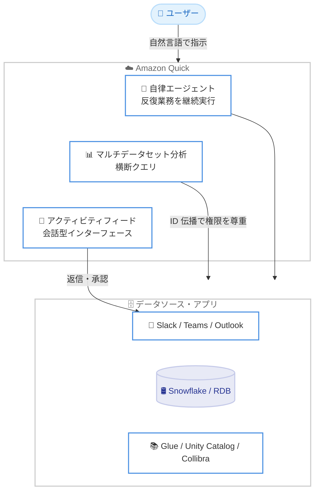

# Amazon Quick - 自律エージェント、マルチデータセット分析、刷新されたアクティビティフィード

**リリース日**: 2026 年 6 月 17 日
**サービス**: Amazon Quick
**機能**: 自律エージェント (Autonomous Agents)、マルチデータセット分析 (Multi-Dataset Analytics)、刷新されたアクティビティフィード (Redesigned Activity Feed)

📊 [このアップデートのインフォグラフィックを見る](https://takech9203.github.io/aws-news-summary/20260617-amazon-quick.html)
<!-- INFOGRAPHIC_BASE_URL は環境変数から取得 -->

## 概要

Amazon Quick は、Slack、Microsoft Teams、Outlook、CRM、データベース、ドキュメントなど、業務で利用する多様なアプリケーションやデータソースを 1 つのワークスペースに統合する AI アシスタントです。ユーザーのワークフローを学習し、実際の業務データに基づいて回答を提供するだけでなく、ダッシュボードの作成や調査、各種業務の代行まで実行できます。今回のアップデートでは、自律エージェント、マルチデータセット分析、刷新されたアクティビティフィードという 3 つの主要機能が発表されました。

中心となるのは「自律エージェント」です。ユーザーは自然言語でタスクを指示し、ステップごとの承認から、ゴールベースでの広範な自動実行まで、自律性のレベルを設定できます。エージェントは継続的に稼働し、停滞している商談のフォローアップ、規制アップデートの要約、購買発注 (PO) の処理といった反復的な業務を自動化します。これにより、手作業の繰り返しや通知過多 (notification overload) の負担を軽減することを目指しています。

加えて、複数のデータソースを横断して自然言語で分析できる「マルチデータセット分析」と、会話型インターフェースとして再設計された「アクティビティフィード」により、業務の優先順位付けや承認、返信などをアプリを切り替えることなく実行できるようになりました。これらの機能は、日々の定型業務に時間を奪われている知識労働者や、複数のデータソースにまたがる分析を必要とするビジネスユーザーを主な対象としています。

**アップデート前の課題**

今回のアップデート以前は、以下のような課題が存在していました。

- 停滞商談のフォロー、規制情報の要約、PO 処理などの反復業務を、毎回手作業で実行する必要があった
- 複数のデータソース (Snowflake やリレーショナルデータベースなど) を横断した分析には、技術的なデータ準備やデータセットの事前結合が必要だった
- メールや Slack への返信、リクエストの承認のために、複数のアプリケーションを切り替える必要があった

**アップデート後の改善**

今回のアップデートにより、以下が可能になりました。

- 自然言語でタスクを指示するだけで、自律エージェントが継続的に反復業務を自動実行できるようになった
- 事前のデータ結合や技術的な準備なしに、複数データソースを横断した自然言語クエリが可能になった
- 刷新されたアクティビティフィードから、優先順位付け、返信、承認をアプリを切り替えずに実行できるようになった

## アーキテクチャ図



ユーザーは自然言語で Amazon Quick に指示し、3 つの主要機能がデータソースやアプリケーションと連携して業務を自動化・分析する流れを示しています。マルチデータセット分析では、既存の権限を尊重する ID 伝播 (identity propagation) によりセキュリティを確保します。

## サービスアップデートの詳細

### 主要機能

1. **自律エージェント (Autonomous Agents)**
   - ユーザーは自然言語でタスクを記述し、自律性のレベルを設定できる
   - 自律性は、ステップごとの承認から、ゴールベースでの広範な自動実行まで調整可能
   - エージェントは継続的に稼働し、停滞商談のフォローアップ、規制アップデートの要約、PO 処理などの反復業務を自動化する
   - 手作業の繰り返しと通知過多の削減を目的としている

2. **マルチデータセット分析 (Multi-Dataset Analytics)**
   - Snowflake やリレーショナルデータベースを含む複数のデータソースを、自然言語で横断的にクエリできる
   - 技術的なデータ準備やデータセットの事前結合が不要
   - AWS Glue、Databricks Unity Catalog、Collibra などのカタログからセマンティックな知識 (semantic intelligence) を継承する
   - 既存の権限を尊重する ID 伝播によってセキュリティを確保する

3. **刷新されたアクティビティフィード (Redesigned Activity Feed)**
   - パーソナライズされた会話型インターフェース
   - サムズアップ・サムズダウンのフィードバックでアップデートの優先順位を付けられる
   - メールや Slack メッセージへの返信、リクエストの承認を、アプリを切り替えずに直接実行できる
   - Quick アプリケーションを公開ウェブサイトとして共有し、組織を越えたコラボレーションが可能

## 技術仕様

### 連携対象とセマンティック層

| 項目 | 詳細 |
|------|------|
| 対応データソース | Snowflake、リレーショナルデータベースなど |
| 連携カタログ | AWS Glue、Databricks Unity Catalog、Collibra |
| 連携アプリケーション | Slack、Microsoft Teams、Outlook、CRM、ドキュメント |
| セキュリティ | 既存の権限を尊重する ID 伝播 (identity propagation) |
| 共有 | Quick アプリケーションを公開ウェブサイトとして共有可能 |

### API 変更履歴

Amazon Quick の基盤となる Amazon QuickSight において、ナレッジベース関連の API が追加されています。Amazon Quick が業務データに基づく回答を生成する仕組みと関連性が高い変更です。

| 日付 | サービス | 変更内容 |
|------|----------|----------|
| 2026/06/05 | [Amazon QuickSight](https://awsapichanges.com/archive/changes/f949c2-quicksight.html) | 8 new api methods - ナレッジベース API とインデックス容量 API のサポートを追加 |

追加された主な API メソッドは以下のとおりです。

- ナレッジベース管理: `DescribeKnowledgeBase`、`SearchKnowledgeBases`、`ListKnowledgeBases`、`DeleteKnowledgeBase`、`BatchDeleteKnowledgeBase`
- 権限管理: `UpdateKnowledgeBasePermissions`、`DescribeKnowledgeBasePermissions`
- インデックス容量: `ListUsersIndexCapacity` (ユーザーごとのインデックス容量消費量を取得)

## 設定方法

### 前提条件

1. Amazon Quick のアカウント (無料で作成可能)
2. 連携したいデータソースまたはアプリケーション (Slack、Snowflake、リレーショナルデータベースなど)
3. マルチデータセット分析を利用する場合、対象データソースへの適切なアクセス権限

### 手順

#### ステップ 1: アカウントの作成と接続

aws.com/quick からアカウントを作成し、Slack、Microsoft Teams、Outlook、CRM、データベースなどの業務アプリケーションを接続します。Amazon Quick がユーザーのワークフローを学習し、業務データに基づいた支援を行うための基盤となります。

#### ステップ 2: 自律エージェントの設定

自然言語でタスクを記述し、自律性のレベルを設定します。ステップごとの承認を求める設定から、ゴールベースで広範に自動実行する設定まで、業務の重要度に応じて調整できます。

#### ステップ 3: マルチデータセット分析の利用

接続済みのデータソースに対し、自然言語で横断的なクエリを実行します。データの事前結合や技術的な準備は不要で、連携カタログのセマンティック情報を活用して回答が生成されます。

## メリット

### ビジネス面

- **生産性の向上**: 反復業務を自律エージェントに委任することで、知識労働者がより付加価値の高い業務に集中できる
- **通知過多の解消**: アクティビティフィードでアップデートを優先順位付けし、重要な情報に素早くアクセスできる
- **意思決定の迅速化**: 複数データソースを横断した分析により、データに基づく判断を短時間で行える

### 技術面

- **データ準備の不要化**: 事前のデータセット結合なしに、複数ソースを横断してクエリできる
- **既存権限の尊重**: ID 伝播により、既存のアクセス制御を維持したままセキュアに分析できる
- **セマンティック層の継承**: Glue、Unity Catalog、Collibra のカタログ情報を活用し、文脈に沿った回答を生成できる

## デメリット・制約事項

### 制限事項

- 公式発表時点で、利用可能リージョンに関する具体的な情報は明示されていない
- 料金体系の詳細 (各プランの金額) は What's New ページには記載されていない
- 連携対象として明記されているデータソース・アプリケーション以外の対応状況は要確認

### 考慮すべき点

- 自律エージェントに高い自律性を付与する場合、実行内容のガバナンスや監査の仕組みを検討する必要がある
- マルチデータセット分析では、ID 伝播による権限制御が正しく機能するよう、接続元の権限設計を確認することが望ましい
- 公開ウェブサイトとしての共有機能を利用する際は、社外への情報公開範囲を慎重に管理する必要がある

## ユースケース

### ユースケース 1: 営業商談の自動フォローアップ

**シナリオ**: 営業チームが多数の商談を抱え、停滞している案件のフォローが後回しになっている。

**実装例**:
```
「2 週間以上更新のない商談を検出し、担当者にフォローアップを促すサマリーを毎朝作成する」
というタスクを自律エージェントに設定する。
```

**効果**: 停滞商談の見落としを防ぎ、営業担当者が手動で進捗を確認する手間を削減できる。

### ユースケース 2: 複数データソース横断の分析

**シナリオ**: 売上データが Snowflake に、顧客マスターがリレーショナルデータベースに分散しており、横断分析にデータ準備の工数がかかっている。

**実装例**:
```
「直近四半期の売上上位顧客と、そのリスクスコアを一覧で表示して」
と自然言語でクエリを実行する (事前のデータ結合は不要)。
```

**効果**: データエンジニアによる事前準備を待たずに、ビジネスユーザー自身がデータドリブンな分析を実行できる。

### ユースケース 3: アクティビティフィードからの一元対応

**シナリオ**: メール、Slack、各種承認リクエストが複数のアプリに分散し、対応のためのアプリ切り替えが負担になっている。

**実装例**:
```
アクティビティフィード上で、メールや Slack メッセージへ直接返信し、
承認リクエストをその場で承認する。
```

**効果**: アプリ間の切り替えを削減し、日々の対応業務を 1 つのインターフェースに集約できる。

## 料金

無料でアカウントを作成して利用を開始できます。Amazon Quick Suite として、Free、Plus、Pro、Enterprise のプランが提供されています。各プランの具体的な金額については、公式の料金ページを参照してください。

## 利用可能リージョン

公式発表時点では、利用可能リージョンに関する具体的な情報は明示されていません。最新の対応状況は公式ページで確認してください。

## 関連サービス・機能

- **Amazon QuickSight**: Amazon Quick の基盤となる BI サービス。ナレッジベース API などが追加され、業務データに基づく回答生成と関連する
- **AWS Glue Data Catalog**: マルチデータセット分析でセマンティック情報を継承する連携カタログの 1 つ
- **Databricks Unity Catalog / Collibra**: セマンティック層を提供するサードパーティのデータカタログ

## 参考リンク

- 📊 [インフォグラフィック](https://takech9203.github.io/aws-news-summary/20260617-amazon-quick.html)
- [公式発表 (What's New)](https://aws.amazon.com/about-aws/whats-new/2026/06/amazon-quick/)
- [AWS Blog](https://aws.amazon.com/blogs/machine-learning/get-back-hours-every-day-with-autonomous-agents-in-amazon-quick/)
- [Amazon Quick 製品ページ](https://aws.amazon.com/quick/)

## まとめ

Amazon Quick の今回のアップデートは、AI アシスタントを「質問に答える」段階から「業務を自律的に実行する」段階へと進化させる重要な発表です。自律エージェント、マルチデータセット分析、刷新されたアクティビティフィードにより、反復業務の自動化とデータ活用の民主化が大きく前進します。日々の定型業務に時間を奪われているチームは、まず無料アカウントで自律エージェントとデータソース連携を試し、自社のワークフローへの適用効果を評価することを推奨します。
