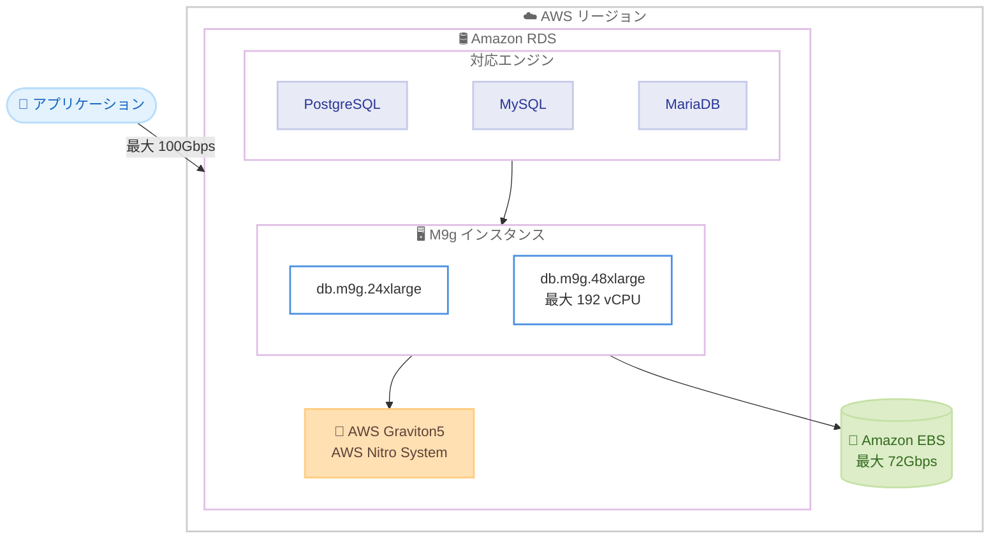

# Amazon RDS - M9g データベースインスタンスのサポート

**リリース日**: 2026年6月17日
**サービス**: Amazon RDS
**機能**: AWS Graviton5 プロセッサ搭載 M9g データベースインスタンス

📊 [このアップデートのインフォグラフィックを見る](https://takech9203.github.io/aws-news-summary/20260617-amazon-rds-postgresql-mysql-mariadb-m9g-instances.html)
<!-- INFOGRAPHIC_BASE_URL は環境変数から取得 -->

## 概要

AWS は、AWS Graviton5 プロセッサを搭載した M9g データベースインスタンスを、Amazon RDS for PostgreSQL、Amazon RDS for MySQL、Amazon RDS for MariaDB の 3 つのオープンソースエンジン向けに一般提供開始しました。Graviton5 は AWS が独自に設計したカスタムプロセッサの最新世代であり、AWS Nitro System 上に構築されています。

M9g インスタンスは、汎用ワークロード向けに最適化されたデータベースインスタンスです。新たに 24xlarge および 48xlarge のサイズが追加され、最大 192 vCPU、最大 100Gbps の拡張ネットワーク帯域幅、Amazon EBS に対する最大 72Gbps の帯域幅を提供します。これにより、大規模なトランザクション処理や高い同時実行性が求められるデータベースワークロードに対応できます。

Graviton4 ベースの同等インスタンスと比較して、Graviton5 は最大 30% の性能向上と、オンデマンド料金で最大 23% の価格性能比の向上を実現します。これらの向上幅はデータベースエンジン、バージョン、ワークロードによって異なります。

**アップデート前の課題**

- Graviton4 ベースの M8g インスタンスでは、最大規模のデータベースワークロードに対する vCPU 数やネットワーク帯域幅に上限がありました
- 高い同時実行性や大規模トランザクションを処理する際、コストパフォーマンスのさらなる改善余地がありました
- 24xlarge や 48xlarge といった超大規模サイズが提供されておらず、垂直スケーリングの上限がありました

**アップデート後の改善**

- 今回のアップデートにより、最大 192 vCPU を提供する 24xlarge / 48xlarge サイズが利用可能になりました
- Graviton4 ベースと比較して最大 30% の性能向上が得られるようになりました
- オンデマンド料金で最大 23% の価格性能比の向上が可能になりました

## アーキテクチャ図



M9g データベースインスタンスは、AWS Graviton5 プロセッサ上で 3 つのオープンソースエンジンを実行し、最大 100Gbps のネットワーク帯域幅と Amazon EBS への最大 72Gbps の帯域幅を提供する構成です。

## サービスアップデートの詳細

### 主要機能

1. **AWS Graviton5 プロセッサ**
   - AWS が独自に設計したカスタムプロセッサの最新世代
   - AWS Nitro System 上に構築
   - Graviton4 ベースの同等インスタンスと比較して最大 30% の性能向上

2. **新しい超大規模インスタンスサイズ**
   - 新たに 24xlarge および 48xlarge サイズを追加
   - 最大 192 vCPU を提供
   - 最大 100Gbps の拡張ネットワーク帯域幅
   - Amazon EBS に対する最大 72Gbps の帯域幅

3. **3 つのオープンソースエンジンに対応**
   - Amazon RDS for PostgreSQL
   - Amazon RDS for MySQL
   - Amazon RDS for MariaDB
   - 対応するエンジンバージョンは RDS ドキュメントを参照

## 技術仕様

### インスタンスの主要スペック

| 項目 | 詳細 |
|------|------|
| プロセッサ | AWS Graviton5 (AWS Nitro System) |
| 新規サイズ | 24xlarge、48xlarge |
| 最大 vCPU | 192 vCPU |
| ネットワーク帯域幅 | 最大 100Gbps |
| Amazon EBS 帯域幅 | 最大 72Gbps |
| 対応エンジン | PostgreSQL、MySQL、MariaDB |

### 性能比較 (Graviton4 ベースとの比較)

| 指標 | 改善幅 |
|------|--------|
| 性能 | 最大 30% 向上 |
| 価格性能比 (オンデマンド) | 最大 23% 向上 |

性能および価格性能比の向上幅は、データベースエンジン、バージョン、ワークロードによって異なります。

## 設定方法

### 前提条件

1. 利用可能リージョンで Amazon RDS を使用していること
2. M9g インスタンスをサポートするエンジンバージョンを使用していること (詳細は RDS ドキュメントを参照)
3. インスタンスクラスを変更する権限を持つ IAM ユーザーまたはロール

### 手順

#### ステップ1: 新規 DB インスタンスの作成

```bash
aws rds create-db-instance \
  --db-instance-identifier my-postgres-db \
  --db-instance-class db.m9g.24xlarge \
  --engine postgres \
  --allocated-storage 100 \
  --master-username admin \
  --manage-master-user-password
```

このコマンドは、M9g インスタンスクラス (db.m9g.24xlarge) を指定して PostgreSQL の DB インスタンスを新規作成します。

#### ステップ2: 既存インスタンスのインスタンスクラス変更

```bash
aws rds modify-db-instance \
  --db-instance-identifier my-existing-db \
  --db-instance-class db.m9g.48xlarge \
  --apply-immediately
```

このコマンドは、既存の DB インスタンスのインスタンスクラスを M9g (db.m9g.48xlarge) に変更します。`--apply-immediately` を指定すると、メンテナンスウィンドウを待たずに即時適用されます。本番環境では、ダウンタイムを最小化するためメンテナンスウィンドウでの適用を検討してください。

## メリット

### ビジネス面

- **コスト最適化**: オンデマンド料金で最大 23% の価格性能比向上により、同じワークロードをより低コストで実行できます
- **大規模ワークロード対応**: 24xlarge / 48xlarge サイズにより、垂直スケーリングの上限が拡大し、大規模なデータベースを単一インスタンスで運用できます
- **マネージドサービスの活用**: Amazon RDS のマネージド機能 (自動バックアップ、パッチ適用、モニタリング) を引き続き利用できます

### 技術面

- **性能向上**: Graviton4 ベースと比較して最大 30% の性能向上により、クエリ処理やトランザクションスループットが改善されます
- **高いネットワーク性能**: 最大 100Gbps のネットワーク帯域幅と Amazon EBS への 72Gbps の帯域幅により、I/O 集約型ワークロードに対応できます
- **既存アプリケーションとの互換性**: インスタンスクラスの変更のみで Graviton5 に移行でき、アプリケーションコードの変更は不要です

## デメリット・制約事項

### 制限事項

- 提供リージョンが限定されています (詳細は利用可能リージョンを参照)
- M9g インスタンスをサポートするエンジンバージョンが限定されます (RDS ドキュメントで確認が必要)
- Graviton (ARM ベース) アーキテクチャのため、x86 専用の拡張機能や一部のサードパーティ製拡張機能を使用する場合は互換性の確認が必要です

### 考慮すべき点

- 既存の x86 ベースインスタンスから移行する場合は、事前にエンジン拡張機能やワークロードの互換性を検証することを推奨します
- インスタンスクラスの変更には再起動を伴うため、ダウンタイムを考慮した計画が必要です (Multi-AZ 構成ではダウンタイムを短縮できます)
- 性能向上幅はワークロードによって異なるため、本番移行前にベンチマークを実施することを推奨します

## ユースケース

### ユースケース1: 大規模 OLTP データベースの集約

**シナリオ**: 複数の中規模 DB インスタンスで運用していたトランザクション処理ワークロードを、より大規模な単一インスタンスに集約してコストと運用負荷を削減したい。

**実装例**:
```
db.m9g.48xlarge (最大 192 vCPU) に集約し、
高い同時接続数とトランザクションスループットを単一インスタンスで処理
```

**効果**: 垂直スケーリングにより運用対象のインスタンス数を削減し、Graviton5 の性能向上で処理能力を確保できます。

### ユースケース2: コスト最適化を目的とした Graviton5 への移行

**シナリオ**: x86 ベースまたは Graviton4 ベースのインスタンスで運用しているデータベースのコストを削減したい。

**実装例**:
```
modify-db-instance でインスタンスクラスを db.m9g.* に変更し、
オンデマンド料金で最大 23% の価格性能比向上を活用
```

**効果**: アプリケーションコードを変更せずにインスタンスクラスの変更のみでコストパフォーマンスを改善できます。

### ユースケース3: I/O 集約型分析ワークロード

**シナリオ**: 大量のデータ読み書きを伴う分析クエリやバッチ処理で、ストレージへの帯域幅がボトルネックになっている。

**実装例**:
```
Amazon EBS への最大 72Gbps の帯域幅と
最大 100Gbps のネットワーク帯域幅を持つ M9g インスタンスを利用
```

**効果**: 高い EBS 帯域幅とネットワーク帯域幅により、I/O 待ちを削減し分析処理を高速化できます。

## 料金

M9g データベースインスタンスは、Amazon RDS の標準的な料金モデル (オンデマンド、リザーブドインスタンス) に従って課金されます。Graviton4 ベースの同等インスタンスと比較して、オンデマンド料金で最大 23% の価格性能比の向上が得られます。

正確な料金とリージョンごとの価格は、Amazon RDS の料金ページを参照してください。

## 利用可能リージョン

以下のリージョンで利用可能です。

- 米国東部 (バージニア北部)
- 米国東部 (オハイオ)
- 米国西部 (オレゴン)
- 欧州 (フランクフルト)

## 関連サービス・機能

- **Amazon EC2 M9g / M9gd インスタンス**: 同じ Graviton5 プロセッサを搭載した EC2 の汎用インスタンス。RDS 以外のワークロードでも Graviton5 を活用できます
- **Amazon Aurora**: より高い可用性とスケーラビリティが必要な場合に検討できるマネージドデータベースサービス
- **AWS Graviton**: AWS が独自設計した ARM ベースプロセッサ。コストパフォーマンスに優れたワークロード実行を実現します

## 参考リンク

- 📊 [インフォグラフィック](https://takech9203.github.io/aws-news-summary/20260617-amazon-rds-postgresql-mysql-mariadb-m9g-instances.html)
- [公式発表 (What's New)](https://aws.amazon.com/about-aws/whats-new/2026/06/amazon-rds-postgresql-mysql-mariadb-m9g-instances/)
- [対応インスタンスクラス (ドキュメント)](https://docs.aws.amazon.com/AmazonRDS/latest/UserGuide/Concepts.DBInstanceClass.Support.html)
- [Amazon RDS 料金ページ](https://aws.amazon.com/rds/pricing/)

## まとめ

Amazon RDS for PostgreSQL、MySQL、MariaDB が AWS Graviton5 搭載の M9g インスタンスに対応したことで、最大 30% の性能向上と最大 23% の価格性能比向上を、アプリケーションコードの変更なしに享受できるようになりました。新たな 24xlarge / 48xlarge サイズは大規模データベースの垂直スケーリングを可能にします。コスト最適化や性能改善を検討している場合は、対応リージョンとエンジンバージョンを確認したうえで、ベンチマークによる検証を経て移行を進めることを推奨します。
