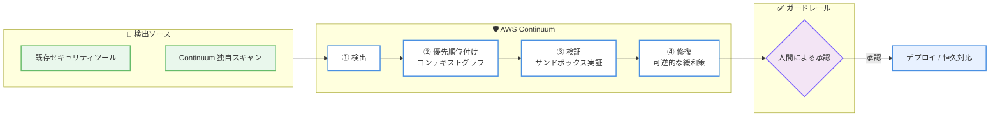

# AWS Continuum - マシンスピードでのセキュリティ

**リリース日**: 2026年6月17日
**サービス**: AWS Continuum
**機能**: ソフトウェアライフサイクル全体にわたるセキュリティリスクの自動検出、優先順位付け、検証、修復

📊 [このアップデートのインフォグラフィックを見る](https://takech9203.github.io/aws-news-summary/20260617-aws-continuum.html)
<!-- INFOGRAPHIC_BASE_URL は環境変数から取得 -->

## 概要

AWS は、ソフトウェアライフサイクル全体にわたってセキュリティリスクを「マシンスピード」で検出、優先順位付け、検証、修復する新しいセキュリティサービス AWS Continuum を発表しました。AWS Continuum は、お客様が定義したガードレールの範囲内で動作し、脆弱性を発見してから対処するまでのギャップを埋めることを目的としています。これにより、セキュリティチームは手作業によるトリアージから、戦略の策定と結果の承認へと役割をシフトできます。

従来のセキュリティ運用では、スキャンツールが大量の検出結果を生成する一方で、それらが実際に悪用可能かどうかの検証や修復は人手に依存していました。AWS Continuum は、検出から修復までの一連のプロセスをエージェントが自律的に進めることで、このギャップを解消します。中核となる AWS Continuum for code vulnerabilities は gated preview (制限付きプレビュー) として提供され、既存のセキュリティツールや独自スキャンからの検出結果を取り込み、環境とビジネスのコンテキストグラフに基づいて優先順位を付け、隔離されたサンドボックス内で再現可能な実証を行うことで悪用可能性を検証します。

AWS Continuum は、信頼レベルを「段階的」に設定できる点が特徴です。初期段階ではエージェントがアクションを提案し、人間が承認するワークフローから始まり、お客様の判断で自律的に実行できる範囲を拡大していきます。Capital One、MongoDB、Rivian、Robinhood などがデザインパートナーとして参加しています。

**アップデート前の課題**

このアップデート以前のセキュリティ運用には、以下のような課題が存在していました。

- セキュリティツールが大量の検出結果を生成する一方で、どれが実際に悪用可能かを人手で検証する必要があった
- 検出から修復までのリードタイムが長く、ペネトレーションテストには数週間を要することもあった
- 脅威モデリングやコードスキャンが手作業中心で、ソフトウェアライフサイクル全体を継続的にカバーすることが難しかった

**アップデート後の改善**

今回のアップデートにより、以下が可能になりました。

- 検出、優先順位付け、検証、修復の一連のプロセスをエージェントがマシンスピードで実行できるようになった
- 隔離されたサンドボックスでの再現可能な実証により、悪用可能な脆弱性のみに集中できるようになった
- ペネトレーションテストを数週間から数時間へと短縮し、修復可能な状態の修正案まで提示できるようになった

## アーキテクチャ図

AWS Continuum は、検出ソースからの入力を受けて検出、優先順位付け、検証、修復の 4 フェーズを進め、修復アクションはお客様が定義したガードレール (人間による承認) を経てデプロイされます。

## サービスアップデートの詳細

### 主要機能

1. **AWS Continuum for code vulnerabilities (gated preview)**
   - 既存のセキュリティツールからの検出結果に加え、独自スキャンによる検出結果を取り込む
   - 環境とビジネスのコンテキストグラフを用いて、各課題の優先順位を判断する
   - 隔離されたサンドボックス内で再現可能な実証を構築し、悪用可能性を検証する
   - 確認された露出に対して「高速かつ可逆的な緩和策」を適用し、その後お客様のレビューとデプロイのプロセスを通じて恒久的な修正を実施する
   - 複数のフロンティアモデルをそれぞれ最も適した場面で使い分ける、モデルに依存しない設計

2. **Continuum penetration testing (ペネトレーションテスト)**
   - 旧 AWS Security Agent のペネトレーションテスト機能を改称
   - オンデマンドのテストにより、従来は数週間を要していたテストを数時間に短縮する
   - 再現可能な実証と、すぐに実装可能な修正案を提供する

3. **Continuum code scanning (コードスキャン、preview)**
   - コンプライアンス要件、悪用パターン、脅威ベクトルに対する詳細な分析を実施する
   - 検証済みの修正案 (validated fixes) を提示する

4. **Continuum threat modeling (脅威モデリング、preview)**
   - 設計ドキュメントまたはソースコードから、コンテキストを考慮した脅威モデルを生成する
   - 結果を STRIDE 形式で出力し、STRIDE の 6 カテゴリすべてにわたる緩和策を提示する

## 技術仕様

### 動作フローと提供形態

| 項目 | 詳細 |
|------|------|
| 動作フロー | 検出 (Discover) → 優先順位付け (Prioritize) → 検証 (Validate) → 修復 (Remediate) |
| code vulnerabilities | gated preview (制限付きプレビュー) |
| code scanning | preview |
| threat modeling | preview |
| penetration testing | 提供中 (旧 AWS Security Agent から改称) |
| モデル | モデルに依存しない設計。複数のフロンティアモデルを使い分け |
| 脅威モデリング出力形式 | STRIDE (6 カテゴリ) |

### 信頼モデルとガードレール

AWS Continuum における信頼は「段階的」であり、お客様が設定します。初期状態ではエージェントがアクションを提案し、人間が承認するワークフローで動作します。お客様は、エージェントが自律的に実行できる範囲を選択できます。

- 初期段階: エージェントが提案し、人間が承認
- 段階的拡大: お客様の判断で自律実行の範囲を拡大
- 修復は「可逆的な緩和策」として適用され、その後にお客様のプロセスを通じた恒久対応へ移行

## メリット

### ビジネス面

- **対処までの時間短縮**: 検出から修復までをマシンスピードで進めることで、脆弱性が露出する時間を最小化できる
- **セキュリティチームの役割転換**: 手作業によるトリアージから、戦略策定と結果承認へと人材をシフトできる
- **テスト工数の削減**: ペネトレーションテストを数週間から数時間へ短縮し、運用コストを抑えられる

### 技術面

- **悪用可能性の検証**: サンドボックスでの再現可能な実証により、誤検知を減らし、真に対処すべきリスクに集中できる
- **コンテキストに基づく優先順位付け**: 環境とビジネスのコンテキストグラフを用いて、影響度の高いリスクを特定できる
- **ライフサイクル全体のカバー**: 設計段階の脅威モデリングから、コードスキャン、稼働中のリスク検出までを一貫してカバーできる

## デメリット・制約事項

### 制限事項

- AWS Continuum for code vulnerabilities は gated preview であり、利用には事前申請とアクセス承認が必要
- code scanning および threat modeling は preview 段階であり、本番環境での利用には注意が必要
- 公式発表時点で料金体系は公開されていない
- 公式発表時点で利用可能リージョンは明示されておらず、提供は一部のお客様に限定されている

### 考慮すべき点

- 自律実行の範囲はお客様が設定するため、ガバナンスポリシーと整合するガードレール設計が重要
- 可逆的な緩和策の適用が稼働中のアプリケーションに与える影響を、事前に評価しておく必要がある

## ユースケース

### ユースケース1: 出荷前のリスク検出

**シナリオ**: 新機能のリリース前に、設計ドキュメントやソースコードに潜むセキュリティリスクを洗い出したい。

**効果**: Continuum threat modeling が設計段階で STRIDE 形式の脅威モデルを生成し、出荷前に緩和策を組み込めるため、本番環境へのリスク流出を防げる。

### ユースケース2: 悪用可能な脆弱性への集中対応

**シナリオ**: 複数のスキャンツールから大量の検出結果が報告され、どれを優先的に対処すべきか判断に時間がかかっている。

**効果**: AWS Continuum for code vulnerabilities がコンテキストグラフに基づいて優先順位を付け、サンドボックスで悪用可能性を検証するため、真に対処すべき脆弱性に集中できる。

### ユースケース3: レビュー間のセキュリティ態勢維持

**シナリオ**: 定期的なセキュリティレビューの間に発生する新たなリスクへの対応が遅れがちである。

**効果**: 稼働中の環境のリスクを継続的に検出し、可逆的な緩和策をガードレールの範囲内で適用することで、レビュー間のセキュリティ態勢を維持できる。

## 料金

公式発表時点で、AWS Continuum の料金体系は公開されていません。最新の情報は AWS の公式ページを確認してください。

## 利用可能リージョン

公式発表時点で、利用可能リージョンは明示されていません。AWS Continuum for code vulnerabilities は gated preview として一部のお客様に提供されています。最新の提供状況は AWS Region 表および公式ページを確認してください。

## 関連サービス・機能

- **AWS Security Agent**: AWS Continuum の基盤となるフロンティアエージェント。ペネトレーションテスト機能は Continuum penetration testing へと改称された
- **Amazon GuardDuty**: 脅威検出サービス。セキュリティ運用全体の中で Continuum と組み合わせて活用できる
- **AWS Security Hub**: セキュリティ検出結果の集約・管理サービス。検出結果ソースとして連携できる

## 参考リンク

- 📊 [インフォグラフィック](https://takech9203.github.io/aws-news-summary/20260617-aws-continuum.html)
- [公式発表 (What's New)](https://aws.amazon.com/about-aws/whats-new/2026/06/aws-continuum/)
- [AWS Blog](https://aws.amazon.com/blogs/security/introducing-aws-continuum-security-at-machine-speed/)
- [AWS Continuum 製品ページ](https://aws.amazon.com/continuum/)
- [ドキュメント](https://docs.aws.amazon.com/securityagent/latest/userguide/)

## まとめ

AWS Continuum は、検出から修復までをマシンスピードで進める新しいセキュリティサービスであり、セキュリティチームの役割を手作業のトリアージから戦略策定へとシフトさせます。現時点では code vulnerabilities が gated preview、code scanning と threat modeling が preview 段階のため、まずは gated preview への申請を行い、自社のガバナンスポリシーに合わせたガードレール設計を検討することを推奨します。
