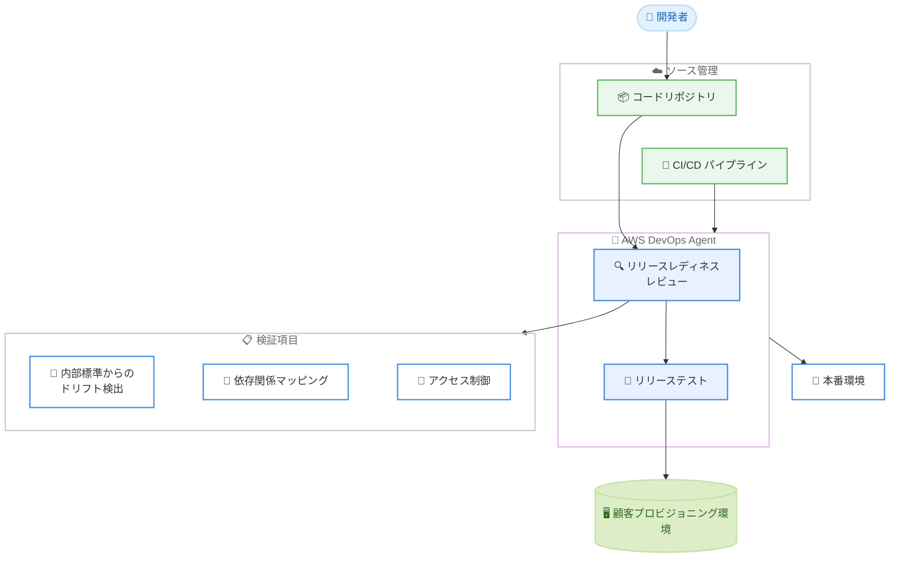

# AWS DevOps Agent - リリース管理機能

**リリース日**: 2026 年 6 月 17 日
**サービス**: AWS DevOps Agent
**機能**: リリース管理機能 (Release Management) のプレビュー

📊 [このアップデートのインフォグラフィックを見る](https://takech9203.github.io/aws-news-summary/20260617-aws-devops-agent-release-management.html)
<!-- INFOGRAPHIC_BASE_URL は環境変数から取得 -->

## 概要

AWS は、AWS DevOps Agent に新しいリリース管理機能 (Release Management) をプレビューとして追加したことを発表しました。この機能は、コード変更のリリース準備状況を自動的にレビューし、自律的なテストを実行することで、チームが本番環境へ安全かつ自信を持ってコードをデプロイできるよう支援します。

これまで AWS DevOps Agent は主に運用面での支援に重点を置いていましたが、今回のアップデートにより、デリバリー (リリース) と運用の両方にまたがって支援範囲が拡張されました。リリースレディネスレビュー (Release Readiness Review) とリリーステスト (Release Testing) という 2 つの主要機能により、人間のレビュアーが見落としがちなリグレッション、UX の問題、統合の失敗を検出することを目指しています。

本機能はプレビューとして提供され、対象は開発チームや DevOps チーム、信頼性の高いデリバリーパイプラインを構築したいエンジニアリング組織です。現時点では米国東部 (バージニア北部) リージョンで利用可能で、プレビュー期間中は追加費用なしで使用できます。

**アップデート前の課題**

- 以前はコード変更が本番環境に適した状態かどうかを、人間のレビュアーが手動で確認する必要があった
- 以前はリポジトリをまたぐ依存関係による破壊的変更を、コミット前に体系的に把握することが困難だった
- 以前はリグレッションや統合の失敗を検出するためのテスト計画を、手動で作成・実行する必要があった

**アップデート後の改善**

- 今回のアップデートにより、コード生成時にリリース準備状況が自動的に評価されるようになった
- 今回のアップデートにより、リポジトリ間の依存関係マッピングによってコミット前に破壊的変更を特定できるようになった
- 今回のアップデートにより、Web および API ベースのアプリケーション向けのテスト計画の生成と実行が自律的に行われるようになった

## アーキテクチャ図

開発者がコードリポジトリと CI/CD パイプラインを AWS DevOps Agent に接続すると、エージェントがリリースレディネスレビューで変更内容を検証し、リリーステストを実行したうえで本番環境へのデプロイを支援する流れを示しています。

## サービスアップデートの詳細

### 主要機能

1. **リリースレディネスレビュー (Release Readiness Review)**
   - コード生成時に、コード変更が本番環境に適した状態かどうかを評価する
   - 内部標準からのドリフト、依存関係への影響、アクセス制御を確認する
   - リポジトリをまたぐ依存関係をマッピングし、コミット前に破壊的変更を特定する
   - 決定論的な証明 (deterministic proofs) を用いて、インフラストラクチャの変更が AWS Well-Architected のベストプラクティスに沿っているか検証する

2. **リリーステスト (Release Testing)**
   - Web および API ベースのアプリケーション向けにテスト計画を生成し、実行する
   - 顧客がプロビジョニングした環境内で動作する
   - 人間のレビュアーが見落とす可能性のあるリグレッション、UX の問題、統合の失敗を検出するよう設計されている

3. **デリバリーと運用の統合支援**
   - 従来の運用面の支援に加えて、リリース (デリバリー) のプロセスも支援対象に含める
   - AWS、マルチクラウド、オンプレミスの各環境にまたがってオペレーショナルエクセレンスを支援する

## 技術仕様

### 機能概要

| 項目 | 詳細 |
|------|------|
| 提供形態 | プレビュー |
| 対象アプリケーション | Web アプリケーション、API ベースのアプリケーション |
| テスト実行環境 | 顧客がプロビジョニングした環境 |
| 検証観点 | 内部標準からのドリフト、依存関係への影響、アクセス制御、Well-Architected 準拠 |
| 前提条件 | コードリポジトリと CI/CD パイプラインの接続 |

### API 変更履歴

| 日付 | サービス | 変更内容 |
|------|----------|----------|
| 2026/06/17 | [aidevops](https://awsapichanges.com/archive/changes/ecddc1-aidevops.html) | 13 updated api methods - リリースレディネスレビューとリリーステスト機能を追加。Remote A2A (Agent-to-Agent) エージェント登録/管理、Git 管理スキルのサポートも追加 |
| 2026/06/12 | [aidevops](https://awsapichanges.com/archive/changes/77da2d-aidevops.html) | 5 new api methods - エージェントスペースでスケジュールベースの自動化トリガーを管理するトリガー CRUD API を追加 |
| 2026/06/08 | [aidevops](https://awsapichanges.com/archive/changes/a09b61-aidevops.html) | 13 new 14 updated api methods - エージェントスペースでバージョン管理されたアセットとアセットファイルを管理するアセット API を追加 |

## 設定方法

### 前提条件

1. 米国東部 (バージニア北部) リージョンで AWS DevOps Agent が利用可能であること
2. AWS DevOps Agent のスペースが作成済みであること
3. リリーステスト用に顧客側でプロビジョニングした環境が用意されていること

### 手順

#### ステップ 1: AWS DevOps Agent スペースを準備する

AWS DevOps Agent のスペースを作成または選択します。リリース管理機能は、このスペース内で接続されたリソースに対して動作します。

#### ステップ 2: コードリポジトリとパイプラインを接続する

AWS DevOps Agent のスペース内で、対象のコードリポジトリと CI/CD パイプラインを接続します。この接続により、エージェントがコード変更を解析し、リリースレディネスレビューとリリーステストを実行できるようになります。

#### ステップ 3: リリースレビューとテストを活用する

コード変更が発生すると、エージェントがリリースレディネスレビューを実行し、リリーステストを生成・実行します。レビュー結果とテスト結果を確認し、本番環境への安全なデプロイにつなげます。

## メリット

### ビジネス面

- **デプロイの安全性向上**: コード変更を本番環境にデプロイする前に自動レビューとテストを行うことで、本番障害のリスクを低減できます
- **MTTR の短縮**: 問題を早期に検出することで、平均復旧時間 (MTTR) の短縮に貢献します
- **デリバリー速度の向上**: 自動化されたレビューとテストにより、より速く安全にコードを出荷できます

### 技術面

- **クロスリポジトリの依存関係把握**: リポジトリをまたぐ依存関係をマッピングし、コミット前に破壊的変更を特定できます
- **Well-Architected 準拠の検証**: 決定論的な証明を用いてインフラ変更がベストプラクティスに沿うかを検証できます
- **マルチ環境対応**: AWS、マルチクラウド、オンプレミスにまたがってオペレーショナルエクセレンスを支援します

## デメリット・制約事項

### 制限事項

- 現時点ではプレビュー提供であり、本番ワークロードへの適用は慎重に評価する必要があります
- 利用可能リージョンは米国東部 (バージニア北部) に限定されています
- リリーステストは顧客がプロビジョニングした環境を必要とします
- リリーステストの対象は Web および API ベースのアプリケーションに限定されています

### 考慮すべき点

- プレビュー期間中は追加費用なしで利用できますが、一般提供時の本番運用機能には料金が発生するため、AWS DevOps Agent の料金ページを確認する必要があります
- 自動化されたレビューやテストの結果は補助的な情報として活用し、最終的なリリース判断には人間によるレビューを併用することが推奨されます

## ユースケース

### ユースケース 1: 本番デプロイ前のリスク低減

**シナリオ**: 複数のマイクロサービスを運用する開発チームが、コミット前にリポジトリ間の破壊的変更を把握したいケース。

**効果**: リリースレディネスレビューがクロスリポジトリの依存関係をマッピングし、破壊的変更を早期に特定することで、本番障害を未然に防ぎます。

### ユースケース 2: Web/API アプリケーションの自動テスト

**シナリオ**: Web フロントエンドと API バックエンドを持つアプリケーションで、手動テスト工数を削減しつつリグレッションを防ぎたいケース。

**効果**: リリーステストがテスト計画を自動生成・実行し、リグレッションや統合の失敗、UX の問題を検出することで、品質を維持しながらテスト工数を削減します。

### ユースケース 3: 内部標準とベストプラクティスの遵守

**シナリオ**: 社内のコーディング標準やセキュリティポリシー、AWS Well-Architected への準拠を継続的に担保したいケース。

**効果**: 内部標準からのドリフトやアクセス制御を確認し、決定論的な証明でインフラ変更を検証することで、標準とベストプラクティスへの準拠を自動的に維持します。

## 料金

リリース管理機能はプレビュー期間中、追加費用なしで利用できます。一般提供されている本番運用機能の料金については、AWS DevOps Agent の料金ページを参照してください。

## 利用可能リージョン

本機能は現時点で米国東部 (バージニア北部) リージョンで利用可能です。本番運用機能が利用可能なリージョンの一覧については、AWS DevOps Agent のドキュメントに記載されているサポートリージョン表を参照してください。

## 関連サービス・機能

- **AWS DevOps Agent**: 本機能のベースとなる AI 搭載エージェント。運用とデリバリーの両面を支援します
- **AWS Well-Architected**: リリースレディネスレビューがインフラ変更の検証に用いるベストプラクティスフレームワークです
- **CI/CD パイプライン**: エージェントが接続して解析・テストを行う対象のデリバリーパイプラインです

## 参考リンク

- 📊 [インフォグラフィック](https://takech9203.github.io/aws-news-summary/20260617-aws-devops-agent-release-management.html)
- [公式発表 (What's New)](https://aws.amazon.com/about-aws/whats-new/2026/06/aws-devops-agent-release-management/)
- [AWS API Changes (aidevops)](https://awsapichanges.com/archive/changes/ecddc1-aidevops.html)

## まとめ

AWS DevOps Agent のリリース管理機能は、コード変更のリリース準備状況の自動レビューと自律的なテストにより、本番デプロイの安全性と速度を両立させる重要なアップデートです。現時点では米国東部 (バージニア北部) リージョンでのプレビュー提供かつ追加費用なしのため、デリバリーパイプラインの信頼性向上を検討しているチームは、コードリポジトリとパイプラインを接続して早期に評価することをおすすめします。
