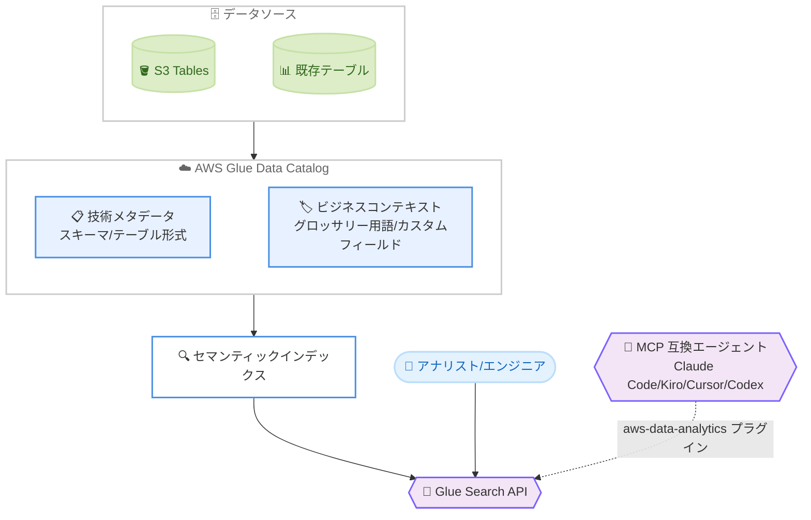

# AWS Glue Data Catalog - ビジネスコンテキストとセマンティック検索

**リリース日**: 2026 年 6 月 17 日
**サービス**: AWS Glue
**機能**: AWS Glue Data Catalog のビジネスコンテキストとセマンティック検索 (プレビュー)

📊 [このアップデートのインフォグラフィックを見る](https://takech9203.github.io/aws-news-summary/20260617-aws-glue-data-catalog.html)
<!-- INFOGRAPHIC_BASE_URL は環境変数から取得 -->

## 概要

AWS は、AWS Glue Data Catalog においてビジネスコンテキストとセマンティック検索の機能をプレビューとして公開しました。この機能により、ユーザーはデータをスキーマやテーブル形式といった技術的な構造だけでなく、データが持つ意味 (セマンティクス) に基づいて発見し、理解できるようになります。

このアップデートでは、Glue Data Catalog のテーブルに対して用語集 (グロッサリー) の用語やカスタムメタデータフィールドを追加し、ビジネス上の意味を付与できます。これらのビジネスコンテキストは技術的なメタデータとあわせてインデックス化され、新しい Glue Search API を通じて意味ベースの検索が可能になります。S3 Tables を基盤とするテーブルにもビジネスコンテキストを付与できます。

さらに、Claude Code、Kiro、Cursor、Codex などの MCP (Model Context Protocol) 互換のエージェントは、Agent Toolkit for AWS が提供する aws-data-analytics プラグインを利用することで、ほぼ設定なしでカタログに接続できます。これにより、AI エージェントが推測されたコンテキストではなく、信頼できる定義に基づいてデータを扱えるようになります。データアナリストやデータエンジニア、AI エージェントを活用する開発者が主な対象です。

**アップデート前の課題**

このアップデート以前には、以下の課題が存在していました。

- 以前は Data Catalog 内のテーブルをスキーマやテーブル名などの技術的なメタデータでしか検索できず、ビジネス上の意味で探すことが困難でした
- 以前はテーブルが表すデータの意味や正しい使い方が、カタログ内に体系的に整理されておらず、利用者が把握しにくい状態でした
- 以前は AI エージェントがデータの文脈を推測に頼る必要があり、信頼できる定義に基づいた回答を得にくい状況でした

**アップデート後の改善**

今回のアップデートにより、以下が可能になりました。

- 今回のアップデートにより、グロッサリー用語やカスタムメタデータを付与し、ビジネス上の意味でテーブルを検索できるようになりました
- 今回のアップデートにより、テーブルの定義、データが表す内容、適切な使い方を 1 ステップで取得できるようになりました
- 今回のアップデートにより、MCP 互換のエージェントがほぼ設定なしでカタログに接続し、信頼できる定義に基づいて動作できるようになりました

## アーキテクチャ図



この図は、データソースから取り込んだテーブルに技術メタデータとビジネスコンテキストを付与し、セマンティックインデックスを経由して Glue Search API でアナリストや MCP 互換エージェントが意味ベースの検索を行う流れを示しています。

## サービスアップデートの詳細

### 主要機能

1. **ビジネスコンテキストのエンリッチメント**
   - Glue Data Catalog のテーブルにグロッサリー用語やカスタムメタデータフィールドを追加できます
   - S3 Tables を基盤とするテーブルにもビジネスコンテキストを付与できます
   - ビジネスコンテキストは技術的なメタデータとあわせてインデックス化されます
   - エージェントにデータの追加コンテキストを示す「スキル」をカタログに紐付けできます

2. **セマンティック検索**
   - 新しい Glue Search API により、データを意味で探せるようになります
   - テーブルは構造 (スキーマ、テーブル形式) と、グロッサリー用語や説明フィールドで表現されるビジネス上の意味の両方で発見できます
   - テーブルの定義、データが表す内容、適切な使い方を 1 ステップで取得できます
   - AI エージェントを推測されたコンテキストではなく、信頼できる定義に基づいて動作させることを目的としています

3. **エージェントとの互換性**
   - Claude Code、Kiro、Cursor、Codex などの MCP 互換エージェントが接続できます
   - Agent Toolkit for AWS が提供する aws-data-analytics プラグインにより、ほぼ設定なしで接続できます
   - exploring-data-catalog や finding-data-lake-assets などのスキルがカタログのワークフローをサポートします

## 技術仕様

### 主要な構成要素

| 項目 | 詳細 |
|------|------|
| グロッサリー (Glossary) | 標準化されたビジネス定義をまとめる入れ物 |
| グロッサリー用語 (Glossary Term) | 「アクティブユーザー」などの個別のビジネス定義 |
| フォーム (Form Type) | データ所在地 (data residency) や保持ポリシーなどメタデータを標準化する仕組み |
| アセット (Asset) | カタログ上で検索・タグ付けの対象となるテーブルなどの資産 |
| スキル (Skill) | AI エージェントにドメインコンテキストを提供するためのアセット |

### API変更履歴

| 日付 | サービス | 変更内容 |
|------|----------|----------|
| 2026/06/17 | [AWS Glue](https://awsapichanges.com/archive/changes/ecddc1-glue.html) | 28 new api methods - Data Catalog の検索とディスカバリーをサポート。`Search`、`CreateGlossary`、`CreateGlossaryTerm`、`AssociateGlossaryTerms`、`PutAsset`、`PutFormType`、`PutAttachment` などのメソッドを追加 |

### IAM ポリシー例

ビジネスコンテキストとセマンティック検索を利用するには、以下の IAM ポリシーを付与します。

```json
{
    "Version": "2012-10-17",
    "Statement": [{
        "Effect": "Allow",
        "Action": [
            "glue:Search", "glue:PutAsset", "glue:GetAsset", "glue:DeleteAsset",
            "glue:PutAssetType", "glue:GetAssetType", "glue:DeleteAssetType", "glue:ListAssetTypes",
            "glue:CreateGlossary", "glue:UpdateGlossary", "glue:GetGlossary", "glue:ListGlossaries", "glue:DeleteGlossary",
            "glue:CreateGlossaryTerm", "glue:UpdateGlossaryTerm", "glue:GetGlossaryTerm", "glue:ListGlossaryTerms", "glue:DeleteGlossaryTerm",
            "glue:AssociateGlossaryTerms", "glue:DisassociateGlossaryTerms",
            "glue:PutFormType", "glue:GetFormType", "glue:DeleteFormType", "glue:ListFormTypes",
            "glue:PutAttachment", "glue:DeleteAttachment",
            "glue:ListIterableForms", "glue:BatchGetIterableForms"
        ],
        "Resource": "*"
    }]
}
```

## 設定方法

### 前提条件

1. サポートされているリージョンで AWS Glue Data Catalog が設定された AWS アカウント
2. インストールおよび設定済みの AWS CLI
3. Data Catalog に登録された 1 つ以上のテーブル
4. AWS Glue Data Catalog のアクションに対する権限を持つ IAM ロールまたはユーザー

### 手順

#### ステップ1: グロッサリーとグロッサリー用語の作成

```bash
aws glue create-glossary \
  --name "Enterprise Data Glossary" \
  --description "Standardized business definitions for enterprise data assets."
```

このコマンドは、企業全体のビジネス定義を標準化するためのグロッサリーを作成します。出力に含まれる `Id` を次のステップで使用します。

```bash
aws glue create-glossary-term \
  --glossary-identifier "d7xm3np5rk2w9j" \
  --name "Active User" \
  --short-description "A user with at least one login in the last 30 days." \
  --long-description "An account that has logged in at least once within the trailing 30-day window."
```

このコマンドは、「アクティブユーザー」というビジネス用語を、短い説明と詳細な説明とともにグロッサリーに登録します。

#### ステップ2: 用語とアセットの関連付け

```bash
aws glue associate-glossary-terms \
  --identifier "arn:aws:glue:us-east-1:123456789012:table/mydb/sales_transactions" \
  --glossary-term-identifiers "c2fymbu18rtsx5"
```

このコマンドは、作成したグロッサリー用語を対象のテーブル (アセット) に関連付けます。これにより、テーブルにビジネス上の意味が付与されます。

#### ステップ3: セマンティック検索の実行

```bash
aws glue search \
  --search-text "active users"
```

このコマンドは、`Search` API を使ってビジネス上の意味でアセットを検索します。アセットタイプで絞り込む場合は、`--filter-clause` オプションを使用します。

```bash
aws glue search \
  --search-text "active users" \
  --filter-clause '{"AttributeFilter":{"Attribute":"assetTypeId","Operator":"equals","Value":{"StringValue":"glue-table"}}}' \
  --max-results 10
```

このコマンドは、検索結果を `glue-table` というアセットタイプに限定し、最大 10 件を返します。

## メリット

### ビジネス面

- **データディスカバリーの効率化**: ビジネス上の意味でデータを検索できるため、目的のデータを素早く見つけられます
- **データガバナンスの向上**: グロッサリーによりビジネス定義を標準化し、組織全体で一貫した理解を促進します
- **セルフサービス分析の促進**: 技術的なスキーマを熟知していない利用者でも、意味ベースで必要なデータにたどり着けます

### 技術面

- **AI エージェントの信頼性向上**: 推測ではなく信頼できる定義に基づいてエージェントが動作します
- **既存資産の活用**: S3 Tables を含む既存のカタログ資産にビジネスコンテキストを付与できます
- **容易な統合**: aws-data-analytics プラグインにより MCP 互換エージェントをほぼ設定なしで接続できます

## デメリット・制約事項

### 制限事項

- 本機能はプレビュー段階であり、仕様が変更される可能性があります
- 利用可能なリージョンが限定されています (バージニア北部、オハイオ、オレゴン、アイルランド)
- ビジネスコンテキストを付与するには、グロッサリーや用語の整備という運用上の作業が必要です

### 考慮すべき点

- プレビュー機能のため、本番環境での利用は慎重に検討する必要があります
- グロッサリーや用語の品質が検索精度に影響するため、定義の整備と維持が重要です
- IAM ポリシーで必要な権限を適切に付与する必要があります

## ユースケース

### ユースケース1: ビジネス用語によるデータ発見

**シナリオ**: 大規模なデータレイクで「アクティブユーザー」を表すテーブルを探したいが、テーブル名やスキーマからは判別できない状況です。

**実装例**:
```bash
aws glue search --search-text "active users"
```

**効果**: ビジネス上の意味で検索することで、技術的な名称を知らなくても目的のテーブルにたどり着けます。

### ユースケース2: AI エージェントによるデータ分析

**シナリオ**: Claude Code や Kiro などの MCP 互換エージェントに、信頼できる定義に基づいてデータ分析を行わせたい状況です。

**実装例**:
```
Agent Toolkit for AWS の aws-data-analytics プラグインを導入し、
エージェントを Glue Data Catalog に接続する
```

**効果**: エージェントがカタログのビジネスコンテキストを参照し、推測に頼らず正確なデータ分析を実行できます。

### ユースケース3: データガバナンスの標準化

**シナリオ**: 部門ごとに異なる用語でデータが管理されており、組織全体で定義を統一したい状況です。

**実装例**:
```bash
aws glue create-glossary \
  --name "Enterprise Data Glossary" \
  --description "Standardized business definitions for enterprise data assets."
```

**効果**: 全社共通のグロッサリーを整備し、各テーブルに用語を関連付けることで、一貫したデータ理解を実現します。

## 料金

公式発表では、本機能に関する料金の詳細は明示されていません。最新の料金については AWS Glue の料金ページを参照してください。なお、本機能はプレビュー段階です。

## 利用可能リージョン

プレビューは以下のリージョンで利用可能です。

- 米国東部 (バージニア北部)
- 米国東部 (オハイオ)
- 米国西部 (オレゴン)
- 欧州 (アイルランド)

## 関連サービス・機能

- **Amazon S3 Tables**: S3 Tables を基盤とするテーブルにもビジネスコンテキストを付与できます
- **Agent Toolkit for AWS**: aws-data-analytics プラグインを通じて MCP 互換エージェントをカタログに接続します
- **AWS Lake Formation**: Data Catalog 上のアセットに対するアクセス制御やデータガバナンスと連携します

## 参考リンク

- 📊 [インフォグラフィック](https://takech9203.github.io/aws-news-summary/20260617-aws-glue-data-catalog.html)
- [公式発表 (What's New)](https://aws.amazon.com/about-aws/whats-new/2026/06/aws-glue-data-catalog/)
- [ドキュメント (Getting started with business context)](https://docs.aws.amazon.com/glue/latest/dg/catalog-business-context-getting-started.html)
- [Agent Toolkit for AWS (GitHub)](https://github.com/aws/agent-toolkit-for-aws)
- [AWS Glue 料金ページ](https://aws.amazon.com/glue/pricing/)

## まとめ

AWS Glue Data Catalog のビジネスコンテキストとセマンティック検索は、データをスキーマだけでなく意味で発見・理解できるようにする重要なアップデートです。特に MCP 互換の AI エージェントを信頼できる定義に基づいて動作させられる点は、生成 AI 時代のデータ活用において大きな価値があります。まずはプレビュー対象リージョンでグロッサリーを整備し、既存テーブルへの用語付与とセマンティック検索を試すことを推奨します。
