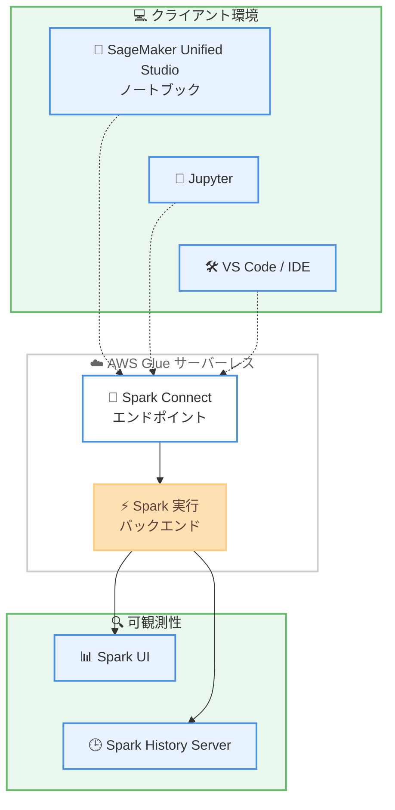

# AWS Glue - Interactive Sessions の Spark Connect サポート

**リリース日**: 2026 年 6 月 17 日
**サービス**: AWS Glue
**機能**: AWS Glue Interactive Sessions における Apache Spark Connect サポート

📊 [このアップデートのインフォグラフィックを見る](https://takech9203.github.io/aws-news-summary/20260617-aws-glue-interactive-sessions-spark-connect-smus-notebooks.html)
<!-- INFOGRAPHIC_BASE_URL は環境変数から取得 -->

## 概要

AWS Glue Interactive Sessions が Apache Spark Connect をサポートするようになりました。これにより、開発者は使い慣れた環境から Spark アプリケーションを構築および実行しながら、実際の処理は AWS Glue のサーバーレスバックエンドで実行できます。クラスターの管理は不要です。

Spark Connect は、クライアントアプリケーションと Spark 実行環境を分離するシンクライアントアーキテクチャを採用しています。この分離により、開発ツールをサーバー側のランタイムに密結合させることなく Spark ジョブを送信できます。サポートされる環境には、Amazon SageMaker Unified Studio のマネージドノートブック、Jupyter、Visual Studio Code をはじめとする Python インタープリターを備えた IDE、そして AWS API、SDK、CLI が含まれます。

この機能は、本番環境への移行前のアドホックなデータ探索、ステップごとの反復的なデバッグ、PySpark ジョブの段階的な開発を対象としたデータエンジニアやデータサイエンティスト向けに設計されています。

**アップデート前の課題**

- 以前はローカルの開発環境や任意の IDE から AWS Glue のサーバーレス Spark バックエンドへ直接対話的に接続する手段が限られていた
- クライアント側の依存関係とサーバー側の Spark ランタイムが密結合しており、バージョンアップグレード時の安定性に懸念があった
- 反復的なデバッグや段階的なジョブ開発を、本番に近いサーバーレス環境で手軽に行うことが難しかった

**アップデート後の改善**

- 今回のアップデートにより、SageMaker Unified Studio のノートブック、Jupyter、VS Code などの任意の環境から Glue のサーバーレスバックエンドに対して対話的に Spark ワークロードを実行できるようになった
- シンクライアントアーキテクチャによってクライアントの依存関係がサーバー側 Spark ランタイムから分離され、アップグレードが簡素化され安定性が向上した
- Spark UI によるリアルタイムモニタリング、Spark History Server による履歴確認、Glue API/CLI/SDK によるセッション管理といった可観測性機能を利用できるようになった

## アーキテクチャ図

クライアント環境から Spark Connect エンドポイント経由で Glue のサーバーレス Spark バックエンドに接続し、実行状況を Spark UI と Spark History Server で確認する流れを示しています。

## サービスアップデートの詳細

### 主要機能

1. **Spark Connect によるシンクライアント接続**
   - クライアントアプリケーションと Spark 実行環境を分離するアーキテクチャを採用
   - 開発ツールをサーバー側ランタイムに密結合させずに Spark ジョブを送信可能
   - クラスター管理が不要なサーバーレスバックエンドで処理を実行

2. **幅広い開発環境のサポート**
   - Amazon SageMaker Unified Studio のマネージドノートブック
   - Jupyter
   - Visual Studio Code をはじめとする Python インタープリターを備えた IDE
   - AWS API、SDK、CLI

3. **対話的な開発体験と可観測性**
   - アドホックなデータ探索、ステップごとの反復的なデバッグ、PySpark ジョブの段階的な開発に対応
   - Spark UI によるリアルタイムモニタリング
   - Spark History Server による実行履歴の確認
   - Glue API/CLI/SDK によるセッション管理

## 技術仕様

### サポートされる開発環境

| 項目 | 詳細 |
|------|------|
| ノートブック | Amazon SageMaker Unified Studio マネージドノートブック、Jupyter |
| IDE | Visual Studio Code など Python インタープリターを備えた IDE |
| プログラマティックアクセス | AWS API、SDK、CLI |
| 接続方式 | Apache Spark Connect (シンクライアントアーキテクチャ) |
| 実行基盤 | AWS Glue サーバーレス Spark バックエンド |
| 可観測性 | Spark UI、Spark History Server、Glue API/CLI/SDK |

## メリット

### ビジネス面

- **開発生産性の向上**: 使い慣れた環境から対話的に Spark ワークロードを実行でき、本番移行前の探索やデバッグを高速化
- **運用負荷の軽減**: サーバーレスバックエンドにより、クラスターのプロビジョニングや管理が不要
- **環境の柔軟性**: SageMaker Unified Studio、Jupyter、VS Code など好みのツールを選択可能

### 技術面

- **安定性の向上**: クライアントの依存関係をサーバー側 Spark ランタイムから分離し、アップグレードを簡素化
- **対話的な反復開発**: ステップごとのデバッグと PySpark ジョブの段階的開発をサポート
- **可観測性の確保**: Spark UI と Spark History Server によるリアルタイム監視と履歴確認

## デメリット・制約事項

### 制限事項

- 利用可能なリージョンが限定されている (利用可能リージョンセクションを参照)
- Spark Connect のシンクライアントアーキテクチャに起因する機能差異が存在する可能性があるため、利用する Spark API の対応状況を確認する必要がある

### 考慮すべき点

- 既存の Interactive Sessions の利用形態から Spark Connect ベースの接続へ移行する場合、クライアント側の設定や依存関係の確認が必要
- 本番ワークロードへ移行する際は、開発時の設定を本番向けに適切に見直すことが望ましい

## ユースケース

### ユースケース1: アドホックなデータ探索

**シナリオ**: データサイエンティストが SageMaker Unified Studio のノートブックから、本番に近いサーバーレス環境でデータセットを対話的に探索する。

**効果**: クラスター管理を意識せず、使い慣れたノートブックから即座にデータ探索を開始できる。

### ユースケース2: PySpark ジョブの段階的開発

**シナリオ**: データエンジニアが VS Code で PySpark ジョブをステップごとにデバッグしながら開発し、Spark UI で実行状況を確認する。

**効果**: 反復的なデバッグと可観測性により、本番移行前にジョブの品質を高められる。

### ユースケース3: 任意 IDE からのサーバーレス実行

**シナリオ**: 開発チームが Jupyter や任意の IDE から Glue のサーバーレスバックエンドに接続し、共通の実行基盤上でワークロードを実行する。

**効果**: クライアント依存関係をサーバー側ランタイムから分離できるため、環境間の差異やアップグレードに伴う影響を抑えられる。

## 料金

本アップデートに関する固有の料金情報は、公式発表では言及されていません。AWS Glue Interactive Sessions の利用料金については、AWS Glue の料金ページを参照してください。

## 利用可能リージョン

以下のリージョンで利用可能です。

- アジアパシフィック: ムンバイ、ソウル、シンガポール、シドニー、東京
- カナダ: 中部
- 欧州: フランクフルト、アイルランド、ロンドン、パリ、ストックホルム
- 南米: サンパウロ
- 米国東部: オハイオ、バージニア北部
- 米国西部: オレゴン

## 関連サービス・機能

- **Amazon SageMaker Unified Studio**: マネージドノートブックから Glue のサーバーレスバックエンドに接続する主要なクライアント環境
- **Apache Spark Connect**: クライアントと実行環境を分離するシンクライアントアーキテクチャの基盤技術
- **AWS Glue**: サーバーレスのデータ統合サービスであり、本機能の実行基盤を提供

## 参考リンク

- 📊 [インフォグラフィック](https://takech9203.github.io/aws-news-summary/20260617-aws-glue-interactive-sessions-spark-connect-smus-notebooks.html)
- [公式発表 (What's New)](https://aws.amazon.com/about-aws/whats-new/2026/06/aws-glue-interactive-sessions-spark-connect-smus-notebooks/)
- [AWS Glue ドキュメント](https://docs.aws.amazon.com/glue/)
- [AWS Glue 料金ページ](https://aws.amazon.com/glue/pricing/)

## まとめ

AWS Glue Interactive Sessions の Spark Connect サポートにより、開発者は SageMaker Unified Studio や任意の IDE から、クラスター管理不要のサーバーレス Spark バックエンドに対して対話的にワークロードを実行できるようになりました。クライアントとサーバーの分離による安定性向上と可観測性機能の活用は、本番移行前の探索やデバッグを大きく効率化します。データエンジニアリングやデータサイエンスのワークフローを持つチームは、対応リージョンでの試験的な導入を検討することを推奨します。
