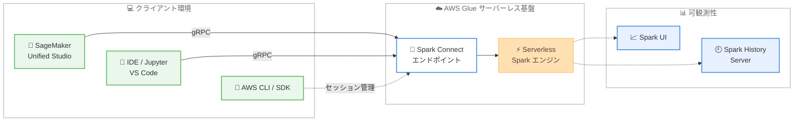

# AWS Glue - Interactive Sessions の Spark Connect サポート

**リリース日**: 2026年6月17日
**サービス**: AWS Glue
**機能**: AWS Glue Interactive Sessions における Apache Spark Connect サポート

📊 [このアップデートのインフォグラフィックを見る](https://takech9203.github.io/aws-news-summary/20260617-aws-glue-interactive-sessions-spark-connect-smus-notebooks.html)
<!-- INFOGRAPHIC_BASE_URL は環境変数から取得 -->

## 概要

AWS Glue Interactive Sessions が Apache Spark Connect をサポートするようになりました。これにより、開発者は使い慣れた環境から Spark アプリケーションを構築および実行しながら、その処理を AWS Glue のサーバーレスインフラストラクチャ上で実行できます。クラスター管理は不要です。

Spark Connect は、クライアントアプリケーションを Spark の実行環境から分離する軽量なクライアントアーキテクチャ (シンクライアントアーキテクチャ) を採用しています。クライアントは gRPC を介してリモートの Spark 環境に接続し、最小限のクライアント側依存関係で Spark を実行します。この仕組みにより、アドホックなデータ探索、ステップごとの反復的なデバッグ、本番デプロイ前の段階的な PySpark ジョブ開発といったワークフローが可能になります。

この機能の主な対象は、Amazon SageMaker Unified Studio のマネージドノートブック、Jupyter や Visual Studio Code などのノートブック環境および IDE、さらに Python インタープリターを備えた任意の IDE を利用するデータエンジニアやデータサイエンティストです。AWS API、SDK、CLI からも接続できます。

**アップデート前の課題**

- 使い慣れたローカル IDE やノートブック環境から、AWS Glue のサーバーレス Spark エンジンに対して対話的に処理を実行することが容易ではなかった
- クライアントアプリケーションと Spark 実行環境が密結合していたため、クライアント側の依存関係とサーバー側ランタイムの分離が難しく、アップグレードや安定性の確保に手間がかかった
- 本番デプロイ前に PySpark ジョブを段階的に開発したり、反復的にデバッグしたりするワークフローを構築しにくかった

**アップデート後の改善**

- Spark Connect により、好みの開発環境から AWS Glue のサーバーレスインフラ上で Spark アプリケーションを実行できるようになった
- シンクライアントアーキテクチャにより、クライアント側の依存関係とサーバー側ランタイムが分離され、アップグレードの簡素化と安定性の向上が実現した
- アドホックなデータ探索、反復的なデバッグ、段階的な PySpark ジョブ開発が可能になった

## アーキテクチャ図



クライアント環境 (SageMaker Unified Studio や IDE) が gRPC を介して AWS Glue のサーバーレス Spark エンジンに接続し、処理結果は Spark UI や Spark History Server で監視できることを示しています。

## サービスアップデートの詳細

### 主要機能

1. **Spark Connect によるリモート実行**
   - クライアントアプリケーションと Spark 実行環境を分離するシンクライアントアーキテクチャを採用
   - クライアントは gRPC を介して AWS Glue のサーバーレス Spark 環境に接続
   - 最小限のクライアント側依存関係でリモートの Spark を実行

2. **対話的な開発ワークフローのサポート**
   - アドホックなデータ探索
   - ステップごとの反復的なデバッグ
   - 本番デプロイ前の段階的な PySpark ジョブ開発

3. **可観測性 (オブザーバビリティ) 機能**
   - Spark UI によるリアルタイムのセッション監視
   - Spark History Server による履歴トラッキング
   - AWS Glue API、CLI、SDK を用いたセッション管理

4. **幅広い開発環境のサポート**
   - Amazon SageMaker Unified Studio のマネージドノートブック
   - Jupyter や Visual Studio Code などのノートブック環境および IDE
   - Python インタープリターを備えた任意の IDE、および AWS API、SDK、CLI

## 技術仕様

### Spark Connect の構成要素

| 項目 | 詳細 |
|------|------|
| 通信プロトコル | gRPC |
| アーキテクチャ | シンクライアント (クライアントと実行環境の分離) |
| 実行基盤 | AWS Glue サーバーレス Spark (クラスター管理不要) |
| 対応クライアント | SageMaker Unified Studio、Jupyter、VS Code、Python 対応 IDE、AWS API / SDK / CLI |
| 監視 | Spark UI (リアルタイム)、Spark History Server (履歴) |

### API変更履歴

| 日付 | サービス | 変更内容 |
|------|----------|----------|
| 2026/06/04 | [AWS Glue](https://awsapichanges.com/archive/changes/fb8102-glue.html) | 2 new 3 updated api methods - AWS Glue Interactive Sessions が Apache Spark Connect をサポート。`GetSessionEndpoint` と `GetDashboardUrl` API を追加し、`CreateSession` が `SPARK_CONNECT` セッションタイプを受け付けるよう変更 |

### セッション作成の例

```python
import boto3

glue = boto3.client("glue")

# Spark Connect セッションを作成
response = glue.create_session(
    Id="my-spark-connect-session",
    Role="arn:aws:iam::123456789012:role/GlueInteractiveSessionRole",
    Command={
        "Name": "glueetl",
        "PythonVersion": "3"
    },
    SessionType="SPARK_CONNECT"
)
```

`CreateSession` API で `SessionType` に `SPARK_CONNECT` を指定することで、Spark Connect 対応のセッションを作成します。実際のパラメーター名や指定方法は公式ドキュメントで確認してください。

## 設定方法

### 前提条件

1. AWS Glue Interactive Sessions を利用できる IAM ロールおよび権限が設定されていること
2. クライアント側に Python インタープリターおよび Spark Connect クライアントが用意されていること
3. SageMaker Unified Studio を利用する場合は、対象ドメインおよびプロジェクトが構成されていること

### 手順

#### ステップ1: Spark Connect セッションの作成

```bash
aws glue create-session \
    --id my-spark-connect-session \
    --role arn:aws:iam::123456789012:role/GlueInteractiveSessionRole \
    --command Name=glueetl,PythonVersion=3 \
    --session-type SPARK_CONNECT
```

AWS CLI で `SPARK_CONNECT` タイプの Interactive Session を作成します。これにより AWS Glue 側にサーバーレス Spark 実行環境が準備されます。

#### ステップ2: エンドポイントの取得とクライアント接続

```bash
aws glue get-session-endpoint --id my-spark-connect-session
```

`GetSessionEndpoint` API でクライアントが接続するための Spark Connect エンドポイントを取得します。取得したエンドポイントに対して、SageMaker Unified Studio ノートブックや使い慣れた IDE から gRPC で接続します。

#### ステップ3: 開発と監視

セッションに接続後、PySpark コードを対話的に実行します。`GetDashboardUrl` API で取得できる URL を通じて Spark UI にアクセスし、リアルタイムでセッションを監視できます。実行履歴は Spark History Server で確認できます。

## メリット

### ビジネス面

- **開発生産性の向上**: 使い慣れた IDE やノートブックから直接 AWS Glue 上で処理を実行でき、環境構築の手間を削減できる
- **インフラ運用コストの削減**: サーバーレス基盤を利用するため、Spark クラスターの構築や管理が不要
- **本番移行リスクの低減**: 段階的な開発と反復的なデバッグにより、本番デプロイ前に品質を高められる

### 技術面

- **依存関係の分離**: クライアント側依存関係とサーバー側ランタイムが分離され、アップグレードが簡素化され安定性が向上
- **可観測性の確保**: Spark UI と Spark History Server によりセッションの監視と履歴トラッキングが可能
- **柔軟な接続手段**: gRPC ベースの接続により、Python 対応の任意の IDE や AWS API / SDK / CLI から利用可能

## デメリット・制約事項

### 制限事項

- 利用可能なリージョンが限定されている (利用可能リージョンを参照)
- クライアント側に Spark Connect クライアントおよび Python 環境を用意する必要がある

### 考慮すべき点

- ローカルクライアントから AWS Glue 環境へ gRPC で接続するため、ネットワーク経路やセキュリティ要件の確認が必要
- 既存の標準的な Glue Interactive Sessions との使い分けを検討する必要がある

## ユースケース

### ユースケース1: ローカル IDE での対話的データ探索

**シナリオ**: データエンジニアがローカルの Visual Studio Code から AWS Glue のサーバーレス Spark エンジンに接続し、大規模データセットを対話的に探索する

**実装例**:
```python
from pyspark.sql import SparkSession

# Spark Connect エンドポイントに接続
spark = SparkSession.builder.remote("sc://<glue-spark-connect-endpoint>").getOrCreate()

df = spark.read.parquet("s3://my-bucket/data/")
df.printSchema()
df.show(20)
```

**効果**: クラスターを管理せずに、使い慣れた IDE から大規模データの探索を即座に開始できる

### ユースケース2: PySpark ジョブの段階的開発とデバッグ

**シナリオ**: 本番デプロイ前に、PySpark の変換ロジックをステップごとに実行して結果を確認しながら開発する

**実装例**:
```python
# 変換処理を段階的に確認しながら構築
filtered = df.filter(df["status"] == "active")
filtered.show(5)

aggregated = filtered.groupBy("region").count()
aggregated.show()
```

**効果**: 反復的なデバッグにより、本番ジョブの品質を高めてからデプロイできる

### ユースケース3: SageMaker Unified Studio での協働分析

**シナリオ**: データサイエンスチームが SageMaker Unified Studio のマネージドノートブックから AWS Glue の Spark エンジンを共有して分析を進める

**実装例**:
```python
# SageMaker Unified Studio ノートブックから Spark Connect セッションを利用
spark.sql("SELECT region, COUNT(*) FROM sales GROUP BY region").show()
```

**効果**: マネージド環境で統合的なデータ分析ワークフローを構築し、チーム間の協働を促進できる

## 料金

公式発表では本機能に関する料金詳細は示されていません。AWS Glue Interactive Sessions の利用料金が適用されると考えられます。詳細は AWS Glue の料金ページで確認してください。

## 利用可能リージョン

本機能は以下のリージョンで利用可能です。

- アジアパシフィック: ムンバイ、ソウル、シンガポール、シドニー、東京
- カナダ: 中部
- 欧州: フランクフルト、アイルランド、ロンドン、パリ、ストックホルム
- 南米: サンパウロ
- 米国東部: オハイオ、バージニア北部
- 米国西部: オレゴン

## 関連サービス・機能

- **Amazon SageMaker Unified Studio**: マネージドノートブックから Spark Connect セッションに接続して分析や開発を行う統合環境
- **Apache Spark Connect**: クライアントと実行環境を分離するシンクライアントアーキテクチャを提供する Apache Spark の機能
- **AWS Glue Interactive Sessions**: サーバーレスの Spark 環境を対話的に利用するための AWS Glue の機能

## 参考リンク

- 📊 [インフォグラフィック](https://takech9203.github.io/aws-news-summary/20260617-aws-glue-interactive-sessions-spark-connect-smus-notebooks.html)
- [公式発表 (What's New)](https://aws.amazon.com/about-aws/whats-new/2026/06/aws-glue-interactive-sessions-spark-connect-smus-notebooks)
- [AWS Glue API 変更履歴 (awsapichanges.com)](https://awsapichanges.com/archive/changes/fb8102-glue.html)
- [AWS Glue ドキュメント](https://docs.aws.amazon.com/glue/)
- [AWS Glue 料金ページ](https://aws.amazon.com/glue/pricing/)

## まとめ

AWS Glue Interactive Sessions の Spark Connect サポートにより、開発者は使い慣れた IDE やノートブックから AWS Glue のサーバーレス Spark エンジンを対話的に利用できるようになりました。クラスター管理が不要で、アドホックな探索から段階的なジョブ開発までを 1 つのワークフローでカバーできます。データエンジニアリングや分析を行うチームは、まず東京リージョンなどの対応リージョンで Spark Connect セッションを試し、既存の開発フローへの組み込みを検討することをおすすめします。
