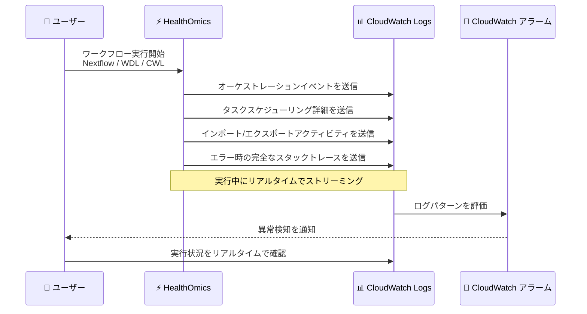

# AWS HealthOmics - ワークフローエンジンログの Amazon CloudWatch へのリアルタイムストリーミング

**リリース日**: 2026年6月17日
**サービス**: AWS HealthOmics
**機能**: ワークフローエンジンログの Amazon CloudWatch へのリアルタイムストリーミング

📊 [このアップデートのインフォグラフィックを見る](https://takech9203.github.io/aws-news-summary/20260617-aws-healthomics-real-time-engine-log-streaming.html)
<!-- INFOGRAPHIC_BASE_URL は環境変数から取得 -->

## 概要

AWS HealthOmics が、ワークフローエンジンログを Amazon CloudWatch へリアルタイムにストリーミングする機能をサポートした。これにより、ワークフローの実行状況を進行中に確認できるようになり、実行の途中段階でも詳細な情報へ即座にアクセスできる。

AWS HealthOmics は HIPAA 対応のフルマネージドサービスであり、ヘルスケアおよびライフサイエンス分野の顧客が大規模な科学的発見を加速するために活用されている。今回のアップデートにより、研究者、バイオインフォマティシャン、開発者は、ワークフローの実行中に得られる実行詳細を即座に把握できるため、反復的なワークフロー開発とデバッグを高速化できる。

ストリーミングされるエンジンログには、ワークフローのオーケストレーションイベント、タスクスケジューリングの詳細、インポート/エクスポートのアクティビティ、エラー発生時の完全なスタックトレースが含まれる。これらの情報がリアルタイムでエンジンログストリームに集約される。

**アップデート前の課題**

- ワークフローの実行詳細はリアルタイムで参照できず、実行が完了または失敗した後でなければログを確認できなかった
- 実行途中での問題の兆候を早期に検知する手段が限られており、長時間実行されるワークフローのデバッグに時間がかかっていた
- 既存の監視・可観測性ツールとワークフロー実行ログを連携させた継続的なモニタリングが難しかった

**アップデート後の改善**

- ワークフローエンジンログが Amazon CloudWatch へリアルタイムでストリーミングされ、実行状況を進行中に確認できるようになった
- ログパターンに対する CloudWatch アラームを設定することで、異常を早期に検知できるようになった
- ダッシュボードの構築や既存の可観測性ツールとの統合により、継続的なモニタリングが可能になった

## アーキテクチャ図



ワークフロー実行中に各種エンジンログが CloudWatch Logs へリアルタイムで送信され、ユーザーが実行状況をその場で確認したり、ログパターンに基づくアラームで異常を早期検知したりできる流れを示している。

## サービスアップデートの詳細

### 主要機能

1. **エンジンログのリアルタイムストリーミング**
   - ワークフローエンジンログが実行中に Amazon CloudWatch へストリーミングされる
   - 実行が完了する前から、進行中の実行状況を確認できる
   - 反復的なワークフロー開発とデバッグを高速化する

2. **詳細な実行情報の可視化**
   - ワークフローのオーケストレーションイベント
   - タスクスケジューリングの詳細
   - インポート/エクスポートのアクティビティ
   - エラー発生時の完全なスタックトレース

3. **CloudWatch との統合による監視**
   - ログパターンに対する CloudWatch アラームを設定し、異常を早期に検知できる
   - 継続的なモニタリングのためのダッシュボードを構築できる
   - 既存の可観測性ツールと統合できる

## 技術仕様

### 対応ワークフロー言語

| 項目 | 詳細 |
|------|------|
| 対応言語 | Nextflow、WDL、CWL |
| ログ送信先 | Amazon CloudWatch Logs (エンジンログストリーム) |
| ストリーミング方式 | 実行中のリアルタイムストリーミング |
| ログ内容 | オーケストレーションイベント、タスクスケジューリング、インポート/エクスポート、エラー時のスタックトレース |

### API 変更履歴

| 日付 | サービス | 変更内容 |
|------|----------|----------|
| 2026/06/11 | [omics](https://awsapichanges.com/archive/changes/b3f27b-omics.html) | 1 updated api methods - ListRuns API レスポンスに workflowName のサポートを追加 |
| 2026/06/08 | [omics](https://awsapichanges.com/archive/changes/a09b61-omics.html) | 2 updated api methods - StartRunBatch API に EngineSettings を追加 |

注: 上記 API 変更は同時期の HealthOmics 関連のアップデートとして参考までに記載する。今回のエンジンログのリアルタイムストリーミングは CloudWatch Logs への統合機能であり、ログの確認は CloudWatch のコンソールおよび API を通じて行う。

## 設定方法

### 前提条件

1. AWS HealthOmics が利用可能なリージョンでワークフロー実行を行うこと
2. ワークフローが Nextflow、WDL、CWL のいずれかで定義されていること
3. CloudWatch Logs のログストリームを参照するための適切な IAM 権限があること

### 手順

#### ステップ1: ワークフロー実行を開始する

```bash
aws omics start-run \
  --workflow-id <workflow-id> \
  --role-arn <role-arn> \
  --output-uri s3://<bucket-name>/output/ \
  --parameters file://params.json
```

ワークフロー実行を開始する。実行が開始されると、エンジンログが CloudWatch Logs のエンジンログストリームへリアルタイムでストリーミングされる。

#### ステップ2: CloudWatch でリアルタイムにログを確認する

```bash
aws logs tail /aws/omics/WorkflowLog --follow
```

`--follow` オプションにより、実行中のエンジンログをリアルタイムで追跡できる。ログにはオーケストレーションイベント、タスクスケジューリング、エラー時のスタックトレースなどが含まれる。

#### ステップ3: ログパターンに対するアラームを設定する

異常を早期に検知するため、CloudWatch メトリクスフィルターとアラームを設定し、特定のエラーパターンが出力された際に通知を受け取るよう構成する。また、継続的なモニタリングのためのダッシュボードを構築し、既存の可観測性ツールと統合する。

## メリット

### ビジネス面

- **開発サイクルの短縮**: 実行完了を待たずにログを確認できるため、ワークフロー開発の反復サイクルが短縮される
- **運用コストの削減**: 問題を早期に検知して対処できるため、無駄な再実行や長時間の実行失敗によるコストを抑制できる
- **科学的発見の加速**: デバッグ時間の短縮により、研究者がより多くの時間を本来の研究に充てられる

### 技術面

- **リアルタイムの可視性**: 実行中のオーケストレーションイベントやタスクスケジューリングを即座に把握できる
- **詳細なエラー解析**: エラー発生時に完全なスタックトレースが得られるため、根本原因の特定が容易になる
- **既存ツールとの統合**: CloudWatch アラーム、ダッシュボード、可観測性ツールと統合した一元的な監視が可能

## デメリット・制約事項

### 制限事項

- ストリーミングされるのはワークフローエンジンログであり、各タスク内部のアプリケーションログとは区別される
- CloudWatch Logs の保存および取り込みに対する料金が別途発生する

### 考慮すべき点

- ログ量が多いワークフローでは、CloudWatch Logs の取り込み量に応じてコストが増加するため、保持期間やログ量の管理を検討する
- アラームやメトリクスフィルターは、検知したいエラーパターンに合わせて適切に設計する必要がある

## ユースケース

### ユースケース1: ワークフロー開発時のリアルタイムデバッグ

**シナリオ**: バイオインフォマティシャンが新しい Nextflow ワークフローを開発しており、実行途中の挙動を確認しながら反復的に修正したい。

**実装例**:
```bash
aws logs tail /aws/omics/WorkflowLog --follow --format short
```

**効果**: 実行完了を待たずにタスクスケジューリングやエラーの兆候を確認でき、開発の反復サイクルが短縮される。

### ユースケース2: 長時間実行ワークフローの異常検知

**シナリオ**: 大規模なゲノム解析ワークフローが長時間実行されるため、エラーを早期に検知して無駄な実行を防ぎたい。

**実装例**:
```
CloudWatch メトリクスフィルターで "ERROR" や特定のスタックトレースパターンを検出し、
CloudWatch アラーム経由で Amazon SNS による通知を構成する。
```

**効果**: 異常を即座に検知して実行を停止または対処でき、長時間の実行失敗によるコストと時間の浪費を防げる。

### ユースケース3: 既存可観測性基盤との統合

**シナリオ**: 組織全体の可観測性基盤で HealthOmics のワークフロー実行も一元的に監視したい。

**実装例**:
```
CloudWatch Logs のサブスクリプションフィルターやダッシュボードを利用し、
既存の監視・可観測性ツールへエンジンログを連携する。
```

**効果**: ワークフロー実行の状況を組織標準のモニタリング環境に統合し、運用の一貫性を確保できる。

## 料金

ワークフローエンジンログのリアルタイムストリーミング機能自体に追加料金は記載されていないが、CloudWatch Logs へのログの取り込み、保存、および分析には Amazon CloudWatch の標準料金が適用される。詳細は CloudWatch および HealthOmics の料金ページを参照する。

## 利用可能リージョン

本機能は、Nextflow、WDL、CWL のワークフロー実行に対応し、HealthOmics が利用可能なすべてのリージョンで提供される。

- 米国東部 (バージニア北部)
- 米国西部 (オレゴン)
- 欧州 (フランクフルト、アイルランド、ロンドン)
- イスラエル (テルアビブ)
- アジアパシフィック (シンガポール、ソウル)

## 関連サービス・機能

- **Amazon CloudWatch Logs**: エンジンログのストリーミング先であり、ログの確認、保存、分析を担う
- **Amazon CloudWatch アラーム**: ログパターンに基づく異常検知と通知を実現する
- **AWS HealthOmics ワークフロー**: Nextflow、WDL、CWL で定義されたバイオインフォマティクスワークフローの実行基盤

## 参考リンク

- 📊 [インフォグラフィック](https://takech9203.github.io/aws-news-summary/20260617-aws-healthomics-real-time-engine-log-streaming.html)
- [公式発表 (What's New)](https://aws.amazon.com/about-aws/whats-new/2026/06/aws-healthomics-real-time-engine-log-streaming/)
- [AWS HealthOmics ドキュメント](https://docs.aws.amazon.com/omics/)
- [Amazon CloudWatch Logs 料金ページ](https://aws.amazon.com/cloudwatch/pricing/)

## まとめ

今回のアップデートにより、AWS HealthOmics のワークフローエンジンログを Amazon CloudWatch へリアルタイムでストリーミングできるようになり、ワークフローの実行状況を進行中に把握できるようになった。研究者やバイオインフォマティシャンは、実行途中の詳細やエラー時のスタックトレースを即座に確認することで、デバッグと反復開発を高速化できる。CloudWatch アラームやダッシュボードと組み合わせて、ワークフロー実行の継続的なモニタリング体制を構築することを推奨する。
