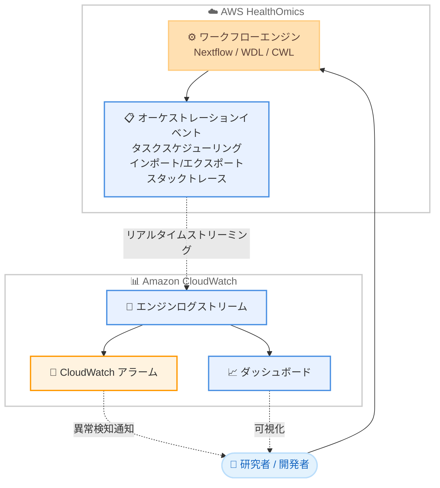

# AWS HealthOmics - ワークフローエンジンログの Amazon CloudWatch へのリアルタイムストリーミング

**リリース日**: 2026年6月17日
**サービス**: AWS HealthOmics
**機能**: ワークフローエンジンログの Amazon CloudWatch へのリアルタイムストリーミング

📊 [このアップデートのインフォグラフィックを見る](https://takech9203.github.io/aws-news-summary/20260617-aws-healthomics-real-time-engine-log-streaming.html)
<!-- INFOGRAPHIC_BASE_URL は環境変数から取得 -->

## 概要

AWS HealthOmics は、バイオインフォマティクスワークフローをフルマネージドで実行できる HIPAA 対応サービスです。今回のアップデートにより、ワークフローのエンジンログを Amazon CloudWatch へリアルタイムでストリーミングできるようになりました。これにより、ワークフロー実行の進捗をライブで追跡できます。

従来は、ワークフロー実行が完了または失敗した後でなければエンジンログを確認できないケースがあり、長時間実行されるゲノム解析パイプラインのデバッグや進捗確認に時間がかかっていました。今回の機能では、ワークフローオーケストレーションイベント、タスクスケジューリングの詳細、インポート/エクスポートのアクティビティ、エラー発生時の完全なスタックトレースが、発生と同時にエンジンログストリームへ送られます。

この機能は、ヘルスケアおよびライフサイエンス分野でゲノム解析やバイオインフォマティクスパイプラインを運用する研究者や開発者にとって、開発の反復速度向上とトラブルシューティングの効率化に直結します。Nextflow、WDL、CWL の各ワークフロータイプに対応しています。

**アップデート前の課題**

- ワークフロー実行が完了するまでエンジンログを確認できず、長時間実行されるパイプラインの進捗をリアルタイムで把握しづらかった
- エラー発生時の詳細なスタックトレースの取得に時間がかかり、デバッグの反復サイクルが遅くなっていた
- ログ取得のタイミングが限られるため、異常検知やアラートを CloudWatch ベースで構築しにくかった

**アップデート後の改善**

- エンジンログが発生と同時に Amazon CloudWatch へストリーミングされ、実行中の進捗をライブで追跡できるようになった
- エラー時の完全なスタックトレースに即座にアクセスでき、開発とデバッグの反復が高速化された
- CloudWatch のログパターンに対するアラームを設定でき、異常を早期に検知できるようになった

## アーキテクチャ図



ワークフローエンジンが生成するイベントやスタックトレースが、リアルタイムで Amazon CloudWatch のエンジンログストリームへ送られ、アラームやダッシュボードによる監視に活用できることを示しています。

## サービスアップデートの詳細

### 主要機能

1. **リアルタイムログストリーミング**
   - ワークフローエンジンログが発生と同時に Amazon CloudWatch へストリーミングされる
   - ワークフロー実行の進捗をライブで追跡できる
   - 実行完了を待たずに実行中の詳細を確認できる

2. **詳細なログ内容**
   - ワークフローオーケストレーションイベント
   - タスクスケジューリングの詳細
   - インポート/エクスポートのアクティビティ
   - エラー発生時の完全なスタックトレース

3. **CloudWatch との連携**
   - ログパターンに対する CloudWatch アラームを設定し、異常を早期に検知できる
   - 監視ダッシュボードの構築が可能
   - 既存のオブザーバビリティツールとの統合が可能

## 技術仕様

### 対応ワークフロータイプ

| 項目 | 詳細 |
|------|------|
| Nextflow | データ駆動型のバイオインフォマティクスワークフロー記述言語 |
| WDL | Workflow Description Language。可読性の高いワークフロー定義言語 |
| CWL | Common Workflow Language。再現性を重視した標準仕様 |

### ログの種類

| ログカテゴリ | 内容 |
|--------------|------|
| オーケストレーションイベント | ワークフロー全体の制御に関するイベント |
| タスクスケジューリング | 個々のタスクの起動・割り当て情報 |
| インポート/エクスポート | データの入出力アクティビティ |
| スタックトレース | エラー発生時の完全なトレース情報 |

## 設定方法

### 前提条件

1. AWS HealthOmics が利用可能なリージョンで実行していること
2. ワークフローを実行する IAM ロールに CloudWatch Logs への書き込み権限があること
3. Nextflow、WDL、CWL いずれかのワークフローが定義されていること

### 手順

#### ステップ1: ワークフロー実行を開始する

```bash
aws omics start-run \
  --workflow-id 1234567 \
  --role-arn arn:aws:iam::123456789012:role/HealthOmicsServiceRole \
  --name "genomics-pipeline-run" \
  --output-uri s3://my-healthomics-output/
```

ワークフロー実行を開始します。実行中にエンジンログがリアルタイムで CloudWatch へストリーミングされます。

#### ステップ2: CloudWatch でエンジンログを確認する

```bash
aws logs tail /aws/omics/WorkflowLog --follow
```

`--follow` オプションにより、エンジンログストリームをリアルタイムで追跡します。ワークフローの進捗やエラーを即座に確認できます。

#### ステップ3: ログパターンに対するアラームを設定する

CloudWatch メトリクスフィルターを使ってエラーパターンを抽出し、しきい値を超えた場合に通知するアラームを設定します。これにより、異常を早期に検知して運用の信頼性を高められます。

## メリット

### ビジネス面

- **開発スピードの向上**: 実行中に進捗とエラーを確認できるため、開発と検証の反復サイクルが短縮される
- **運用信頼性の向上**: 異常を早期に検知できるため、長時間実行されるパイプラインの失敗による損失を抑えられる
- **コンプライアンス対応**: HIPAA 対応サービスであるため、ヘルスケアおよびライフサイエンス分野の要件に適合する

### 技術面

- **リアルタイム可観測性**: ワークフロー実行のライブモニタリングが可能になる
- **効率的なデバッグ**: 完全なスタックトレースに即座にアクセスでき、原因特定が容易になる
- **既存ツールとの統合**: CloudWatch を中心とした既存のオブザーバビリティ環境にシームレスに統合できる

## デメリット・制約事項

### 制限事項

- 現時点で利用可能なリージョンが限定されている
- ログ量の増加に伴い CloudWatch Logs の取り込み・保存コストが発生する

### 考慮すべき点

- ログ保持期間やフィルター設定を適切に管理し、コストを最適化する必要がある
- 大量のログをストリーミングする場合、ダッシュボードやアラームの設計を事前に検討することが望ましい

## ユースケース

### ユースケース1: 長時間実行ゲノム解析パイプラインの進捗監視

**シナリオ**: 数時間から数日かかる大規模なゲノム解析ワークフローを実行し、進捗をリアルタイムで把握したい

**実装例**:
```
aws logs tail /aws/omics/WorkflowLog --follow
```

**効果**: 実行完了を待たずに進捗を確認でき、問題発生時に早期対応できる

### ユースケース2: エラーの即時デバッグ

**シナリオ**: ワークフローが途中で失敗した際に、原因を素早く特定したい

**実装例**:
```
CloudWatch Logs Insights でスタックトレースを含むログエントリを検索
fields @timestamp, @message
| filter @message like /ERROR/
| sort @timestamp desc
```

**効果**: 完全なスタックトレースに即座にアクセスでき、デバッグの反復が高速化される

### ユースケース3: 異常検知の自動アラート

**シナリオ**: 特定のエラーパターンが発生した際に運用チームへ自動通知したい

**実装例**:
```
CloudWatch メトリクスフィルターでエラーパターンを抽出し、
SNS トピックと連携したアラームを設定
```

**効果**: 異常を早期に検知し、運用の信頼性を高められる

## 料金

公式発表時点で、本機能自体に関する追加料金の記載はありません。エンジンログのストリーミング先である Amazon CloudWatch Logs の取り込み・保存・分析については、CloudWatch の通常料金が適用されます。詳細は CloudWatch および HealthOmics の料金ページを参照してください。

## 利用可能リージョン

- 米国東部 (バージニア北部)
- 米国西部 (オレゴン)
- 欧州 (フランクフルト、アイルランド、ロンドン)
- イスラエル (テルアビブ)
- アジアパシフィック (シンガポール、ソウル)

## 関連サービス・機能

- **Amazon CloudWatch**: エンジンログのストリーミング先。アラームやダッシュボードによる監視を提供
- **Amazon CloudWatch Logs Insights**: ストリーミングされたログのクエリ・分析に活用できる
- **AWS HealthOmics ワークフロー**: Nextflow、WDL、CWL に対応したフルマネージドなバイオインフォマティクス実行基盤

## 参考リンク

- 📊 [インフォグラフィック](https://takech9203.github.io/aws-news-summary/20260617-aws-healthomics-real-time-engine-log-streaming.html)
- [公式発表 (What's New)](https://aws.amazon.com/about-aws/whats-new/2026/06/aws-healthomics-real-time-engine-log-streaming/)
- [AWS HealthOmics ドキュメント](https://docs.aws.amazon.com/omics/)
- [Amazon CloudWatch でのログ監視ドキュメント](https://docs.aws.amazon.com/omics/latest/dev/monitoring-cloudwatch.html)

## まとめ

このアップデートにより、AWS HealthOmics のワークフローエンジンログを Amazon CloudWatch へリアルタイムでストリーミングできるようになり、長時間実行されるバイオインフォマティクスパイプラインのライブ監視と高速なデバッグが可能になりました。HealthOmics を利用しているチームは、CloudWatch アラームやダッシュボードを活用した監視体制を整備し、開発の反復速度と運用の信頼性を高めることを推奨します。
