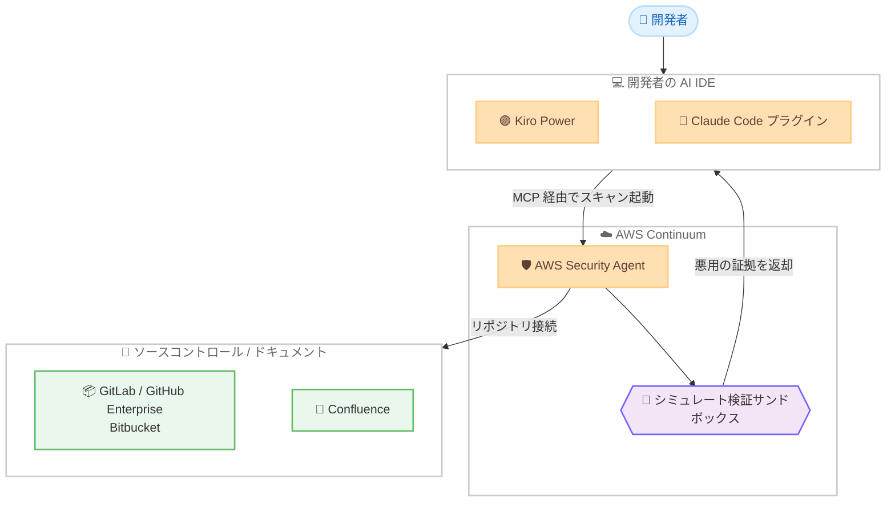

# AWS Security Agent - Kiro Power、Claude Code、シミュレート検証、新規統合のサポート追加

**リリース日**: 2026 年 6 月 17 日
**サービス**: AWS Security Agent (AWS Continuum)
**機能**: Kiro Power、Claude Code プラグイン、シミュレート検証、ソースコントロール統合の拡張

📊 [このアップデートのインフォグラフィックを見る](https://takech9203.github.io/aws-news-summary/20260617-aws-kiro-power-claude-code.html)
<!-- INFOGRAPHIC_BASE_URL は環境変数から取得 -->

## 概要

AWS は、AWS Continuum の一部である AWS Security Agent に対して、開発者向けの大幅な機能拡張を発表しました。今回のアップデートにより、AWS Security Agent は AI 搭載 IDE である Kiro および Claude Code をサポートし、開発者は普段使用している開発環境からセキュリティスキャンを直接起動できるようになりました。あわせて、検出結果の信頼性を高める「シミュレート検証 (simulated validations)」と、複数のソースコントロールおよびドキュメントプラットフォームとの新規統合が追加されています。

AWS Security Agent は、アプリケーションを開発ライフサイクル全体にわたって能動的に保護するフロンティアエージェントとして位置づけられています。設計時のスレットモデリング (プレビュー)、開発時のコードレビュー (プレビュー)、デプロイ時のペネトレーションテスト (GA) という 3 つのセキュリティフェーズを 1 つの統合された製品として提供します。今回の拡張は、これらの機能を開発者の作業環境に直接届けることで、コンテキストの切り替えを排除し、セキュリティ対応を開発フローに組み込むことを目的としています。

Kiro Power はオープンソースとして提供され、Claude Code プラグインも提供されます。さらに、オープンな MCP (Model Context Protocol) 統合を通じて、任意の AI IDE と連携できます。これにより開発者は、既存のソースコントロールプラットフォームを接続し、スレットモデルの構築、コードスキャンの実行、コードレビューやペネトレーションテストで検証された修正対応を、IDE を離れることなく実施できます。

**アップデート前の課題**

- 以前はセキュリティスキャンを実行するために専用のコンソールやツールへ移動する必要があり、開発フローからコンテキストを切り替える負担があった
- 以前は検出結果が実際に悪用可能かどうかを開発者自身が手動でトリアージする必要があり、誤検知の切り分けに多くの時間がかかっていた
- 以前は連携できるソースコントロールやドキュメントプラットフォームが限られており、自己ホスト型環境やドキュメントツールとの統合が十分ではなかった

**アップデート後の改善**

- 今回のアップデートにより、Kiro、Claude Code、および MCP 対応の AI IDE から直接セキュリティスキャンを起動できるようになった
- 今回のアップデートにより、シミュレート検証によって悪用の証拠 (proof of exploit) が提示され、誤検知を最小化し、優先度付けされた修正対応が可能になった
- 今回のアップデートにより、GitLab.com、GitLab Self Managed、GitHub Enterprise、Bitbucket、Confluence との統合が追加された

## アーキテクチャ図



開発者は AI IDE から MCP 経由で AWS Security Agent を起動し、接続されたソースコントロールやドキュメントに対してスキャンを実行します。検出結果はサンドボックスでシミュレート検証され、悪用の証拠とともに IDE 内にインラインで返却されます。

## サービスアップデートの詳細

### 主要機能

1. **Kiro Power と Claude Code プラグイン**
   - オープンソースの Kiro Power と Claude Code プラグインにより、開発者は普段の IDE からセキュリティスキャンを直接起動できる
   - オープンな MCP 統合により、AWS Security Agent MCP サーバーを介して任意の AI IDE と連携できる
   - スレットモデルの構築、コードスキャンの実行、検証された修正対応を、コンテキストを切り替えることなく IDE 内で完結できる

2. **シミュレート検証 (Simulated Validations)**
   - コードスキャナーが検出結果を隔離されたサンドボックス内で再現し、悪用の証拠 (proof of exploit) を提示する
   - 単なる検出を超えて、脆弱性が実際にどのように悪用され得るかの証拠を返すことで、検出結果の信頼性を高める
   - 検証されていないアラートのトリアージにかかる時間を削減し、誤検知を最小化して修正対応の優先度付けを支援する

3. **新規統合のサポート**
   - GitLab.com、GitLab Self Managed、GitHub Enterprise、Bitbucket といったソースコントロールプラットフォームに対応
   - ドキュメントプラットフォームとして Confluence をサポートし、レビュー時のコンテキストとして活用できる
   - SaaS 型および自己ホスト型の両方の環境に対応する

## 技術仕様

### AWS Security Agent の 3 つのフェーズ

| フェーズ | 機能 | 提供状態 |
|------|------|------|
| 設計時 (Design-time) | スレットモデリング (STRIDE フレームワークを使用) | プレビュー |
| 開発時 (Development-time) | コードレビュー (推論ベースの分析) | プレビュー |
| デプロイ時 (Deployment-time) | ペネトレーションテスト | GA |

### IDE 連携方式

| 連携方式 | 説明 |
|------|------|
| Kiro Power | オープンソースとして提供される Kiro 向け連携 |
| Claude Code プラグイン | Claude Code 向けのプラグイン |
| MCP 統合 | オープンな MCP により任意の AI IDE と連携 (AWS Security Agent MCP サーバーを使用) |

### API変更履歴

| 日付 | サービス | 変更内容 |
|------|----------|----------|
| 2026/06/17 | [securityagent](https://awsapichanges.com/archive/changes/ecddc1-securityagent.html) | 31 new 21 updated api methods - スレットモデリング、コードレビュー、セキュリティ要件、追加の統合プロバイダー向けの新規 API を含む SDK モデルの更新 |

## 設定方法

### 前提条件

1. AWS Security Agent がサポートされているリージョンの AWS アカウント
2. Kiro、Claude Code、または MCP 対応の AI IDE
3. 接続対象となるソースコントロールリポジトリ (GitLab、GitHub Enterprise、Bitbucket など)

### 手順

#### ステップ1: AWS Security Agent のセットアップ

```text
Set up AWS Security Agent
```

IDE 上でこのように依頼すると、Kiro が Agent Space の有無を確認します。既存の Agent Space を使用するか、新規に作成するかを選択できます。

#### ステップ2: フルセキュリティスキャンの実行

```text
Run a full security scan on this repo
```

接続したリポジトリに対してフルセキュリティスキャンを実行します。Kiro のターン完了後には Agent フックが差分スキャンを開始すべきかどうかを評価します。

#### ステップ3: 検出結果の修正対応とスレットモデリング

```text
help me remediate my findings
Build a threat model for this application
```

修正対応の依頼により、検出結果がローカルにダウンロードされ、最も重大なものから優先的に対応するためのバグ修正セッションが提供されます。スレットモデルの構築を依頼すると、結果が `.security-agent/threat_model.md` に保存されます。

## メリット

### ビジネス面

- **セキュリティ対応の前倒し**: 開発ライフサイクルの早い段階からセキュリティを組み込むことで、後工程での手戻りやリスクを削減できる
- **誤検知コストの削減**: シミュレート検証による悪用の証拠により、検証作業に費やす工数を削減できる
- **既存ツールへの統合**: GitLab、GitHub Enterprise、Bitbucket、Confluence など既存の開発資産を活用できる

### 技術面

- **コンテキストスイッチの排除**: 普段の IDE からセキュリティスキャンと修正対応を完結できる
- **オープンな連携基盤**: MCP を介して任意の AI IDE と連携できる柔軟性がある
- **再現性のある検証**: 隔離されたサンドボックスで脆弱性を再現し、証拠を提示する

## デメリット・制約事項

### 制限事項

- スレットモデリングおよびコードレビューはプレビュー段階であり、本番利用前に動作確認が必要
- 利用可能なリージョンは AWS Security Agent がサポートされている AWS 商用リージョンに限定される
- Claude Code プラグインの提供状況は提供元の情報を確認する必要がある

### 考慮すべき点

- 自己ホスト型のソースコントロール環境を接続する場合は、ネットワークやアクセス権限の構成を確認する
- シミュレート検証はサンドボックス内で実行されるため、対象とする脆弱性の種類によって結果が異なる可能性がある

## ユースケース

### ユースケース1: IDE 内でのプルリクエストセキュリティレビュー

**シナリオ**: 開発者がプルリクエスト作成時に、IDE を離れることなくセキュリティレビューを実施したい。

**実装例**:
```text
Run a full security scan on this repo
```

**効果**: 推論ベースの分析により複雑な脆弱性を検出し、修正コミットと是正ガイダンスを開発フロー内で受け取れる。

### ユースケース2: 誤検知の削減と優先度付け

**シナリオ**: セキュリティチームが大量の検出結果のトリアージに追われており、実際に悪用可能なものを優先したい。

**実装例**:
```text
help me remediate my findings
```

**効果**: シミュレート検証により悪用の証拠が提示され、最も重大な脆弱性から優先的に修正対応できる。

### ユースケース3: 設計段階でのスレットモデリング

**シナリオ**: アプリケーションの設計段階でアーキテクチャ上の脅威を体系的に洗い出したい。

**実装例**:
```text
Build a threat model for this application
```

**効果**: STRIDE フレームワークに基づいて脅威アクター、攻撃ベクトル、弱点を特定し、結果が `.security-agent/threat_model.md` に保存される。

## 料金

本アップデートの公式発表では具体的な料金は提示されていません。AWS Security Agent では 2 か月間の無料トライアルが提供されています。詳細な料金体系については AWS Security Agent の料金ページを確認してください。

## 利用可能リージョン

AWS Security Agent がサポートされているすべての AWS 商用リージョンで利用できます。リージョンごとの提供状況やロードマップについては、AWS Capabilities by Region で確認してください。

## 関連サービス・機能

- **Kiro**: AWS が提供する AI 搭載 IDE。Kiro Power により AWS Security Agent と連携する
- **Claude Code**: Anthropic の Claude Code。プラグインを通じて AWS Security Agent のスキャンを起動できる
- **AWS Continuum**: AWS Security Agent が属する、アプリケーションを開発ライフサイクル全体で保護するエージェント基盤
- **Model Context Protocol (MCP)**: AI IDE と AWS Security Agent を連携させるためのオープンな統合プロトコル

## 参考リンク

- 📊 [インフォグラフィック](https://takech9203.github.io/aws-news-summary/20260617-aws-kiro-power-claude-code.html)
- [公式発表 (What's New)](https://aws.amazon.com/about-aws/whats-new/2026/06/aws-kiro-power-claude-code/)
- [AWS Blog](https://aws.amazon.com/blogs/aws/aws-security-agent-adds-threat-modeling-kiro-power-and-claude-code-plugin-and-more)
- [ドキュメント](https://docs.aws.amazon.com/securityagent/latest/userguide/what-is.html)

## まとめ

今回のアップデートにより、AWS Security Agent は Kiro、Claude Code、MCP 対応の AI IDE から直接利用できるようになり、セキュリティスキャンと修正対応を開発フローへ自然に組み込めるようになりました。シミュレート検証による悪用の証拠の提示と、GitLab、GitHub Enterprise、Bitbucket、Confluence など主要なプラットフォームとの統合は、セキュリティ運用の効率と信頼性を大きく高めます。まずは無料トライアルを活用し、利用中の IDE とソースコントロール環境で検証することをお勧めします。
