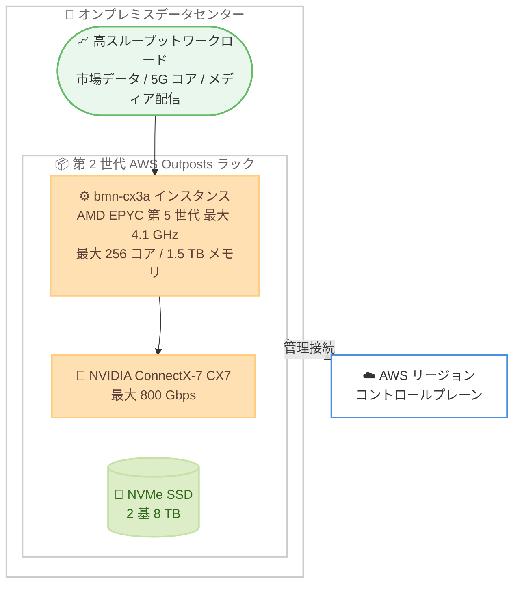

# AWS Outposts - bmn-cx3a インスタンス対応

**リリース日**: 2026 年 6 月 17 日
**サービス**: AWS Outposts
**機能**: bmn-cx3a インスタンス (アクセラレーテッドネットワーキング対応の AMD ベースインスタンス)

📊 [このアップデートのインフォグラフィックを見る](https://takech9203.github.io/aws-news-summary/20260617-aws-outposts-amd-bmn-cx3a.html)
<!-- INFOGRAPHIC_BASE_URL は環境変数から取得 -->

## 概要

AWS は、第 2 世代 AWS Outposts ラックにおける bmn-cx3a インスタンスの提供を発表しました。bmn-cx3a は、Outposts 上で初めてアクセラレーテッドネットワーキングに対応した AMD ベースのインスタンスです。第 5 世代 AMD EPYC プロセッサ (最大 4.1 GHz) と NVIDIA ConnectX-7 (CX7) ネットワークインターフェイスカードを搭載し、ほぼラインレートで動作する最大 800 Gbps のベアメタルアクセラレーテッドネットワーク帯域幅を提供します。

bmn-cx3a インスタンスは、bmn-cx3a.metal-32xl と bmn-cx3a.metal-64xl の 2 つのサイズで提供され、最大 256 コア、1.5 TB のメモリ、2 基の 8 TB NVMe SSD ストレージを備えます。ネイティブのレイヤー 2 (L2) マルチキャストとハードウェア Precision Time Protocol (PTP) をサポートしており、リアルタイム市場データの取り込みと配信、市場分析やリスク分析、通信業界の 5G コアネットワークアプリケーション、メディア配信といった高スループットワークロード向けに設計されています。

オンプレミス環境で AWS インフラストラクチャを利用する金融サービス、通信、メディア業界のお客様にとって、低レイテンシかつ高帯域なベアメタル性能をデータの所在地で実現できる選択肢が広がります。

**アップデート前の課題**

- 以前は Outposts ラックでアクセラレーテッドネットワーキングに対応した AMD ベースのインスタンスを利用できなかった
- 以前は Outposts 上で 800 Gbps クラスのベアメタルネットワーク帯域幅を必要とする高スループットワークロードを実行することが難しかった
- 以前はネイティブ L2 マルチキャストやハードウェア PTP を必要とするワークロードを、Outposts 上で柔軟に動かす選択肢が限られていた

**アップデート後の改善**

- 今回のアップデートにより、第 2 世代 Outposts ラックで AMD EPYC ベースのベアメタルインスタンスを利用できるようになった
- 今回のアップデートにより、Outposts 上で最大 800 Gbps のアクセラレーテッドネットワークを必要とするワークロードを実行できるようになった
- 今回のアップデートにより、ネイティブ L2 マルチキャストとハードウェア PTP を要する金融・通信・メディア系ワークロードをオンプレミスで実行しやすくなった

## アーキテクチャ図



bmn-cx3a インスタンスはオンプレミスの第 2 世代 Outposts ラック上で動作し、CX7 NIC による高帯域ネットワークでデータ所在地に近い場所で高スループットワークロードを処理します。

## サービスアップデートの詳細

### 主要機能

1. **AMD EPYC ベースのベアメタルインスタンス**
   - 第 5 世代 AMD EPYC プロセッサを搭載し、最大 4.1 GHz で動作します
   - Outposts 上で初めての AMD ベースかつアクセラレーテッドネットワーキング対応インスタンスです
   - 最大 256 コア、1.5 TB のメモリを提供します

2. **アクセラレーテッドネットワーキング**
   - NVIDIA ConnectX-7 (CX7) ネットワークインターフェイスカードを搭載します
   - ほぼラインレートで動作する最大 800 Gbps のベアメタルネットワーク帯域幅を提供します
   - ネイティブ L2 マルチキャストとハードウェア PTP をサポートします

3. **2 つのインスタンスサイズ**
   - bmn-cx3a.metal-32xl と bmn-cx3a.metal-64xl の 2 サイズを提供します
   - いずれも 2 基の 8 TB NVMe SSD ストレージを備えます

## 技術仕様

### インスタンススペック

| 項目 | 詳細 |
|------|------|
| プロセッサ | 第 5 世代 AMD EPYC (最大 4.1 GHz) |
| NIC | NVIDIA ConnectX-7 (CX7) |
| ネットワーク帯域幅 | 最大 800 Gbps (ベアメタルアクセラレーテッド) |
| 最大コア数 | 256 コア |
| 最大メモリ | 1.5 TB |
| ローカルストレージ | 2 基 8 TB NVMe SSD |
| サイズ | bmn-cx3a.metal-32xl, bmn-cx3a.metal-64xl |
| 特殊機能 | ネイティブ L2 マルチキャスト, ハードウェア PTP |
| 対象プラットフォーム | 第 2 世代 AWS Outposts ラック |

### API 変更履歴

| 日付 | サービス | 変更内容 |
|------|----------|----------|
| 2026/06/16 | [outposts](https://awsapichanges.com/archive/changes/e078c6-outposts.html) | 2 updated api methods - 見積もりからの注文作成のサポートを追加 |

今回の bmn-cx3a インスタンス対応に直接対応する API メソッドの追加は確認されていません。上記の Outposts API 変更は見積もりからの注文作成に関するもので、参考情報として記載しています。

## 設定方法

### 前提条件

1. 第 2 世代 AWS Outposts ラックが利用可能なリージョン・国/地域であること
2. 第 2 世代 Outposts ラックの注文と設置が完了していること
3. 該当する Outposts に bmn-cx3a インスタンス用のキャパシティが割り当てられていること

### 手順

#### ステップ1: Outposts のキャパシティ構成を確認する

```bash
aws outposts get-outpost-instance-types --outpost-id op-xxxxxxxxxxxxxxxxx
```

このコマンドは、指定した Outpost で利用可能なインスタンスタイプを確認するもので、bmn-cx3a が含まれているかを確認します。

#### ステップ2: bmn-cx3a インスタンスを起動する

```bash
aws ec2 run-instances \
  --instance-type bmn-cx3a.metal-32xl \
  --image-id ami-xxxxxxxxxxxxxxxxx \
  --subnet-id subnet-xxxxxxxxxxxxxxxxx \
  --placement "AvailabilityZone=ap-northeast-1a"
```

このコマンドは、Outposts に紐づくサブネット上で bmn-cx3a インスタンスを起動します。インスタンスタイプにはワークロードに応じて metal-32xl または metal-64xl を指定します。

#### ステップ3: 高スループットワークロードの構成

L2 マルチキャストやハードウェア PTP を利用する場合は、各ワークロード (市場データ配信、5G コア、メディア配信など) の要件に合わせてネットワークと時刻同期を構成します。

## メリット

### ビジネス面

- **データ所在地の要件への対応**: オンプレミスでデータを保持しつつ高性能なベアメタル処理を実現できます
- **対象業界の拡大**: 金融、通信、メディアといった低レイテンシ・高帯域を要する業界のワークロードを Outposts 上で実行できます
- **AWS の運用一貫性**: クラウドと同じ AWS の運用モデルでオンプレミスインフラを管理できます

### 技術面

- **高帯域ネットワーク**: 最大 800 Gbps のアクセラレーテッドネットワークを利用できます
- **大規模なコンピュート**: 最大 256 コア、1.5 TB メモリのベアメタル性能を活用できます
- **特殊ネットワーク機能**: ネイティブ L2 マルチキャストとハードウェア PTP により、市場データや 5G コアなどの要件を満たせます

## デメリット・制約事項

### 制限事項

- 第 2 世代 Outposts ラックがサポートされる国/地域でのみ利用可能です
- 提供サイズは bmn-cx3a.metal-32xl と bmn-cx3a.metal-64xl の 2 種類に限られます
- ベアメタルインスタンスであるため、利用にはキャパシティの事前確保が前提となります

### 考慮すべき点

- 800 Gbps クラスのネットワークを活かすには、オンプレミス側のネットワーク設計も合わせて検討する必要があります
- ハードウェア PTP や L2 マルチキャストを利用するワークロードでは、対応するアプリケーション側の設定が必要です

## ユースケース

### ユースケース1: リアルタイム市場データの取り込みと配信

**シナリオ**: 金融機関が取引所に近いデータセンターで、低レイテンシかつ高帯域な市場データの取り込みと配信を行いたい

**実装例**:
```
bmn-cx3a.metal-64xl + L2 マルチキャスト + ハードウェア PTP
```

**効果**: ほぼラインレートの 800 Gbps ネットワークと正確な時刻同期により、リアルタイム性の高い市場データ処理を実現できます

### ユースケース2: 通信業界の 5G コアネットワーク

**シナリオ**: 通信事業者が 5G コアネットワークアプリケーションをオンプレミスで運用しながら、AWS の運用モデルを利用したい

**実装例**:
```
bmn-cx3a.metal-32xl + CX7 NIC によるアクセラレーテッドネットワーキング
```

**効果**: 高スループットなパケット処理をベアメタル性能で実行し、データ所在地要件を満たしながら 5G ワークロードを運用できます

### ユースケース3: メディア配信

**シナリオ**: メディア企業が大容量コンテンツの配信処理を低レイテンシで行いたい

**実装例**:
```
bmn-cx3a.metal-64xl + 2x 8 TB NVMe SSD
```

**効果**: 大容量メモリと高速ローカルストレージ、高帯域ネットワークにより、高スループットなメディア配信処理を実現できます

## 料金

bmn-cx3a インスタンスは AWS Outposts の一部として提供されます。料金は構成内容と契約期間に依存するため、詳細は AWS Outposts の料金ページおよび個別の見積もりをご確認ください。

## 利用可能リージョン

bmn-cx3a インスタンスは、第 2 世代 AWS Outposts ラックがサポートされるすべての国およびリージョンで利用可能です。最新の対応リージョンと国/地域の一覧は、Outposts ラックの FAQ ページをご確認ください。

## 関連サービス・機能

- **Amazon EC2**: bmn-cx3a はベアメタルの EC2 インスタンスタイプとして提供され、EC2 の起動・管理操作を利用します
- **AWS Outposts ラック**: 本インスタンスは第 2 世代 Outposts ラック上で動作します
- **Amazon VPC**: Outposts に紐づくサブネットを通じてネットワーク構成を行います

## 参考リンク

- 📊 [インフォグラフィック](https://takech9203.github.io/aws-news-summary/20260617-aws-outposts-amd-bmn-cx3a.html)
- [公式発表 (What's New)](https://aws.amazon.com/about-aws/whats-new/2026/06/aws-outposts-amd-bmn-cx3a/)
- [AWS Outposts ラック](https://aws.amazon.com/outposts/rack/)
- [AWS Outposts ラックの FAQ](https://aws.amazon.com/outposts/rack/faqs/)

## まとめ

bmn-cx3a は、Outposts 上で初めてアクセラレーテッドネットワーキングに対応した AMD ベースのベアメタルインスタンスであり、最大 800 Gbps のネットワーク、256 コア、1.5 TB メモリ、L2 マルチキャストとハードウェア PTP をオンプレミスで提供します。金融、通信、メディア業界で低レイテンシ・高帯域を要するワークロードを運用しているお客様は、第 2 世代 Outposts ラックでの本インスタンスの活用を検討することをおすすめします。まずは対象リージョンと必要なキャパシティを確認し、要件に合わせたサイズを選定してください。
