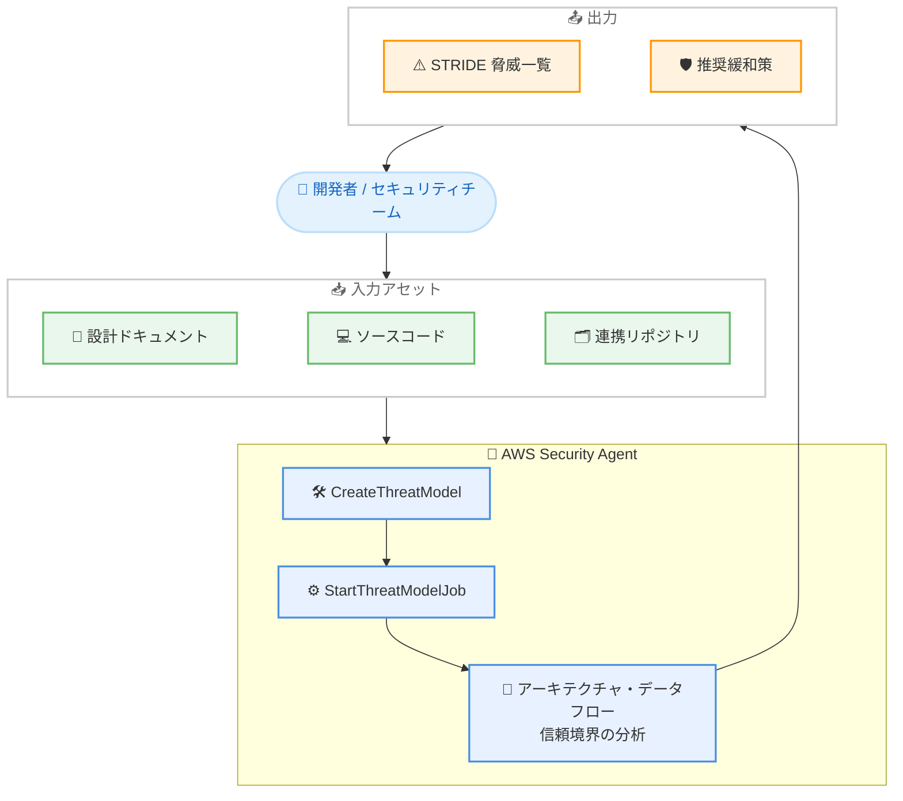

# AWS Security Agent - 脅威モデリングのサポート

**リリース日**: 2026 年 6 月 17 日
**サービス**: AWS Security Agent (AWS Continuum)
**機能**: Threat Modeling (脅威モデリング)

📊 [このアップデートのインフォグラフィックを見る](https://takech9203.github.io/aws-news-summary/20260617-aws-security-agent-threat-modeling.html)
<!-- INFOGRAPHIC_BASE_URL は環境変数から取得 -->

## 概要

AWS は、AWS Continuum の一部である AWS Security Agent に、アプリケーションの脅威モデルを自動的に構築する AI 駆動の脅威モデリング機能を追加したことを発表しました。本機能は本日よりパブリックプレビューとして利用可能です。エージェントは設計ドキュメントまたはソースコードをレビューし、アプリケーション全体のアーキテクチャコンテキストを把握したうえで、STRIDE フレームワークに基づいて脅威を特定し、推奨される緩和策を提示します。

脅威モデリングは、従来は専門的なスキルと相当な手作業を必要とする作業でした。今回の機能はエージェント型 AI の推論能力を活用し、コードとドキュメントを深く分析することで、アーキテクチャ、データフロー、信頼境界を理解します。そのうえで、STRIDE の 6 つのカテゴリすべてにわたって、コンテキストに即した脅威モデルと実行可能な緩和策を生成します。

開発者は Kiro や Claude Code などの IDE にエージェントを組み込み、仕様から脅威モデルを作成して設計フェーズの早い段階で脅威に対処できます。セキュリティチームは、設計ドキュメントやソースコードに対するデプロイ前評価として本機能を活用できます。

**アップデート前の課題**

今回のアップデート以前、脅威モデリングには以下のような課題がありました。

- 脅威モデリングには専門的なセキュリティスキルが必要で、実施できる人材が限られていた
- アーキテクチャやデータフロー、信頼境界の分析に多大な手作業が必要だった
- 設計フェーズの早い段階で脅威を体系的に洗い出す仕組みが整っていなかった

**アップデート後の改善**

今回のアップデートにより、以下が可能になりました。

- 設計ドキュメントやソースコードを入力するだけで、エージェントが脅威モデルを自動構築できるようになった
- STRIDE フレームワークの 6 カテゴリすべてに沿って、脅威と緩和策を網羅的に提示できるようになった
- Kiro や Claude Code などの IDE に統合し、設計フェーズの早い段階で脅威に対処できるようになった

## アーキテクチャ図



エージェントが設計ドキュメントやソースコードを入力として受け取り、分析を経て STRIDE に基づく脅威一覧と緩和策を生成する流れを示しています。

## サービスアップデートの詳細

### 主要機能

1. **設計ドキュメントとソースコードの自動分析**
   - エージェントが設計ドキュメントまたはソースコードをレビューし、アプリケーション全体のアーキテクチャコンテキストを把握する
   - アーキテクチャ、データフロー、信頼境界を理解したうえで脅威を特定する
   - S3 上のドキュメントやソースコード、連携済みリポジトリなど、複数の入力アセットに対応する

2. **STRIDE フレームワークによる脅威の特定**
   - STRIDE の 6 カテゴリ (Spoofing、Tampering、Repudiation、Information Disclosure、Denial of Service、Elevation of Privilege) すべてにわたって脅威を分類する
   - 各脅威に重要度 (CRITICAL、HIGH、MEDIUM、LOW、INFO) と推奨される緩和策を付与する
   - 脅威ごとにステータス (OPEN、RESOLVED、DISMISSED) を管理し、対応状況を追跡できる

3. **IDE への統合とデプロイ前評価**
   - 開発者は Kiro や Claude Code などの IDE にエージェントを組み込み、仕様から脅威モデルを作成できる
   - 設計フェーズの早い段階で脅威に対処することで、シフトレフトを実現する
   - セキュリティチームは、設計ドキュメントやソースコードに対するデプロイ前評価として活用できる

## 技術仕様

### STRIDE カテゴリ

脅威モデルでは、API のレスポンスに含まれる `stride` フィールドで以下の 6 カテゴリが返されます。

| STRIDE カテゴリ | API 列挙値 | 概要 |
|------|------|------|
| Spoofing (なりすまし) | `SPOOFING` | 不正な ID の偽装 |
| Tampering (改ざん) | `TAMPERING` | データやコードの不正な改変 |
| Repudiation (否認) | `REPUDIATION` | 操作の否認・追跡不能 |
| Information Disclosure (情報漏えい) | `INFORMATION_DISCLOSURE` | 機密情報の漏えい |
| Denial of Service (サービス拒否) | `DENIAL_OF_SERVICE` | 可用性の侵害 |
| Elevation of Privilege (権限昇格) | `ELEVATION_OF_PRIVILEGE` | 不正な権限の取得 |

### 主要 API メソッド

| API | 役割 |
|------|------|
| `CreateThreatModel` | 脅威モデルを作成し、入力アセット (ドキュメント、ソースコード、エンドポイント、アクター、連携リポジトリ) を定義 |
| `StartThreatModelJob` | 脅威モデリングジョブを開始し、分析を実行 |
| `ListThreats` | 検出された脅威の一覧を取得 (重要度、STRIDE 分類、ステータスを含む) |
| `UpdateThreat` | 脅威のステータスや緩和策の推奨事項などを更新 |
| `BatchGetThreatModels` | 複数の脅威モデルの詳細を一括取得 |

### API変更履歴

| 日付 | サービス | 変更内容 |
|------|----------|----------|
| 2026/06/17 | [securityagent](https://awsapichanges.com/archive/changes/ecddc1-securityagent.html) | 31 new 21 updated api methods - 脅威モデリング、コードレビュー、セキュリティ要件、追加の連携プロバイダーに対応する API を追加 |

### 脅威モデル作成のリクエスト例

```json
{
  "title": "payment-service-threat-model",
  "agentSpaceId": "as-xxxxxxxx",
  "description": "決済サービスの脅威モデル",
  "assets": {
    "sourceCode": [
      { "s3Location": "s3://my-bucket/payment-service/" }
    ],
    "documents": [
      { "s3Location": "s3://my-bucket/design/payment-arch.pdf" }
    ]
  },
  "serviceRole": "arn:aws:iam::123456789012:role/SecurityAgentThreatModelingRole"
}
```

`CreateThreatModel` でソースコードや設計ドキュメントの場所を指定して脅威モデルを定義します。

## 設定方法

### 前提条件

1. AWS Security Agent (AWS Continuum) が利用可能なリージョンであること
2. エージェントがアセットにアクセスするための IAM サービスロールが構成されていること
3. 分析対象の設計ドキュメントまたはソースコードが S3 などの参照可能な場所に配置されていること

### 手順

#### ステップ1: 脅威モデルの作成

```bash
aws securityagent create-threat-model \
  --title "payment-service-threat-model" \
  --agent-space-id "as-xxxxxxxx" \
  --assets '{"sourceCode":[{"s3Location":"s3://my-bucket/payment-service/"}]}' \
  --service-role "arn:aws:iam::123456789012:role/SecurityAgentThreatModelingRole"
```

分析対象のソースコードや設計ドキュメントを指定して脅威モデルを作成します。

#### ステップ2: 脅威モデリングジョブの開始

```bash
aws securityagent start-threat-model-job \
  --agent-space-id "as-xxxxxxxx" \
  --threat-model-id "tm-xxxxxxxx"
```

作成した脅威モデルに対して分析ジョブを開始します。エージェントがアーキテクチャ、データフロー、信頼境界を分析します。

#### ステップ3: 検出された脅威の確認

```bash
aws securityagent list-threats \
  --agent-space-id "as-xxxxxxxx" \
  --threat-job-id "tmj-xxxxxxxx"
```

ジョブの完了後、検出された脅威を STRIDE 分類、重要度、推奨緩和策とともに一覧で確認します。IDE (Kiro や Claude Code) に統合している場合は、開発ワークフローの中で同様の操作を実行できます。

## メリット

### ビジネス面

- **専門スキルへの依存軽減**: 脅威モデリングに必要だった専門的なスキルと手作業を AI エージェントが補完し、より多くのチームが脅威モデリングを実施できる
- **シフトレフトによるコスト削減**: 設計フェーズの早い段階で脅威に対処することで、後工程での手戻りや修正コストを抑制できる
- **追加コストなしでの評価**: パブリックプレビュー期間中は追加料金なしで利用でき、導入のハードルが低い

### 技術面

- **コンテキストに即した分析**: アーキテクチャ、データフロー、信頼境界を理解したうえで脅威を特定するため、汎用的なチェックリストより精度の高い結果が得られる
- **STRIDE の網羅的なカバレッジ**: 6 つのカテゴリすべてにわたって脅威を分類し、見落としを減らす
- **開発ワークフローへの統合**: Kiro や Claude Code などの IDE に組み込めるため、開発者が普段の作業の中で脅威モデリングを実施できる

## デメリット・制約事項

### 制限事項

- パブリックプレビューのため、本番環境での利用にあたっては機能や挙動が変更される可能性がある
- 利用可能リージョンは AWS Security Agent がサポートするリージョンに限定される
- AI による生成結果であるため、専門家によるレビューと検証が引き続き推奨される

### 考慮すべき点

- 入力するソースコードや設計ドキュメントの品質が、生成される脅威モデルの精度に影響する
- エージェントがアセットへアクセスするための IAM ロールの権限設計を適切に行う必要がある
- パブリックプレビュー終了後の料金体系を事前に確認しておく必要がある

## ユースケース

### ユースケース1: 設計フェーズでの早期脅威特定

**シナリオ**: 新しいマイクロサービスを開発するチームが、設計仕様をもとに早期に脅威を洗い出したい。

**実装例**:
```
Kiro / Claude Code 内で仕様 (spec) からエージェントを呼び出し
→ STRIDE に基づく脅威モデルを生成
→ 設計フェーズで緩和策を反映
```

**効果**: 実装前に脅威を特定して対処することで、後工程での手戻りを削減できます。

### ユースケース2: デプロイ前のセキュリティ評価

**シナリオ**: セキュリティチームが本番デプロイ前に、設計ドキュメントとソースコードに対して脅威評価を実施したい。

**実装例**:
```
CreateThreatModel で設計ドキュメントとソースコードを指定
→ StartThreatModelJob で分析を実行
→ ListThreats で CRITICAL / HIGH の脅威を抽出してレビュー
```

**効果**: デプロイ前に重大な脅威を体系的に把握し、リスクを低減できます。

### ユースケース3: 既存アプリケーションの脅威棚卸し

**シナリオ**: 既存アプリケーションのソースコードに対して脅威モデルを構築し、現状のリスクを可視化したい。

**実装例**:
```
連携リポジトリ (integratedRepositories) を入力アセットに指定
→ 脅威モデリングジョブを実行
→ UpdateThreat で対応状況 (RESOLVED / DISMISSED) を管理
```

**効果**: 既存システムのリスクを STRIDE 観点で棚卸しし、継続的に対応状況を追跡できます。

## 料金

パブリックプレビュー期間中は、追加料金なしで利用可能です。プレビュー終了後の料金体系については、公式ドキュメントおよび料金ページで最新情報を確認してください。

## 利用可能リージョン

AWS Security Agent がサポートするすべてのリージョンで利用可能です。具体的な対応リージョンは公式ドキュメントを参照してください。

## 関連サービス・機能

- **AWS Continuum**: AWS Security Agent はこのプラットフォームの一部として提供される
- **Kiro**: AWS が提供する AI 搭載 IDE。エージェントを統合して仕様から脅威モデルを作成できる
- **Claude Code**: エージェントを組み込んで開発ワークフロー内で脅威モデリングを実行できる
- **Amazon S3**: 分析対象の設計ドキュメントやソースコードの配置先として利用される

## 参考リンク

- 📊 [インフォグラフィック](https://takech9203.github.io/aws-news-summary/20260617-aws-security-agent-threat-modeling.html)
- [公式発表 (What's New)](https://aws.amazon.com/about-aws/whats-new/2026/06/aws-security-agent-threat-modeling/)
- [AWS API Changes (securityagent)](https://awsapichanges.com/archive/changes/ecddc1-securityagent.html)

## まとめ

AWS Security Agent の脅威モデリング機能は、従来は専門スキルと手作業を要した脅威モデリングを AI エージェントで自動化し、STRIDE フレームワークに沿った脅威と緩和策を提示します。Kiro や Claude Code への統合により設計フェーズでのシフトレフトが実現できるため、開発チームとセキュリティチームの双方で活用を検討する価値があります。まずはパブリックプレビュー期間中に、追加料金なしで自社アプリケーションへの適用を試すことを推奨します。
