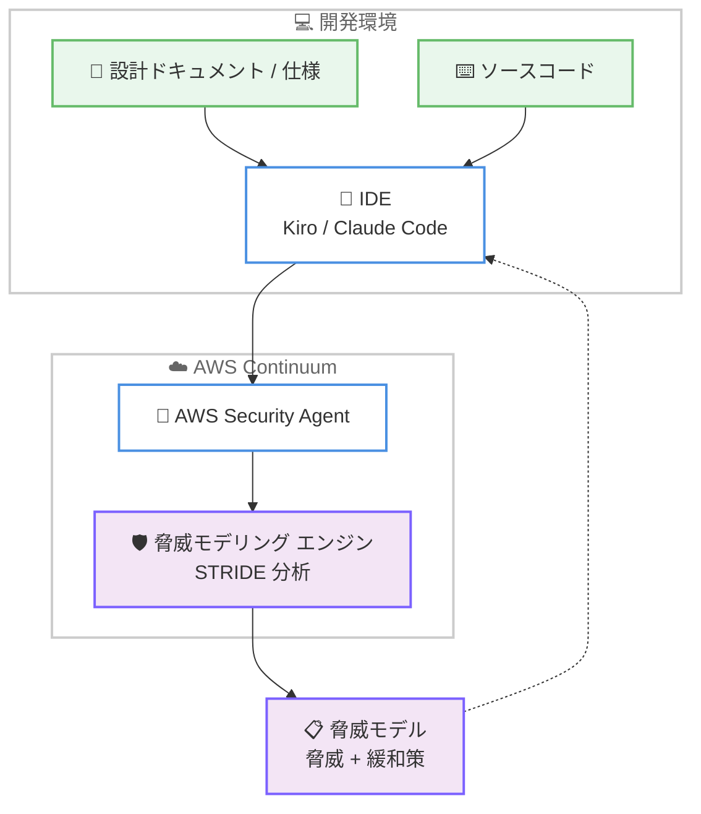

# AWS Security Agent - 脅威モデリングのサポート

**リリース日**: 2026 年 6 月 17 日
**サービス**: AWS Security Agent (AWS Continuum)
**機能**: Threat Modeling (脅威モデリング) - パブリックプレビュー

📊 [このアップデートのインフォグラフィックを見る](https://takech9203.github.io/aws-news-summary/20260617-aws-security-agent-threat-modeling.html)
<!-- INFOGRAPHIC_BASE_URL は環境変数から取得 -->

## 概要

AWS は、AWS Continuum の一部である AWS Security Agent が脅威モデリング (Threat Modeling) のサポートを開始したことを発表しました。これは、アプリケーションの脅威モデルを自動的に生成する AI 駆動のエージェント機能で、パブリックプレビューとして提供されます。

この機能は、設計ドキュメントやアプリケーションのソースコードを深く解析し、アーキテクチャ、データフロー、信頼境界を理解します。その上で STRIDE フレームワークを用いて脅威を特定し、推奨される緩和策を提示します。生成される脅威モデルは、STRIDE の 6 つのカテゴリすべてにわたる実用的な緩和策 (actionable mitigations) を含みます。

さらに、Kiro や Claude Code などの IDE にエージェントを統合できます。これにより、開発者は仕様 (spec) から脅威モデルを作成し、設計段階の早い時点で脅威に対処できます。セキュリティチームは、デプロイ前のアセスメントとして設計ドキュメントやソースコードに対して活用できます。

**アップデート前の課題**

- 脅威モデリングは専門知識を持つセキュリティ担当者による手作業が中心で、時間とコストがかかっていた
- 設計段階で脅威を体系的に洗い出す仕組みがなく、脆弱性がデプロイ後に発覚することが多かった
- STRIDE などのフレームワークを用いた網羅的な分析を、開発のスピードに合わせて継続的に実施することが困難だった

**アップデート後の改善**

- 設計ドキュメントやソースコードを AI エージェントが自動解析し、脅威モデルを生成できるようになった
- STRIDE の 6 つのカテゴリすべてに対応した、実用的な緩和策が提示されるようになった
- Kiro や Claude Code などの IDE に統合し、開発フローの中で設計段階から脅威に対処できるようになった

## アーキテクチャ図

開発者は IDE 上の設計ドキュメントやソースコードを起点に、AWS Security Agent へ解析を依頼します。エージェントが STRIDE に基づき脅威モデルを生成し、脅威と緩和策を IDE へ返却する流れを示しています。

## サービスアップデートの詳細

### 主要機能

1. **AI 駆動の自動脅威モデル生成**
   - 設計ドキュメントやアプリケーションのソースコードを深く解析する
   - アーキテクチャ、データフロー、信頼境界 (trust boundaries) を理解する
   - コンテキストに即した脅威モデルを自動的に生成する

2. **STRIDE フレームワークによる脅威の特定**
   - STRIDE の 6 つのカテゴリすべてにわたって脅威を特定する
   - 各脅威に対して推奨される緩和策 (recommended mitigations) を提示する
   - 実用的で対応可能な緩和策 (actionable mitigations) を含む

3. **IDE 統合 (Kiro / Claude Code)**
   - Kiro や Claude Code などの IDE にエージェントを統合できる
   - 仕様 (spec) から脅威モデルを作成できる
   - 設計段階の早い時点で脅威に対処できる (shift-left セキュリティ)

4. **デプロイ前アセスメント**
   - セキュリティチームは設計ドキュメントやソースコードに対してデプロイ前の評価を実施できる
   - リリース前にセキュリティ上の懸念点を体系的に洗い出せる

## 技術仕様

### STRIDE フレームワークの 6 つのカテゴリ

AWS Security Agent の脅威モデリングは、Microsoft が提唱する STRIDE フレームワークの 6 カテゴリすべてをカバーします。

| カテゴリ | 英語表記 | 対象となる脅威 |
|------|------|------|
| S (なりすまし) | Spoofing | 他者になりすます認証関連の脅威 |
| T (改ざん) | Tampering | データやコードの不正な改ざん |
| R (否認) | Repudiation | 操作の実行を否認できてしまう脅威 |
| I (情報漏えい) | Information Disclosure | 機密情報の意図しない開示 |
| D (サービス拒否) | Denial of Service | 可用性を損なう攻撃 |
| E (権限昇格) | Elevation of Privilege | 不正な権限取得 |

### 入力と出力

| 項目 | 詳細 |
|------|------|
| 入力 | 設計ドキュメント、アプリケーションのソースコード |
| 解析対象 | アーキテクチャ、データフロー、信頼境界 |
| 出力 | STRIDE 6 カテゴリの脅威モデルと推奨緩和策 |
| 統合先 | Kiro、Claude Code などの IDE |

## メリット

### ビジネス面

- **セキュリティコストの削減**: 専門家による手作業の脅威モデリング工数を AI エージェントが軽減する
- **リスクの早期低減**: 設計段階で脅威を特定することで、デプロイ後の手戻りやインシデント対応コストを抑制できる
- **追加費用なしで試用可能**: パブリックプレビュー期間中は追加料金なしで利用できる

### 技術面

- **shift-left セキュリティの実現**: IDE 統合により開発の早期段階でセキュリティ対策を組み込める
- **網羅性の向上**: STRIDE の 6 カテゴリすべてを体系的にカバーし、見落としを減らせる
- **コンテキスト理解**: ソースコードと設計ドキュメントの両方からアーキテクチャやデータフローを理解する

## デメリット・制約事項

### 制限事項

- パブリックプレビュー段階の機能であり、本番環境での利用には十分な検証が必要
- 利用可能リージョンは AWS Security Agent がサポートするリージョンに限定される
- パブリックプレビュー期間終了後の料金体系は別途公表される見込み

### 考慮すべき点

- AI が生成する脅威モデルは出発点として有用だが、セキュリティ専門家によるレビューと組み合わせることが望ましい
- 解析精度は入力となる設計ドキュメントやソースコードの品質に依存する

## ユースケース

### ユースケース 1: 設計段階での脅威モデリング

**シナリオ**: 新規マイクロサービスの設計フェーズで、Kiro 上の仕様から脅威を洗い出したい。

**効果**: 設計ドキュメントから STRIDE ベースの脅威モデルを自動生成し、実装前に緩和策を設計へ反映できる。

### ユースケース 2: 開発フローへの組み込み

**シナリオ**: Claude Code を使う開発チームが、コーディングと並行してセキュリティ評価を行いたい。

**効果**: IDE 統合により、ソースコードの変更に合わせて脅威モデルを更新し、継続的にセキュリティを担保できる。

### ユースケース 3: デプロイ前のセキュリティアセスメント

**シナリオ**: セキュリティチームがリリース前にアプリケーションのリスクを評価したい。

**効果**: 設計ドキュメントとソースコードに対するデプロイ前アセスメントを実施し、本番リリース前にリスクを特定できる。

## 料金

パブリックプレビュー期間中は、追加料金なし (at no additional cost) で利用できます。プレビュー終了後の料金体系は、今後 AWS から公表される見込みです。

## 利用可能リージョン

AWS Security Agent がサポートするすべてのリージョンで利用できます。具体的な対応リージョンは公式ドキュメントを参照してください。

## 関連サービス・機能

- **AWS Continuum**: AWS Security Agent が所属するプラットフォーム。脅威モデリング機能はその一部として提供される
- **Kiro**: AWS が提供する AI 搭載 IDE。エージェントを統合して仕様から脅威モデルを作成できる
- **Claude Code**: 統合先としてサポートされる開発環境。開発フローの中で脅威モデリングを利用できる

## 参考リンク

- 📊 [インフォグラフィック](https://takech9203.github.io/aws-news-summary/20260617-aws-security-agent-threat-modeling.html)
- [公式発表 (What's New)](https://aws.amazon.com/about-aws/whats-new/2026/06/aws-security-agent-threat-modeling/)
- [AWS Blog](https://aws.amazon.com/blogs/aws/aws-security-agent-adds-threat-modeling-kiro-power-and-claude-code-plugin-and-more/)
- [ドキュメント (AWS Security Agent User Guide)](https://docs.aws.amazon.com/securityagent/latest/userguide/what-is.html)

## まとめ

AWS Security Agent の脅威モデリングは、設計ドキュメントやソースコードから STRIDE ベースの脅威モデルを自動生成し、Kiro や Claude Code との統合により設計段階からのセキュリティ対策 (shift-left) を可能にする AI エージェント機能です。パブリックプレビュー期間中は追加料金なしで利用できるため、開発チームやセキュリティチームは早期に試用し、脅威モデリングの自動化による効果を検証することが推奨されます。
