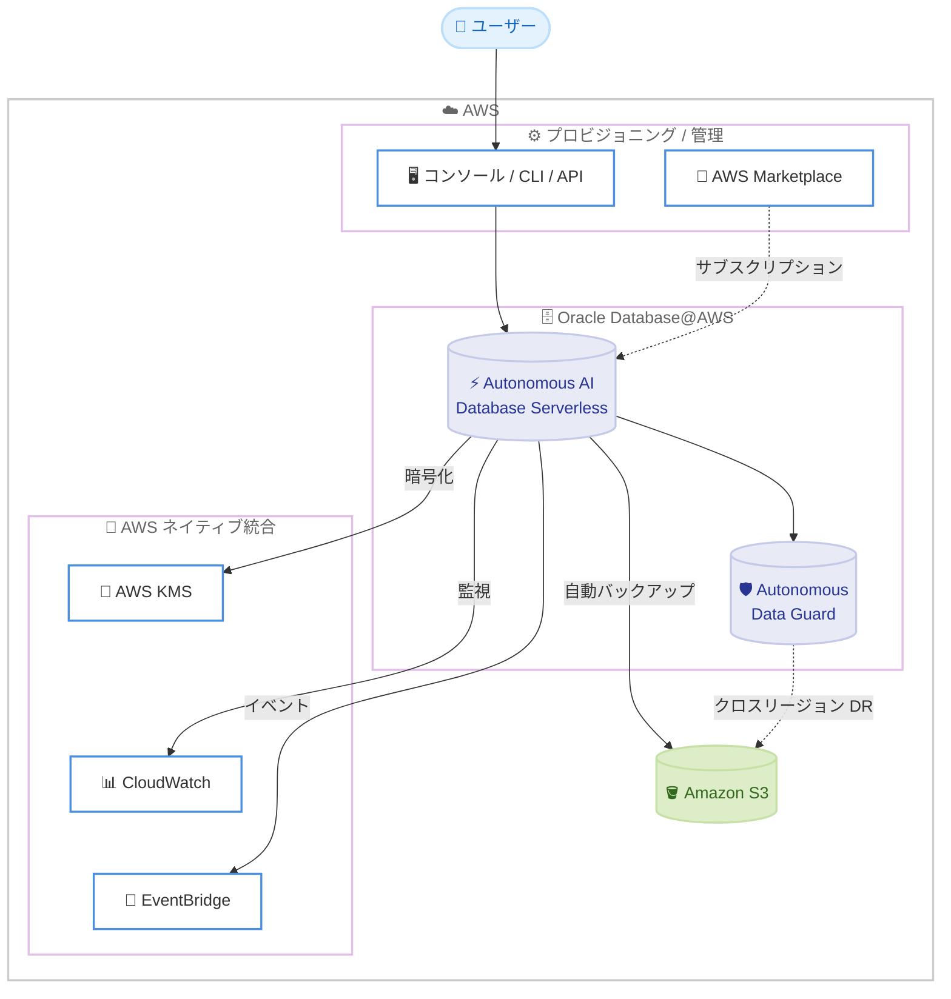

# Oracle Database@AWS - Oracle Autonomous AI Database Serverless 対応

**リリース日**: 2026 年 6 月 17 日
**サービス**: Oracle Database@AWS
**機能**: Oracle Autonomous AI Database Serverless (ADB-S)

📊 [このアップデートのインフォグラフィックを見る](https://takech9203.github.io/aws-news-summary/20260617-oracle-database-aws-autonomous-database-serverless.html)
<!-- INFOGRAPHIC_BASE_URL は環境変数から取得 -->

## 概要

Oracle Database@AWS において、Oracle Autonomous AI Database Serverless (ADB-S) がサポートされました。ADB-S は Oracle Exadata インフラストラクチャ上で稼働するフルマネージドの Oracle データベースサービスであり、パッチ適用、チューニング、スケーリングを自動で実行します。これにより、お客様はデータベースの運用管理から解放され、アプリケーションとデータの活用に専念できます。

これまで Oracle Database@AWS で Autonomous Database を利用するには、専用の Exadata インフラストラクチャや VM クラスターを事前にセットアップする必要がありました。今回のアップデートにより、AWS マネジメントコンソール、AWS CLI、API から直接 ADB-S をプロビジョニングできるようになり、専用インフラストラクチャの構築なしにサーバーレスでデータベースを起動できます。サービスは AWS Marketplace を通じて、パブリックオファーおよびプライベートオファーで提供されます。

ADB-S は AI Transaction Processing、AI Lakehouse、AI JSON Database、Oracle APEX の 4 つのワークロードタイプをサポートし、需要に応じてコンピューティングとストレージを独立してスケーリングできます。また、AWS KMS による暗号化、Amazon CloudWatch によるモニタリング、Amazon EventBridge によるイベント管理など、AWS のネイティブサービスと統合されています。

**アップデート前の課題**

- ADB を利用するには、専用の Exadata インフラストラクチャや VM クラスターを事前にプロビジョニングする必要があった
- インフラストラクチャの容量計画とサイジングを事前に行う必要があり、リソースの過剰確保や不足が発生しやすかった
- パッチ適用やチューニングなどのデータベース運用に手間がかかっていた

**アップデート後の改善**

- 専用 Exadata インフラストラクチャや VM クラスターのセットアップなしに、コンソール、CLI、API から直接 ADB-S をプロビジョニングできる
- コンピューティングとストレージを需要に応じて独立してスケーリングでき、サーバーレスでリソースを最適化できる
- パッチ適用、チューニング、スケーリングが自動化され、運用負荷が大幅に軽減された

## アーキテクチャ図

AWS のコンソールや AWS Marketplace から ADB-S をプロビジョニングし、AWS KMS、CloudWatch、EventBridge と統合しながら、Autonomous Data Guard と Amazon S3 への自動バックアップで高可用性と災害復旧を実現する構成を示しています。

## サービスアップデートの詳細

### 主要機能

1. **サーバーレスプロビジョニング**
   - AWS マネジメントコンソール、AWS CLI、API から直接 ADB-S をプロビジョニング可能
   - 専用の Exadata インフラストラクチャや VM クラスターの事前セットアップが不要
   - AWS Marketplace のパブリックオファーおよびプライベートオファーを通じて提供

2. **4 つのワークロードタイプ**
   - AI Transaction Processing: トランザクション処理向け
   - AI Lakehouse: 分析・データレイクハウス向け
   - AI JSON Database: JSON ドキュメント中心のアプリケーション向け
   - Oracle APEX: ローコードアプリケーション開発向け

3. **独立したスケーリングと自動運用**
   - コンピューティングとストレージを需要に応じて独立してスケーリング
   - パッチ適用、チューニング、スケーリングを自動で実行
   - フルマネージドにより運用負荷を最小化

4. **高可用性と災害復旧**
   - Autonomous Data Guard による高可用性とディザスタリカバリ
   - Amazon S3 への自動バックアップ
   - クロスリージョンのディザスタリカバリに対応

## 技術仕様

### サービス概要

| 項目 | 詳細 |
|------|------|
| サービス名 | Oracle Autonomous AI Database Serverless (ADB-S) |
| 稼働基盤 | Oracle Exadata インフラストラクチャ |
| プロビジョニング | AWS コンソール / CLI / API |
| 提供チャネル | AWS Marketplace (パブリック / プライベートオファー) |
| ワークロードタイプ | AI Transaction Processing、AI Lakehouse、AI JSON Database、Oracle APEX |
| 高可用性 / DR | Autonomous Data Guard、Amazon S3 自動バックアップ、クロスリージョン DR |
| ライセンス | Bring Your Own License (BYOL) / License Included |

### AWS ネイティブ統合

| サービス | 用途 |
|----------|------|
| AWS KMS | データ暗号化 |
| Amazon CloudWatch | モニタリング |
| Amazon EventBridge | イベント管理 |
| Amazon S3 | 自動バックアップ |

## 設定方法

### 前提条件

1. Oracle Database@AWS が利用可能な AWS アカウントを保有していること
2. AWS Marketplace で Oracle Database@AWS のオファーにサブスクライブしていること
3. ADB-S をプロビジョニングするための適切な IAM 権限があること

### 手順

#### ステップ1: AWS Marketplace でのサブスクリプション

AWS Marketplace で Oracle Database@AWS のパブリックオファー、またはお客様向けのプライベートオファーにサブスクライブします。これにより、AWS アカウントから ADB-S を利用できるようになります。

#### ステップ2: ADB-S のプロビジョニング

AWS マネジメントコンソール、AWS CLI、または API から ADB-S インスタンスをプロビジョニングします。ワークロードタイプ (AI Transaction Processing、AI Lakehouse、AI JSON Database、Oracle APEX のいずれか) を選択し、必要なコンピューティングとストレージを指定します。専用インフラストラクチャの事前セットアップは不要です。

#### ステップ3: AWS サービスとの統合設定

AWS KMS による暗号化キーの指定、Amazon CloudWatch によるメトリクス監視、Amazon EventBridge によるイベント連携を設定します。あわせて Autonomous Data Guard と Amazon S3 への自動バックアップにより、高可用性と災害復旧の構成を有効化します。

## メリット

### ビジネス面

- **運用コストの削減**: パッチ適用やチューニングなどの運用が自動化され、データベース管理に必要な人的リソースを削減できる
- **柔軟な調達**: AWS Marketplace を通じてサブスクライブでき、AWS の請求に統合できる
- **ライセンスの柔軟性**: BYOL と License Included の両方に対応し、既存の Oracle ライセンス資産を活用できる

### 技術面

- **サーバーレス運用**: 専用インフラストラクチャのセットアップが不要で、迅速にデータベースを起動できる
- **独立スケーリング**: コンピューティングとストレージを需要に応じて独立してスケーリングでき、リソースを最適化できる
- **AWS ネイティブ統合**: KMS、CloudWatch、EventBridge、S3 と統合し、既存の AWS 運用基盤に組み込める

## デメリット・制約事項

### 制限事項

- 利用可能リージョンが米国東部 (バージニア北部) と米国西部 (オレゴン) の 2 リージョンに限定される
- 利用には AWS Marketplace でのサブスクリプションが前提となる

### 考慮すべき点

- 日本リージョンは現時点で対象外のため、レイテンシーやデータレジデンシー要件の確認が必要
- ワークロードタイプの選択は要件に応じて適切に行う必要がある
- 料金は AWS Marketplace のオファー内容に依存するため、事前に確認が必要

## ユースケース

### ユースケース1: 既存 Oracle ワークロードの AWS 移行

**シナリオ**: オンプレミスや他環境で稼働する Oracle データベースを AWS に移行したいが、Exadata インフラストラクチャの構築や運用負荷を避けたい。

**効果**: 専用インフラストラクチャのセットアップなしに ADB-S をプロビジョニングでき、BYOL により既存ライセンスを活用しながら、自動運用で管理負荷を最小化できます。

### ユースケース2: 変動するワークロードへのサーバーレス対応

**シナリオ**: トランザクション量が時間帯や季節で大きく変動するアプリケーションを運用しており、リソースを動的に最適化したい。

**効果**: コンピューティングとストレージを独立してスケーリングできるため、需要に応じてリソースを調整し、過剰確保を避けつつ性能を確保できます。

### ユースケース3: AI / 分析ワークロードの統合データベース

**シナリオ**: トランザクション処理と分析、JSON ドキュメント処理を組み合わせた AI アプリケーション基盤を構築したい。

**効果**: AI Transaction Processing、AI Lakehouse、AI JSON Database のワークロードタイプを活用し、AWS の各サービスと統合しながら、用途に応じたデータベースを単一のサービスで実現できます。

## 料金

ADB-S は AWS Marketplace を通じてサブスクライブする形で提供されます。ライセンスは Bring Your Own License (BYOL) と License Included の両方に対応しています。具体的な料金は AWS Marketplace のオファー内容に依存するため、最新の料金は AWS Marketplace および Oracle Database@AWS の料金ページで確認してください。

## 利用可能リージョン

- 米国東部 (バージニア北部)
- 米国西部 (オレゴン)

## 関連サービス・機能

- **Oracle Exadata**: ADB-S が稼働する基盤インフラストラクチャ
- **AWS KMS**: データ暗号化に使用される鍵管理サービス
- **Amazon CloudWatch**: ADB-S のメトリクスを監視するためのモニタリングサービス
- **Amazon EventBridge**: ADB-S のイベントを連携するためのイベントバス
- **Amazon S3**: 自動バックアップとクロスリージョン DR の保存先

## 参考リンク

- 📊 [インフォグラフィック](https://takech9203.github.io/aws-news-summary/20260617-oracle-database-aws-autonomous-database-serverless.html)
- [公式発表 (What's New)](https://aws.amazon.com/about-aws/whats-new/2026/06/oracle-database-aws-autonomous-database-serverless/)

## まとめ

今回のアップデートにより、Oracle Database@AWS でサーバーレスの Autonomous AI Database が利用可能になり、専用インフラストラクチャのセットアップなしに迅速かつ柔軟に Oracle データベースを起動できるようになりました。既存の Oracle ワークロードを AWS 上でフルマネージドかつ自動運用で稼働させたい組織にとって有力な選択肢となります。米国の 2 リージョンでの提供開始となるため、対象リージョンとライセンス、料金体系を確認したうえで、自社ワークロードへの適用を検討することをお勧めします。
