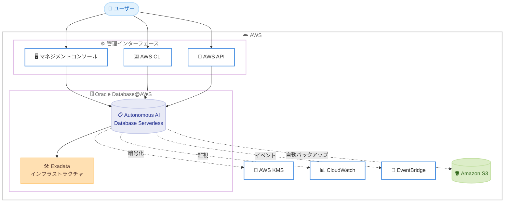

# Oracle Database@AWS - Oracle Autonomous AI Database Serverless サポート

**リリース日**: 2026 年 6 月 17 日
**サービス**: Oracle Database@AWS
**機能**: Oracle Autonomous AI Database Serverless (ADB-S)

📊 [このアップデートのインフォグラフィックを見る](https://takech9203.github.io/aws-news-summary/20260617-oracle-database-aws-autonomous-database-serverless.html)
<!-- INFOGRAPHIC_BASE_URL は環境変数から取得 -->

## 概要

Oracle Database@AWS が Oracle Autonomous AI Database Serverless (ADB-S) のサポートを開始しました。ADB-S は Oracle Exadata インフラストラクチャ上で動作するフルマネージドの Oracle データベースサービスであり、パッチ適用、チューニング、スケーリングを自動的に処理します。これにより、お客様はデータベース運用の負担を大幅に軽減できます。

これまで Oracle Database@AWS でデータベースを利用するには、専用の Exadata インフラストラクチャや VM クラスターを事前にプロビジョニングする必要がありました。今回のアップデートにより、お客様は AWS マネジメントコンソール、AWS CLI、または AWS API から Oracle Autonomous AI Database を直接プロビジョニングできるようになり、専用インフラストラクチャのセットアップが不要になりました。

ADB-S は AWS Marketplace のパブリックオファーおよびプライベートオファーを通じて提供され、Bring Your Own License (BYOL) と License Included の両方のライセンスオプションをサポートします。AWS のネイティブサービスとの統合により、AWS 環境内で Oracle のオートノマス機能を活用したいお客様に適しています。

**アップデート前の課題**

- 以前は Oracle Database@AWS を利用する際に、専用の Exadata インフラストラクチャや VM クラスターを事前にプロビジョニングする必要があった
- 以前はデータベースのパッチ適用、チューニング、スケーリングを手動またはお客様側で管理する必要があった
- 以前はサーバーレス形態でのオートノマスデータベースの選択肢がなく、ワークロードに応じた柔軟なリソース割り当てが容易ではなかった

**アップデート後の改善**

- 今回のアップデートにより、AWS コンソール、CLI、API から Oracle Autonomous AI Database を直接プロビジョニングできるようになった
- 今回のアップデートにより、専用 Exadata インフラストラクチャや VM クラスターのセットアップが不要になった
- 今回のアップデートにより、コンピューティングとストレージがワークロード需要に応じて独立してスケールするようになった

## アーキテクチャ図



AWS の各種インターフェースから Autonomous AI Database Serverless を直接プロビジョニングし、KMS、CloudWatch、EventBridge、S3 といった AWS ネイティブサービスと統合する構成を示しています。

## サービスアップデートの詳細

### 主要機能

1. **AWS ネイティブからの直接プロビジョニング**
   - AWS マネジメントコンソール、AWS CLI、AWS API から Oracle Autonomous AI Database を直接プロビジョニングできる
   - 専用の Exadata インフラストラクチャや VM クラスターを事前にセットアップする必要がない
   - フルマネージドサービスとして、パッチ適用、チューニング、スケーリングが自動的に処理される

2. **4 種類のワークロードタイプ**
   - AI Transaction Processing: トランザクション処理向けのワークロード
   - AI Lakehouse: 分析およびレイクハウス向けのワークロード
   - AI JSON Database: JSON ドキュメント中心のワークロード
   - Oracle APEX: ローコードアプリケーション開発向けのワークロード
   - コンピューティングとストレージがワークロード需要に応じて独立してスケールする

3. **高可用性とディザスタリカバリ**
   - Autonomous Data Guard による高可用性を提供
   - Amazon S3 への自動バックアップに対応
   - クロスリージョンディザスタリカバリをサポート

4. **AWS サービスとの統合**
   - 暗号化に AWS Key Management Service (KMS) を利用
   - モニタリングに Amazon CloudWatch を利用
   - イベント管理に Amazon EventBridge を利用

## 技術仕様

### ワークロードタイプとサービス統合

| 項目 | 詳細 |
|------|------|
| サービス形態 | フルマネージド (サーバーレス) |
| 基盤インフラ | Oracle Exadata インフラストラクチャ |
| ワークロードタイプ | AI Transaction Processing、AI Lakehouse、AI JSON Database、Oracle APEX |
| スケーリング | コンピューティングとストレージが独立してスケール |
| 高可用性 | Autonomous Data Guard |
| バックアップ | Amazon S3 への自動バックアップ |
| DR | クロスリージョンディザスタリカバリ |
| 暗号化 | AWS KMS |
| モニタリング | Amazon CloudWatch |
| イベント管理 | Amazon EventBridge |
| 提供形態 | AWS Marketplace (パブリック / プライベートオファー) |
| ライセンス | BYOL、License Included |

### API 変更履歴

| 日付 | サービス | 変更内容 |
|------|----------|----------|
| 2026/06/09 | [odb](https://awsapichanges.com/archive/changes/6ed721-odb.html) | 23 new 1 updated api methods - Autonomous Database Serverless API の追加。GetOciOnboardingStatus API レスポンスに autonomousDatabaseOciIntegrationIamRoles、linkedOciTenancyId、linkedOciCompartmentId、subscriptionErrors フィールドを追加 |

## 設定方法

### 前提条件

1. Oracle Database@AWS を AWS Marketplace でサブスクライブしていること
2. ODB ネットワークが構成済みであること
3. プロビジョニングに必要な IAM 権限を保有していること

### 手順

#### ステップ 1: AWS Marketplace でのサブスクライブ

AWS Marketplace の Oracle Database@AWS 製品リスティングからサブスクライブします。BYOL または License Included のいずれかのライセンスオプションを選択します。パブリックオファーまたはプライベートオファーを通じて契約できます。

#### ステップ 2: Autonomous AI Database のプロビジョニング

```bash
# AWS CLI で Autonomous Database をプロビジョニングする例 (概念例)
aws odb create-autonomous-database \
  --display-name "my-adb-serverless" \
  --workload-type "AI_TRANSACTION_PROCESSING" \
  --compute-count 2 \
  --data-storage-size-in-gbs 1024
```

AWS マネジメントコンソール、AWS CLI、または AWS API から Autonomous AI Database を直接プロビジョニングします。ワークロードタイプ (AI Transaction Processing、AI Lakehouse、AI JSON Database、Oracle APEX) を選択し、コンピューティングとストレージのサイズを指定します。専用の Exadata インフラストラクチャや VM クラスターのセットアップは不要です。実際のコマンド名やパラメータは AWS CLI のリファレンスを参照してください。

#### ステップ 3: AWS サービスとの統合設定

暗号化に AWS KMS のキーを指定し、モニタリングのために Amazon CloudWatch、イベント駆動の運用のために Amazon EventBridge を構成します。高可用性が必要な場合は Autonomous Data Guard を有効化し、クロスリージョンディザスタリカバリを設定します。

## メリット

### ビジネス面

- **運用負荷の軽減**: パッチ適用、チューニング、スケーリングが自動化されることで、データベース管理に要する運用コストと工数を削減できる
- **柔軟なライセンス**: BYOL と License Included の両方に対応し、既存の Oracle ライセンス資産を活用するか、必要に応じて従量課金的に利用するかを選択できる
- **調達の簡素化**: AWS Marketplace を通じて契約・課金を一元化でき、調達プロセスを効率化できる

### 技術面

- **インフラ管理の不要化**: 専用 Exadata インフラストラクチャや VM クラスターのプロビジョニングが不要となり、AWS ネイティブのインターフェースから直接利用できる
- **独立したスケーリング**: コンピューティングとストレージがワークロード需要に応じて独立してスケールし、リソースを最適化できる
- **AWS サービスとの統合**: KMS、CloudWatch、EventBridge、S3 と統合することで、既存の AWS 運用基盤に組み込みやすい

## デメリット・制約事項

### 制限事項

- 現時点で利用可能なリージョンは US East (バージニア北部) と US West (オレゴン) の 2 リージョンに限定されている
- 東京リージョンを含むその他のリージョンでは未提供
- 利用には AWS Marketplace を通じたサブスクリプションが前提となる

### 考慮すべき点

- ADB-S は Oracle の管理ポリシーに基づき自動的にパッチ適用やチューニングが行われるため、変更管理プロセスとの整合性を確認する必要がある
- クロスリージョンディザスタリカバリの構成には対応リージョンの組み合わせを確認する必要がある
- ライセンスオプション (BYOL / License Included) の選択により、コスト構造とコンプライアンス要件が異なるため事前の検討が必要

## ユースケース

### ユースケース 1: 運用負荷を抑えたトランザクション処理基盤

**シナリオ**: 既存の Oracle データベースを AWS に移行しつつ、データベース管理者の運用負荷を最小限に抑えたい企業。

**実装例**:
```
ワークロードタイプ: AI Transaction Processing
ライセンス: BYOL (既存ライセンスを活用)
高可用性: Autonomous Data Guard を有効化
```

**効果**: パッチ適用やチューニングの自動化により、運用工数を削減しつつ、既存の Oracle ライセンス資産を活用できます。

### ユースケース 2: 分析向けレイクハウス

**シナリオ**: 大規模なデータ分析ワークロードに対し、コンピューティングとストレージを独立してスケールさせたいデータ分析チーム。

**実装例**:
```
ワークロードタイプ: AI Lakehouse
スケーリング: 需要に応じてコンピューティングを自動拡張
モニタリング: Amazon CloudWatch
```

**効果**: 分析需要の変動に合わせてリソースを最適化し、コスト効率の高い分析基盤を構築できます。

### ユースケース 3: ローコードアプリケーション開発

**シナリオ**: Oracle APEX を用いて社内向けの業務アプリケーションを迅速に開発したい開発チーム。

**実装例**:
```
ワークロードタイプ: Oracle APEX
バックアップ: Amazon S3 への自動バックアップ
イベント管理: Amazon EventBridge
```

**効果**: インフラ管理を意識せずに APEX アプリケーションを構築でき、開発のスピードを向上できます。

## 料金

ADB-S は AWS Marketplace のパブリックオファーおよびプライベートオファーを通じて提供され、Bring Your Own License (BYOL) と License Included の両方のライセンスオプションをサポートします。具体的な料金は AWS Marketplace の製品リスティングおよび選択するライセンスオプションによって異なります。詳細な料金については AWS Marketplace の Oracle Database@AWS 製品ページを参照してください。

## 利用可能リージョン

本機能は以下の 2 リージョンで利用可能です。

- US East (バージニア北部)
- US West (オレゴン)

## 関連サービス・機能

- **Amazon S3**: Autonomous AI Database の自動バックアップ先として利用される
- **AWS Key Management Service (KMS)**: データベースの暗号化に利用される
- **Amazon CloudWatch**: データベースのモニタリングに利用される
- **Amazon EventBridge**: イベント駆動の運用やイベント管理に利用される

## 参考リンク

- 📊 [インフォグラフィック](https://takech9203.github.io/aws-news-summary/20260617-oracle-database-aws-autonomous-database-serverless.html)
- [公式発表 (What's New)](https://aws.amazon.com/about-aws/whats-new/2026/06/oracle-database-aws-autonomous-database-serverless/)
- [Oracle Database@AWS ユーザーガイド](https://docs.aws.amazon.com/odb/latest/UserGuide/what-is-odb.html)
- [AWS Marketplace - Oracle Database@AWS](https://aws.amazon.com/marketplace/)

## まとめ

Oracle Database@AWS における Oracle Autonomous AI Database Serverless のサポートにより、専用インフラストラクチャのセットアップなしに、AWS ネイティブのインターフェースからフルマネージドの Oracle オートノマスデータベースを利用できるようになりました。4 種類のワークロードタイプと AWS サービスとの統合により、運用負荷を抑えつつ柔軟なデータベース基盤を構築できます。現時点では US East (バージニア北部) と US West (オレゴン) での提供となるため、対象リージョンでの Oracle ワークロード移行や新規構築を検討しているお客様は、AWS Marketplace でのサブスクリプションとライセンスオプションを確認することをお勧めします。
