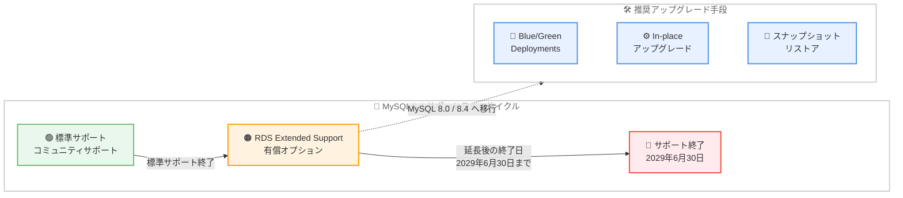

# Amazon Aurora および RDS for MySQL - MySQL 5.7 の Extended Support を 2029 年 6 月まで延長

**リリース日**: 2026 年 6 月 17 日
**サービス**: Amazon Aurora、Amazon RDS for MySQL
**機能**: RDS Extended Support (MySQL 5.7) の提供期間延長

📊 [このアップデートのインフォグラフィックを見る](https://takech9203.github.io/aws-news-summary/20260617-rds-mysql-es-extension.html)
<!-- INFOGRAPHIC_BASE_URL は環境変数から取得 -->

## 概要

AWS は、Amazon Aurora MySQL 互換エディションおよび Amazon RDS for MySQL における MySQL 5.7 の RDS Extended Support の終了日を、従来の 2027 年 2 月 28 日から 2029 年 6 月 30 日まで延長したことを発表しました。これにより、お客様はサポート対象のメジャーバージョンへの移行を計画し、完了させるための時間を追加で確保できるようになります。

RDS Extended Support は、標準サポート (コミュニティによるサポート) が終了したデータベースバージョンに対して、重大度の高い CVE に対するセキュリティパッチ、運用上の重大な問題に対するバグ修正、および標準の Aurora と RDS の SLA の範囲内での AWS サポートへのアクセスを提供する有償オプションです。今回の延長は、Aurora MySQL バージョン 2 (MySQL 5.7 互換) と RDS for MySQL バージョン 5.7 を対象とし、Aurora MySQL と RDS for MySQL が利用可能なすべての AWS リージョンに適用されます。

今回の延長に伴う価格の引き上げはありません。お客様は 2029 年 6 月 30 日まで、引き続き 3 年目 (Year 3) の料金で Extended Support を利用できます。AWS は、最新のデータベース機能、パフォーマンスの向上、セキュリティ強化の恩恵を受けるために、MySQL 8.0 または MySQL 8.4 互換バージョンへのアップグレードを引き続き推奨しています。

**アップデート前の課題**

このアップデート以前は、MySQL 5.7 を利用するお客様は次のような制約に直面していました。

- MySQL 5.7 の Extended Support 終了日が 2027 年 2 月 28 日であり、移行計画に使える時間が限られていた
- 大規模な本番ワークロードや複雑なアプリケーション依存関係を持つ環境では、終了日までに MySQL 8.0 への移行を完了することが難しいケースがあった
- 終了日を過ぎると Extended Support の対象外となり、セキュリティパッチを受けられなくなるリスクがあった

**アップデート後の改善**

今回のアップデートにより、以下が可能になりました。

- MySQL 5.7 の Extended Support 終了日が 2029 年 6 月 30 日まで延長され、移行計画と実行の時間を約 2 年 4 か月追加で確保できるようになった
- 価格の引き上げなしに、3 年目 (Year 3) の料金で延長期間中もセキュリティパッチとバグ修正を継続して受けられるようになった
- Aurora MySQL と RDS for MySQL が利用可能なすべての AWS リージョンで、追加の対応なしに延長が適用されるようになった

## アーキテクチャ図



MySQL 5.7 の Extended Support 終了日が 2029 年 6 月 30 日まで延長され、その間に Blue/Green Deployments、in-place アップグレード、スナップショットリストアのいずれかの手段で MySQL 8.0 または 8.4 への移行を進めることが推奨されます。

## サービスアップデートの詳細

### 主要機能

1. **Extended Support 終了日の延長**
   - MySQL 5.7 の RDS Extended Support 終了日が、2027 年 2 月 28 日から 2029 年 6 月 30 日に延長された
   - 対象は Aurora MySQL バージョン 2 (MySQL 5.7 互換) と RDS for MySQL バージョン 5.7
   - 追加の申請や設定変更は不要で、対象バージョンに自動的に適用される

2. **価格据え置き (3 年目料金の継続)**
   - 今回の延長に伴う価格の引き上げはない
   - お客様は 2029 年 6 月 30 日まで、引き続き 3 年目 (Year 3) の Extended Support 料金を支払う
   - Extended Support は vCPU あたりの時間単位課金で、長期利用ほどコスト負担が大きくなる点は変わらない

3. **継続的なセキュリティとサポートの提供**
   - 重大度が Critical および High の CVE に対するセキュリティパッチを提供
   - 運用上の重大な問題に対するバグ修正を提供
   - 標準の Aurora および RDS の SLA の範囲内で AWS サポートへアクセス可能

## 技術仕様

### 対象バージョンと終了日

| 項目 | 詳細 |
|------|------|
| 対象エンジン (Aurora) | Aurora MySQL バージョン 2 (MySQL 5.7 互換) |
| 対象エンジン (RDS) | RDS for MySQL バージョン 5.7 |
| 従来の Extended Support 終了日 | 2027 年 2 月 28 日 |
| 延長後の Extended Support 終了日 | 2029 年 6 月 30 日 |
| 延長期間中の料金 | 3 年目 (Year 3) 料金を継続適用 |
| 対象リージョン | Aurora MySQL と RDS for MySQL が利用可能なすべての AWS リージョン |

### Extended Support に含まれる内容

| 提供内容 | 説明 |
|------|------|
| セキュリティパッチ | Critical および High の CVE に対するパッチ |
| バグ修正 | 運用上の重大な問題に対する修正 |
| AWS サポート | 標準の Aurora および RDS の SLA 範囲内でのサポートアクセス |

### API 変更履歴

今回のアップデートはサポートライフサイクルの延長であり、新しい API メソッドの追加や既存 API の変更は伴いません。

## 設定方法

Extended Support の延長自体は対象バージョンに自動的に適用されるため、お客様による追加の操作は不要です。一方で、AWS は MySQL 8.0 または 8.4 互換バージョンへの移行を推奨しています。以下に主なアップグレード手段を示します。

### 前提条件

1. 対象が Aurora MySQL バージョン 2 (MySQL 5.7 互換) または RDS for MySQL バージョン 5.7 であることを確認する
2. アプリケーションが MySQL 8.0 / 8.4 と互換性があるかを事前に検証する
3. アップグレード前にスナップショットを取得し、ロールバック手段を確保する

### 手順

#### ステップ1: 現在の対象 DB を確認する

```bash
# RDS for MySQL のうちエンジンバージョン 5.7 系のインスタンスを一覧表示する
aws rds describe-db-instances \
  --query "DBInstances[?starts_with(EngineVersion, '5.7')].[DBInstanceIdentifier,EngineVersion]" \
  --output table
```

このコマンドは、アカウント内の RDS for MySQL のうち、エンジンバージョンが 5.7 で始まるインスタンスを抽出し、識別子とバージョンを一覧表示します。移行対象の棚卸しに利用します。

#### ステップ2: Blue/Green Deployments で移行する

```bash
# 既存の MySQL 5.7 インスタンスから Blue/Green デプロイメントを作成する
aws rds create-blue-green-deployment \
  --blue-green-deployment-name mysql57-to-80 \
  --source <既存DBインスタンスのARN> \
  --target-engine-version 8.0.<マイナーバージョン>
```

このコマンドは、本番環境 (Blue) のクローンとなるステージング環境 (Green) を作成し、Green 側を MySQL 8.0 へアップグレードします。Green 側で十分に検証したうえで切り替えることで、ダウンタイムを最小化できます。

#### ステップ3: in-place アップグレードまたはスナップショットリストアを選択する

- **in-place アップグレード**: `modify-db-instance` でエンジンバージョンを指定し、既存インスタンスを直接アップグレードする方法。手順がシンプルですが、アップグレード中はダウンタイムが発生します
- **スナップショットリストア**: 既存のスナップショットから新しいエンジンバージョンで復元する方法。元の環境を残したまま移行先を構築できます

ワークロードの規模、許容できるダウンタイム、検証要件に応じて最適な手段を選択してください。

## メリット

### ビジネス面

- **移行猶予の確保**: 終了日が約 2 年 4 か月延長され、大規模・複雑な環境でも余裕を持った移行計画が立てられる
- **追加コストの回避**: 価格の引き上げがなく、3 年目料金のまま延長期間を利用できるため、想定外のコスト増を避けられる
- **コンプライアンスの維持**: 延長期間中も継続してセキュリティパッチを受けられるため、セキュリティおよびコンプライアンス要件を満たし続けられる

### 技術面

- **継続的なセキュリティ対応**: Critical / High の CVE に対するパッチが提供され、既知の脆弱性へのリスクを低減できる
- **運用の安定性**: 運用上の重大な問題に対するバグ修正が継続して提供される
- **全リージョン対応**: 対象バージョンが利用可能なすべての AWS リージョンに自動適用されるため、地域ごとの個別対応が不要

## デメリット・制約事項

### 制限事項

- 延長は MySQL 5.7 互換バージョン (Aurora MySQL v2、RDS for MySQL 5.7) のみが対象
- Extended Support は有償オプションであり、延長期間中も 3 年目料金の課金が継続する
- 提供されるのは Critical / High の CVE パッチと運用上の重大な問題のバグ修正であり、新機能の追加は含まれない

### 考慮すべき点

- Extended Support はあくまで移行までの猶予を提供するものであり、最終的には MySQL 8.0 または 8.4 への移行が必要
- Extended Support の料金は通常の DB 利用料金に上乗せされるため、長期間の利用はコスト負担が大きくなる
- 新しいデータベース機能やパフォーマンス改善は MySQL 8.0 / 8.4 でのみ提供されるため、移行を先送りするほど機会損失が生じる

## ユースケース

### ユースケース1: 大規模本番環境の段階的移行

**シナリオ**: 多数のアプリケーションが依存する大規模な MySQL 5.7 本番データベースを運用しており、2027 年 2 月の終了日までに移行を完了することが困難だった。

**実装例**:
```
1. Extended Support 延長により 2029 年 6 月まで猶予を確保
2. 開発・ステージング環境から順次 MySQL 8.0 へ移行・検証
3. Blue/Green Deployments で本番環境を低ダウンタイムで切り替え
```

**効果**: アプリケーション互換性を十分に検証しながら、リスクを抑えた段階的な移行が可能になる。

### ユースケース2: コンプライアンス要件下でのセキュリティ維持

**シナリオ**: セキュリティおよびコンプライアンス要件により、サポートされていないデータベースバージョンの運用が許されない。

**実装例**:
```
1. Extended Support を継続利用し Critical / High CVE パッチを適用
2. 延長期間中に移行計画を策定・実行
3. 移行完了後に Extended Support を終了
```

**効果**: 移行作業中もセキュリティパッチの適用を継続でき、コンプライアンス要件を満たし続けられる。

### ユースケース3: コストを意識した移行タイミングの最適化

**シナリオ**: Extended Support の料金負担を抑えつつ、移行のリソースと予算を計画的に配分したい。

**実装例**:
```
1. 価格据え置き (3 年目料金) の延長を前提に移行予算を再計画
2. 優先度の高いワークロードから順に MySQL 8.0 / 8.4 へ移行
3. Extended Support 課金期間をできる限り短縮するよう移行を完了
```

**効果**: 価格引き上げがない延長を活用し、移行リソースと予算を無理なく配分できる。

## 料金

今回の延長に伴う価格の引き上げはありません。お客様は 2029 年 6 月 30 日まで、引き続き 3 年目 (Year 3) の RDS Extended Support 料金を支払います。

RDS Extended Support は、データベースインスタンスの vCPU 数に基づく時間単位の追加料金として課金されます。標準サポート終了後の経過年数に応じた料金体系となっており、今回の延長期間中は最も高い 3 年目料金が適用される点に注意が必要です。正確な単価はリージョンやエンジンによって異なるため、最新の料金は公式の料金ページで確認してください。

### 料金例

| 使用量 | 月額料金（概算） |
|--------|------------------|
| MySQL 5.7 インスタンス (Extended Support 適用) | vCPU あたりの時間単価 × vCPU 数 × 稼働時間が通常料金に上乗せ |
| MySQL 8.0 / 8.4 へ移行後 | Extended Support 料金は発生しない |

## 利用可能リージョン

Aurora MySQL および RDS for MySQL が利用可能なすべての AWS リージョンで、今回の Extended Support 延長が適用されます。

## 関連サービス・機能

- **Amazon RDS Blue/Green Deployments**: 本番環境への影響を最小限に抑えながら MySQL 8.0 / 8.4 へアップグレードするための推奨手段
- **Amazon RDS for MySQL**: バージョン 5.7 が今回の延長対象。MySQL 8.0 / 8.4 が移行先となる
- **Amazon Aurora MySQL**: バージョン 2 (MySQL 5.7 互換) が延長対象。Aurora MySQL バージョン 3 (MySQL 8.0 互換) が移行先となる

## 参考リンク

- 📊 [インフォグラフィック](https://takech9203.github.io/aws-news-summary/20260617-rds-mysql-es-extension.html)
- [公式発表 (What's New)](https://aws.amazon.com/about-aws/whats-new/2026/06/rds-mysql-es-extension/)
- [Amazon RDS の Extended Support に関するドキュメント](https://docs.aws.amazon.com/AmazonRDS/latest/UserGuide/extended-support.html)
- [Amazon Aurora の Extended Support に関するドキュメント](https://docs.aws.amazon.com/AmazonRDS/latest/AuroraUserGuide/extended-support.html)
- [Amazon RDS 料金ページ](https://aws.amazon.com/rds/mysql/pricing/)

## まとめ

MySQL 5.7 の RDS Extended Support 終了日が 2029 年 6 月 30 日まで価格据え置きで延長されたことで、お客様はより余裕を持って MySQL 8.0 / 8.4 への移行を計画・実行できるようになりました。Extended Support はあくまで移行までの猶予を提供するものであるため、延長期間に頼り切るのではなく、Blue/Green Deployments などの手段を用いた計画的な移行を早期に進めることを推奨します。
