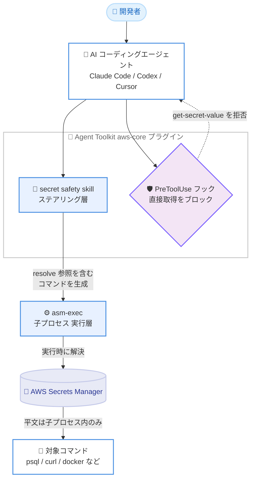

# AWS Secrets Manager - Agent Toolkit for AWS における安全なシークレット処理

**リリース日**: 2026 年 6 月 17 日
**サービス**: AWS Secrets Manager
**機能**: Agent Toolkit for AWS における secret safety skill

📊 [このアップデートのインフォグラフィックを見る](https://takech9203.github.io/aws-news-summary/20260617-safe-secrets-handling-in-agent-toolkit-for-aws.html)
<!-- INFOGRAPHIC_BASE_URL は環境変数から取得 -->

## 概要

AWS Secrets Manager は、Agent Toolkit for AWS の `aws-core` プラグインに、安全にシークレットを扱うための新しいスキル (secret safety skill) を追加しました。Agent Toolkit for AWS は、AI コーディングエージェントに対して AWS 開発向けのツール、ナレッジ、ガードレールを提供するオープンソースリポジトリです。

このスキルは、AI コーディングエージェントを使ったエージェント型ワークフローにおいて、シークレットの値をモデルのコンテキストやセッションログに露出させることなく利用できるようにします。Claude Code、Codex、Cursor といった主要なエージェントハーネスに対応しており、開発者は通常のワークフローを維持しながらシークレットを安全に扱えます。

対象となるのは、AI コーディングエージェントを利用して AWS 上のアプリケーション開発を行う開発者や、生成 AI を活用した開発フローのセキュリティを強化したいチームです。

**アップデート前の課題**

このアップデート以前、AI コーディングエージェントはシークレットの取り扱いに関するガードレールを持っていませんでした。

- 以前は、エージェントが `get-secret-value` を呼び出すことで、シークレットを平文のまま取得できてしまいました
- 以前は、取得した平文のシークレットがエージェントのコンテキストウィンドウに取り込まれ、会話履歴やログ、下流のツール呼び出しに漏えいするリスクがありました
- 以前は、シークレットの不用意な取得を構造的に防ぐ仕組みが存在しませんでした

**アップデート後の改善**

今回のアップデートにより、エージェント型ワークフローでのシークレット利用が安全になりました。

- 今回のアップデートにより、シークレットの実際の値をコンテキストウィンドウに通すことなく、エージェントが安全にシークレットを利用できるようになりました
- 今回のアップデートにより、平文のシークレットがモデルのコンテキスト、セッションログ、エージェントメモリに残らないようになりました
- 今回のアップデートにより、`get-secret-value` などの直接的な取得呼び出しをフックで自動的にブロックできるようになりました

## アーキテクチャ図



エージェントはステアリング層のスキルに従ってシークレットを「取得」せず「利用」するコマンドを生成し、`asm-exec` が実行時に子プロセス内でのみ値を解決します。フックは直接的な取得呼び出しを自動的にブロックします。

## サービスアップデートの詳細

### 主要機能

1. **secret safety skill によるステアリング (スキルガイダンス)**
   - エージェントに対し、シークレットを平文で取得するのではなく、`{{resolve:secretsmanager:...}}` 形式の動的参照を使うよう促します
   - モデルが生の値を要求したり受け取ったりしないように誘導し、開発者に意図を確認したうえでシークレットを「利用する」コマンドを構築します
   - 動的参照と `asm-exec` ラッパースクリプトを組み合わせて利用するため、平文の値は子プロセス内にのみ存在し、エージェントのコンテキストウィンドウには入りません

2. **PreToolUse フックによる構造的な強制 (実行層の保護)**
   - `aws-core` プラグインを有効にすると、ツール呼び出しの実行前に `PreToolUse` フックが介入します
   - AWS CLI、SDK、MCP ツール、AWS Workload Credentials Provider デーモンへの直接アクセスによる `get-secret-value` および `batch-get-secret-value` の呼び出しをブロックします
   - 手動設定は不要で、プラグインを導入するだけで自動的に有効になります

3. **asm-exec による実行時解決**
   - `asm-exec` はコマンド引数内の `{{resolve:...}}` 参照を解決してから対象コマンドを実行するラッパースクリプトです
   - 値の解決には、ローカルにキャッシュされる AWS Workload Credentials Provider (`localhost:2773`)、または SigV4 署名で AWS MCP エンドポイントに要求する方式が利用されます
   - シークレットの値は `asm-exec` プロセスのメモリと子プロセスの引数内にのみ存在します

## 技術仕様

### `{{resolve:...}}` 構文

| コンポーネント | 必須 | デフォルト | 説明 |
|------|------|------|------|
| secret-id | はい | – | シークレット名または完全な ARN |
| field-type | いいえ | SecretString | `SecretString` を指定 |
| json-key | いいえ | (値全体) | JSON 形式のシークレットから抽出するキー |
| version-stage | いいえ | AWSCURRENT | バージョンステージラベル |

完全な構文は次のとおりです。

```text
{{resolve:secretsmanager:<secret-id>:<field-type>:<json-key>:<version-stage>}}
```

### API 変更履歴

今回のアップデートは Agent Toolkit for AWS (オープンソースリポジトリ) のスキルとフックの追加であり、AWS Secrets Manager の API そのものの変更ではありません。awsapichanges.com 上に対応する API 変更は確認されませんでした。

### 必要な IAM 権限

```json
{
  "Version": "2012-10-17",
  "Statement": [
    {
      "Effect": "Allow",
      "Action": "secretsmanager:GetSecretValue",
      "Resource": "arn:aws:secretsmanager:<region>:<account-id>:secret:prod/*"
    }
  ]
}
```

解決したいシークレットに対して `secretsmanager:GetSecretValue` 権限が必要です。

## 設定方法

### 前提条件

1. Claude Code や OpenAI Codex など、プラグインをサポートする AI コーディングエージェント
2. Agent Toolkit for AWS の `aws-core` プラグインのインストール
3. 次のいずれかのシークレット解決バックエンド。`localhost:2773` で稼働する AWS Workload Credentials Provider、または AWS MCP エンドポイントへ署名できる AWS 認証情報
4. 解決対象のシークレットに対する `secretsmanager:GetSecretValue` の IAM 権限

### 手順

#### ステップ1: aws-core プラグインのインストール

```bash
# Claude Code の場合
claude plugin add ./plugins/aws-core

# OpenAI Codex の場合
codex plugin add ./plugins/aws-core
```

利用するエージェントプラットフォームに `aws-core` プラグインをインストールします。secret safety skill とフックは自動的に有効になります。

#### ステップ2: asm-exec を使ってシークレットを利用するコマンドを実行

```bash
asm-exec -- psql \
  "host=mydb.example.com \
  user={{resolve:secretsmanager:prod/db-creds:SecretString:username}} \
  password={{resolve:secretsmanager:prod/db-creds:SecretString:password}}" \
  -c "SELECT * FROM users LIMIT 10"
```

`asm-exec` がコマンド引数内の `{{resolve:...}}` 参照を実行時に解決し、対象コマンド (この例では `psql`) を実行します。平文のシークレットは子プロセス内にのみ存在し、エージェントのコンテキストには渡りません。

#### ステップ3: リージョンをまたぐシークレットの利用

```bash
# 完全な ARN を使う場合 (リージョンは自動的に抽出される)
asm-exec -- curl -H "X-Api-Key: {{resolve:secretsmanager:arn:aws:secretsmanager:eu-west-1:123456789012:secret:prod/key-a1b2c3}}" \
  https://eu.api.example.com/data

# AWS_REGION を使う場合
export AWS_REGION=eu-west-1
asm-exec -- curl -H "X-Api-Key: {{resolve:secretsmanager:prod/key}}" \
  https://eu.api.example.com/data
```

デフォルトと異なるリージョンに保存されたシークレットを利用する場合は、完全な ARN を指定するか、`AWS_REGION` 環境変数を設定します。

## メリット

### ビジネス面

- **情報漏えいリスクの低減**: 平文のシークレットが会話履歴やログに残らないため、生成 AI を活用した開発における機密情報の漏えいリスクを抑えられます
- **ガバナンスの強化**: フックによる構造的な強制により、組織のポリシーとして安全なシークレット利用を徹底しやすくなります
- **追加コストなしで導入可能**: オープンソースのプラグインとして提供され、既存の開発ワークフローに組み込めます

### 技術面

- **コンテキスト汚染の防止**: シークレットの値がモデルのコンテキストウィンドウに入らないため、コンテキスト経由の漏えい経路を遮断します
- **ゼロコンフィグでのフック有効化**: プラグインを導入するだけで `PreToolUse` フックが有効になり、手動設定は不要です
- **柔軟なバックエンド**: AWS Workload Credentials Provider と AWS MCP エンドポイントの両方に対応し、いずれかが利用できない場合は自動的にフォールバックします

## デメリット・制約事項

### 制限事項

- これはベストエフォートの防御であり、セキュリティ境界ではありません。最も一般的な漏えい経路を防ぎますが、すべての回避経路を阻止できるわけではありません
- フックはエージェントのセッション開始時に読み込まれます。セッション途中でプラグインをインストールした場合は、フックを有効化するためにセッションを再起動する必要があります
- `field-type` は `SecretString` のみ指定可能です

### 考慮すべき点

- IAM の最小権限、CloudTrail による監視、VPC エンドポイントポリシーと組み合わせて多層的に運用することが推奨されます
- シークレットの値は `asm-exec` プロセスのメモリと子プロセスの引数内に存在するため、対象コマンド自体のログ出力には注意が必要です
- 両方の解決バックエンドに到達できない場合は解決に失敗するため、認証情報やリージョン設定の確認が必要です

## ユースケース

### ユースケース1: AI エージェントによるデータベース接続

**シナリオ**: 開発者が Claude Code を使ってアプリケーションのデバッグを行い、本番データベースへ接続する必要がある。従来は接続情報を平文でエージェントに渡していた。

**実装例**:
```bash
asm-exec -- mysql \
  -h {{resolve:secretsmanager:prod/mysql:SecretString:host}} \
  -u {{resolve:secretsmanager:prod/mysql:SecretString:username}} \
  -p{{resolve:secretsmanager:prod/mysql:SecretString:password}} \
  -e "SHOW TABLES"
```

**効果**: データベースの認証情報がエージェントのコンテキストやログに残らず、安全に接続できます。

### ユースケース2: ベアラートークンを用いた外部 API 呼び出し

**シナリオ**: エージェントが外部 API を呼び出す処理を生成する際、API トークンを安全に扱いたい。

**実装例**:
```bash
asm-exec -- curl -H "Authorization: Bearer {{resolve:secretsmanager:prod/api-token}}" \
  https://api.example.com/data
```

**効果**: トークンの値はコンテキストに露出せず、実行時にのみ解決されます。

### ユースケース3: コンテナへのシークレットの受け渡し

**シナリオ**: ローカルでコンテナを起動する際、データベースのパスワードを環境変数として渡す必要がある。

**実装例**:
```bash
asm-exec -- docker run \
  -e "DB_PASSWORD={{resolve:secretsmanager:prod/db:SecretString:password}}" \
  myapp:latest
```

**効果**: パスワードを平文でエージェントに保持させることなく、コンテナへ安全に渡せます。

## 料金

この機能は Agent Toolkit for AWS のオープンソースプラグインとして提供され、スキルとフック自体に追加料金は発生しません。シークレットの取得には AWS Secrets Manager の通常の料金が適用されます。詳細は AWS Secrets Manager の料金ページを参照してください。

## 利用可能リージョン

AWS Secrets Manager が利用可能なすべての AWS リージョンで利用できます。

## 関連サービス・機能

- **AWS Secrets Manager**: シークレットの保存と管理を担う基盤サービス。`{{resolve:...}}` 参照を通じて実行時に値が解決されます
- **AWS Workload Credentials Provider**: `localhost:2773` で稼働し、ローカルにキャッシュされたシークレット解決バックエンドを提供します
- **Agent Toolkit for AWS**: AI コーディングエージェントに AWS 開発向けのツールとガードレールを提供するオープンソースリポジトリで、本スキルの提供元です

## 参考リンク

- 📊 [インフォグラフィック](https://takech9203.github.io/aws-news-summary/20260617-safe-secrets-handling-in-agent-toolkit-for-aws.html)
- [公式発表 (What's New)](https://aws.amazon.com/about-aws/whats-new/2026/06/safe-secrets-handling-in-agent-toolkit-for-aws/)
- [ドキュメント (Use secrets safely with AI Coding Agents)](https://docs.aws.amazon.com/secretsmanager/latest/userguide/retrieving-secrets-ai-agents.html)
- [Agent Toolkit for AWS (GitHub)](https://github.com/aws/agent-toolkit-for-aws)
- [AWS Secrets Manager 料金ページ](https://aws.amazon.com/secrets-manager/pricing/)

## まとめ

このアップデートは、AI コーディングエージェントを活用した開発において、シークレットの漏えいという重大なリスクに対処する重要な機能です。ステアリング層とフックによる二層の保護により、平文のシークレットをモデルのコンテキストに通すことなく安全に利用できます。AI エージェントを開発フローに取り入れているチームは、`aws-core` プラグインを導入し、IAM の最小権限や CloudTrail 監視と組み合わせて多層的なセキュリティ運用を検討することを推奨します。
