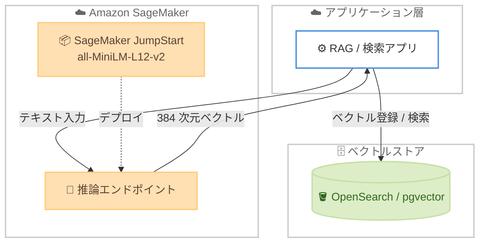

# Amazon SageMaker JumpStart - all-MiniLM-L12-v2 の提供開始

**リリース日**: 2026年6月18日
**サービス**: Amazon SageMaker JumpStart
**機能**: all-MiniLM-L12-v2 (セマンティック検索・文章類似度向けテキスト埋め込みモデル)

📊 [このアップデートのインフォグラフィックを見る](https://takech9203.github.io/aws-news-summary/20260618-all-minilm-l12-v2-on-sagemaker-jumpstart.html)
<!-- INFOGRAPHIC_BASE_URL は環境変数から取得 -->

## 概要

AWS は、Sentence Transformers が開発したテキスト埋め込みモデル all-MiniLM-L12-v2 を Amazon SageMaker JumpStart で利用できるようにしたことを発表しました。このモデルは文や段落を 384 次元の密ベクトル空間にマッピングし、セマンティック検索、テキストクラスタリング、文章類似度といったユースケースをサポートします。

all-MiniLM-L12-v2 は、入力されたテキストを意味を捉えた密ベクトル (embeddings) にエンコードします。生成されたベクトルは、情報検索、セマンティック検索、ドキュメントのクラスタリング、重複検出、言い換え (paraphrase) の識別などに活用できます。33.4M パラメータという小さなフットプリントにより高速な推論を実現しながら、本番環境でのスケールに耐えうる高い埋め込み品質を維持している点が特徴です。

お客様は SageMaker Studio の Models 画面、または SageMaker Python SDK を使用して、わずか数クリックで自身の AWS アカウントにモデルをデプロイできます。これにより、Retrieval-Augmented Generation (RAG) パイプラインのベクトル化処理や、ベクトル検索基盤の構築を、モデルの実装や微調整に時間をかけることなく素早く開始できます。

**アップデート前の課題**

- 高品質なオープンソース埋め込みモデルを SageMaker で利用するには、Hugging Face からモデルをダウンロードし、推論コンテナや依存関係を自分で構成してデプロイする必要があった
- 埋め込みモデルの選定にあたり、推論速度と埋め込み品質のトレードオフを検証する手間がかかっていた
- RAG やセマンティック検索の基盤を構築する際、ベクトル化を担う埋め込みモデルの準備が初期構築のボトルネックになりやすかった

**アップデート後の改善**

- SageMaker JumpStart から数クリックで all-MiniLM-L12-v2 をデプロイできるようになった
- 12 層アーキテクチャにより、軽量な L6 系モデルよりも高い埋め込み品質を得つつ、小さなフットプリントで高速な推論を維持できる
- セマンティック検索、クラスタリング、文章類似度のユースケースに対応した埋め込み基盤を、最小限の設定で本番運用へ展開できる

## アーキテクチャ図



アプリケーションはテキストを SageMaker 推論エンドポイントに送信し、384 次元の埋め込みベクトルを取得します。取得したベクトルは OpenSearch や pgvector などのベクトルストアに登録・検索され、セマンティック検索や RAG を実現します。

## サービスアップデートの詳細

### 主要機能

1. **384 次元の密ベクトル生成**
   - 文や段落を 384 次元の密ベクトル空間にマッピングする
   - ベクトルは意味的な情報 (semantic meaning) を捉えるため、表層的な単語一致を超えた類似度比較が可能
   - 情報検索、セマンティック検索、ドキュメントクラスタリング、重複検出、言い換え識別に利用できる

2. **12 層アーキテクチャによる高品質と高速推論の両立**
   - `microsoft/MiniLM-L12-H384-uncased` をベースとした 12 層の BERT 系トランスフォーマー (33.4M パラメータ)
   - 小さなフットプリントにより高速な推論を実現しつつ、本番スケールでも高い埋め込み品質を維持
   - 軽量な L6 系モデルと比較して、より深い層構造による高品質な埋め込みが期待できる

3. **SageMaker JumpStart からの簡単なデプロイ**
   - SageMaker Studio の Models 画面から数クリックでデプロイ可能
   - SageMaker Python SDK を使用したコードベースのデプロイにも対応
   - デプロイ後は SageMaker 推論エンドポイント経由で埋め込み生成を呼び出せる

## 技術仕様

### モデル仕様

| 項目 | 詳細 |
|------|------|
| モデル名 | all-MiniLM-L12-v2 |
| 開発元 | Sentence Transformers |
| ベースモデル | microsoft/MiniLM-L12-H384-uncased |
| アーキテクチャ | 12 層 BERT 系トランスフォーマー |
| パラメータ数 | 約 33.4M |
| 埋め込み次元 | 384 次元 |
| 最大シーケンス長 | 256 word pieces (超過分は切り捨て) |
| ライセンス | Apache 2.0 |
| 主な用途 | セマンティック検索、文章類似度、クラスタリング、情報検索 |

### 学習データ

- 10 億件超の文ペア (合計 1,170,060,424 タプル) を用いた自己教師あり対照学習 (contrastive learning) でファインチューニング
- 主要な学習データソースには Reddit コメント (約 7.26 億件)、S2ORC 引用ペア、WikiAnswers の重複質問、PAQ の質問応答ペアが含まれる

### API変更履歴

このアップデートは SageMaker JumpStart 上での既存モデルカタログへのモデル追加であり、新規 API の追加や既存 API の変更を伴うものではありません。デプロイには既存の SageMaker 推論 API (`InvokeEndpoint` など) を利用します。

## 設定方法

### 前提条件

1. Amazon SageMaker を利用可能な AWS アカウント
2. SageMaker のドメインおよびユーザープロファイル (SageMaker Studio 利用時)
3. モデルのデプロイとエンドポイント作成に必要な IAM 権限

### 手順

#### ステップ1: SageMaker Studio からモデルを選択

SageMaker Studio を開き、左側ナビゲーションの [Models] (JumpStart) 画面で「all-MiniLM-L12-v2」を検索します。モデルカードを開き、内容を確認します。

#### ステップ2: モデルをデプロイ

```python
from sagemaker.jumpstart.model import JumpStartModel

# JumpStart モデル ID を指定してモデルを初期化
model = JumpStartModel(model_id="huggingface-sentencesimilarity-all-minilm-l12-v2")

# 推論エンドポイントへデプロイ
predictor = model.deploy()
```

SageMaker Python SDK の `JumpStartModel` クラスにモデル ID を指定してデプロイします。`deploy()` の実行により推論エンドポイントが作成されます。

> 注: 実際のモデル ID やインスタンスタイプは SageMaker JumpStart のモデルカードおよびドキュメントで確認してください。

#### ステップ3: 埋め込みを生成

```python
# テキストを送信して埋め込みベクトルを取得
response = predictor.predict({
    "inputs": "AWS のセマンティック検索を構築する"
})

# 384 次元のベクトルが返却される
print(response)
```

デプロイしたエンドポイントにテキストを送信し、384 次元の埋め込みベクトルを取得します。得られたベクトルをベクトルストアに登録することで、セマンティック検索や RAG の基盤を構築できます。

## メリット

### ビジネス面

- **構築期間の短縮**: 埋め込みモデルの準備を数クリックで完了でき、セマンティック検索や RAG の PoC から本番化までのリードタイムを短縮できる
- **コスト効率**: 33.4M パラメータの軽量モデルのため、大規模モデルと比べて推論コストとインフラ要件を抑えやすい
- **オープンソースの活用**: Apache 2.0 ライセンスのモデルを SageMaker の運用環境に統合し、AWS の管理・スケーリング機能を活用できる

### 技術面

- **高速推論**: 小さなフットプリントにより低レイテンシでの埋め込み生成が可能
- **品質と速度の両立**: 12 層アーキテクチャにより、軽量な L6 系モデルよりも高い埋め込み品質が期待できる
- **統合の容易さ**: SageMaker 推論エンドポイントとして提供されるため、OpenSearch や pgvector などのベクトルストアと容易に連携できる

## デメリット・制約事項

### 制限事項

- 最大シーケンス長は 256 word pieces であり、それを超える長文は切り捨てられる (長文ドキュメントはチャンク分割が必要)
- 学習データの大半が英語コーパスのため、多言語や日本語特有のタスクでは品質を事前に検証する必要がある
- 384 次元という比較的低い次元数は効率に優れる一方、最大精度を求めるタスクでは高次元モデルに劣る場合がある

### 考慮すべき点

- 推論エンドポイントは起動中に課金されるため、利用パターンに応じてエンドポイントの稼働時間やインスタンスタイプを最適化する
- ユースケースに応じて L6 系モデルや他の埋め込みモデルとの品質・コスト比較を行うことが望ましい
- 利用可能リージョンやインスタンスタイプは SageMaker JumpStart のモデルカードで確認する

## ユースケース

### ユースケース1: 社内ドキュメント検索 (RAG)

**シナリオ**: 社内ナレッジベースを対象に、自然言語の質問から関連ドキュメントを検索する RAG パイプラインを構築する。

**実装例**:
```
ドキュメント → all-MiniLM-L12-v2 で埋め込み生成 → ベクトルストアに登録
質問 → 埋め込み生成 → ベクトル類似度検索 → 関連文書を LLM へ渡して回答生成
```

**効果**: キーワード一致では拾えない意味的に関連する文書を検索でき、回答の精度が向上する。

### ユースケース2: 重複・類似コンテンツの検出

**シナリオ**: 大量のテキストデータ (問い合わせ、レビュー、記事) から重複や言い換えを検出する。

**実装例**:
```
各テキストを埋め込みベクトル化 → ベクトル間のコサイン類似度を計算
→ 閾値を超えるペアを重複・類似候補として抽出
```

**効果**: 表現が異なる重複コンテンツを高精度に検出し、データ品質の向上や名寄せ処理を自動化できる。

### ユースケース3: テキストクラスタリングによる分類

**シナリオ**: ラベルのない大量のテキストを意味的に近いグループへ自動分類する。

**実装例**:
```
テキスト群を埋め込みベクトル化 → k-means などのクラスタリングを適用
→ 意味的に近いトピックごとにグループ化
```

**効果**: 教師データなしでトピックの傾向を把握でき、問い合わせ分類やコンテンツ整理を効率化できる。

## 料金

SageMaker JumpStart 経由で all-MiniLM-L12-v2 を利用する場合、モデル自体は Apache 2.0 ライセンスのオープンソースモデルであり、ソフトウェア利用料は発生しません。課金は、モデルをデプロイした SageMaker 推論エンドポイントで使用するインスタンスの稼働時間に対して発生します。料金はインスタンスタイプとリージョンによって異なります。最新かつ正確な料金は SageMaker の料金ページを参照してください。

## 利用可能リージョン

利用可能なリージョンは、What's New の発表時点では明示されていません。最新の対応リージョンおよびインスタンスタイプは、SageMaker JumpStart のモデルカードおよび公式ドキュメントで確認してください。

## 関連サービス・機能

- **Amazon OpenSearch Service**: 生成した埋め込みベクトルを格納し、k-NN ベクトル検索を実行するベクトルストアとして利用できる
- **Amazon Aurora PostgreSQL (pgvector)**: リレーショナルデータベース上でベクトル検索を行う場合の格納先として利用できる
- **Amazon Bedrock**: RAG パイプラインにおいて、検索結果をもとに回答を生成する LLM レイヤーとして組み合わせ可能
- **Amazon SageMaker Studio**: モデルの検索、デプロイ、エンドポイント管理を行う統合開発環境

## 参考リンク

- 📊 [インフォグラフィック](https://takech9203.github.io/aws-news-summary/20260618-all-minilm-l12-v2-on-sagemaker-jumpstart.html)
- [公式発表 (What's New)](https://aws.amazon.com/about-aws/whats-new/2026/06/all-minilm-l12-v2-on-sagemaker-jumpstart/)
- [Amazon SageMaker JumpStart ドキュメント](https://docs.aws.amazon.com/sagemaker/latest/dg/studio-jumpstart.html)
- [all-MiniLM-L12-v2 モデルカード (Hugging Face)](https://huggingface.co/sentence-transformers/all-MiniLM-L12-v2)
- [Amazon SageMaker 料金ページ](https://aws.amazon.com/sagemaker/pricing/)

## まとめ

all-MiniLM-L12-v2 が SageMaker JumpStart で利用可能になったことで、高品質かつ軽量な埋め込みモデルを数クリックでデプロイし、セマンティック検索や RAG の基盤を素早く構築できるようになりました。推論速度と埋め込み品質のバランスに優れたモデルであり、まずは PoC でユースケースに対する品質とコストを検証し、ベクトルストアと組み合わせた検索基盤への適用を検討することをお勧めします。
