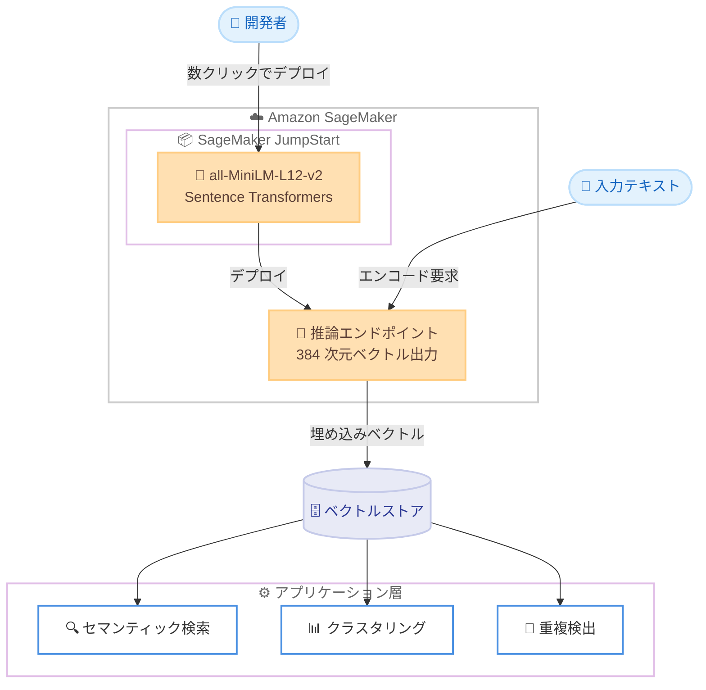

# Amazon SageMaker JumpStart - all-MiniLM-L12-v2 の提供開始

**リリース日**: 2026 年 6 月 18 日
**サービス**: Amazon SageMaker JumpStart
**機能**: all-MiniLM-L12-v2 (Sentence Transformers 埋め込みモデル) の提供

📊 [このアップデートのインフォグラフィックを見る](https://takech9203.github.io/aws-news-summary/20260618-all-minilm-l12-v2-on-sagemaker-jumpstart.html)
<!-- INFOGRAPHIC_BASE_URL は環境変数から取得 -->

## 概要

AWS は、Sentence Transformers の埋め込みモデルである all-MiniLM-L12-v2 を Amazon SageMaker JumpStart で利用できるようにしたことを発表しました。このモデルは、文章や短い段落を 384 次元の密ベクトル (dense vector) にマッピングし、セマンティック検索や文章類似度の計算といったアプリケーションを実現します。

all-MiniLM-L12-v2 はコンパクトなアーキテクチャを採用しており、高い埋め込み品質を維持しながら高速な推論を提供します。これにより、大規模なテキスト表現を効率的に処理する必要がある本番環境のワークロードに適しています。情報検索、セマンティック検索システム、ドキュメントやテキストのクラスタリング、重複検出、パラフレーズ (言い換え) の識別など、幅広いユースケースで活用できます。

SageMaker JumpStart を通じて、SageMaker Studio の [Models] セクションから数クリックでデプロイできるほか、SageMaker Python SDK を使用して各自の AWS アカウントにデプロイすることも可能です。事前トレーニング済みのモデルをすぐに利用できるため、埋め込みモデルを基盤とするアプリケーションの開発を迅速に開始できます。

**アップデート前の課題**

- 埋め込みモデルを利用するには、Hugging Face などの外部リポジトリからモデルを取得し、推論コンテナやエンドポイントの構成を自前で準備する必要がありました
- セマンティック検索や類似度計算のための埋め込み生成基盤を、ゼロから構築・運用する手間がありました
- モデルのデプロイやスケーリングに関する設定を手動で管理する必要がありました

**アップデート後の改善**

- SageMaker JumpStart 経由で all-MiniLM-L12-v2 を数クリックまたは数行の SDK コードでデプロイできるようになりました
- AWS の管理されたインフラストラクチャ上で、すぐに本番品質の埋め込み生成を開始できます
- SageMaker のマネージドエンドポイントを活用し、推論のスケーリングや運用を簡素化できるようになりました

## アーキテクチャ図



開発者は SageMaker JumpStart から all-MiniLM-L12-v2 をデプロイし、推論エンドポイントでテキストを 384 次元ベクトルに変換します。生成された埋め込みをベクトルストアに格納することで、セマンティック検索やクラスタリングなどのアプリケーションを構築できます。

## サービスアップデートの詳細

### 主要機能

1. **高品質な文章埋め込みの生成**
   - 文章や短い段落を 384 次元の密ベクトルにエンコードし、意味的な情報を表現します
   - 単語の表層的な一致ではなく、意味的な近さに基づいた類似度計算を可能にします

2. **コンパクトかつ高速な推論**
   - MiniLM ベースのコンパクトなアーキテクチャにより、高い埋め込み品質を維持しながら高速な推論を実現します
   - 大規模なテキスト表現を効率的に処理する本番ワークロードに適しています

3. **SageMaker JumpStart 経由の容易なデプロイ**
   - SageMaker Studio の [Models] セクションから数クリックでデプロイできます
   - SageMaker Python SDK を使用して、各自の AWS アカウントにプログラムからデプロイすることも可能です

## 技術仕様

### モデル概要

| 項目 | 詳細 |
|------|------|
| モデル名 | all-MiniLM-L12-v2 |
| 提供元 | Sentence Transformers |
| 出力次元数 | 384 次元 (密ベクトル) |
| 主な用途 | セマンティック検索、文章類似度 |
| アーキテクチャ特性 | コンパクトで高速な推論 |
| デプロイ方法 | SageMaker Studio (Models)、SageMaker Python SDK |

### デプロイ例 (SageMaker Python SDK)

```python
from sagemaker.jumpstart.model import JumpStartModel

# JumpStart モデル ID を指定してモデルオブジェクトを生成
model = JumpStartModel(model_id="<all-MiniLM-L12-v2 のモデル ID>")

# 推論エンドポイントをデプロイ
predictor = model.deploy()

# テキストをエンコードして埋め込みベクトルを取得
response = predictor.predict({"inputs": ["セマンティック検索のための文章です"]})
```

上記は SageMaker JumpStart からモデルをデプロイし、テキストを埋め込みベクトルに変換する例です。正確なモデル ID や入力フォーマットは SageMaker JumpStart のドキュメントを参照してください。

## 設定方法

### 前提条件

1. Amazon SageMaker Studio が利用可能な AWS アカウント
2. SageMaker の実行ロール (IAM ロール) と、モデルデプロイに必要な権限
3. 推論エンドポイント用のインスタンスを起動できるサービスクォータ

### 手順

#### ステップ1: SageMaker Studio で JumpStart を開く

SageMaker Studio を起動し、[Models] (JumpStart) セクションから all-MiniLM-L12-v2 を検索します。モデルの詳細ページで仕様やデプロイオプションを確認します。

#### ステップ2: モデルをデプロイする

```python
from sagemaker.jumpstart.model import JumpStartModel

model = JumpStartModel(model_id="<all-MiniLM-L12-v2 のモデル ID>")
predictor = model.deploy()
```

JumpStart のモデルオブジェクトを生成し、`deploy()` を呼び出して推論エンドポイントを作成します。Studio の UI から数クリックでデプロイすることも可能です。

#### ステップ3: 埋め込みを生成して活用する

デプロイしたエンドポイントにテキストを送信して 384 次元の埋め込みベクトルを取得し、ベクトルストア (例: Amazon OpenSearch Service、Amazon Aurora の pgvector) に格納してセマンティック検索やクラスタリングに利用します。

## メリット

### ビジネス面

- **開発の迅速化**: 事前トレーニング済みモデルを即座にデプロイでき、埋め込み基盤の構築期間を短縮できます
- **コスト効率**: コンパクトなモデルにより、小さなインスタンスでも高速な推論が可能で、推論コストを抑えられます
- **幅広い適用範囲**: 検索、クラスタリング、重複検出など複数のユースケースに同一モデルを活用できます

### 技術面

- **マネージド運用**: SageMaker のマネージドエンドポイントにより、スケーリングや可用性の管理を簡素化できます
- **再現性のあるデプロイ**: Python SDK を用いることで、デプロイ手順をコード化し再現性を確保できます
- **エコシステムとの統合**: SageMaker や OpenSearch などの AWS サービスと組み合わせて埋め込みパイプラインを構築できます

## デメリット・制約事項

### 制限事項

- all-MiniLM-L12-v2 は短い文章や段落向けに最適化されており、長文ドキュメント全体をそのままエンコードする用途には適切なチャンク分割が必要です
- 出力次元数は 384 次元に固定されています
- 推論エンドポイントを稼働させている間はインスタンス料金が発生します

### 考慮すべき点

- 多言語対応の度合いはモデルの特性に依存するため、対象言語での精度を事前に評価することを推奨します
- 利用可能リージョンや対応インスタンスタイプは、SageMaker JumpStart のドキュメントで確認してください
- 大量のテキストをバッチ処理する場合は、エンドポイントのスケーリング設定やバッチ推論の活用を検討してください

## ユースケース

### ユースケース1: 社内ナレッジのセマンティック検索

**シナリオ**: 社内ドキュメントや FAQ をキーワード一致ではなく意味的な近さで検索したい。

**実装例**:
```
1. ドキュメントを適切なサイズにチャンク分割
2. all-MiniLM-L12-v2 で各チャンクを 384 次元ベクトルに変換
3. ベクトルをベクトルストアに格納
4. 検索クエリも同じモデルでベクトル化し、近傍検索を実行
```

**効果**: 表現が異なっても意味的に関連するドキュメントを検索でき、検索精度が向上します。

### ユースケース2: 問い合わせの重複検出

**シナリオ**: カスタマーサポートに寄せられる問い合わせのうち、内容が重複するものを自動で検出したい。

**実装例**:
```
1. 各問い合わせ文を埋め込みベクトルに変換
2. ベクトル間のコサイン類似度を計算
3. 類似度が閾値を超えるペアを重複候補として抽出
```

**効果**: 重複対応の削減と、よくある質問のグルーピングによる対応効率の向上が期待できます。

### ユースケース3: ドキュメントのクラスタリング

**シナリオ**: 大量のテキストデータをテーマごとに自動分類したい。

**実装例**:
```
1. 全テキストを埋め込みベクトルに変換
2. K-means などのクラスタリングアルゴリズムを適用
3. クラスタごとに代表的なトピックを抽出
```

**効果**: 手動のラベル付けなしにテキストを意味的なグループに整理でき、データ分析を効率化できます。

## 料金

本アップデートの発表では、専用の料金体系については言及されていません。SageMaker JumpStart のモデルをデプロイして利用する場合、推論エンドポイントに使用する Amazon SageMaker のインスタンス料金などの通常の SageMaker 利用料金が適用されます。正確な料金は Amazon SageMaker の料金ページを参照してください。

## 利用可能リージョン

本アップデートの発表では、利用可能リージョンの具体的な記載はありません。対応リージョンについては、Amazon SageMaker JumpStart のドキュメントおよび利用しているリージョンの SageMaker コンソールで確認してください。

## 関連サービス・機能

- **Amazon SageMaker Studio**: JumpStart のモデルを検索・デプロイするための統合開発環境です
- **Amazon OpenSearch Service**: 生成した埋め込みベクトルを格納し、近傍検索 (k-NN) を実行できます
- **Amazon Bedrock**: マネージドな埋め込みモデルの選択肢として、用途に応じて比較検討できます

## 参考リンク

- 📊 [インフォグラフィック](https://takech9203.github.io/aws-news-summary/20260618-all-minilm-l12-v2-on-sagemaker-jumpstart.html)
- [公式発表 (What's New)](https://aws.amazon.com/about-aws/whats-new/2026/06/all-minilm-l12-v2-on-sagemaker-jumpstart/)
- [Amazon SageMaker JumpStart ドキュメント](https://docs.aws.amazon.com/sagemaker/latest/dg/studio-jumpstart.html)
- [Amazon SageMaker 料金ページ](https://aws.amazon.com/sagemaker/pricing/)

## まとめ

all-MiniLM-L12-v2 が SageMaker JumpStart で利用可能になったことで、高品質かつ高速な文章埋め込みを数クリックでデプロイできるようになりました。セマンティック検索や重複検出、クラスタリングといったテキスト表現を活用するアプリケーションを検討している場合は、JumpStart からモデルをデプロイし、自社データでの精度を評価することから始めることを推奨します。
