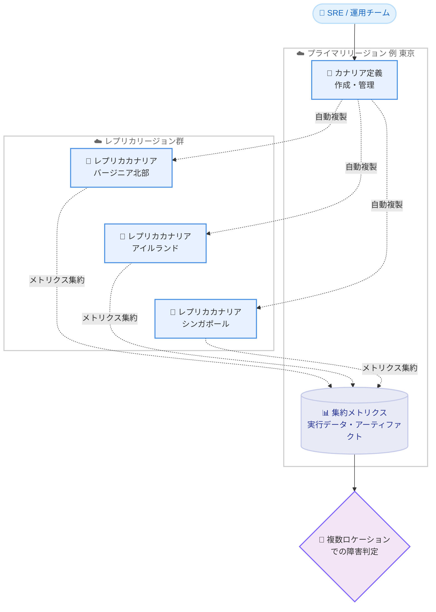

# Amazon CloudWatch Synthetics - マルチロケーションカナリア

**リリース日**: 2026 年 6 月 18 日
**サービス**: Amazon CloudWatch (Synthetics)
**機能**: マルチロケーションカナリア (Multilocation Canaries)

📊 [このアップデートのインフォグラフィックを見る](https://takech9203.github.io/aws-news-summary/20260618-amazon-cloudwatch-synthetics-multilocation.html)
<!-- INFOGRAPHIC_BASE_URL は環境変数から取得 -->

## 概要

Amazon CloudWatch Synthetics は、同一のカナリア (Canary) を複数の AWS リージョンで同時に実行できるマルチロケーションカナリア機能の提供を開始しました。これにより、開発者やサイト信頼性エンジニア (SRE) は、単一の管理ポイントから世界中の複数の地理的ロケーションでアプリケーションのエンドユーザー体験を監視できるようになります。

この機能では、プライマリリージョンで 1 つのカナリアを作成し管理します。CloudWatch Synthetics は、選択した追加リージョンへそのカナリアを自動的に複製します。各リージョンで実行されるレプリカカナリアは独立して動作し、地理的に分散した回復力のある監視カバレッジを提供します。すべての実行データ、メトリクス、アーティファクトはプライマリリージョンに集約されるため、複数ロケーションの監視結果を一元的に把握できます。

CDN や決済処理サービスといったサードパーティ依存関係がすべての地域で正常に機能しているかの検証や、特定リージョン固有のパフォーマンス問題の早期発見に役立ちます。対象は、グローバルなユーザー体験の一貫性を維持したいアプリケーション運用チームや SRE です。

**アップデート前の課題**

このアップデート以前は、複数の地理的ロケーションから監視を行うために、各リージョンで個別のカナリアを構築・維持する必要がありました。

- 以前は、リージョンごとにカナリアを個別に作成・管理する必要があり、運用負荷が高かった
- 以前は、複数のカナリアを手動で同期する必要があり、設定のドリフト (構成のずれ) が発生するリスクがあった
- 以前は、各リージョンのメトリクスやアーティファクトが分散しており、一元的な監視が困難だった

**アップデート後の改善**

今回のアップデートにより、単一の管理ポイントから複数リージョンでの監視が実現しました。

- 今回のアップデートにより、1 つのカナリアを複数リージョンへ自動複製できるようになった
- 今回のアップデートにより、リージョンごとのカナリアを個別に管理する必要がなくなり、設定ドリフトのリスクが低減された
- 今回のアップデートにより、すべての実行データとメトリクスがプライマリリージョンに集約され、一元監視が可能になった

## アーキテクチャ図

プライマリリージョンで定義したカナリアが複数のレプリカリージョンへ自動複製され、各リージョンの実行結果がプライマリリージョンに集約される構成を示しています。

## サービスアップデートの詳細

### 主要機能

1. **単一管理ポイントからのマルチリージョン実行**
   - プライマリリージョンで 1 つのカナリアを作成・管理する
   - 選択した複数の AWS リージョンへカナリアを自動的に複製する
   - 各リージョンのレプリカカナリアは独立して実行され、特定リージョンの障害が他リージョンの監視に影響しない

2. **データとメトリクスの一元集約**
   - すべての実行データ、メトリクス、アーティファクトをプライマリリージョンに集約する
   - 複数ロケーションの監視結果を一箇所で確認できる
   - 設定ドリフトのリスクを低減し、運用負荷を削減する

3. **既存カナリアの移行サポート**
   - 既存のシングルリージョンカナリアを再作成することなくマルチロケーションへ変換できる
   - レプリカリージョンを追加するだけで移行が完了する

4. **複数ロケーション障害に基づくアラーム**
   - 複数のロケーションで問題が発生した場合にのみトリガーするアラームを設定できる
   - アラートの信頼性を高め、単一ロケーションの一時的な問題によるノイズを削減する

## 技術仕様

### マルチロケーションカナリアの構成要素

| 項目 | 詳細 |
|------|------|
| プライマリリージョン | カナリアの作成・管理を行う基点となるリージョン |
| レプリカリージョン | プライマリから自動複製されるカナリアが実行されるリージョン |
| データ集約先 | すべての実行データ・メトリクス・アーティファクトはプライマリリージョンに集約 |
| 実行モデル | 各レプリカは独立実行 (1 リージョンの障害が他に波及しない) |
| 移行 | 既存のシングルリージョンカナリアにレプリカリージョンを追加して変換可能 |

### API変更履歴

今回のアップデートに直接対応する awsapichanges.com の API 変更情報は確認できませんでした。最新の API 仕様については公式ドキュメントを参照してください。

## 設定方法

### 前提条件

1. CloudWatch Synthetics が利用可能なプライマリリージョンでカナリアを作成済み、または作成可能であること
2. レプリカを配置する各リージョンで CloudWatch Synthetics がサポートされていること
3. カナリアの実行に必要な IAM 権限が付与されていること

### 手順

#### ステップ1: プライマリリージョンでのカナリア作成または選択

CloudWatch コンソールの Synthetics セクションで、プライマリリージョンに新しいカナリアを作成するか、既存のカナリアを選択します。プライマリリージョンがカナリア定義の管理基点となります。

#### ステップ2: レプリカリージョンの追加

カナリアの設定でマルチロケーションを有効化し、複製先となるリージョンを選択します。既存のシングルリージョンカナリアの場合も、レプリカリージョンを追加するだけで再作成は不要です。CloudWatch Synthetics が選択したリージョンへカナリアを自動的に複製します。

#### ステップ3: アラームとモニタリングの構成

プライマリリージョンに集約されたメトリクスを基に、複数ロケーションで障害が発生した場合にトリガーするアラームを構成します。これにより、地理的に分散した障害を高い信頼性で検知できます。

## メリット

### ビジネス面

- **グローバルなユーザー体験の一貫性確保**: 世界中の複数ロケーションから監視することで、地域ごとのパフォーマンス差を可視化し、一貫したユーザー体験を維持できる
- **運用コストの削減**: リージョンごとに個別のカナリアを管理する必要がなくなり、運用工数を削減できる
- **インシデント検知の信頼性向上**: 複数ロケーションでの障害判定により、誤検知を減らしアラートの信頼性を高める

### 技術面

- **設定ドリフトの防止**: 単一の定義から自動複製するため、リージョン間で監視設定がずれるリスクを排除できる
- **回復力のある監視**: 各レプリカが独立実行されるため、特定リージョンの障害が監視全体に波及しない
- **一元的なデータ管理**: メトリクスとアーティファクトがプライマリリージョンに集約され、分析が容易になる

## デメリット・制約事項

### 制限事項

- 利用可能なのは CloudWatch Synthetics をサポートする AWS 商用リージョンに限られる
- レプリカリージョンでもカナリアの実行が発生するため、実行回数に応じた料金が各リージョンで発生する

### 考慮すべき点

- 複数リージョンでカナリアを実行する分、カナリア実行回数が増加し、料金が増える点を見積もる必要がある
- どのリージョンをレプリカとして選択するかは、実際のユーザー分布やサードパーティ依存関係の配置に基づいて検討することが望ましい

## ユースケース

### ユースケース1: グローバル Web アプリケーションの可用性監視

**シナリオ**: 世界各地にユーザーを持つ EC サイトで、各地域からのアクセスパフォーマンスと可用性を一貫した条件で監視したい。

**効果**: 単一のカナリア定義を主要地域へ複製し、地域固有の遅延や障害を早期に発見できる。

### ユースケース2: CDN・サードパーティ依存関係の検証

**シナリオ**: 複数地域に配信される CDN や、地域別の決済処理サービスがすべての地域で正常に機能しているか確認したい。

**効果**: 各リージョンのレプリカカナリアが実際のエンドユーザー視点で依存関係を検証し、特定地域での不具合を検知できる。

### ユースケース3: 高信頼性アラートによるノイズ削減

**シナリオ**: 単一ロケーションの一時的なネットワーク問題による誤アラートを減らし、本当に重要な障害のみ通知したい。

**効果**: 複数ロケーションで同時に問題が発生した場合のみトリガーするアラームを構成し、アラートの信頼性を高めノイズを削減できる。

## 料金

公式発表ではマルチロケーションカナリア固有の料金体系は明示されていません。CloudWatch Synthetics は通常、カナリアの実行回数 (canary run) に基づいて課金されます。マルチロケーション構成では各レプリカリージョンでカナリアが実行されるため、実行回数の合計に応じた料金が発生する点を考慮してください。正確な料金は公式の料金ページを参照してください。

## 利用可能リージョン

CloudWatch Synthetics をサポートするすべての AWS 商用リージョンで利用可能です。

## 関連サービス・機能

- **Amazon CloudWatch Alarms**: 集約されたメトリクスに対してアラームを設定し、複数ロケーションでの障害を検知する
- **Amazon CloudWatch Synthetics (カナリア)**: 本機能の基盤となる合成モニタリング機能
- **Amazon S3**: カナリアのスクリーンショットや HAR ファイルなどのアーティファクト保存先として利用される

## 参考リンク

- 📊 [インフォグラフィック](https://takech9203.github.io/aws-news-summary/20260618-amazon-cloudwatch-synthetics-multilocation.html)
- [公式発表 (What's New)](https://aws.amazon.com/about-aws/whats-new/2026/06/amazon-cloudwatch-synthetics-multilocation/)
- [ドキュメント: Using synthetic monitoring](https://docs.aws.amazon.com/AmazonCloudWatch/latest/monitoring/CloudWatch_Synthetics_Canaries.html)
- [料金ページ: Amazon CloudWatch Pricing](https://aws.amazon.com/cloudwatch/pricing/)

## まとめ

マルチロケーションカナリアは、単一の管理ポイントから複数の AWS リージョンでの合成モニタリングを実現する重要なアップデートです。グローバルにユーザーを持つアプリケーションの運用チームや SRE は、既存のシングルリージョンカナリアにレプリカリージョンを追加することで簡単に移行できるため、まずは主要なユーザー地域を対象に複製を試し、複数ロケーション障害に基づくアラームを構成することを推奨します。
