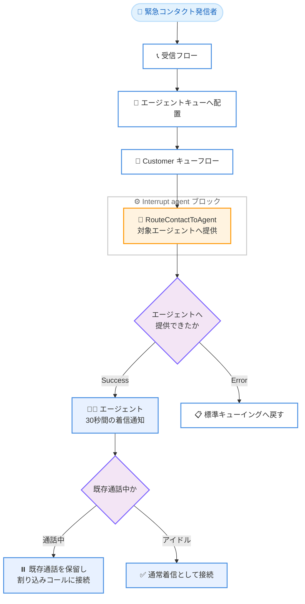

# Amazon Connect - 緊急コンタクトによるエージェント割り込み機能

**リリース日**: 2026 年 6 月 18 日
**サービス**: Amazon Connect
**機能**: 緊急コンタクトによるエージェントへの割り込み (Interrupt an agent with an urgent contact)

📊 [このアップデートのインフォグラフィックを見る](https://takech9203.github.io/aws-news-summary/20260618-amazon-connect-interrupt-agent-with-urgent-contact.html)
<!-- INFOGRAPHIC_BASE_URL は環境変数から取得 -->

## 概要

Amazon Connect Customer は、緊急のコンタクトによってエージェントへ割り込みを行う機能をリリースしました。この機能を利用すると、通常のルーティング設定を上書きし、緊急性や時間的制約のあるコンタクトを特定のエージェントへ確実に届けることができます。

これまでの Amazon Connect では、エージェントが最大同時処理数 (Maximum concurrency) に達している場合や、キューからのコンタクトをブロックするカスタムステータスを設定している場合、緊急のコンタクトであってもそのエージェントへすぐに届けることができませんでした。今回のアップデートにより、新たに用意された「Interrupt agent」フローブロックを Customer キューフローへ配置することで、エージェントが別の通話中であっても、あるいはカスタムステータス中であっても、緊急コンタクトをそのエージェントへ着信させることが可能になりました。

たとえば、時間的制約のあるコールバックを待っているエージェントが、その間に通常のサービスコールを受けているケースでも、緊急コールが到着するとエージェントへ着信させ、エージェントは最初の発信者を保留にして緊急コールに応答するかどうかを判断できます。また、「バックオフィス業務」などカスタムステータス中はカスタマーサービスのコールをブロックしつつ、個人内線への通話だけは着信させる、といった運用も実現できます。

**アップデート前の課題**

- エージェントが最大同時処理数に達している場合、緊急のコンタクトであっても通常のルーティングではすぐに割り当てられなかった
- エージェントがキューからのコンタクトをブロックするカスタムステータス中の場合、特定の緊急コンタクトを届ける手段がなかった
- 個人内線 (DID) への通話など、特定のエージェントへ確実に届けたいコンタクトを通話中のエージェントへ着信させることが難しかった

**アップデート後の改善**

- 新しい「Interrupt agent」フローブロックにより、通常のルーティング設定を上書きして特定のエージェントへコンタクトを提供できるようになった
- エージェントが通話中でも、2 件目のコールを着信させ、エージェントが既存の通話を保留して応答するかどうかを選択できるようになった
- カスタムステータス中のエージェントに対しても、特定のコンタクトを直接割り当てられるようになった

## アーキテクチャ図



緊急コンタクトが Customer キューフロー内の「Interrupt agent」ブロックを通じて対象エージェントへ提供され、エージェントが通話中の場合は既存通話が保留されて割り込みコールに接続される流れを示しています。

## サービスアップデートの詳細

### 主要機能

1. **Interrupt agent フローブロック**
   - 通常のルーティング設定を上書きし、特定のエージェントへコンタクトを提供するためのフローブロック
   - エージェントが最大同時処理数に達している場合や、カスタムステータス (非ルーティング状態) の場合でもコンタクトを提供できる
   - **Customer キューフロー**でのみ使用可能。他のフロータイプから呼び出されたフローモジュール内で使用すると Error ブランチが選択される
   - Flow 言語では `RouteContactToAgent` アクションとして表現される

2. **対象エージェントの指定方法**
   - **手動指定**: ブロックのプロパティパネルでインスタンスレベルのユーザーリストからエージェントを選択
   - **動的指定**: コンタクト属性としてエージェントの識別子 (User ARN、User ID、Username) を渡す

3. **デュアルコール (2 件同時通話) のエージェント体験**
   - 通話中のエージェントへ割り込みコールが提供されると、標準コール (20 秒) より長い **30 秒間**の着信通知が表示される
   - 着信音は標準とは異なる控えめな「キャッチホン」スタイルの音で、エージェントにのみ聞こえ、発信者には聞こえない
   - 割り込みコールは、エージェントが通話中の場合、自動応答設定に関わらず**自動応答されない**
   - エージェントが割り込みコンタクトを受け入れると、元のコンタクトは自動的に保留される。両方の通話がエージェントに割り当てられるが、アクティブな通話は常に 1 件のみで、もう一方を再開するには対象を選択して **Resume** を選ぶ

4. **対応チャネルとブランチ**
   - 音声 (Voice)、チャット (Chat)、タスク (Task)、E メール (Email) に対応
   - **Success** ブランチはコンタクトがエージェントへ正常に提供された時点で選択される (エージェントが受諾・拒否するかどうかは問わない)
   - **Error** ブランチはエージェントがオフライン、最大同時処理数 +1 に達している、デスクフォン/モバイル転送中、既存コンタクトが Connecting/Incoming 状態、in-app/web 通話、システムエラーなどの場合に選択される

## 技術仕様

### 機能の主要パラメータ

| 項目 | 詳細 |
|------|------|
| フローブロック名 | Interrupt agent |
| Flow 言語アクション | `RouteContactToAgent` |
| 使用可能フロータイプ | Customer キューフローのみ |
| 対応チャネル | Voice、Chat、Task、Email |
| 割り込みコールの呼び出し時間 | 30 秒 (固定、設定変更不可) |
| 着信通知の表示時間 | 30 秒 (標準コールは 20 秒) |
| 最大同時通話数 | 通常の最大同時処理数 +1 (音声は最大 2 件まで) |

### 自動応答 (Auto-accept) の挙動

| エージェントの状態 | 自動応答 |
|------|------|
| Available ステータス、最大同時処理数未満 | あり |
| Available ステータス、最大同時処理数に到達 | なし |
| カスタムステータス | なし |

### 設定のヒント

- 個人内線 (DID) ルーティングを既に実装している場合、エージェントキューを実行する Customer キューフローの**先頭ブロック**として Interrupt agent ブロックを追加する
- 割り込みコールは 30 秒間呼び出すため、ボイスメール転送のタイムアウトは**最低 30 秒以上**待つように設定する。短すぎるとエージェントが応答する前にボイスメールへ転送される可能性がある
- チャットで使用する場合は、先頭ブロックにせず、直前に 3 秒間待機する **Wait** ブロックを配置してコンタクトが完全にエンキューされてから提供する
- Available ステータスのときのみ提供したい場合は、事前に **Check staffing** ブロックでエージェントキューのスタッフ状況を確認し、スタッフがいる場合のみ Interrupt agent ブロックへ分岐させる

## 設定方法

### 前提条件

1. Amazon Connect Customer インスタンスが利用可能であること
2. エージェントが Connect Customer のソフトフォン (Agent Workspace、スタンドアロン CCP、または StreamsJS/ConnectSDK を用いたカスタム CCP) を使用していること
3. ブラウザは Google Chrome または Microsoft Edge Chromium を使用していること (Mozilla Firefox は非対応)

### 手順

#### ステップ1: Customer キューフローを開く

Amazon Connect の管理コンソールで、対象のエージェントキューを実行する Customer キューフローを開きます。Interrupt agent ブロックは Customer キューフローでのみ動作するため、フロータイプが正しいことを確認します。

#### ステップ2: Interrupt agent ブロックを配置する

音声の場合はキューフローの先頭に Interrupt agent ブロックを配置します。チャットの場合は先頭に Wait ブロック (3 秒) を置き、その後ろに Interrupt agent ブロックを配置します。対象エージェントは、プロパティパネルでの手動選択、またはコンタクト属性 (User ARN / User ID / Username) による動的指定のいずれかで指定します。

#### ステップ3: ブランチとボイスメール転送を構成する

Success / Error の各ブランチを構成します。割り込みが成功するとエージェントへ提供され、失敗時は標準キューイングへ戻すなどの後続処理を設定します。ボイスメール転送を行う場合は、タイムアウトを最低 30 秒以上に設定し、割り込みコールの呼び出し時間 (30 秒) と整合させます。

## メリット

### ビジネス面

- **緊急対応の確実化**: 時間的制約のある重要なコンタクトを、エージェントの状態に関わらず確実に届けられる
- **顧客体験の向上**: 個人内線への通話やコールバックなど、特定エージェントへ届けたいコンタクトの取りこぼしを削減できる
- **柔軟な運用**: カスタムステータス中でも特定のコンタクトのみ着信させるなど、業務状況に応じた細かなルーティングを実現できる

### 技術面

- **既存フローへの統合が容易**: 既存の Customer キューフローへブロックを追加するだけで導入できる
- **動的指定への対応**: コンタクト属性によるエージェントの動的指定により、柔軟なルーティングロジックを構築できる
- **マルチチャネル対応**: 音声・チャット・タスク・E メールの全チャネルで利用できる

## デメリット・制約事項

### 制限事項

- **ソフトフォン必須**: Connect Customer のソフトフォンを使用するエージェントのみ対応。デスクフォンやモバイル端末への転送中は非対応 (Error ブランチが選択される)
- **最大同時処理数 +1 まで**: この機能で提供できるのは通常の最大同時処理数を 1 件超えるところまで。音声は最大 2 件まで。既に 2 件処理中の場合は Error ブランチが選択される
- **Connecting/プレビューダイヤラー状態**: 既存コンタクトが Connecting 状態、またはプレビューダイヤラーモードの場合は 2 件目を提供できない
- **In-app/web/ビデオ通話**: in-app/web 通話、ビデオ、画面共有のコンタクトは割り込みコンタクトに設定できない。エージェントが in-app/web 通話を処理中の場合は標準音声コールでも提供できない
- **ブラウザ制限**: Google Chrome と Microsoft Edge Chromium のみ対応。Mozilla Firefox は非対応
- **エージェントファーストコールバック**: エージェントファーストコールバックを処理中のエージェントへ、別のエージェントファーストコールバックは提供できない (標準受信音声コールは提供可能)

### 考慮すべき点

- 割り込みコールの呼び出し時間 (30 秒) は設定変更できないため、ボイスメール転送のタイムアウトを整合させる必要がある
- カスタム CCP を使用している場合、最新の StreamsJS を使用しているか確認し、必要に応じて RTC JS のアップグレードを検討する。`agent.getState()` はデュアルコールシナリオでは非対応のため、`agent.getAvailabilityState()` や `contact.getState()` への移行が推奨される
- レガシーの 3 者間会議機能を使用している場合、2 件目のコールを受けると 1 件目の会議を完了するまで再開できない (マルチパーティコール機能では切り替え可能)

## ユースケース

### ユースケース1: 個人内線 (DID) への割り込み着信

**シナリオ**: 特定のエージェントの個人内線へかかってきた重要な電話を、そのエージェントが別の顧客対応中であっても確実に届けたい。

**実装例**:
```
Customer キューフローの先頭に Interrupt agent ブロックを配置し、
対象エージェントを手動または動的 (User ID) に指定。
ボイスメール転送のタイムアウトは 30 秒以上に設定。
```

**効果**: 通話中のエージェントへ 30 秒間の着信通知が表示され、エージェントは既存通話を保留して個人内線のコールに応答できる。

### ユースケース2: コールバック待機中の緊急コール対応

**シナリオ**: 時間的制約のあるコールバックを待っているエージェントが、その間に通常のサービスコールを受けている。緊急コールが到着した際にエージェントへ確実に届けたい。

**実装例**:
```
緊急コール用のキューフローに Interrupt agent ブロックを配置。
Check staffing ブロックでスタッフ状況を確認後、
対象エージェントへ割り込みを実行。
```

**効果**: エージェントが別の通話中でも緊急コールを着信させ、最初の発信者を保留にして応答するかどうかを判断できる。

### ユースケース3: カスタムステータス中の限定着信

**シナリオ**: 「バックオフィス業務」ステータス中はカスタマーサービスのコールをブロックしたいが、個人内線への通話だけは着信させたい。

**実装例**:
```
個人内線用のキューフローにのみ Interrupt agent ブロックを配置。
通常のカスタマーサービスキューフローには配置しない。
```

**効果**: カスタムステータス中でも特定のコンタクトのみ着信させ、業務状況に応じた柔軟なルーティングを実現できる。

## 料金

公式発表および管理者ガイドでは、本機能に関する追加料金の記載はありません。Amazon Connect の従量課金体系に基づき、通話やコンタクト処理に対する通常の料金が適用されます。詳細は Amazon Connect の料金ページを参照してください。

## 利用可能リージョン

Amazon Connect Customer が提供されているすべての AWS リージョンで利用可能です。

## 関連サービス・機能

- **Amazon Connect Agent Workspace**: 割り込みコールの着信通知やデュアルコールの操作 (保留・再開) を行うエージェント向け統合ワークスペース
- **Amazon Connect Customer Profiles**: 割り込みコール受け入れ時にコンタクトに応じたコンテキストを表示するコンテキストアプリ
- **Amazon Connect Streams JS / RTC JS**: カスタム CCP でデュアルコール機能を利用するためのクライアントライブラリ
- **Check staffing / Wait ブロック**: Interrupt agent ブロックと組み合わせて使用するフローブロック

## 参考リンク

- 📊 [インフォグラフィック](https://takech9203.github.io/aws-news-summary/20260618-amazon-connect-interrupt-agent-with-urgent-contact.html)
- [公式発表 (What's New)](https://aws.amazon.com/about-aws/whats-new/2026/06/amazon-connect-interrupt-agent-with-urgent-contact/)
- [ドキュメント (Interrupt agent ブロック)](https://docs.aws.amazon.com/connect/latest/adminguide/interrupt-agent.html)
- [Amazon Connect サービスページ](https://aws.amazon.com/connect/)
- [Amazon Connect 料金ページ](https://aws.amazon.com/connect/pricing/)

## まとめ

今回のアップデートにより、Amazon Connect Customer は緊急性の高いコンタクトを通常のルーティング設定を上書きして特定のエージェントへ確実に届けられるようになりました。コンタクトセンターの運用では、個人内線への着信や時間的制約のあるコールバックなど、取りこぼしが許されないコンタクトが存在します。Interrupt agent ブロックを Customer キューフローへ組み込み、ソフトフォン環境やボイスメールのタイムアウト設定などの前提条件を確認したうえで、緊急対応シナリオへの適用を検討してください。
