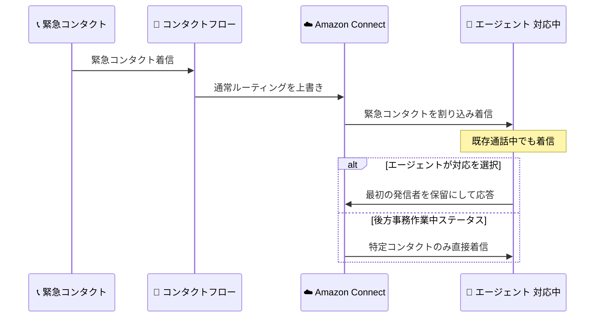

# Amazon Connect - 緊急コンタクトによるエージェント割り込み機能

**リリース日**: 2026 年 6 月 18 日
**サービス**: Amazon Connect
**機能**: 緊急コンタクトによるエージェントへの割り込み (Interrupt an agent with an urgent contact)

📊 [このアップデートのインフォグラフィックを見る](https://takech9203.github.io/aws-news-summary/20260618-amazon-connect-interrupt-agent-with-urgent-contact.html)
<!-- INFOGRAPHIC_BASE_URL は環境変数から取得 -->

## 概要

Amazon Connect は、緊急または時間的制約のあるコンタクトを、エージェントの通常のルーティング設定を上書きしてエージェントに届ける機能を発表しました。これにより、コンタクトセンター管理者は、特定の状況下でエージェントの現在の状態や受付可否にかかわらず、優先度の高いコンタクトを確実にエージェントへ到達させることができます。

この機能は 2 つの主要なシナリオに対応します。1 つは、エージェントがすでに別の通話に対応中であっても、緊急のコールバックを着信させ、エージェントが「最初の発信者を保留にして 2 件目を取るかどうか」を自ら判断できるようにするものです。もう 1 つは、通常はキューからのコンタクトをブロックするカスタムステータス (例: 後方事務作業中) にいるエージェントに対して、特定のコンタクトを直接届けるものです。

本機能は、Amazon Connect が提供されているすべての AWS リージョンで利用可能であり、追加料金なしで使用できます。コンタクトセンターの運用において、緊急対応やエスカレーション、VIP 顧客対応などのワークフローを強化します。

**アップデート前の課題**

- エージェントが通話中の場合、緊急のコールバックであってもエージェントへ着信させる手段がなく、対応が遅延していた
- エージェントがカスタムステータス (例: 後方事務作業中) に入ると、優先度の高い特定のコンタクトであってもキューからのコンタクトが一律にブロックされていた
- 通常のルーティング設定では、コンタクトの緊急度に応じてエージェントへの到達を柔軟に制御することが難しかった

**アップデート後の改善**

- 通話中のエージェントに対しても緊急コールバックを着信させ、エージェント自身が対応を判断できるようになった
- カスタムステータスでキューからのコンタクトをブロックしているエージェントにも、特定のコンタクトを直接届けられるようになった
- 通常のルーティング設定を上書きして、緊急コンタクトを確実にエージェントへ到達させる制御が可能になった

## アーキテクチャ図

緊急コンタクトが通常のルーティング設定を上書きし、対応中またはカスタムステータスのエージェントへ割り込み着信する流れを示しています。

## サービスアップデートの詳細

### 主要機能

1. **通話中エージェントへの緊急割り込み**
   - エージェントがすでに別の通話に対応中であっても、緊急コールバックを着信させる
   - エージェントは、最初の発信者を保留にして緊急コンタクトに対応するかどうかを自ら判断できる
   - 時間的制約のある対応の遅延を防ぐ

2. **カスタムステータス中のエージェントへの直接ルーティング**
   - 通常はキューからのコンタクトをブロックするカスタムステータス (例: 後方事務作業中) のエージェントに、特定のコンタクトを直接届ける
   - 顧客対応の通話からエージェントを外しつつ、個人内線などへの着信は通す運用が可能

3. **通常ルーティング設定の上書き**
   - 緊急または時間的制約のある状況のために、エージェントの通常のルーティング設定を上書きしてコンタクトを届ける
   - 管理者がルーティング動作を構成できる

## 技術仕様

### 機能概要

| 項目 | 詳細 |
|------|------|
| 対象サービス | Amazon Connect |
| 機能種別 | コンタクトルーティングの制御 |
| 主な用途 | 緊急対応、エスカレーション、VIP 顧客対応 |
| 動作 | 通常のルーティング設定を上書きしてエージェントへ着信 |
| 料金 | 追加料金なし |

## 設定方法

### 前提条件

1. Amazon Connect インスタンスが作成済みであること
2. コンタクトフローを編集できる管理者権限を保有していること
3. 対象となるエージェントとキューが構成済みであること

### 手順

#### ステップ1: コンタクトフローの設計

緊急コンタクトを識別するロジックをコンタクトフロー内に構成します。緊急度を示す属性や条件に基づいて、通常ルーティングを上書きするフローに分岐させます。

#### ステップ2: エージェントへの割り込みルーティング設定

緊急コンタクトを特定のエージェントへ直接ルーティングするよう設定します。通話中やカスタムステータスのエージェントに対しても着信させる構成を行います。

#### ステップ3: 動作確認

テスト用の緊急コンタクトを発生させ、対応中のエージェントやカスタムステータス中のエージェントへ正しく割り込み着信するかを確認します。詳細な設定方法は管理者ガイドを参照してください。

## メリット

### ビジネス面

- **対応遅延の削減**: 緊急コンタクトを確実にエージェントへ届けることで、時間的制約のある対応の遅延を防ぐ
- **顧客満足度の向上**: VIP 顧客や緊急案件に対して迅速な対応が可能になる
- **柔軟な運用**: 後方事務作業などのステータスを保ちつつ、優先コンタクトのみ受け付ける運用が可能

### 技術面

- **追加コスト不要**: 既存の Amazon Connect 料金に含まれ、追加料金なしで利用できる
- **既存フローへの統合**: 既存のコンタクトフロー内でルーティング制御を構成できる
- **グローバル対応**: Amazon Connect が提供される全リージョンで利用可能

## デメリット・制約事項

### 制限事項

- 通常のルーティング設定を上書きするため、運用ルールを明確に定義しないと意図しない割り込みが発生する可能性がある
- エージェントが対応中の場合、最終的な応答可否はエージェントの判断に委ねられる

### 考慮すべき点

- 緊急コンタクトの定義や条件をコンタクトフロー内で適切に設計する必要がある
- 割り込みの頻度が高すぎるとエージェントの業務効率や負荷に影響する可能性があるため、運用ポリシーの整備が重要

## ユースケース

### ユースケース1: 緊急コールバックの優先着信

**シナリオ**: 顧客から緊急のコールバック要求があり、対応すべきエージェントが別の通話に対応中の状況。

**効果**: 通話中のエージェントへ緊急コールバックを着信させ、エージェントが最初の発信者を保留にして緊急対応するかを判断できるため、重要な対応の遅延を防げる。

### ユースケース2: 後方事務作業中の特定コンタクト受付

**シナリオ**: エージェントが後方事務作業のためカスタムステータスに入り、通常のキューコンタクトをブロックしているが、担当案件に関する特定のコンタクトは受け付けたい状況。

**効果**: 顧客対応の通話からは外れつつ、個人内線などの特定コンタクトのみを直接着信させることで、業務の集中とフォローアップ対応を両立できる。

### ユースケース3: VIP 顧客のエスカレーション対応

**シナリオ**: 重要顧客からの問い合わせを、担当エージェントの状態にかかわらず優先的に届けたい状況。

**効果**: 通常ルーティングを上書きして担当エージェントへ確実に届けることで、VIP 顧客への迅速かつ確実な対応を実現する。

## 料金

本機能は追加料金なしで利用できます。Amazon Connect の通常の従量課金 (通話やメッセージの利用量に応じた料金) の範囲内で使用可能です。詳細は Amazon Connect の料金ページを参照してください。

## 利用可能リージョン

Amazon Connect が提供されているすべての AWS リージョンで利用可能です。

## 関連サービス・機能

- **Amazon Connect コンタクトフロー**: 緊急コンタクトの識別とルーティング制御を構成する基盤
- **Amazon Connect エージェントステータス**: カスタムステータスと連携した割り込み制御に関連
- **Amazon Connect ルーティングプロファイル**: エージェントへのコンタクト割り当てを管理する仕組みと関連

## 参考リンク

- 📊 [インフォグラフィック](https://takech9203.github.io/aws-news-summary/20260618-amazon-connect-interrupt-agent-with-urgent-contact.html)
- [公式発表 (What's New)](https://aws.amazon.com/about-aws/whats-new/2026/06/amazon-connect-interrupt-agent-with-urgent-contact/)
- [Amazon Connect 管理者ガイド](https://docs.aws.amazon.com/connect/latest/adminguide/)
- [Amazon Connect 料金ページ](https://aws.amazon.com/connect/pricing/)

## まとめ

このアップデートにより、Amazon Connect は緊急または時間的制約のあるコンタクトを、エージェントの状態やルーティング設定を上書きして確実に届けられるようになりました。緊急対応や VIP 顧客対応のワークフローを持つコンタクトセンターでは、追加料金なしで導入できるため、コンタクトフローへの割り込みルーティング設定を検討し、運用ポリシーとあわせて整備することを推奨します。
