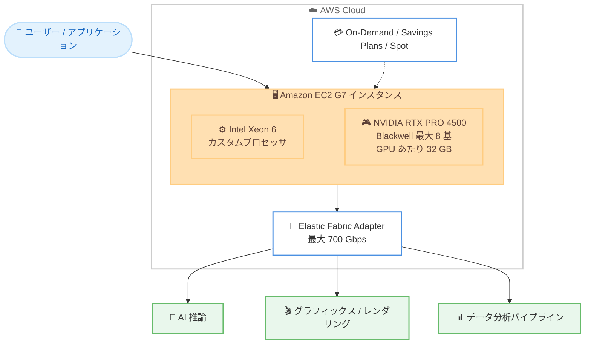

# Amazon EC2 - G7 インスタンス

**リリース日**: 2026 年 6 月 18 日
**サービス**: Amazon EC2
**機能**: Amazon EC2 G7 インスタンス (一般提供開始)

📊 [このアップデートのインフォグラフィックを見る](https://takech9203.github.io/aws-news-summary/20260618-amazon-ec2-g7-generally-available.html)
<!-- INFOGRAPHIC_BASE_URL は環境変数から取得 -->

## 概要

AWS は、NVIDIA RTX PRO 4500 Blackwell Server Edition GPU を搭載した Amazon EC2 G7 インスタンスの一般提供を開始しました。G7 インスタンスは、AI 推論、グラフィックス処理、データ分析といった GPU アクセラレーションを必要とするワークロード向けに設計された最新世代のインスタンスです。

G7 インスタンスは、最大 8 基の NVIDIA RTX PRO 4500 Blackwell Server Edition GPU (GPU あたり 32 GB のメモリ) と、カスタム Intel Xeon 6 プロセッサを組み合わせています。前世代の G6 インスタンスと比較して、最大 4.6 倍の AI 推論性能と最大 2.1 倍のグラフィックス性能を提供します。ネットワークには最大 700 Gbps の Elastic Fabric Adapter (EFA) 帯域幅を備えており、分散ワークロードや大規模なデータ処理パイプラインにも対応します。

対象ユーザーは、生成 AI モデルの推論を本番運用する開発者、リアルタイムレンダリングやゲームストリーミングを提供するメディア企業、大規模なデータ分析パイプラインを運用するデータエンジニアなど、コスト効率の高い GPU リソースを求める幅広い層です。

**アップデート前の課題**

G7 登場以前は、以下のような課題がありました。

- 前世代の G6 インスタンスでは、最新の生成 AI 推論ワークロードに対して GPU の計算性能が不足する場合があった
- 高いグラフィックス性能を求める場合、より高価な上位インスタンスを選択する必要があった
- 分散推論や大規模データ処理において、ネットワーク帯域幅がボトルネックになる場合があった

**アップデート後の改善**

今回のアップデートにより、以下が可能になりました。

- G6 と比較して最大 4.6 倍の AI 推論性能により、より大規模なモデルや高スループットの推論をコスト効率良く実行できるようになった
- 最大 2.1 倍のグラフィックス性能により、リアルタイムかつ映画品質のレンダリングやゲームストリーミングを実現できるようになった
- 最大 700 Gbps の EFA 帯域幅により、分散ワークロードや大規模データ処理パイプラインのネットワークボトルネックが緩和された

## アーキテクチャ図



G7 インスタンスは Intel Xeon 6 プロセッサと最大 8 基の NVIDIA Blackwell GPU を組み合わせ、高帯域幅の EFA を通じて AI 推論、グラフィックス、データ分析の各ワークロードを処理します。

## サービスアップデートの詳細

### 主要機能

1. **NVIDIA RTX PRO 4500 Blackwell Server Edition GPU の搭載**
   - 最新の NVIDIA Blackwell アーキテクチャ世代の GPU を採用
   - 1 インスタンスあたり最大 8 基の GPU を搭載可能
   - GPU あたり 32 GB のメモリを提供

2. **前世代と比較した性能向上**
   - 前世代の G6 インスタンスと比較して最大 4.6 倍の AI 推論性能
   - 最大 2.1 倍のグラフィックス性能
   - 言語翻訳、動画・画像分析、音声認識、レコメンダーシステムなどの推論ワークロードに最適

3. **高帯域幅ネットワーク**
   - 最大 700 Gbps の Elastic Fabric Adapter (EFA) 帯域幅
   - 分散ワークロードや大規模データ処理パイプラインに対応
   - カスタム Intel Xeon 6 プロセッサとの組み合わせ

## 技術仕様

### G7 インスタンスのハードウェア構成

| 項目 | 詳細 |
|------|------|
| GPU | NVIDIA RTX PRO 4500 Blackwell Server Edition |
| GPU 数 | 最大 8 基 |
| GPU メモリ | GPU あたり 32 GB |
| プロセッサ | カスタム Intel Xeon 6 |
| ネットワーク帯域幅 | 最大 700 Gbps (EFA) |
| AI 推論性能 | G6 比 最大 4.6 倍 |
| グラフィックス性能 | G6 比 最大 2.1 倍 |

### API 変更履歴

今回の G7 インスタンス GA に直接対応する EC2 API メソッドの新規追加・変更は確認されていません。新しいインスタンスタイプは既存の EC2 API (`RunInstances`、`DescribeInstanceTypes` など) を通じて利用できます。

## 設定方法

### 前提条件

1. AWS アカウントと、EC2 インスタンスを起動する IAM 権限を保有していること
2. 対象リージョン (米国東部 (オハイオ) または米国西部 (オレゴン)) を利用できること
3. 必要に応じて GPU インスタンスの vCPU クォータ (サービスクォータ) が確保されていること

### 手順

#### ステップ1: 利用可能なインスタンスタイプの確認

```bash
aws ec2 describe-instance-types \
  --filters "Name=instance-type,Values=g7.*" \
  --region us-east-2 \
  --query "InstanceTypes[].InstanceType"
```

このコマンドは、米国東部 (オハイオ) リージョンで利用可能な G7 ファミリーのインスタンスタイプ一覧を取得します。

#### ステップ2: G7 インスタンスの起動

```bash
aws ec2 run-instances \
  --image-id ami-xxxxxxxxxxxxxxxxx \
  --instance-type g7.xlarge \
  --key-name my-key-pair \
  --region us-east-2
```

このコマンドは、GPU ワークロード用の AMI を指定して G7 インスタンスを起動します。GPU ドライバがプリインストールされた AMI (例: AWS Deep Learning AMI) の利用を推奨します。

#### ステップ3: GPU の動作確認

```bash
nvidia-smi
```

インスタンスに SSH 接続後、このコマンドで NVIDIA GPU が正しく認識されているか、ドライバのバージョンや GPU メモリ使用状況を確認します。

## メリット

### ビジネス面

- **コスト効率の向上**: G6 比で最大 4.6 倍の推論性能により、同等のスループットをより少ないインスタンス数で実現でき、運用コストの最適化につながる
- **柔軟な購入オプション**: オンデマンド、Savings Plans、スポットインスタンスから選択でき、ワークロードの特性に応じてコストを最適化できる
- **新規ワークロードへの対応**: 生成 AI 推論やリアルタイムレンダリングなど、需要が拡大する分野に対応できる

### 技術面

- **最新 GPU アーキテクチャ**: NVIDIA Blackwell 世代の GPU により、最新の AI / グラフィックスワークロードに対応
- **高帯域幅ネットワーク**: 最大 700 Gbps の EFA により、分散推論や大規模データ処理のスケーラビリティが向上
- **大容量 GPU メモリ**: GPU あたり 32 GB、最大 8 基構成で大規模モデルの推論にも対応

## デメリット・制約事項

### 制限事項

- 一般提供開始時点で利用可能なリージョンは米国東部 (オハイオ) と米国西部 (オレゴン) に限定される
- GPU インスタンスはサービスクォータの上限により、起動前にクォータの引き上げ申請が必要な場合がある
- GPU を活用するには、適切な NVIDIA ドライバや CUDA 環境のセットアップが必要

### 考慮すべき点

- 東京リージョンを含む他リージョンでの提供時期は今回の発表時点では明示されていないため、最新情報の確認が必要
- スポットインスタンスを利用する場合は中断の可能性を考慮した設計が必要

## ユースケース

### ユースケース1: 生成 AI モデルの推論基盤

**シナリオ**: 言語翻訳や画像分析を行う SaaS 事業者が、推論リクエストの増加に対しコスト効率良くスケールしたい。

**実装例**:
```
g7 インスタンスに推論サーバー (例: Triton Inference Server) をデプロイし、
Auto Scaling グループと組み合わせてリクエスト量に応じて自動スケール
```

**効果**: G6 比で最大 4.6 倍の推論性能により、同じスループットを少ないインスタンス数で処理でき、推論コストを削減できます。

### ユースケース2: リアルタイムレンダリングとゲームストリーミング

**シナリオ**: クラウドゲーミングや 3D レンダリングサービスを提供する企業が、低遅延かつ高品質な映像配信を実現したい。

**実装例**:
```
g7 インスタンス上で GPU レンダリングエンジンを実行し、
映像をエンコードしてエンドユーザーへストリーミング配信
```

**効果**: 最大 2.1 倍のグラフィックス性能により、映画品質のリアルタイムレンダリングやスムーズなゲームストリーミングを提供できます。

### ユースケース3: 大規模データ分析パイプライン

**シナリオ**: データエンジニアリングチームが、GPU を活用した大規模なデータ処理パイプラインを高速化したい。

**実装例**:
```
複数の g7 インスタンスを EFA で接続し、GPU アクセラレーション対応の
データ処理フレームワーク (例: RAPIDS) で分散処理を実行
```

**効果**: 最大 700 Gbps の EFA 帯域幅により、ノード間通信のボトルネックを抑え、大規模データ処理のスループットを向上できます。

## 料金

G7 インスタンスは、オンデマンドインスタンス、Savings Plans、スポットインスタンスの各購入オプションで利用できます。料金はインスタンスサイズおよびリージョンによって異なります。具体的な時間単価は Amazon EC2 の料金ページで確認してください。

### 料金例

| 使用量 | 月額料金（概算） |
|--------|------------------|
| オンデマンド | EC2 料金ページを参照 |
| Savings Plans 利用時 | オンデマンド比で割引適用 |
| スポットインスタンス利用時 | 大幅な割引 (中断の可能性あり) |

## 利用可能リージョン

一般提供開始時点で、以下のリージョンで利用可能です。

- 米国東部 (オハイオ)
- 米国西部 (オレゴン)

## 関連サービス・機能

- **Amazon EC2 G6 インスタンス**: G7 の前世代にあたる GPU インスタンス。G7 は G6 比で最大 4.6 倍の AI 推論性能を提供
- **Elastic Fabric Adapter (EFA)**: 高帯域・低遅延のネットワークインターフェイス。G7 では最大 700 Gbps をサポート
- **AWS Deep Learning AMI**: GPU ドライバや主要な機械学習フレームワークがプリインストールされた AMI。G7 でのセットアップを簡素化
- **AWS Savings Plans**: G7 インスタンスのコストを継続利用で最適化する購入オプション

## 参考リンク

- 📊 [インフォグラフィック](https://takech9203.github.io/aws-news-summary/20260618-amazon-ec2-g7-generally-available.html)
- [公式発表 (What's New)](https://aws.amazon.com/about-aws/whats-new/2026/06/amazon-ec2-g7-generally-available/)
- [AWS Blog](https://aws.amazon.com/blogs/aws/announcing-amazon-ec2-g7-instances-accelerated-by-nvidia-rtx-pro-4500-blackwell-server-edition-gpus/)
- [Amazon EC2 料金](https://aws.amazon.com/ec2/pricing/)

## まとめ

Amazon EC2 G7 インスタンスは、NVIDIA RTX PRO 4500 Blackwell GPU を搭載し、G6 比で最大 4.6 倍の AI 推論性能と最大 2.1 倍のグラフィックス性能を提供する最新世代の GPU インスタンスです。AI 推論、リアルタイムレンダリング、大規模データ分析を運用するチームは、まず米国東部 (オハイオ) または米国西部 (オレゴン) リージョンで G7 インスタンスを検証し、既存ワークロードのコスト効率と性能改善を評価することを推奨します。
