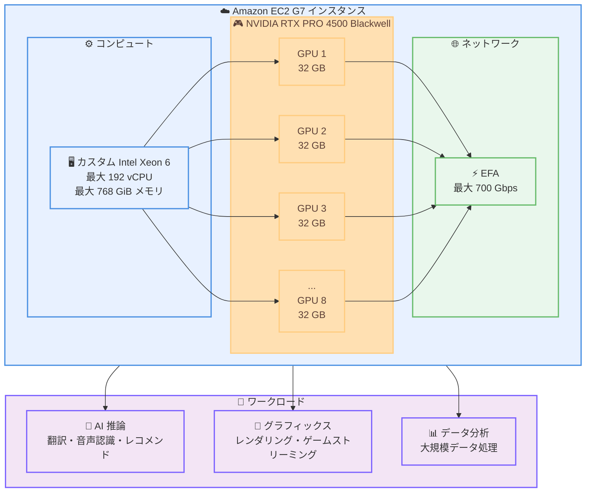

# Amazon EC2 G7 インスタンス - 一般提供開始

**リリース日**: 2026年6月18日
**サービス**: Amazon EC2
**機能**: G7 インスタンスの一般提供 (GA)

📊 [このアップデートのインフォグラフィックを見る](https://takech9203.github.io/aws-news-summary/20260618-amazon-ec2-g7-generally-available.html)

## 概要

AWS は、NVIDIA RTX PRO 4500 Blackwell Server Edition GPU を搭載した Amazon Elastic Compute Cloud (Amazon EC2) G7 インスタンスの一般提供を発表しました。G7 インスタンスは、前世代の G6 と比較して最大 4.6 倍の AI 推論パフォーマンスと最大 2.1 倍のグラフィックスパフォーマンスを提供します。

G7 インスタンスは、言語翻訳、動画と画像の分析、音声認識、レコメンデーションシステムなどの AI 推論ワークロードに最適です。また、リアルタイムの映画品質レンダリングやゲームストリーミングなどのグラフィックスワークロード、大規模なデータ処理パイプラインといったデータ分析ワークロードにも適しています。

G7 インスタンスは、最大 8 基の NVIDIA RTX PRO 4500 Blackwell Server Edition GPU (GPU あたり 32 GB のメモリ) とカスタム Intel Xeon 6 プロセッサを搭載しています。最大 192 個の仮想 CPU (vCPU)、最大 768 GiB のシステムメモリ、最大 700 Gbps の Elastic Fabric Adapter (EFA) ネットワーク帯域幅をサポートしています。

**アップデート前の課題**

- 前世代の G6 インスタンスでは、最新の生成 AI 推論ワークロードに対して GPU パフォーマンスが不足する場面があった
- グラフィックスワークロードにおいて、リアルタイムの映画品質レンダリングを実現するには性能に制約があった
- 大規模なマルチ GPU 推論やデータ処理パイプラインで、ノード内・ノード間の通信帯域幅が課題となっていた
- 推論コストの最適化のために、より高いコストパフォーマンスを持つ GPU インスタンスが求められていた

**アップデート後の改善**

- G6 と比較して最大 4.6 倍の AI 推論パフォーマンスを実現し、より高速なモデル実行が可能になった
- G6 と比較して最大 2.1 倍のグラフィックスパフォーマンスにより、リアルタイムレンダリングやゲームストリーミングが向上した
- 最大 700 Gbps の EFA 帯域幅 (G6 比で最大 7 倍) により、マルチノードワークロードの通信が高速化された
- GPU あたり 32 GB のメモリと最新の Blackwell アーキテクチャにより、効率的な AI 推論とグラフィックス処理を両立できるようになった

## アーキテクチャ図



この図は、G7 インスタンスの主要なアーキテクチャコンポーネントと、サポートされるワークロードを示しています。最大 8 基の NVIDIA RTX PRO 4500 Blackwell GPU とカスタム Intel Xeon 6 プロセッサが、最大 700 Gbps の EFA ネットワークを介して高速通信をサポートしています。

## サービスアップデートの詳細

### 主要機能

1. **NVIDIA RTX PRO 4500 Blackwell Server Edition GPU**
   - 最新の NVIDIA Blackwell アーキテクチャを採用
   - GPU あたり 32 GB のメモリを搭載
   - 第 5 世代 Tensor Core と第 4 世代 RT Core を搭載
   - 最大 8 基の GPU を搭載可能
   - G6 と比較して最大 4.6 倍の AI 推論パフォーマンス、最大 2.1 倍のグラフィックスパフォーマンス

2. **カスタム Intel Xeon 6 プロセッサ**
   - 最大 192 個の仮想 CPU (vCPU) をサポート
   - 全コアで持続する 3.9 GHz のターボ周波数
   - 同時マルチスレッディング (SMT) は無効化されており、安定した性能を提供

3. **高速ネットワークとストレージ**
   - Elastic Fabric Adapter (EFA) で最大 700 Gbps のネットワーク帯域幅 (G6 比で最大 7 倍)
   - 最大 7.6 TB のローカル NVMe SSD ストレージ
   - 最大 80 Gbps の EBS 帯域幅

4. **多様な購入オプション**
   - オンデマンドインスタンス
   - Savings Plans
   - スポットインスタンス

## 技術仕様

### インスタンスサイズ

| インスタンスサイズ | GPU | GPU メモリ (GB) | vCPU | システムメモリ (GiB) | インスタンスストレージ (GB) | ネットワーク帯域幅 (Gbps) | EBS 帯域幅 (Gbps) |
|------|------|------|------|------|------|------|------|
| g7.2xlarge | 1 | 32 | 8 | 32 | 1 x 600 | 最大 60 | 最大 8 |
| g7.4xlarge | 1 | 32 | 16 | 64 | 1 x 600 | 最大 100 | 8 |
| g7.8xlarge | 1 | 32 | 32 | 128 | 1 x 950 | 最大 100 | 16 |
| g7.12xlarge | 2 | 64 | 48 | 192 | 1 x 1900 | 175 | 20 |
| g7.24xlarge | 4 | 128 | 96 | 384 | 1 x 3800 | 350 | 40 |
| g7.48xlarge | 8 | 256 | 192 | 768 | 2 x 3800 | 700 | 80 |
| g7.metal (近日提供) | 8 | 256 | 192 | 768 | 2 x 3800 | 700 | 80 |

### パフォーマンス比較

| 項目 | G7 | G6 |
|------|------|------|
| AI 推論パフォーマンス | 基準 | G7 が最大 4.6 倍 |
| グラフィックスパフォーマンス | 基準 | G7 が最大 2.1 倍 |
| EFA ネットワーク帯域幅 | 最大 700 Gbps | G7 が最大 7 倍 |
| GPU アーキテクチャ | NVIDIA Blackwell | 前世代 |

### API変更履歴

今回のアップデートは新しいインスタンスタイプの追加であり、Amazon EC2 の既存 API (`RunInstances`、`DescribeInstanceTypes` など) を通じて利用できます。専用の API 変更は確認されていません。

## 設定方法

### 前提条件

1. AWS アカウントが作成されている
2. 適切な IAM 権限 (EC2 インスタンスの起動権限) が付与されている
3. G7 インスタンスが利用可能なリージョン (US East (Ohio)、US West (Oregon)) を使用

### 手順

#### ステップ1: AWS マネジメントコンソールからインスタンスを起動

1. AWS Management Console にログイン
2. EC2 ダッシュボードに移動
3. 「インスタンスを起動」をクリック
4. インスタンスタイプで「g7」を検索して選択
5. AMI (Amazon Machine Image) を選択 (Deep Learning AMI 推奨)
6. ネットワーク設定、セキュリティグループを構成
7. 「インスタンスを起動」をクリック

#### ステップ2: AWS CLI からインスタンスを起動

```bash
aws ec2 run-instances \
  --image-id ami-xxxxxxxxx \
  --instance-type g7.2xlarge \
  --key-name your-key-pair \
  --security-group-ids sg-xxxxxxxxx \
  --subnet-id subnet-xxxxxxxxx \
  --region us-east-2
```

このコマンドは、指定した AMI、キーペア、セキュリティグループを使用して、US East (Ohio) リージョンで G7 インスタンスを起動します。

#### ステップ3: GPU の確認

```bash
# インスタンスにログイン後、GPU の状態を確認
nvidia-smi
```

NVIDIA System Management Interface (nvidia-smi) を使用して、GPU が正しく認識されているか確認します。

## メリット

### ビジネス面

- **高速な AI 推論**: G6 と比較して最大 4.6 倍の AI 推論パフォーマンスにより、エンドユーザーへの応答時間が短縮され、顧客体験が向上
- **コスト効率**: より高速な推論により、同じワークロードをより少ないインスタンスで処理でき、推論コストを削減
- **幅広いワークロードへの対応**: AI 推論、グラフィックス、データ分析を 1 つのインスタンスファミリーでカバーでき、運用が簡素化される

### 技術面

- **最新の Blackwell アーキテクチャ**: 第 5 世代 Tensor Core と第 4 世代 RT Core により、AI とグラフィックスの両方で高い性能を発揮
- **高速ネットワーク**: 最大 700 Gbps の EFA により、マルチノード分散推論やデータ処理パイプラインのスループットが向上
- **大容量ローカルストレージ**: 最大 7.6 TB のローカル NVMe SSD により、データの一時保存やキャッシュを高速に処理
- **安定した CPU 性能**: SMT 無効化と 3.9 GHz の持続ターボ周波数により、予測可能なパフォーマンスを提供

## デメリット・制約事項

### 制限事項

- 現在、US East (Ohio) と US West (Oregon) の 2 つのリージョンでのみ利用可能
- GPU メモリは 32 GB/GPU に固定されており、増減はできない
- g7.metal (ベアメタル) サイズは「近日提供」であり、現時点では利用できない

### 考慮すべき点

- 高性能な GPU インスタンスのため、オンデマンド料金は相応に高額になる
- スポットインスタンスを使用する場合、中断のリスクがある
- Savings Plans を利用することでコストを削減できるが、長期的なコミットメントが必要
- GPU あたり 32 GB のメモリのため、超大規模モデルには、より大容量メモリの GPU を搭載した G7e などの検討が必要

## ユースケース

### ユースケース1: AI 推論 (音声認識・翻訳)

**シナリオ**: コールセンターのリアルタイム文字起こしと多言語翻訳を、低レイテンシかつ大量に処理したい。

**実装例**:
```python
import torch
from transformers import pipeline

# 音声認識モデルをロード (GPU 上で実行)
asr = pipeline(
    "automatic-speech-recognition",
    model="openai/whisper-large-v3",
    device=0,
    torch_dtype=torch.float16,
)

# 音声ファイルを文字起こし
result = asr("call_audio.wav")
print(result["text"])
```

**効果**: G6 と比較して最大 4.6 倍高速に推論でき、多数の同時通話をリアルタイムで処理できる。

### ユースケース2: リアルタイムグラフィックスレンダリングとゲームストリーミング

**シナリオ**: クラウドゲームプラットフォームで、映画品質のグラフィックスをリアルタイムでレンダリングし、低レイテンシで配信したい。

**実装例**:
```bash
# NVIDIA ドライバと GPU 状態を確認後、レンダリングエンジンを起動
nvidia-smi

# 例: GPU アクセラレーションを有効化したレンダリングサーバーを起動
./render-server --gpu 0 --resolution 4k --rt-cores enabled
```

**効果**: 第 4 世代 RT Core により、リアルタイムのレイトレーシングと映画品質レンダリングを実現し、没入感の高いゲーム体験を提供できる。

### ユースケース3: 大規模データ処理パイプライン

**シナリオ**: 大量の画像・動画データを GPU で並列処理し、特徴抽出やバッチ推論を高速に実行したい。

**実装例**:
```python
import torch
from torch.utils.data import DataLoader

# 複数 GPU を使用したバッチ推論
model = load_model().cuda()
if torch.cuda.device_count() > 1:
    model = torch.nn.DataParallel(model)

loader = DataLoader(dataset, batch_size=256, num_workers=8)
for batch in loader:
    with torch.no_grad():
        outputs = model(batch.cuda())
    save_results(outputs)
```

**効果**: 最大 8 基の GPU と最大 700 Gbps の EFA を活用し、大規模データ処理パイプラインを高速に実行できる。

## 料金

G7 インスタンスの料金は、インスタンスサイズ、購入オプション、リージョンによって異なります。

### 購入オプション

| 購入オプション | 特徴 | コスト削減 |
|--------------|------|-----------|
| オンデマンドインスタンス | 柔軟性が高く、長期コミットメント不要 | なし (定価) |
| スポットインスタンス | 未使用の EC2 容量を利用、中断のリスクあり | 最大 90% 削減 |
| Savings Plans | 1 年または 3 年のコミットメント | 最大 72% 削減 |

料金の詳細は [Amazon EC2 料金ページ](https://aws.amazon.com/ec2/pricing/) を参照してください。

## 利用可能リージョン

G7 インスタンスは、以下のリージョンで利用可能です。

- **US East (Ohio)**: us-east-2
- **US West (Oregon)**: us-west-2

今後、他のリージョンへの展開が予定されています。

## 関連サービス・機能

- **AWS Deep Learning AMI**: GPU インスタンス向けの事前設定された機械学習フレームワークを含む AMI
- **Amazon SageMaker**: G7 インスタンスを使用してモデルのデプロイと推論を簡素化
- **Elastic Fabric Adapter (EFA)**: 高性能なネットワークインターフェース
- **Amazon EC2 G7e インスタンス**: より大容量の GPU メモリ (96 GB/GPU) を必要とする大規模 AI ワークロード向けの上位ファミリー

## 参考リンク

- 📊 [インフォグラフィック](https://takech9203.github.io/aws-news-summary/20260618-amazon-ec2-g7-generally-available.html)
- [公式発表 (What's New)](https://aws.amazon.com/about-aws/whats-new/2026/06/amazon-ec2-g7-generally-available/)
- [G7 インスタンス詳細ページ](https://aws.amazon.com/ec2/instance-types/g7/)
- [Amazon EC2 料金ページ](https://aws.amazon.com/ec2/pricing/)
- [AWS Management Console](https://console.aws.amazon.com/)

## まとめ

Amazon EC2 G7 インスタンスは、NVIDIA RTX PRO 4500 Blackwell Server Edition GPU とカスタム Intel Xeon 6 プロセッサを搭載し、G6 と比較して最大 4.6 倍の AI 推論パフォーマンスと最大 2.1 倍のグラフィックスパフォーマンスを提供します。AI 推論、グラフィックスレンダリング、大規模データ処理など幅広いワークロードに適しています。現在、US East (Ohio) と US West (Oregon) で利用可能で、オンデマンド、スポット、Savings Plans の購入オプションから選択できます。コストパフォーマンスの高い GPU インスタンスを求めるお客様は、G7 インスタンスの導入を検討することをお勧めします。
