# Amazon ECS - 高速サービスオートスケーリング

**リリース日**: 2026年6月18日
**サービス**: Amazon Elastic Container Service (Amazon ECS)
**機能**: 高解像度メトリクスによる高速サービスオートスケーリング

📊 [このアップデートのインフォグラフィックを見る](https://takech9203.github.io/aws-news-summary/20260618-amazon-ecs-faster-autoscaling.html)
<!-- INFOGRAPHIC_BASE_URL は環境変数から取得 -->

## 概要

Amazon ECS は、サービスオートスケーリングが負荷の変化に対してより迅速に反応できるようになったことを発表しました。今回のアップデートにより、高解像度 (20 秒) のメトリクスとメトリクス発行の最適化がサポートされ、トラフィックの急増に対してスケールアウトの判断と新しいタスクのプロビジョニングが大幅に高速化されます。

AWS の社内ベンチマークによると、スケールアウトのトリガー時間は従来の 363 秒から 86 秒へと 76% 短縮 (4.2 倍高速) され、新しいタスクのエンドツーエンドのプロビジョニング時間は 386 秒から 109 秒へと 72% 短縮 (3.5 倍高速) されました。これにより、急激な負荷変動に対して迅速にキャパシティを追加できるようになります。

スケーリングの反応速度が向上することで、お客様はベースラインのキャパシティを削減し、コンピューティングコストを抑えながらも信頼性を維持できます。この機能は、CPU 使用率およびメモリ使用率に基づくターゲット追跡スケーリングポリシーで 20 秒のメトリクス解像度をサポートします。本番ワークロードでスパイク状のトラフィックを処理するすべての ECS ユーザーが対象です。

**アップデート前の課題**

このアップデート以前は、ECS サービスオートスケーリングのメトリクス解像度に制約がありました。

- 以前はメトリクス解像度がデフォルトの 60 秒であり、負荷の急増を検知してスケールアウトを開始するまでに時間がかかっていた
- 以前はスケールアウトのトリガーまでに 6 分以上 (363 秒) を要し、トラフィックスパイクへの対応が遅れる場合があった
- 以前はスケーリングの遅延を見越して、余分なベースラインキャパシティを確保する必要があり、コストの増加につながっていた

**アップデート後の改善**

今回のアップデートにより、より高速なスケーリングが可能になりました。

- 今回のアップデートにより、20 秒の高解像度メトリクスを利用してスケールアウトの判断を従来比 4.2 倍高速化できるようになった
- 今回のアップデートにより、新しいタスクのプロビジョニングがエンドツーエンドで 3.5 倍高速化された
- 今回のアップデートにより、過剰なベースラインキャパシティを確保する必要がなくなり、コンピューティングコストの削減が可能になった

## アーキテクチャ図

```mermaid
flowchart LR
    subgraph Service["📦 ECS サービス"]
        direction LR
        T1["⚙️ タスク 1"]
        T2["⚙️ タスク 2"]
        T1 ~~~ T2
    end

    subgraph Scaling["📈 Application Auto Scaling"]
        direction LR
        Alarm["🔔 CloudWatch アラーム"]
        Policy["🎯 ターゲット追跡<br/>ポリシー"]
        Alarm ~~~ Policy
    end

    CW[("📊 CloudWatch<br/>高解像度メトリクス 20 秒")]
    User(["👤 トラフィック急増"]) --> Service
    Service -->|"CPU/メモリ使用率を 20 秒間隔で発行"| CW
    CW --> Alarm
    Alarm --> Policy
    Policy -->|"高速スケールアウト 86 秒"| Service

    classDef cloud fill:none,stroke:#CCCCCC,stroke-width:2px,color:#666666
    classDef compute fill:#FFE0B2,stroke:#FFCC80,stroke-width:2px,color:#5D4037
    classDef database fill:#E8EAF6,stroke:#C5CAE9,stroke-width:2px,color:#283593
    classDef decision fill:#F3E5F5,stroke:#7B61FF,stroke-width:2px,color:#333333
    classDef user fill:#E3F2FD,stroke:#BBDEFB,stroke-width:2px,color:#1565C0

    class Service,Scaling cloud
    class T1,T2 compute
    class CW database
    class Alarm,Policy decision
    class User user
```



ECS サービスが CPU/メモリ使用率を 20 秒間隔で CloudWatch に発行し、ターゲット追跡ポリシーが負荷の変化を素早く検知して高速にスケールアウトする流れを示しています。

## サービスアップデートの詳細

### 主要機能

1. **高解像度 (20 秒) メトリクスのサポート**
   - 従来のデフォルトである 60 秒解像度に加えて、20 秒の高解像度メトリクスを選択できるようになった
   - CPU 使用率およびメモリ使用率のメトリクスが対象となる
   - 60 秒解像度も引き続き利用可能で、ワークロードに応じて選択できる

2. **メトリクス発行の最適化**
   - メトリクス発行のパイプラインが最適化され、負荷の変化からスケーリングアクションまでの遅延が短縮された
   - スケールアウトのトリガー時間が 363 秒から 86 秒へと 76% 短縮された
   - 新しいタスクのエンドツーエンドのプロビジョニング時間が 386 秒から 109 秒へと 72% 短縮された

3. **ターゲット追跡スケーリングポリシーとの統合**
   - CPU 使用率およびメモリ使用率に基づくターゲット追跡ポリシーで 20 秒解像度をサポートする
   - 高解像度に対応した事前定義メトリクスを指定することで、迅速なスケーリングが実現する
   - 予測スケーリングやスケジュールスケーリングなど既存のポリシータイプと併用できる

## 技術仕様

### メトリクス解像度とスケーリング速度

| 項目 | 詳細 |
|------|------|
| メトリクス解像度 | 60 秒 (従来のデフォルト) または 20 秒 (新規対応) |
| 対象メトリクス | CPU 使用率、メモリ使用率 |
| スケーリングポリシータイプ | ターゲット追跡スケーリング |
| スケールアウトトリガー時間 | 363 秒 → 86 秒 (76% 短縮、4.2 倍高速) |
| エンドツーエンドプロビジョニング時間 | 386 秒 → 109 秒 (72% 短縮、3.5 倍高速) |
| 対応コンピューティング | AWS Fargate、Amazon ECS Managed Instances、Amazon EC2 |

### API変更履歴

今回のアップデートに直接対応する awsapichanges.com 上の ECS API 変更は確認されませんでした。設定は Application Auto Scaling および CloudWatch の高解像度メトリクスを通じて行います。

### 設定の考え方

高解像度メトリクスを有効にしたうえで、対応する事前定義メトリクスを指定したターゲット追跡ポリシーを構成します。

```json
{
  "TargetValue": 60.0,
  "PredefinedMetricSpecification": {
    "PredefinedMetricType": "ECSServiceAverageCPUUtilization"
  },
  "ScaleInCooldown": 300,
  "ScaleOutCooldown": 60
}
```

## 設定方法

### 前提条件

1. Amazon ECS のサービスが稼働していること (Fargate、ECS Managed Instances、または EC2 起動タイプ)
2. Application Auto Scaling を利用するための適切な IAM 権限を持っていること
3. サービスで CPU/メモリ使用率に基づくスケーリングを行う構成であること

### 手順

#### ステップ1: 高解像度メトリクスを有効にする

```bash
# サービス作成または更新時に 20 秒の高解像度メトリクスを有効化する
aws ecs update-service \
  --cluster my-cluster \
  --service my-service \
  --enable-high-resolution-metrics
```

サービスの作成時または更新時に、20 秒解像度のメトリクスを有効にします。これにより CPU/メモリ使用率が 20 秒間隔で CloudWatch に発行されます。

#### ステップ2: スケーラブルターゲットを登録する

```bash
# ECS サービスをスケーラブルターゲットとして登録する
aws application-autoscaling register-scalable-target \
  --service-namespace ecs \
  --resource-id service/my-cluster/my-service \
  --scalable-dimension ecs:service:DesiredCount \
  --min-capacity 2 \
  --max-capacity 20
```

ECS サービスのタスク数 (DesiredCount) をスケーリング対象として登録します。最小・最大キャパシティを指定します。

#### ステップ3: ターゲット追跡ポリシーを設定する

```bash
# 高解像度メトリクスに対応したターゲット追跡ポリシーを適用する
aws application-autoscaling put-scaling-policy \
  --service-namespace ecs \
  --resource-id service/my-cluster/my-service \
  --scalable-dimension ecs:service:DesiredCount \
  --policy-name cpu-target-tracking \
  --policy-type TargetTrackingScaling \
  --target-tracking-scaling-policy-configuration file://config.json
```

CPU 使用率を対象としたターゲット追跡ポリシーを適用します。`config.json` には目標値とクールダウン設定を記述します。AWS マネジメントコンソール、CLI、CloudFormation、各種 SDK から設定できます。

## メリット

### ビジネス面

- **コスト削減**: スケーリングの反応が速くなることで、過剰なベースラインキャパシティを削減し、コンピューティングコストを抑えられる
- **ユーザー体験の向上**: トラフィックの急増に素早く対応できるため、レスポンス遅延やエラーを抑制し、サービス品質を維持できる
- **信頼性の維持**: 低コスト化と同時に、急激な負荷変動への対応力を保てる

### 技術面

- **スケールアウトの高速化**: スケールアウトのトリガー時間が最大 4.2 倍、プロビジョニングが最大 3.5 倍高速化される
- **柔軟な解像度選択**: 20 秒と 60 秒の解像度を選択でき、ワークロードの特性に合わせて最適化できる
- **既存ポリシーとの併用**: 予測スケーリングやスケジュールスケーリングと組み合わせて運用できる

## デメリット・制約事項

### 制限事項

- 20 秒の高解像度メトリクスは、CloudWatch の標準料金が適用され追加コストが発生する
- 高解像度メトリクスがサポートされるのは CPU 使用率およびメモリ使用率に基づくターゲット追跡ポリシーである
- ベンチマーク値は AWS の社内測定結果であり、実際の改善幅はワークロードや構成によって異なる

### 考慮すべき点

- 高解像度メトリクスの利用による CloudWatch 料金の増加と、スケーリング高速化によるコスト削減効果のバランスを評価する
- スケールアウトの高速化に伴い、頻繁なスケーリングを避けるためクールダウン設定を適切に調整する
- 急速なスケールインによる可用性低下を防ぐため、最小キャパシティを慎重に設定する

## ユースケース

### ユースケース1: スパイク型トラフィックを処理する API

**シナリオ**: イベントやキャンペーンによって短時間で急激にリクエストが増加する API サービスで、従来は 60 秒解像度のため対応が遅れていた。

**実装例**:
```
CPU 使用率のターゲット追跡ポリシー (目標値 60%) + 20 秒高解像度メトリクス
```

**効果**: 負荷の急増を素早く検知し、約 86 秒でスケールアウトを開始することで、エラー率やレイテンシの悪化を防ぐ。

### ユースケース2: コスト最適化を狙うバックエンドワークロード

**シナリオ**: 通常は低負荷だが断続的に負荷が高まるバックエンドサービスで、これまではスケーリング遅延を見越して余分なタスクを常時稼働させていた。

**実装例**:
```
最小キャパシティを引き下げ + 20 秒高解像度メトリクスによる高速スケールアウト
```

**効果**: ベースラインのタスク数を削減してコンピューティングコストを下げつつ、負荷増加時には迅速にキャパシティを追加できる。

### ユースケース3: メモリ集約型の処理ワークロード

**シナリオ**: バッチ処理やデータ変換などメモリ使用率が急上昇するワークロードで、メモリ枯渇によるタスク停止を避けたい。

**実装例**:
```
メモリ使用率のターゲット追跡ポリシー + 20 秒高解像度メトリクス
```

**効果**: メモリ使用率の上昇を 20 秒間隔で検知し、迅速にタスクを増やすことでメモリ起因の障害リスクを低減する。

## 料金

高解像度 (20 秒) メトリクスの利用には、CloudWatch の標準料金が適用されます。高解像度メトリクスは標準解像度メトリクスとは異なる料金体系となるため、利用前に Amazon CloudWatch の料金ページで詳細を確認することを推奨します。ECS サービスオートスケーリング機能自体には追加料金は発生しません。

### 料金例

| 使用量 | 月額料金（概算） |
|--------|------------------|
| 高解像度メトリクスの利用 | CloudWatch 標準料金が適用 (Amazon CloudWatch 料金ページを参照) |
| サービスオートスケーリング機能 | 追加料金なし |

## 利用可能リージョン

すべての AWS 商用リージョンおよび AWS GovCloud (US) リージョンで利用可能です。

## 関連サービス・機能

- **AWS Application Auto Scaling**: ECS サービスのタスク数をスケーリングする基盤サービスで、ターゲット追跡ポリシーを管理する
- **Amazon CloudWatch**: 高解像度 (20 秒) メトリクスを収集・発行し、スケーリングアラームのトリガーとなる
- **AWS Fargate**: サーバーレスでタスクを実行するコンピューティングオプションで、本機能の対象となる
- **Amazon ECS Managed Instances**: ECS が管理するインスタンス上でタスクを実行するオプションで、本機能の対象となる

## 参考リンク

- 📊 [インフォグラフィック](https://takech9203.github.io/aws-news-summary/20260618-amazon-ecs-faster-autoscaling.html)
- [公式発表 (What's New)](https://aws.amazon.com/about-aws/whats-new/2026/06/amazon-ecs-faster-autoscaling/)
- [ドキュメント (Amazon ECS サービスオートスケーリング)](https://docs.aws.amazon.com/AmazonECS/latest/developerguide/service-auto-scaling.html)
- [料金ページ (Amazon CloudWatch)](https://aws.amazon.com/cloudwatch/pricing/)

## まとめ

このアップデートは、ECS サービスオートスケーリングが 20 秒の高解像度メトリクスをサポートすることで、スケールアウトを最大 4.2 倍高速化する重要な機能強化です。スパイク型のトラフィックを扱う本番ワークロードでは、可用性を高めながらベースラインキャパシティを削減してコストを最適化できます。CloudWatch の追加料金とのバランスを評価したうえで、ターゲット追跡ポリシーへの高解像度メトリクスの適用を検討することを推奨します。
