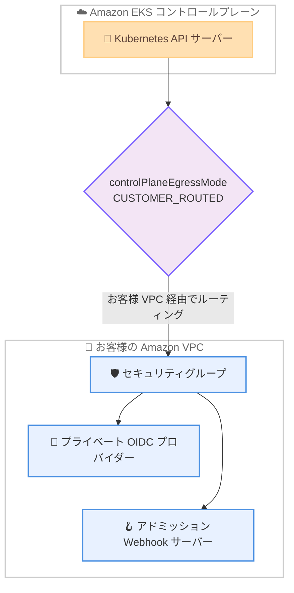

# Amazon EKS - カスタマールーティング型コントロールプレーンエグレス

**リリース日**: 2026年6月18日
**サービス**: Amazon Elastic Kubernetes Service (Amazon EKS)
**機能**: Customer-Routed Control Plane Egress (カスタマールーティング型コントロールプレーンエグレス)

📊 [このアップデートのインフォグラフィックを見る](https://takech9203.github.io/aws-news-summary/20260618-amazon-eks-customer-routed-control-plane-egress.html)
<!-- INFOGRAPHIC_BASE_URL は環境変数から取得 -->

## 概要

Amazon EKS は、Kubernetes API サーバーからのアウトバウンドトラフィックをお客様自身の Amazon VPC 経由でルーティングできる新機能を発表しました。この機能により、コントロールプレーンが外部リソースへ通信する際の経路、セキュリティグループ、エグレスパスをお客様が制御できるようになります。

対象となるトラフィックは、アドミッション Webhook のコールバック、OpenID Connect (OIDC) プロバイダーのルックアップ、および集約 API サーバー (Aggregate API server) へのリクエストです。これらのトラフィックをお客様の VPC 経由に切り替えることで、VPC 内にのみ存在するプライベートな OIDC プロバイダーや Webhook サーバーへ到達できるようになります。

この機能は、データ境界 (data perimeter) 要件、コンプライアンス要件、またはプライベートネットワークインフラを持つ組織を主な対象としています。すべての EKS 利用可能リージョンで、追加費用なしで利用できます。

**アップデート前の課題**

- 以前は、EKS コントロールプレーンからのアウトバウンドトラフィックの経路をお客様が制御できなかった
- 以前は、VPC 内にのみ存在するプライベートな OIDC プロバイダーや Webhook サーバーへコントロールプレーンから到達することが困難だった
- 以前は、コントロールプレーンのエグレストラフィックにお客様独自のセキュリティグループやデータ境界ポリシーを適用できなかった

**アップデート後の改善**

- 今回のアップデートにより、Kubernetes API サーバーのアウトバウンドトラフィックをお客様の VPC 経由でルーティングできるようになった
- 今回のアップデートにより、プライベートな OIDC プロバイダーや Webhook サーバーへコントロールプレーンから到達できるようになった
- 今回のアップデートにより、エグレストラフィックの経路、セキュリティグループ、エグレスパスを制御できるようになった

## アーキテクチャ図



コントロールプレーンのアウトバウンドトラフィックを `CUSTOMER_ROUTED` モードに設定することで、API サーバーからのトラフィックがお客様の VPC を経由し、VPC 内のプライベートリソースへ到達できるようになります。

## サービスアップデートの詳細

### 主要機能

1. **コントロールプレーンエグレスのカスタマールーティング**
   - Kubernetes API サーバーのアウトバウンドトラフィックをお客様の VPC 経由でルーティング
   - トラフィックの経路、セキュリティグループ、エグレスパスをお客様が制御
   - クラスター作成時または既存クラスターの更新時に有効化可能

2. **対象トラフィックの拡大**
   - アドミッション Webhook のコールバック
   - OpenID Connect (OIDC) プロバイダーのルックアップ
   - 集約 API サーバー (Aggregate API server) へのリクエスト

3. **組織全体での適用制御**
   - `eks:controlPlaneEgressMode` IAM 条件キーを利用
   - AWS Organizations のサービスコントロールポリシー (SCP) と組み合わせて、組織全体で適用を強制可能

## 技術仕様

### 設定項目

| 項目 | 詳細 |
|------|------|
| 設定名 | `controlPlaneEgressMode` |
| 設定値 | `CUSTOMER_ROUTED` (カスタマールーティングを有効化) |
| 適用タイミング | クラスター作成時または既存クラスターの更新時 |
| IAM 条件キー | `eks:controlPlaneEgressMode` |
| 制御単位 | AWS Organizations の SCP による組織全体への適用 |

### API変更履歴

今回のアップデートに対応する awsapichanges.com 上の EKS API 変更履歴は、本レポート作成時点では確認できませんでした。`controlPlaneEgressMode` の設定は、EKS クラスターの作成・更新 API を通じて指定します。

### 設定例

```bash
# 新規クラスター作成時にカスタマールーティングを有効化
aws eks create-cluster \
  --name my-cluster \
  --role-arn arn:aws:iam::111122223333:role/eks-cluster-role \
  --resources-vpc-config subnetIds=subnet-aaaa,subnet-bbbb \
  --control-plane-egress-mode CUSTOMER_ROUTED
```

上記は新規クラスター作成時に `controlPlaneEgressMode` を `CUSTOMER_ROUTED` に設定する例です。正確なパラメータ名や指定方法は、Amazon EKS ユーザーガイドおよび最新の AWS CLI / API リファレンスで確認してください。

## 設定方法

### 前提条件

1. Amazon EKS クラスターを利用できる環境であること
2. クラスターのアウトバウンドトラフィックを通すお客様の VPC とサブネットが用意されていること
3. クラスター作成・更新を行う IAM 権限を持っていること

### 手順

#### ステップ1: コントロールプレーンエグレスモードの設定

```bash
aws eks update-cluster-config \
  --name my-cluster \
  --control-plane-egress-mode CUSTOMER_ROUTED
```

既存クラスターのコントロールプレーンエグレスモードを `CUSTOMER_ROUTED` に更新します。これにより、コントロールプレーンのアウトバウンドトラフィックがお客様の VPC 経由でルーティングされるようになります。

#### ステップ2: VPC のルーティングとセキュリティグループの確認

```bash
aws eks describe-cluster --name my-cluster \
  --query 'cluster.resourcesVpcConfig'
```

クラスターに関連付けられた VPC 設定を確認し、プライベートな OIDC プロバイダーや Webhook サーバーへ到達できるルーティングとセキュリティグループが構成されていることを検証します。

#### ステップ3: 組織全体での適用強制 (任意)

組織全体でカスタマールーティングを強制する場合は、`eks:controlPlaneEgressMode` IAM 条件キーを利用した SCP を AWS Organizations に適用します。これにより、組織内のすべてのアカウントで意図しないエグレス設定を防止できます。

## メリット

### ビジネス面

- **コンプライアンス対応**: データ境界要件やコンプライアンス要件を持つ組織が、コントロールプレーンのエグレスを自社ネットワークポリシーに準拠させられる
- **追加費用なし**: 機能の利用に追加料金が発生しないため、コスト増を抑えつつセキュリティ態勢を強化できる
- **ガバナンス強化**: SCP と IAM 条件キーにより、組織全体で一貫したエグレスポリシーを適用できる

### 技術面

- **ネットワーク制御の向上**: コントロールプレーントラフィックの経路、セキュリティグループ、エグレスパスを細かく制御できる
- **プライベートリソースへの到達**: VPC 内にのみ存在する OIDC プロバイダーや Webhook サーバーをコントロールプレーンから利用できる
- **既存クラスターへの適用**: 新規クラスターだけでなく既存クラスターでも有効化できる

## デメリット・制約事項

### 制限事項

- 対象トラフィックはアドミッション Webhook コールバック、OIDC プロバイダールックアップ、集約 API サーバーリクエストに限られる
- カスタマールーティングを有効にすると、お客様側で適切な VPC ルーティングとセキュリティグループの構成が必要になる

### 考慮すべき点

- VPC のルーティングやセキュリティグループの設定が不適切な場合、Webhook や OIDC への通信が失敗し、クラスター動作に影響する可能性がある
- 組織全体で適用する前に、検証環境でエグレス経路が想定どおり機能することを確認することが推奨される

## ユースケース

### ユースケース1: プライベート OIDC プロバイダーの利用

**シナリオ**: 社内ネットワーク内 (VPC 内) にのみ公開されている OIDC プロバイダーを使って、Kubernetes API サーバーの認証連携を行いたい。

**実装例**:
```bash
aws eks update-cluster-config \
  --name corp-cluster \
  --control-plane-egress-mode CUSTOMER_ROUTED
```

**効果**: コントロールプレーンが VPC 経由でプライベート OIDC プロバイダーへ到達でき、外部公開を伴わずに認証連携を実現できる。

### ユースケース2: プライベート Webhook サーバーとの連携

**シナリオ**: VPC 内にのみ配置されたアドミッション Webhook サーバーで、ポリシー検証やリソース変更を行いたい。

**実装例**:
```bash
# Webhook サーバーが配置された VPC 経由でエグレスをルーティング
aws eks update-cluster-config \
  --name secure-cluster \
  --control-plane-egress-mode CUSTOMER_ROUTED
```

**効果**: API サーバーから VPC 内の Webhook サーバーへ到達でき、プライベートネットワーク内でアドミッション制御を完結できる。

### ユースケース3: 組織全体でのデータ境界の強制

**シナリオ**: 規制業種の企業が、すべての EKS クラスターでコントロールプレーンのエグレスを自社 VPC 経由に統一したい。

**実装例**:
```json
{
  "Version": "2012-10-17",
  "Statement": [
    {
      "Effect": "Deny",
      "Action": ["eks:CreateCluster", "eks:UpdateClusterConfig"],
      "Resource": "*",
      "Condition": {
        "StringNotEquals": {
          "eks:controlPlaneEgressMode": "CUSTOMER_ROUTED"
        }
      }
    }
  ]
}
```

**効果**: SCP により、カスタマールーティング以外の設定でのクラスター作成・更新を拒否し、組織全体でデータ境界を強制できる。

## 料金

この機能は追加費用なしで利用できます。Amazon EKS クラスターおよび関連リソース (VPC、データ転送など) の通常料金は引き続き適用されます。

## 利用可能リージョン

Amazon EKS が利用可能なすべての AWS リージョンで利用できます。

## 関連サービス・機能

- **Amazon VPC**: コントロールプレーンのアウトバウンドトラフィックをルーティングする経路として使用
- **AWS Organizations (SCP)**: `eks:controlPlaneEgressMode` 条件キーと組み合わせ、組織全体でエグレスポリシーを強制
- **OpenID Connect (OIDC)**: コントロールプレーンが認証連携のために参照するプロバイダー
- **AWS IAM**: 条件キーによりエグレスモードの設定を制御

## 参考リンク

- 📊 [インフォグラフィック](https://takech9203.github.io/aws-news-summary/20260618-amazon-eks-customer-routed-control-plane-egress.html)
- [公式発表 (What's New)](https://aws.amazon.com/about-aws/whats-new/2026/06/amazon-eks-customer-routed-control-plane-egress/)
- [Amazon EKS ユーザーガイド](https://docs.aws.amazon.com/eks/latest/userguide/)
- [Amazon EKS 料金ページ](https://aws.amazon.com/eks/pricing/)

## まとめ

Amazon EKS のカスタマールーティング型コントロールプレーンエグレスは、コントロールプレーンのアウトバウンドトラフィックをお客様の VPC 経由に切り替え、ネットワーク制御とデータ境界の強制を可能にする重要な機能です。データ境界要件やコンプライアンス要件を持つ組織は、まず検証環境で `controlPlaneEgressMode` を `CUSTOMER_ROUTED` に設定し、プライベート OIDC プロバイダーや Webhook サーバーへの到達性を確認することを推奨します。組織全体への展開には、SCP と IAM 条件キーによる適用強制を検討してください。
