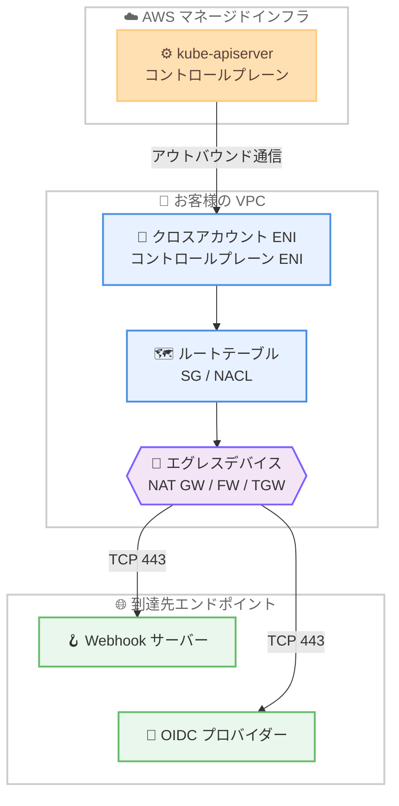

# Amazon EKS - カスタマールーティング型コントロールプレーンエグレス

**リリース日**: 2026年6月18日
**サービス**: Amazon Elastic Kubernetes Service (Amazon EKS)
**機能**: Customer-Routed Control Plane Egress (カスタマールーティング型コントロールプレーンエグレス)

📊 [このアップデートのインフォグラフィックを見る](https://takech9203.github.io/aws-news-summary/20260618-amazon-eks-customer-routed-control-plane-egress.html)
<!-- INFOGRAPHIC_BASE_URL は環境変数から取得 -->

## 概要

Amazon EKS は、Kubernetes API サーバーからのアウトバウンドトラフィックをお客様自身の Amazon VPC 経由でルーティングできる新機能を発表しました。この機能により、コントロールプレーンが外部リソースへ通信する際のルーティング、セキュリティグループ、エグレスパスをお客様が制御できるようになります。

対象となるトラフィックは、アドミッション Webhook のコールバック、OpenID Connect (OIDC) プロバイダーのディスカバリー、および集約 API サーバー (Aggregated API server) へのリクエストです。これらのトラフィックをお客様の VPC 経由に切り替えることで、VPC 内からのみアクセス可能なプライベートな OIDC プロバイダーや Webhook サーバーへコントロールプレーンが到達できるようになります。

この機能は、データ境界 (data perimeter) の要件、コンプライアンス要件、またはプライベートネットワークインフラを持つ組織を主な対象としています。クラスター作成時または既存クラスターの更新時に `controlPlaneEgressMode` を `CUSTOMER_ROUTED` に設定することで有効化でき、Amazon EKS が利用可能なすべての AWS リージョンで追加料金なしで利用できます。

**アップデート前の課題**

- これまでは Amazon EKS がコントロールプレーンから VPC リソースへのエグレスネットワークを管理しており (`AWS_MANAGED` モード)、お客様がそのネットワークパスを制御できなかった
- VPC 内にのみ存在するプライベートな OIDC プロバイダーや Webhook サーバーへ、コントロールプレーンから到達させることが難しかった
- アウトバウンドトラフィックの経路をお客様の NAT ゲートウェイやファイアウォール、検査アプライアンス経由に強制する手段がなく、データ境界やコンプライアンス要件を満たしにくかった

**アップデート後の改善**

- `CUSTOMER_ROUTED` モードを選択することで、コントロールプレーンの ENI から VPC リソースへ向かうトラフィックの経路をお客様自身が管理できるようになった
- NAT ゲートウェイ、NAT インスタンス、Transit Gateway、ファイアウォールアプライアンスなど、任意のエグレスデバイスを経由させられるようになった
- `eks:controlPlaneEgressMode` IAM 条件キーと AWS Organizations のサービスコントロールポリシー (SCP) を組み合わせ、組織全体でエグレスモードを強制できるようになった

## アーキテクチャ図



`CUSTOMER_ROUTED` モードでは、kube-apiserver からのお客様向けトラフィックが VPC 内のクロスアカウント ENI を経由し、お客様が定義したルートテーブルとエグレスデバイスを通って Webhook や OIDC エンドポイントへ到達します。なお、etcd や CloudWatch Logs など EKS が管理する内部トラフィックは引き続き AWS マネージドの経路を通り、この設定の影響を受けません。

## サービスアップデートの詳細

### 主要機能

1. **エグレスルーティングモードの選択**
   - `AWS_MANAGED` (デフォルト): Amazon EKS がコントロールプレーン ENI からのエグレスパスを管理する。NAT ゲートウェイなどのルーティングインフラを別途構成する必要はない
   - `CUSTOMER_ROUTED`: お客様が VPC サブネット内でコントロールプレーンからのエグレスパスを管理する。エグレスデバイスやルートテーブル、NACL、セキュリティグループのルールを自身で構成する

2. **既存 ENI の再利用**
   - `CUSTOMER_ROUTED` モードでは、Amazon EKS がコントロールプレーンとノード間の通信用にすでに作成しているクロスアカウントネットワークインターフェイスを利用する
   - 専用のエグレス用ネットワークインターフェイスは新規に作成されず、既存インターフェイスの「使われ方」が変わる

3. **VPC の DNS 設定による名前解決**
   - `CUSTOMER_ROUTED` モードでは、コントロールプレーンがお客様の VPC の DNS 設定を使用してホスト名を解決する
   - これにより Route 53 プライベートホストゾーンや、Route 53 Resolver エンドポイント経由のオンプレミス DNS のエンドポイントへ到達できる

4. **IAM 条件キーによる組織的なガバナンス**
   - `eks:controlPlaneEgressMode` 条件キーを IAM ポリシーや SCP で使用し、許可するエグレスモードを制御できる
   - 対象アクションは `eks:CreateCluster` と `eks:UpdateClusterConfig`

## 技術仕様

### CUSTOMER_ROUTED モードで VPC 経由となるトラフィック

| トラフィック | 宛先 | ポート | 備考 |
|------|------|------|------|
| アドミッション Webhook | Webhook エンドポイント (お客様定義の URL) | 443 (通常) | Webhook 構成時のみ。外部エンドポイントの場合はエグレスデバイス経由 |
| OIDC ディスカバリー | OIDC issuer URL | 443 | OIDC プロバイダー構成時のみ。外部の場合はエグレスデバイス経由 |
| 集約 API サーバー | お客様の API サーバーエンドポイント | 443 | 構成時のみ。外部の場合はエグレスデバイス経由 |
| Kubelet API | ワーカーノードの IP アドレス | 10250 | クラスター ENI 経由の通信であり、エグレスデバイスは経由しない |

etcd、CloudWatch Logs、EKS 内部サービスとの通信など、EKS が管理するコントロールプレーントラフィックは引き続き AWS マネージドの経路を通り、お客様の VPC 構成の影響を受けません。

### サブネットの要件

| 項目 | 詳細 |
|------|------|
| ルーティング | コントロールプレーンが到達すべきエンドポイントへのルートが必要。VPC 外のエンドポイントには通常デフォルトルート (IPv4: `0.0.0.0/0`、IPv6: `::/0`) をエグレスデバイスへ設定 |
| セキュリティグループ | クロスアカウント ENI でアウトバウンド通信を許可 (例: Webhook と OIDC 向けの 443) |
| ネットワーク ACL | アウトバウンド通信と、戻りトラフィック用のインバウンドエフェメラルポート範囲 (1024-65535) を許可 |
| DHCP オプションセット | ドメインネームサーバーのリストに `AmazonProvidedDNS` を含める必要がある |

### API変更履歴

今回のアップデートに関連する awsapichanges.com の EKS API 変更エントリは、本レポート作成時点では確認できませんでした。実際の API としては、`CreateCluster` および `UpdateClusterConfig` の `resourcesVpcConfig` に `controlPlaneEgressMode` フィールドが追加されています。

### IAM 条件キーによる強制 (SCP 例)

```json
{
  "Version": "2012-10-17",
  "Statement": [
    {
      "Sid": "RequireCustomerRoutedControlPlane",
      "Effect": "Deny",
      "Action": [
        "eks:CreateCluster",
        "eks:UpdateClusterConfig"
      ],
      "Resource": "*",
      "Condition": {
        "StringNotEquals": {
          "eks:controlPlaneEgressMode": "CUSTOMER_ROUTED"
        }
      }
    }
  ]
}
```

このポリシーは、`CUSTOMER_ROUTED` を指定しない限りクラスターの作成と設定更新を拒否し、組織内のすべてのクラスターでカスタマールーティング型エグレスを強制します。

## 設定方法

### 前提条件

1. VPC とサブネットが Amazon EKS の標準ネットワーク要件を満たしていること
2. コントロールプレーンが到達すべきエンドポイント (Webhook サーバー、OIDC プロバイダーなど) へのルートとエグレスデバイス (NAT ゲートウェイ、NAT インスタンス、Transit Gateway、ファイアウォール) が用意されていること
3. セキュリティグループ、NACL、ルートテーブルが必要なアウトバウンド通信と戻りトラフィックを許可していること
4. DHCP オプションセットに `AmazonProvidedDNS` が含まれていること

### 手順

#### ステップ1: カスタマールーティング型エグレスでクラスターを作成する

```bash
aws eks create-cluster \
    --name my-cluster \
    --role-arn arn:aws:iam::111122223333:role/myAmazonEKSClusterRole \
    --resources-vpc-config "subnetIds=subnet-ExampleID1,subnet-ExampleID2,securityGroupIds=sg-ExampleID1,controlPlaneEgressMode=CUSTOMER_ROUTED" \
    --kubernetes-network-config "ipFamily=ipv4" \
    --region region-code
```

`--resources-vpc-config` に `controlPlaneEgressMode=CUSTOMER_ROUTED` を指定して新規クラスターを作成します。IPv6 クラスターの場合は `ipFamily=ipv6` を指定し、IPv4 用の NAT ゲートウェイに加えて IPv6 用の egress-only インターネットゲートウェイを用意します。

#### ステップ2: 既存クラスターのエグレスモードを更新する

```bash
aws eks update-cluster-config \
    --name my-cluster \
    --resources-vpc-config "controlPlaneEgressMode=CUSTOMER_ROUTED" \
    --region region-code
```

既存クラスターを `CUSTOMER_ROUTED` へ切り替えます。更新タイプは `ControlPlaneEgressUpdate` で、通常 10 分以内に完了します。`CUSTOMER_ROUTED` への切り替えは一方向の操作であり、`AWS_MANAGED` に戻すことはできない点に注意してください。

#### ステップ3: 接続性を検証する

```bash
aws eks describe-cluster --name my-cluster \
    --query "cluster.resourcesVpcConfig.controlPlaneEgressMode" \
    --region region-code
```

現在のエグレスモードを確認します。あわせてクラスターが `ACTIVE` 状態であることを確認し、Webhook を発火させるリソースの作成、ノードの登録 (`kubectl get nodes`)、IRSA を使う Pod の IAM ロール引き受けなどを通じて実際の接続性を検証します。

## メリット

### ビジネス面

- **コンプライアンス要件への対応**: データ境界やコンプライアンス要件を持つ組織が、コントロールプレーンのアウトバウンドトラフィックを自社のネットワーク制御下に置けるようになる
- **追加コストなし**: Amazon EKS が利用可能なすべてのリージョンで追加料金なしで利用できる
- **組織的なガバナンス**: SCP と IAM 条件キーにより、組織全体で一貫したエグレスポリシーを強制できる

### 技術面

- **プライベートエンドポイントへの到達**: VPC 内にのみ存在するプライベートな OIDC プロバイダーや Webhook サーバーへコントロールプレーンが到達できる
- **柔軟な経路制御**: NAT ゲートウェイ、ファイアウォール、検査アプライアンス、Transit Gateway 経由の集約エグレスなど、任意の経路を選択できる
- **既存アーキテクチャとの親和性**: Standard モードと Auto Mode のどちらのクラスターでも同じ仕組みで動作する。専用 ENI が追加されないため構成がシンプル

## デメリット・制約事項

### 制限事項

- `CUSTOMER_ROUTED` への切り替えは一方向の操作であり、`AWS_MANAGED` へ戻すことはできない
- ネットワークの設定ミス (エグレスパスの欠落、制限的な NACL、不適切なセキュリティグループ) があると、アドミッション Webhook 呼び出しや OIDC 認証などのコントロールプレーン操作が失敗する可能性がある
- Terraform の AWS Provider における当該フィールドのサポートは将来のリリースで提供予定
- EKS Capabilities (ArgoCD、ACK、KRO など) のコントローラーからのトラフィックは、この機能では VPC 経由にルーティングされない

### 考慮すべき点

- IPv6 クラスターでは IPv4 と IPv6 の両方のエグレスパスを構成する必要がある (IPv4: NAT ゲートウェイ、IPv6: egress-only インターネットゲートウェイなど)
- VPC フローログを有効にすると、VPC を経由する Webhook や OIDC エンドポイントへのエグレストラフィックを観測できる。有効でない場合はこれらのトラフィックはログに記録されない
- 切り替え前に VPC が前提条件を満たしているか必ず確認する

## ユースケース

### ユースケース1: プライベート OIDC プロバイダーの利用

**シナリオ**: 社内専用の OIDC プロバイダーを VPC 内に配置し、外部に公開せずにクラスター認証や IRSA を運用したい。

**実装例**:
```
コントロールプレーンサブネットに、Route 53 プライベートホストゾーンで解決される
プライベート OIDC issuer への到達経路を構成し、CUSTOMER_ROUTED を有効化する
```

**効果**: コントロールプレーンがインターネットを経由せずにプライベート OIDC エンドポイントへ到達でき、認証情報を社内ネットワーク内に閉じられる。

### ユースケース2: 集約エグレスとトラフィック検査

**シナリオ**: セキュリティポリシー上、すべてのアウトバウンドトラフィックをファイアウォールや検査アプライアンスを通す必要がある。

**実装例**:
```
コントロールプレーンサブネットのデフォルトルートを Transit Gateway 経由の
集約エグレス VPC または AWS Network Firewall へ向ける
```

**効果**: Webhook や OIDC 向けのコントロールプレーントラフィックも含めてアウトバウンド通信を一元的に検査・記録でき、データ境界を強化できる。

### ユースケース3: 組織全体でのエグレスモード強制

**シナリオ**: 大企業で、すべての新規・既存 EKS クラスターにカスタマールーティング型エグレスを強制したい。

**実装例**:
```
eks:controlPlaneEgressMode 条件キーを用いた SCP を AWS Organizations に適用し、
CUSTOMER_ROUTED 以外のクラスター作成・更新を拒否する
```

**効果**: 個々のチームの設定ミスを防ぎ、組織全体で一貫したネットワークガバナンスを実現できる。

## 料金

この機能は、Amazon EKS が利用可能なすべての AWS リージョンで追加料金なしで利用できます。ただし、お客様が用意する NAT ゲートウェイ、Transit Gateway、ファイアウォールアプライアンス、データ転送などの関連リソースには、それぞれの通常料金が適用されます。

## 利用可能リージョン

Amazon EKS が利用可能なすべての AWS リージョンで利用できます。

## 関連サービス・機能

- **Amazon VPC**: トラフィックのルーティング、セキュリティグループ、NACL、エグレスデバイスを管理する基盤
- **AWS Organizations / SCP**: `eks:controlPlaneEgressMode` 条件キーと組み合わせ、組織全体でエグレスモードを強制
- **Amazon Route 53 Resolver**: VPC の DNS 設定を通じてプライベートホストゾーンやオンプレミス DNS の名前解決を実現
- **AWS Network Firewall / NAT Gateway / Transit Gateway**: コントロールプレーンのエグレストラフィックを検査・集約するためのエグレスデバイス
- **VPC フローログ**: VPC を経由するコントロールプレーンのエグレストラフィックを観測

## 参考リンク

- 📊 [インフォグラフィック](https://takech9203.github.io/aws-news-summary/20260618-amazon-eks-customer-routed-control-plane-egress.html)
- [公式発表 (What's New)](https://aws.amazon.com/about-aws/whats-new/2026/06/amazon-eks-customer-routed-control-plane-egress/)
- [ドキュメント (Configuring control plane egress routing)](https://docs.aws.amazon.com/eks/latest/userguide/control-plane-egress.html)
- [Amazon EKS 料金ページ](https://aws.amazon.com/eks/pricing/)

## まとめ

カスタマールーティング型コントロールプレーンエグレスは、EKS コントロールプレーンからのアウトバウンドトラフィックの経路をお客様自身が制御できるようにする、データ境界やコンプライアンス要件を持つ組織にとって重要なアップデートです。`CUSTOMER_ROUTED` への切り替えは一方向の操作であり、ネットワーク設定ミスがコントロールプレーン操作の失敗につながるため、有効化前に VPC のルーティング、セキュリティグループ、NACL、DNS 設定が前提条件を満たしているか必ず確認してください。組織全体での適用には `eks:controlPlaneEgressMode` 条件キーを用いた SCP の活用を検討することをお勧めします。
