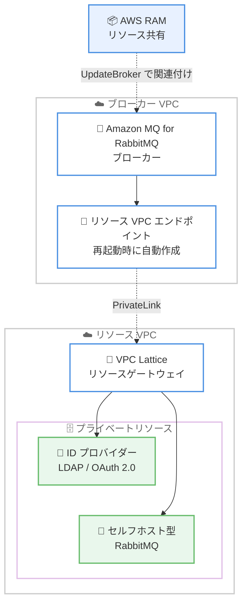

# Amazon MQ for RabbitMQ - プライベートネットワーク接続のサポート

**リリース日**: 2026 年 6 月 18 日
**サービス**: Amazon MQ
**機能**: Amazon MQ for RabbitMQ プライベートネットワーク接続 (Private networking)

📊 [このアップデートのインフォグラフィックを見る](https://takech9203.github.io/aws-news-summary/20260618-amazon-mq-private-network-connectivity.html)
<!-- INFOGRAPHIC_BASE_URL は環境変数から取得 -->

## 概要

Amazon MQ for RabbitMQ が、プライベートネットワーク接続 (Private networking) をサポートしました。この機能により、Amazon MQ for RabbitMQ ブローカーは、VPC 内のプライベートリソースをパブリックに公開することなく、それらのリソースへ接続できるようになりました。

これまで RabbitMQ の Federation、Shovel、または認証で VPC 内のプライベートリソースへ接続する場合、Network Load Balancer や NAT Gateway を組み合わせた回避策を構築する必要がありました。今回のアップデートにより、ブローカーがプライベートな ID プロバイダー (LDAP や OAuth 2.0 など)、他の Amazon MQ for RabbitMQ ブローカー、セルフホスト型 RabbitMQ ブローカーへインターネットを経由せずに接続できるようになり、セキュリティおよびコンプライアンス要件への対応が容易になります。

Amazon MQ は、この接続を Amazon VPC Lattice、AWS Resource Access Manager (AWS RAM)、AWS PrivateLink を使用して確立し、基盤となるインフラストラクチャをユーザーに代わって管理します。利用を開始するには、VPC Lattice リソースゲートウェイを作成し、リソース設定を AWS RAM リソース共有にパッケージ化して、ブローカーに関連付けます。

**アップデート前の課題**

- RabbitMQ の Federation、Shovel、認証で VPC 内のプライベートリソースに接続するには、Network Load Balancer と NAT Gateway を組み合わせた回避策が必要だった
- プライベートな ID プロバイダー (LDAP、OAuth 2.0) との連携時に、リソースを公開せずに接続する標準的な手段がなかった
- 回避策のためにネットワークインフラストラクチャを自前で構築・運用する必要があり、セキュリティおよびコンプライアンス要件への対応が複雑だった

**アップデート後の改善**

- VPC 内のプライベートリソースを公開せずに、ブローカーから直接接続できるようになった
- Network Load Balancer や NAT Gateway による回避策が不要になった
- Amazon VPC Lattice、AWS RAM、AWS PrivateLink を用いた接続を Amazon MQ が自動的に管理するため、運用負荷が軽減された

## アーキテクチャ図



ブローカー VPC のリソース VPC エンドポイントから、AWS PrivateLink を経由してリソース VPC の VPC Lattice リソースゲートウェイに接続し、プライベートリソースへ到達します。AWS RAM リソース共有を `UpdateBroker` でブローカーに関連付けることで、この経路が確立されます。

## サービスアップデートの詳細

### 主要機能

1. **VPC 内プライベートリソースへの接続**
   - ブローカーが VPC 内のプライベートリソースへ、インターネットを経由せずに接続できる
   - 接続先には、プライベートな ID プロバイダー (LDAP、OAuth 2.0)、他の Amazon MQ for RabbitMQ ブローカー、セルフホスト型 RabbitMQ ブローカーが含まれる
   - RabbitMQ Federation、Shovel、認証のユースケースに対応する

2. **マネージドなネットワークインフラストラクチャ**
   - Amazon VPC Lattice、AWS RAM、AWS PrivateLink を組み合わせて接続を確立する
   - 基盤となるインフラストラクチャは Amazon MQ がユーザーに代わって管理する
   - ブローカーの再起動時に、ブローカー VPC 内にリソース VPC エンドポイントが自動的に作成される

3. **リソース共有による設定管理**
   - VPC Lattice リソースゲートウェイがブローカーからプライベートリソースへのトラフィックの入口となる
   - VPC Lattice リソース設定で、到達先 (IP アドレスまたは DNS 名) を定義する
   - AWS RAM リソース共有にリソース設定をパッケージ化し、`UpdateBroker` API でブローカーへ関連付ける

## 技術仕様

### 構成コンポーネント

| 項目 | 詳細 |
|------|------|
| VPC Lattice リソースゲートウェイ | ブローカーからプライベートリソースへのトラフィックの入口。透過的なプロキシとして機能する |
| VPC Lattice リソース設定 | 到達先 (IP アドレスまたは DNS 名) を定義する。任意でカスタムドメイン名を設定可能 |
| AWS RAM リソース共有 | リソース設定をパッケージ化し、ブローカーへ関連付ける。外部プリンシパルの許可が必須 |
| リソース VPC エンドポイント | ブローカー再起動時にブローカー VPC 内へ自動作成され、ネットワーク経路を確立する |

### API変更履歴

| 日付 | サービス | 変更内容 |
|------|----------|----------|
| 2026/06/17 | [AmazonMQ](https://awsapichanges.com/archive/changes/ecddc1-mq.html) | 1 new 1 updated api methods - プライベートネットワークのサポートを追加。新規 `DescribeSharedResources` API で共有リソースの詳細を取得でき、`UpdateBroker` で AWS RAM リソース共有をブローカーに関連付け可能 |

### リソース共有の関連付け (AWS CLI)

```bash
aws mq update-broker \
  --broker-id b-a1b2c3d4-5678-90ab-cdef-EXAMPLE11111 \
  --resource-share-arns arn:aws:ram:us-east-1:123456789012:resource-share/a1b2c3d4-5678-90ab-cdef-EXAMPLE22222
```

`--resource-share-arns` は完全置換 (put) であり、追加 (additive) ではありません。関連付けたいリソース共有 ARN の完全なリストを毎回指定する必要があります。

## 設定方法

### 前提条件

1. RUNNING 状態の Amazon MQ for RabbitMQ ブローカーがあること
2. 少なくとも 1 つのサブネットを持つ VPC があること (リソースゲートウェイをホストする VPC。ブローカーと同じ VPC である必要はない)
3. VPC Lattice リソースゲートウェイがブローカーと少なくとも 1 つのアベイラビリティーゾーンを共有していること (単一インスタンスブローカーのみが対象。クラスターブローカーは全 AZ を使用する)

### 手順

#### ステップ1: VPC Lattice リソースゲートウェイの作成

Amazon VPC コンソールの [VPC Lattice] - [リソースゲートウェイ] から、VPC、サブネット、セキュリティグループを指定してリソースゲートウェイを作成します。少なくとも 1 つのサブネットがブローカーと共有する AZ にあることを確認します。

#### ステップ2: VPC Lattice リソース設定の作成

```text
# 到達先 (IP アドレスまたは DNS 名) を定義するリソース設定を作成
```

ブローカーが到達する必要のあるプライベート接続先を定義します。各リソース設定は、リソースゲートウェイを設定した VPC 内から解決可能な IP アドレスまたは DNS 名を指定します。任意でカスタムドメイン名を追加できますが、DNS 解決に使用できるのは検証済みのドメイン名のみです。利用可能なドメイン名がない場合、Amazon MQ は `DescribeSharedResources` API を通じて DNS 名を提供します。

#### ステップ3: AWS RAM リソース共有の作成

AWS RAM リソース共有を作成し、VPC Lattice リソース設定を追加します。このリソース共有をブローカーへ関連付けます。リソース共有は外部プリンシパルを許可する必要があります (`allowExternalPrincipals=false` の共有は使用できません)。

#### ステップ4: リソース共有とブローカーの関連付け

```bash
aws mq update-broker \
  --broker-id b-a1b2c3d4-5678-90ab-cdef-EXAMPLE11111 \
  --resource-share-arns arn:aws:ram:us-east-1:123456789012:resource-share/a1b2c3d4-5678-90ab-cdef-EXAMPLE22222
```

`UpdateBroker` API でリソース共有をブローカーへ関連付けます。複数のリソース共有を関連付ける場合は、ARN をスペースで区切って指定します。再起動前に複数回呼び出した場合は、最後の呼び出しのみが有効になります。

#### ステップ5: ブローカーの再起動

```bash
aws mq reboot-broker --broker-id b-a1b2c3d4-5678-90ab-cdef-EXAMPLE11111
```

リソース共有の変更を反映するためにブローカーを再起動します。再起動時に Amazon MQ がブローカー VPC 内へリソース VPC エンドポイントを作成し、プライベートリソースへのネットワーク経路を確立します。再起動には通常 10 分から 20 分かかり、単一インスタンスブローカーではダウンタイム、クラスターブローカーでは短時間の切り替え (フェイルオーバー) が発生します。

## メリット

### ビジネス面

- **セキュリティとコンプライアンスの強化**: プライベートリソースを公開せずに接続できるため、セキュリティおよびコンプライアンス要件への対応が容易になる
- **運用負荷の軽減**: Network Load Balancer や NAT Gateway による回避策の構築・運用が不要になる
- **マネージドサービスの活用**: 基盤インフラストラクチャを Amazon MQ が管理するため、自前での管理コストが減る

### 技術面

- **インターネット非経由の接続**: トラフィックがパブリックインターネットを経由しない
- **柔軟な構成**: リソースゲートウェイをホストする VPC はブローカーと別 VPC でもよく、ブローカーがパブリックアクセス可能であっても利用できる
- **マルチ AZ 対応**: 高可用性のために複数の AZ のサブネットを使用できる

## デメリット・制約事項

### 制限事項

- Amazon MQ for RabbitMQ ブローカーのみが対象であり、ActiveMQ ブローカーは非対応
- AWS GovCloud (US) リージョンでは利用できない
- Amazon VPC Lattice が利用可能なリージョンでのみ利用できる
- リソース共有の変更を反映するにはブローカーの再起動が必要であり、ダウンタイムまたはフェイルオーバーが発生する

### 考慮すべき点

- `UpdateBroker` の `resourceShareArns` は完全置換 (put) であるため、関連付けたい ARN の完全なリストを毎回指定する必要がある
- リソース共有は外部プリンシパルを許可する必要があり、組織内に限定された共有は使用できない
- 単一インスタンスブローカーでは、リソースゲートウェイがブローカーと少なくとも 1 つの AZ を共有している必要がある

## ユースケース

### ユースケース1: プライベートな ID プロバイダーによる認証

**シナリオ**: VPC 内に配置した LDAP または OAuth 2.0 の ID プロバイダーを用いて、Amazon MQ for RabbitMQ ブローカーのユーザー認証を行いたい。

**実装例**:
```text
リソース設定: ID プロバイダーのプライベート IP / DNS 名
RabbitMQ 認証バックエンド: LDAP / OAuth 2.0
```

**効果**: ID プロバイダーをインターネットへ公開せずに、ブローカーから認証を実行できる。

### ユースケース2: RabbitMQ Federation / Shovel による連携

**シナリオ**: 他の Amazon MQ for RabbitMQ ブローカーやセルフホスト型 RabbitMQ ブローカーと、Federation または Shovel を用いてメッセージを連携したい。

**実装例**:
```text
リソース設定: 連携先ブローカーのプライベート IP / DNS 名
RabbitMQ プラグイン: federation / shovel
```

**効果**: NAT Gateway や Network Load Balancer の回避策なしに、プライベート経路でブローカー間のメッセージ連携を実現できる。

### ユースケース3: セルフホスト型 RabbitMQ への接続

**シナリオ**: オンプレミスや EC2 上で稼働するセルフホスト型 RabbitMQ ブローカーと、マネージドな Amazon MQ ブローカーを安全に連携したい。

**実装例**:
```text
リソース設定: セルフホスト型 RabbitMQ の到達先
リソースゲートウェイ: 対象リソースに到達可能な VPC
```

**効果**: プライベートネットワーク経由でハイブリッドなメッセージング構成を構築できる。

## 料金

プライベートネットワーク機能は Amazon VPC Lattice、AWS RAM、AWS PrivateLink を利用して構成されます。Amazon MQ 自体の料金に加え、これらの基盤サービスの利用料金が発生する可能性があります。詳細は Amazon MQ の料金ページおよび各サービスの料金ページを参照してください。

## 利用可能リージョン

Amazon VPC Lattice が利用可能なすべての AWS リージョンで利用できます。ただし、AWS GovCloud (US) リージョンでは利用できません。また、Amazon MQ for RabbitMQ ブローカーのみが対象で、ActiveMQ ブローカーは非対応です。

## 関連サービス・機能

- **Amazon VPC Lattice**: プライベートリソースへの接続経路を提供するリソースゲートウェイとリソース設定の基盤
- **AWS Resource Access Manager (AWS RAM)**: リソース設定をパッケージ化し、ブローカーへ共有する仕組み
- **AWS PrivateLink**: ブローカー VPC とリソースゲートウェイ間のプライベート接続を確立する

## 参考リンク

- 📊 [インフォグラフィック](https://takech9203.github.io/aws-news-summary/20260618-amazon-mq-private-network-connectivity.html)
- [公式発表 (What's New)](https://aws.amazon.com/about-aws/whats-new/2026/06/amazon-mq-private-network-connectivity/)
- [Private networking (Amazon MQ Developer Guide)](https://docs.aws.amazon.com/amazon-mq/latest/developer-guide/private-networking.html)
- [Amazon VPC Lattice](https://aws.amazon.com/vpc/lattice/)
- [Amazon MQ 料金ページ](https://aws.amazon.com/amazon-mq/pricing/)

## まとめ

このアップデートにより、Amazon MQ for RabbitMQ ブローカーは Network Load Balancer や NAT Gateway の回避策なしに、VPC 内のプライベートリソースへ安全に接続できるようになりました。LDAP や OAuth 2.0 による認証、Federation や Shovel による連携でプライベート接続が必要なユーザーは、VPC Lattice リソースゲートウェイと AWS RAM リソース共有を用いた構成を検討してください。利用にあたっては、ブローカーの再起動が必要な点と、VPC Lattice が利用可能なリージョンに限定される点を確認することを推奨します。
