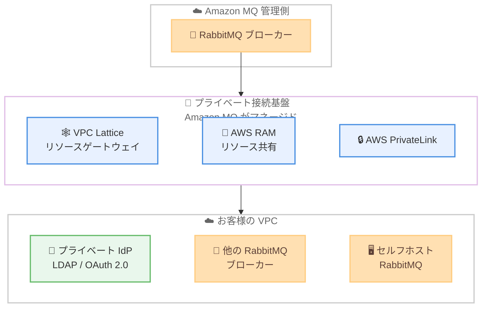

# Amazon MQ for RabbitMQ - プライベートネットワーク接続のサポート

**リリース日**: 2026 年 6 月 18 日
**サービス**: Amazon MQ
**機能**: Amazon MQ for RabbitMQ のプライベートネットワーク接続 (Private networking)

📊 [このアップデートのインフォグラフィックを見る](https://takech9203.github.io/aws-news-summary/20260618-amazon-mq-private-network-connectivity.html)
<!-- INFOGRAPHIC_BASE_URL は環境変数から取得 -->

## 概要

Amazon MQ for RabbitMQ がプライベートネットワーク接続に対応しました。この機能により、RabbitMQ ブローカーはお客様の VPC 内のプライベートリソースに接続できるようになります。これらのリソースをパブリックに公開する必要はありません。

これまで RabbitMQ ブローカーがプライベートな ID プロバイダー (LDAP や OAuth 2.0 など)、他の Amazon MQ for RabbitMQ ブローカー、またはセルフホストの RabbitMQ ブローカーに到達するには、Network Load Balancer (NLB) や NAT Gateway を組み合わせた回避策が必要でした。今回のアップデートにより、こうした回避策なしにセキュリティおよびコンプライアンス要件を満たしながらプライベート接続を実現できます。

Amazon MQ はこの接続を Amazon VPC Lattice、AWS Resource Access Manager (AWS RAM)、AWS PrivateLink を利用して確立し、基盤となるインフラストラクチャをお客様に代わって管理します。RabbitMQ Federation や Shovel によるブローカー間連携、プライベートな認証バックエンドとの統合といったユースケースで、運用負荷を抑えながら安全な接続を構成できます。

**アップデート前の課題**

- 以前は RabbitMQ Federation、Shovel、または認証でプライベートリソースに接続する際に、Network Load Balancer と NAT Gateway を用いた回避策を構築する必要がありました
- 以前はプライベートな ID プロバイダー (LDAP や OAuth 2.0) にブローカーから到達させる標準的な手段がなく、追加のネットワークインフラを自前で運用する必要がありました
- 以前は回避策のために作成したリソースをお客様自身で構築・保守する必要があり、運用負荷とコストが増大していました

**アップデート後の改善**

- 今回のアップデートにより、ブローカーから VPC 内のプライベートリソースへ、リソースを公開せずに接続できるようになりました
- 今回のアップデートにより、NLB や NAT Gateway による回避策が不要になりました
- 今回のアップデートにより、Amazon MQ が VPC Lattice、AWS RAM、PrivateLink を用いた基盤インフラを代理で管理するため、運用負荷が軽減されました

## アーキテクチャ図



RabbitMQ ブローカーは Amazon MQ がマネージドする VPC Lattice、AWS RAM、PrivateLink を経由して、お客様の VPC 内のプライベートリソースへパブリック公開なしに接続します。

## サービスアップデートの詳細

### 主要機能

1. **VPC 内プライベートリソースへの接続**
   - RabbitMQ ブローカーが VPC 内のプライベートリソースへ接続可能になりました
   - 対象リソースをパブリックに公開する必要がありません
   - セキュリティおよびコンプライアンス要件を満たしやすくなります

2. **プライベートな認証バックエンドとの統合**
   - プライベートな ID プロバイダー (LDAP、OAuth 2.0) にブローカーから到達できます
   - 認証情報をパブリックネットワークに露出させずに認証連携を構成できます

3. **ブローカー間およびセルフホスト連携**
   - 他の Amazon MQ for RabbitMQ ブローカーへの接続をサポートします
   - セルフホストの RabbitMQ ブローカーへの接続をサポートします
   - RabbitMQ Federation や Shovel を用いたメッセージ連携をプライベート経路で実現できます

4. **マネージドな接続基盤**
   - Amazon VPC Lattice、AWS RAM、AWS PrivateLink を用いて接続を確立します
   - 基盤となるインフラストラクチャは Amazon MQ がお客様に代わって管理します

## 技術仕様

### 利用される AWS サービス

| 項目 | 詳細 |
|------|------|
| Amazon VPC Lattice | リソースゲートウェイを通じてプライベートリソースへの接続経路を提供 |
| AWS Resource Access Manager (AWS RAM) | リソース構成をリソース共有としてパッケージ化しブローカーと関連付け |
| AWS PrivateLink | プライベートかつ安全な接続を実現 |
| 対象ブローカー | Amazon MQ for RabbitMQ のみ |

### API変更履歴

今回のアップデートに直接関連する公開 API メソッドの変更は、AWS API Changes では確認できませんでした。接続の構成は VPC Lattice のリソースゲートウェイ、AWS RAM のリソース共有、ブローカーへの関連付けを通じて行います。

## 設定方法

### 前提条件

1. Amazon MQ for RabbitMQ ブローカーが作成済みであること
2. 利用するリージョンで Amazon VPC Lattice が利用可能であること
3. 接続先となるプライベートリソース (LDAP、OAuth 2.0、RabbitMQ ブローカーなど) が VPC 内に存在すること

### 手順

#### ステップ1: VPC Lattice リソースゲートウェイの作成

接続先のプライベートリソースが存在する VPC に、VPC Lattice のリソースゲートウェイを作成します。これがプライベートリソースへの接続経路の起点となります。

#### ステップ2: リソース構成を AWS RAM リソース共有にパッケージ化

接続対象のリソース構成 (resource configurations) を AWS RAM のリソース共有 (resource share) としてパッケージ化します。これにより、対象リソースを Amazon MQ ブローカーと共有できる状態にします。

#### ステップ3: ブローカーへの関連付け

作成したリソース共有を Amazon MQ for RabbitMQ ブローカーに関連付けます。関連付けが完了すると、ブローカーはプライベートリソースへパブリック公開なしに接続できるようになります。詳細な操作手順は Amazon MQ デベロッパーガイドの「Private networking」を参照してください。

## メリット

### ビジネス面

- **セキュリティとコンプライアンスの強化**: プライベートリソースを公開せずに接続できるため、セキュリティおよびコンプライアンス要件を満たしやすくなります
- **運用負荷の削減**: NLB や NAT Gateway による回避策の構築・保守が不要になり、運用工数を削減できます
- **マネージド化による安心感**: 接続基盤を Amazon MQ が管理するため、お客様はメッセージング基盤の活用に集中できます

### 技術面

- **回避策の排除**: NLB と NAT Gateway を用いた複雑なネットワーク構成が不要になります
- **標準的な統合手段**: VPC Lattice、AWS RAM、PrivateLink という AWS 標準のサービスを用いて接続を確立します
- **Federation / Shovel 連携の簡素化**: ブローカー間およびセルフホスト RabbitMQ との連携をプライベート経路で構成できます

## デメリット・制約事項

### 制限事項

- プライベートネットワーク接続は Amazon MQ for RabbitMQ ブローカーでのみ利用可能です (他のエンジンタイプは対象外)
- 利用は Amazon VPC Lattice が利用可能なリージョンに限られます
- VPC Lattice、AWS RAM、PrivateLink の利用に伴う追加料金が発生する可能性があります

### 考慮すべき点

- 接続を構成するには VPC Lattice のリソースゲートウェイと AWS RAM のリソース共有の設定が必要です
- 既存の NLB / NAT Gateway による回避策からの移行計画を検討する必要があります

## ユースケース

### ユースケース1: プライベート ID プロバイダーによる認証

**シナリオ**: VPC 内に配置した LDAP または OAuth 2.0 の ID プロバイダーを用いて、RabbitMQ ブローカーの認証を行いたい。

**実装例**:
```
ブローカー --> VPC Lattice リソースゲートウェイ --> プライベート LDAP / OAuth 2.0 サーバー
```

**効果**: 認証バックエンドをパブリックに公開せずに、ブローカーの認証連携を安全に構成できます。

### ユースケース2: RabbitMQ Federation / Shovel によるブローカー間連携

**シナリオ**: 複数の Amazon MQ for RabbitMQ ブローカー間で、Federation や Shovel を用いてメッセージを連携させたい。

**実装例**:
```
ブローカー A --> マネージド接続基盤 (VPC Lattice / RAM / PrivateLink) --> ブローカー B
```

**効果**: NLB や NAT Gateway を構築せずに、プライベート経路でブローカー間のメッセージ連携を実現できます。

### ユースケース3: セルフホスト RabbitMQ との接続

**シナリオ**: VPC 内で運用しているセルフホストの RabbitMQ ブローカーと、Amazon MQ for RabbitMQ ブローカーを連携させたい。

**実装例**:
```
Amazon MQ ブローカー --> マネージド接続基盤 --> セルフホスト RabbitMQ ブローカー
```

**効果**: ハイブリッドなメッセージング構成を、プライベートかつマネージドな経路で構成できます。

## 料金

プライベートネットワーク接続機能そのものに加え、接続に利用される Amazon VPC Lattice、AWS Resource Access Manager、AWS PrivateLink の利用に応じた料金が発生する場合があります。詳細は Amazon MQ の料金ページおよび各サービスの料金ページを参照してください。

## 利用可能リージョン

プライベートネットワーク接続は Amazon MQ for RabbitMQ ブローカーで利用でき、Amazon VPC Lattice が利用可能なすべての AWS リージョンで提供されます。

## 関連サービス・機能

- **Amazon VPC Lattice**: リソースゲートウェイを通じてプライベートリソースへの接続経路を提供します
- **AWS Resource Access Manager (AWS RAM)**: リソース構成をリソース共有としてパッケージ化し、ブローカーと関連付けます
- **AWS PrivateLink**: プライベートで安全な接続を実現します
- **RabbitMQ Federation / Shovel**: ブローカー間およびセルフホスト RabbitMQ とのメッセージ連携に活用できます

## 参考リンク

- 📊 [インフォグラフィック](https://takech9203.github.io/aws-news-summary/20260618-amazon-mq-private-network-connectivity.html)
- [公式発表 (What's New)](https://aws.amazon.com/about-aws/whats-new/2026/05/amazon-mq-private-network-connectivity/)
- [Private networking (Amazon MQ Developer Guide)](https://docs.aws.amazon.com/amazon-mq/latest/developer-guide/rabbitmq-private-networking.html)
- [Amazon MQ 料金ページ](https://aws.amazon.com/amazon-mq/pricing/)

## まとめ

Amazon MQ for RabbitMQ のプライベートネットワーク接続は、これまで NLB や NAT Gateway による回避策を必要としていたプライベートリソースへの接続を、VPC Lattice・AWS RAM・PrivateLink を用いたマネージドな仕組みで実現します。LDAP / OAuth 2.0 による認証、Federation / Shovel によるブローカー間連携、セルフホスト RabbitMQ との接続を、セキュリティとコンプライアンスを保ちながら構成できます。RabbitMQ を利用している場合は、既存の回避策の見直しと本機能への移行を検討することをお勧めします。
