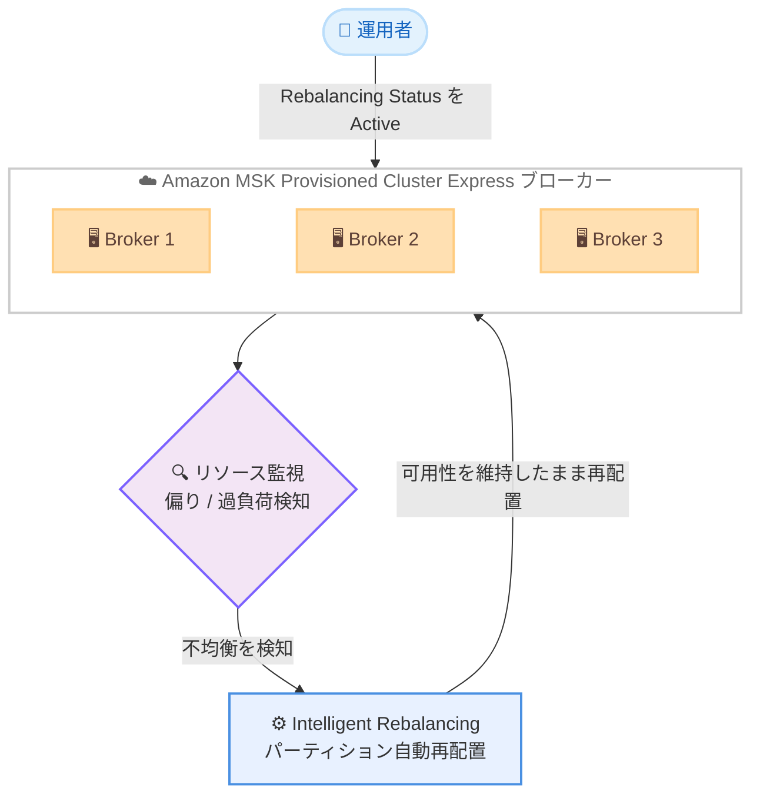

# Amazon MSK - Express ブローカーの Intelligent Rebalancing 既存クラスター対応

**リリース日**: 2026 年 6 月 18 日
**サービス**: Amazon Managed Streaming for Apache Kafka (Amazon MSK)
**機能**: Intelligent Rebalancing for Express brokers on existing clusters

📊 [このアップデートのインフォグラフィックを見る](https://takech9203.github.io/aws-news-summary/20260618-amazon-msk-express-intelligent.html)
<!-- INFOGRAPHIC_BASE_URL は環境変数から取得 -->

## 概要

Amazon MSK の Express ブローカーを使用する MSK Provisioned クラスターにおいて、Intelligent Rebalancing (インテリジェントリバランシング) がすべての既存クラスターで利用可能になりました。これまでこの機能は、2025 年 11 月の Intelligent Rebalancing リリース以降に新規作成されたクラスターのみが対象でした。今回のアップデートにより、それ以前に作成された既存の Express クラスターでも Intelligent Rebalancing を有効化できるようになりました。

Intelligent Rebalancing は、パーティションを自動的にバランシングし、Express ベースのクラスターをスケールアップまたはスケールダウンする際の運用を支援する機能です。AWS の説明によると、この機能は Kafka リソースを最適にリバランシングすることで、MSK Express ベースのクラスターのキャパシティ使用率を最大化します。サードパーティーツールや手動操作によるパーティション管理が不要になり、クラスターは Amazon MSK の組み込みのデフォルト設定によってリソースの偏りや過負荷を継続的に監視されます。

この機能は追加料金なしで利用でき、Express ブローカーがサポートされるすべての AWS リージョンで提供されます。既存クラスターを対象とした今回の拡張により、これまで新規クラスターでしか享受できなかった自動リバランシングの恩恵を、運用中のクラスターでも受けられるようになりました。

**アップデート前の課題**

- 2025 年 11 月 20 日より前に作成された Express クラスターでは、Intelligent Rebalancing を利用できなかった
- 既存クラスターでは、パーティションのリバランシングを手動操作または Cruise Control などのサードパーティーツールで管理する必要があった
- 既存クラスターのスケール操作時に、パーティションの再配置を自前で計画・実行する運用負荷が発生していた

**アップデート後の改善**

- 2025 年 11 月 20 日より前に作成された既存の Express クラスターでも Intelligent Rebalancing を有効化できるようになった
- **Rebalancing Status** を **Active** に設定するだけで、既存クラスターの自動リバランシングが有効になる
- 手動またはサードパーティーツールによるパーティション管理が不要になり、運用負荷が軽減された

## アーキテクチャ図

Intelligent Rebalancing は Express ベースのクラスターを継続的に監視し、リソースの偏りや過負荷を検知すると、クラスターの可用性を維持したままパーティションを自動的に再配置します。

## サービスアップデートの詳細

### 主要機能

1. **既存クラスターでの Intelligent Rebalancing 有効化**
   - 2026 年 6 月 18 日より、Express ブローカーを使用するすべての MSK Provisioned クラスターで利用可能
   - 2025 年 11 月 20 日より前に作成されたクラスターでは、初期状態で **Rebalancing Status** が **Paused** に設定されている
   - Amazon MSK コンソール、AWS CLI、または SDK から **Rebalancing Status** を **Active** に設定することで有効化できる

2. **スケールアップ / スケールダウン時の自動リバランシング**
   - ブローカーの追加・削除をシングルクリックで実行できる
   - 追加・削除するブローカーを指定すると、AWS の内部ベストプラクティスに基づいてパーティションを自動的に再配置する
   - スケール操作はクラスターの可用性に影響を与えずに完了する

3. **定常状態でのリバランシング (Steady state rebalancing)**
   - クラスターの状態を継続的に監視し、以下の状況でパーティションを自動的にリバランシングする
     - ブローカー間でリソース使用率に偏りが生じた場合
     - ブローカーが過剰プロビジョニングまたは低使用率になった場合
     - 新しいブローカーが追加された、または既存のブローカーが削除された場合

## 技術仕様

### 機能概要

| 項目 | 詳細 |
|------|------|
| 対象クラスター | Express ブローカーを使用する MSK Provisioned クラスター |
| デフォルト設定 (新規クラスター) | 有効 (Active) |
| デフォルト設定 (2025/11/20 以前作成) | 一時停止 (Paused) |
| 最大パーティション数 | ブローカーあたり最大 20,000 パーティション |
| スケール操作の所要時間 | 30 分以内に完了 |
| 可用性への影響 | スケール中もクラスターの可用性に影響なし |
| 料金 | 追加料金なし |
| 設定要否 | 追加の設定は不要 (新規クラスターの場合) |

### モニタリング用 CloudWatch メトリクス

| メトリクス | 説明 |
|------------|------|
| `RebalanceInProgress` | 毎分発行され、リバランシング実行中は 1、それ以外は 0 |
| `UnderProvisioned` | クラスターがアンダープロビジョニング状態で、パーティションのリバランシングを実行できないことを示す。ブローカーの追加またはインスタンスタイプのスケールアップが必要 |

## 設定方法

### 前提条件

1. Express ブローカーを使用する MSK Provisioned クラスターを利用していること
2. 2025 年 11 月 20 日より前に作成されたクラスターの場合、初期状態では **Rebalancing Status** が **Paused** に設定されている
3. サードパーティーのリバランシングツール (Cruise Control など) を使用している場合は、Intelligent Rebalancing と併用できないため運用方針を整理しておくこと

### 手順

#### ステップ 1: 既存クラスターの Rebalancing Status を確認

Amazon MSK コンソールまたは AWS CLI で対象クラスターの Intelligent Rebalancing のステータスを確認します。2025 年 11 月 20 日より前に作成されたクラスターでは **Paused** になっています。

#### ステップ 2: Rebalancing Status を Active に設定

Amazon MSK コンソール、AWS CLI、または SDK を使用して **Rebalancing Status** を **Active** に変更します。これにより既存クラスターで定常状態のリバランシングが有効になります。手順の詳細は公式ドキュメントの「Steady state rebalancing」を参照してください。

#### ステップ 3: CloudWatch メトリクスでリバランシング状況を監視

`RebalanceInProgress` および `UnderProvisioned` メトリクスを CloudWatch で監視し、リバランシングの実行状況やクラスターのプロビジョニング状態を確認します。`UnderProvisioned` が 1 を示す場合は、ブローカーの追加またはインスタンスタイプのスケールアップを検討します。

## メリット

### ビジネス面

- **運用コストの削減**: 手動またはサードパーティーツールによるパーティション管理が不要になり、運用工数を削減できる
- **追加料金なし**: Intelligent Rebalancing は追加料金なしで利用でき、コスト増を伴わずに運用効率を改善できる
- **既存資産の活用**: 既存の Express クラスターを再作成することなく、自動リバランシングの恩恵を受けられる

### 技術面

- **キャパシティ使用率の最大化**: Kafka リソースを最適に再配置し、ブローカー間の負荷の偏りを解消する
- **可用性を維持したスケーリング**: スケールアップ / スケールダウン時もクラスターの可用性に影響を与えない
- **高速なスケール操作**: スケール操作は 30 分以内に完了する

## デメリット・制約事項

### 制限事項

- 自動パーティション再配置は、ブローカーあたり最大 20,000 パーティションまでのサポート
- Intelligent Rebalancing を有効にすると、パーティション再配置 API やサードパーティーのリバランシングツール (Cruise Control など) を使用できない
- これらの API やツールを使用するには、まず対象クラスターの Intelligent Rebalancing を一時停止する必要がある

### 考慮すべき点

- 2025 年 11 月 20 日より前に作成されたクラスターは初期状態で **Paused** のため、有効化には明示的な操作が必要
- サードパーティーツールによるリバランシング運用から移行する場合は、運用フローの見直しが必要

## ユースケース

### ユースケース 1: 既存 Express クラスターの運用負荷削減

**シナリオ**: 2025 年初頭から運用している Express クラスターで、パーティションのリバランシングを手動で管理しており、運用負荷が高くなっている。

**効果**: **Rebalancing Status** を **Active** に設定するだけで、手動でのパーティション管理が不要になり、クラスターの偏りや過負荷を自動的に解消できる。

### ユースケース 2: スケーリング時のパーティション再配置自動化

**シナリオ**: トラフィックの増減に応じてブローカー数を調整する必要があるが、スケール時のパーティション再配置計画に時間がかかっている。

**効果**: ブローカーの追加・削除をシングルクリックで実行でき、AWS の内部ベストプラクティスに基づいてパーティションが自動的に再配置される。スケール操作は 30 分以内に完了し、可用性にも影響しない。

### ユースケース 3: サードパーティーツールからの移行

**シナリオ**: Cruise Control を利用してパーティションのリバランシングを行っているが、運用とメンテナンスの負荷を削減したい。

**効果**: Intelligent Rebalancing を有効化することで、サードパーティーツールへの依存をなくし、Amazon MSK のマネージド機能でリバランシングを完結できる。

## 料金

Intelligent Rebalancing は追加料金なしで利用できます。Amazon MSK Provisioned クラスターおよび Express ブローカーの通常の料金が適用されます。

## 利用可能リージョン

Amazon MSK Express ブローカーがサポートされるすべての AWS リージョンで利用可能です。

## 関連サービス・機能

- **Amazon MSK Express ブローカー**: 本機能の対象となる高性能ブローカータイプ。Standard ブローカーと比較して最大 180 倍高速な運用操作が可能
- **Amazon CloudWatch**: `RebalanceInProgress` や `UnderProvisioned` メトリクスによるリバランシング状況の監視
- **AWS CloudFormation**: Intelligent Rebalancing の設定をテンプレートで管理可能

## 参考リンク

- 📊 [インフォグラフィック](https://takech9203.github.io/aws-news-summary/20260618-amazon-msk-express-intelligent.html)
- [公式発表 (What's New)](https://aws.amazon.com/about-aws/whats-new/2026/06/amazon-msk-express-intelligent/)
- [ドキュメント (Intelligent rebalancing for clusters)](https://docs.aws.amazon.com/msk/latest/developerguide/intelligent-rebalancing.html)
- [料金ページ (Amazon MSK Pricing)](https://aws.amazon.com/msk/pricing/)

## まとめ

今回のアップデートにより、Intelligent Rebalancing が新規クラスターだけでなく、既存のすべての Express クラスターで利用可能になりました。これまで手動やサードパーティーツールでパーティション管理を行っていた運用者は、追加料金なしで自動リバランシングの恩恵を受けられます。2025 年 11 月 20 日より前に作成したクラスターを利用している場合は、**Rebalancing Status** を **Active** に設定して機能を有効化することを推奨します。
