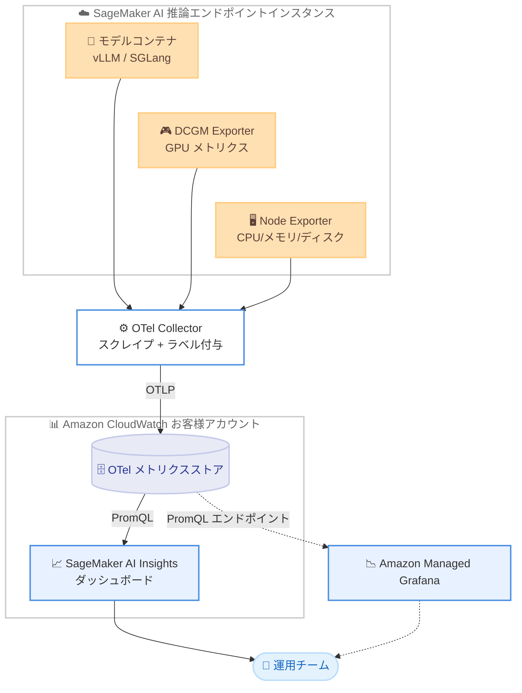

# Amazon SageMaker AI - 推論エンドポイントの新しいオブザーバビリティ機能

**リリース日**: 2026 年 6 月 18 日
**サービス**: Amazon SageMaker AI
**機能**: 推論エンドポイント向け詳細オブザーバビリティ (Detailed observability)

📊 [このアップデートのインフォグラフィックを見る](https://takech9203.github.io/aws-news-summary/20260618-amazon-sagemaker-ai-inference.html)

## 概要

Amazon SageMaker AI は、リアルタイム推論エンドポイント向けの新しいオブザーバビリティ機能を発表しました。この機能により、本番環境の生成 AI 推論ワークロードについて、トークンパフォーマンス、GPU の状態、推論コンポーネントの配置、オートスケーリングの挙動などをきめ細かく可視化できます。

この機能は OpenTelemetry (OTel) をベースに構築されており、GPU、ノード、推論フレームワークの各レイヤーから運用メトリクスを収集して Amazon CloudWatch に発行します。あらかじめ用意された SageMaker AI Insights ダッシュボードにより、複数のデータが 1 つのビューに集約され、Time to First Token (TTFT) の劣化、可用性ゾーン (AZ) のコンプライアンス、オートスケーリングポリシーのチューニングといった課題を、数時間ではなく数分で診断できるようになります。

対象は、本番環境で生成 AI モデルを運用する機械学習エンジニアや SRE、プラットフォーム運用チームです。計測コードの追加 (インストルメンテーション) は不要で、メトリクスは自動的に発行されます。

**アップデート前の課題**

- 推論パフォーマンスの問題を診断するには、CloudWatch のログやメトリクスを手作業で検索し、レイテンシのスパイクを相関させる必要があった
- vLLM や SGLang などの推論フレームワーク内部のメトリクス (TTFT、トークン/秒、KV キャッシュ利用率など) を取得するには、カスタムの計測コードが必要だった
- マルチテナントのインスタンス上で、どのモデルが GPU リソースを消費しているのかを特定することが困難だった
- スケーリングが遅い原因 (コールドスタートの内訳など) を切り分けるのに時間がかかっていた

**アップデート後の改善**

- 事前構築済みの SageMaker AI Insights ダッシュボードにより、トークンパフォーマンス、GPU の状態、配置状況を 1 つのビューで確認できるようになった
- OpenTelemetry ネイティブのメトリクスが計測コードなしで自動発行されるようになった
- GPU メトリクス (DCGM) が推論コンポーネント単位で属性付けされ、リソース消費の発生源を特定できるようになった
- PromQL によるクエリと Amazon Managed Grafana への連携が可能になり、問題解決にかかる時間が短縮された

## アーキテクチャ図



各エンドポイントインスタンスがモデルコンテナ、DCGM Exporter、Node Exporter からメトリクスを公開し、OTel Collector がそれらをスクレイプしてラベルを付与した上で、OTLP 経由でお客様アカウントの CloudWatch に発行します。

## サービスアップデートの詳細

### 主要機能

1. **SageMaker AI Insights ダッシュボード**
   - Amazon CloudWatch 内に事前構築されたダッシュボード
   - トークンパフォーマンス、GPU の状態、推論コンポーネントの配置、オートスケーリングの挙動を 1 つのビューに集約
   - TTFT の劣化診断、AZ コンプライアンスの確認、オートスケーリングポリシーのチューニングを支援

2. **OpenTelemetry ネイティブのメトリクス収集**
   - OTel Collector が DCGM (GPU メトリクス)、Node Exporter (CPU/メモリ/ディスク)、推論フレームワークコンテナ (vLLM、SGLang) の Prometheus エンドポイントをスクレイプ
   - 計測コードの追加は不要で、メトリクスは自動的に発行される
   - 収集されたメトリクスは OTLP 経由で CloudWatch に OTel メトリクスデータとして格納される

3. **豊富なディメンションラベルと GPU 単位の属性付け**
   - 各メトリクスにエンドポイント名、推論コンポーネント名、インスタンス ID、AZ、インスタンスタイプなどのラベルを付与
   - GPU メトリクス (DCGM) は推論コンポーネント単位で属性付けされ、マルチテナントインスタンス上でどのモデルが GPU を消費しているか特定可能

4. **PromQL クエリと Grafana 連携**
   - Amazon CloudWatch、CloudWatch Query Studio、Amazon Managed Grafana から PromQL 構文でクエリ可能
   - リージョンの PromQL エンドポイント経由で接続し、事前構成済みのダッシュボードテンプレートをインポートできる
   - PromQL はクエリ言語として利用できるが、Prometheus サーバーや Prometheus 互換バックエンドは関与しない

## 技術仕様

### 収集されるメトリクスのカテゴリ

| カテゴリ | 主なメトリクス | スコープ | 発行頻度 |
|------|------|------|------|
| 推論フレームワーク (vLLM/SGLang) | TTFT、トークン間レイテンシ (ITL)、KV キャッシュ、キュー深度、バッチサイズ、トークン/秒、同時リクエスト数 | 推論コンポーネント単位 (IC エンドポイント)、インスタンス/エンドポイント単位 (SME) | 設定可能 |
| GPU の状態 (DCGM) | GPU 利用率、メモリコピー利用率、GPU 温度 | インスタンス単位、GPU 単位 | 設定可能 |
| ノードの状態 | CPU、メモリ、ディスク、ファイルシステム | インスタンス単位 | 設定可能 |
| 推論コンポーネントの配置と高可用性 | IC コピー数、AZ ごとのコピー数、AZ スキュー、インスタンスあたりの IC 数、AZ ごとのインスタンス数 | エンドポイント単位 | 定期 |
| ライフサイクル | モデルダウンロード時間、GPU ロード時間、コンテナ起動、コールドスタート | IC 単位、エンドポイント単位 | イベント駆動 |
| オートスケーリング | スケーリングイベント、エンドツーエンドレイテンシ、リバランス | エンドポイント単位 | イベント駆動 |
| ICE 診断 | ICE 数、失敗タイプ、失敗 AZ | エンドポイント単位 | イベント駆動 |

### 主なラベル

| ラベル | 説明 |
|------|------|
| `aws.sagemaker.endpoint.name` | エンドポイント名 |
| `aws.sagemaker.inference_component.name` | 推論コンポーネント名 |
| `@resource.host.id` | インスタンス ID |
| `@resource.cloud.availability_zone` | 可用性ゾーン |
| `@resource.host.type` | インスタンスタイプ |

### スクレイプ頻度の設定

メトリクスの収集頻度は `MetricPublishFrequencyInSeconds` で制御します。有効な値は 10、30、60、120、180、240、300 秒で、デフォルトは 60 秒です。ライフサイクル、オートスケーリング、ICE 診断などのコントロールプレーンメトリクスはイベント駆動であり、この設定の影響を受けません。

## 設定方法

### 前提条件

1. SageMaker AI のリアルタイム推論エンドポイントを利用していること
2. 対象リージョンが詳細オブザーバビリティに対応していること
3. CloudWatch および (必要に応じて) Amazon Managed Grafana へのアクセス権限があること

### 手順

#### ステップ 1: CloudWatch で SageMaker AI Insights ダッシュボードを確認

CloudWatch コンソールから、事前構築済みの SageMaker AI Insights ダッシュボードを開きます。トークンパフォーマンス、GPU の状態、推論コンポーネントの配置などが 1 つのビューに集約されて表示されます。

#### ステップ 2: PromQL でメトリクスをクエリ

```text
# 推論コンポーネント単位の TTFT を確認する PromQL クエリの例
histogram_quantile(0.99, sum by (aws_sagemaker_inference_component_name) (rate(ttft_seconds_bucket[5m])))
```

CloudWatch または CloudWatch Query Studio で PromQL 構文を使用し、TTFT などのメトリクスをきめ細かく分析します。

#### ステップ 3: Amazon Managed Grafana と連携

リージョンの PromQL エンドポイント (`https://monitoring.{region}.amazonaws.com`) を Grafana のデータソースとして接続し、事前構成済みのダッシュボードテンプレートをインポートします。これにより、Grafana 上で SageMaker AI の推論メトリクスを可視化できます。

## メリット

### ビジネス面

- **問題解決時間の短縮**: パフォーマンスの問題を数時間ではなく数分で診断でき、本番ワークロードの信頼性が向上する
- **運用負荷の軽減**: 手作業での CloudWatch 検索やレイテンシ相関の作業が不要になる
- **コスト最適化**: GPU 利用率や推論コンポーネントの配置を可視化することで、リソースの過剰/過少プロビジョニングを見直せる

### 技術面

- **計測コード不要**: OpenTelemetry ネイティブのメトリクスが自動発行され、追加実装の手間がない
- **きめ細かい属性付け**: GPU メトリクスが推論コンポーネント単位で取得でき、マルチテナント環境での原因特定が容易
- **既存ツールとの親和性**: PromQL と Amazon Managed Grafana に対応し、既存の運用ワークフローに組み込みやすい

## デメリット・制約事項

### 制限事項

- 対応リージョンは限定されている (利用可能リージョンを参照)
- メトリクスは Prometheus メトリクスではなく OTel メトリクスとして CloudWatch に格納される。PromQL はクエリ言語としてのみサポートされ、Prometheus サーバーは関与しない
- スクレイプ頻度として設定できる値は 10、30、60、120、180、240、300 秒に限定される

### 考慮すべき点

- メトリクス自体は追加料金なしで提供されるが、OTel エンリッチメントに伴う CloudWatch のデータ取り込みコストが発生する可能性がある
- 高頻度のスクレイプ設定はデータ量とコストの増加につながるため、ワークロードに応じた調整が必要

## ユースケース

### ユースケース 1: TTFT 劣化の原因特定

**シナリオ**: 生成 AI チャットアプリケーションでユーザーから応答開始が遅いという報告があり、TTFT の劣化が疑われる。

**実装例**:
```text
# 推論コンポーネント単位の TTFT 推移を確認
rate(ttft_seconds_sum[5m]) / rate(ttft_seconds_count[5m])
```

**効果**: どの推論コンポーネントとインスタンスで TTFT が劣化しているかを特定し、キュー深度や GPU 利用率と相関させて原因を切り分けられる。

### ユースケース 2: マルチテナント GPU の消費分析

**シナリオ**: 1 つのインスタンスに複数の推論コンポーネントを配置しており、特定のモデルが GPU を圧迫している可能性がある。

**実装例**:
```text
# 推論コンポーネント単位の GPU 利用率
sum by (aws_sagemaker_inference_component_name) (DCGM_FI_DEV_GPU_UTIL)
```

**効果**: GPU リソースの消費源となっている推論コンポーネントを特定し、配置やインスタンスタイプの見直しに活用できる。

### ユースケース 3: 高可用性とオートスケーリングの検証

**シナリオ**: 推論コンポーネントが複数 AZ に均等に配置されているか、オートスケーリングが適切に機能しているかを確認したい。

**実装例**:
```text
# AZ ごとの IC コピー数を確認し、AZ スキューを検出
sum by (availability_zone) (aws_sagemaker_inference_component_copy_count)
```

**効果**: AZ スキューやスケーリングイベントを可視化し、可用性の確保とオートスケーリングポリシーのチューニングを行える。

## 料金

詳細オブザーバビリティのメトリクスは追加料金なしで提供されます。ただし、OTel エンリッチメントに関連する Amazon CloudWatch のデータ取り込みコストが発生する可能性があります。詳細は [Amazon CloudWatch の料金ページ](https://aws.amazon.com/cloudwatch/pricing/) を参照してください。

## 利用可能リージョン

本機能は以下のリージョンで利用可能です。

- 米国東部 (バージニア北部)、米国東部 (オハイオ)
- 米国西部 (オレゴン)、米国西部 (北カリフォルニア)
- カナダ (中部)
- 南米 (サンパウロ)
- 欧州 (アイルランド、フランクフルト、ロンドン、ストックホルム、チューリッヒ)
- アジアパシフィック (ムンバイ、シンガポール、シドニー、東京、ソウル、ジャカルタ)

## 関連サービス・機能

- **Amazon CloudWatch**: メトリクスの格納先であり、SageMaker AI Insights ダッシュボードと PromQL クエリの実行基盤
- **Amazon Managed Grafana**: PromQL エンドポイント経由で接続し、推論メトリクスを可視化
- **OpenTelemetry (OTel)**: メトリクス収集の基盤となるオープンスタンダード
- **vLLM / SGLang**: メトリクスを公開する推論フレームワーク

## 参考リンク

- 📊 [インフォグラフィック](https://takech9203.github.io/aws-news-summary/20260618-amazon-sagemaker-ai-inference.html)
- [公式発表 (What's New)](https://aws.amazon.com/about-aws/whats-new/2026/06/amazon-sagemaker-ai-inference/)
- [ドキュメント (詳細オブザーバビリティ)](https://docs.aws.amazon.com/sagemaker/latest/dg/monitoring-cloudwatch-detailed-observability.html)
- [Amazon SageMaker AI](https://aws.amazon.com/sagemaker/ai/)
- [Amazon CloudWatch の料金](https://aws.amazon.com/cloudwatch/pricing/)

## まとめ

今回のアップデートにより、SageMaker AI のリアルタイム推論エンドポイントについて、計測コードを追加することなく OpenTelemetry ベースのきめ細かいメトリクスを取得できるようになりました。事前構築済みの SageMaker AI Insights ダッシュボードと PromQL/Grafana 連携を活用することで、本番生成 AI ワークロードの問題切り分けを数分で行えます。本番環境で推論エンドポイントを運用しているチームは、まず対応リージョンで本機能を有効化し、TTFT や GPU 利用率の可視化から運用改善を始めることを推奨します。
