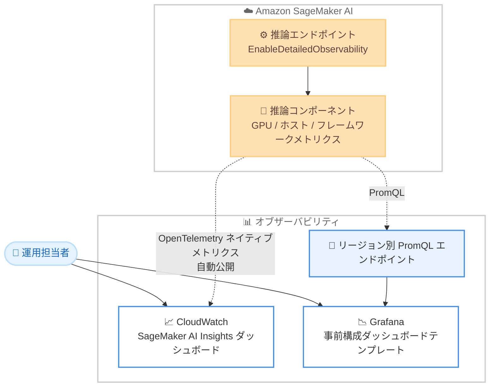

# Amazon SageMaker AI - 推論エンドポイントの新しいオブザーバビリティ機能

**リリース日**: 2026 年 6 月 18 日
**サービス**: Amazon SageMaker AI
**機能**: 推論エンドポイント向けオブザーバビリティ機能 (SageMaker AI Insights ダッシュボード)

📊 [このアップデートのインフォグラフィックを見る](https://takech9203.github.io/aws-news-summary/20260618-amazon-sagemaker-ai-inference.html)
<!-- INFOGRAPHIC_BASE_URL は環境変数から取得 -->

## 概要

Amazon SageMaker AI は、推論エンドポイントに対する新しいオブザーバビリティ機能を発表しました。この機能は、本番環境で稼働する生成 AI ワークロードのパフォーマンスを可視化し、問題の特定と解決にかかる時間を大幅に短縮することを目的としています。

従来、推論エンドポイントのパフォーマンス問題を調査するには、Amazon CloudWatch の複数のメトリクスを手動で探し回り、レイテンシーの問題とハードウェアの状態を相関させる必要がありました。今回のアップデートでは、Time to First Token (TTFT)、トークン間レイテンシー、キュー深度、1 秒あたりのトークン数などの主要なパフォーマンス指標を、インフラストラクチャの健全性とあわせてリアルタイムに追跡できます。これにより、これまで数時間を要していた問題の特定と解決が数分で完了するようになります。

中核となるのは、Amazon CloudWatch に組み込まれた事前構築済みの SageMaker AI Insights ダッシュボードです。トークンレイテンシー、GPU 使用率、推論コンポーネントのコピー数、スケーリングイベント、コールドスタートの内訳を 1 つのビューに集約します。メトリクスは OpenTelemetry ネイティブメトリクスとして自動的に公開されるため、ユーザー側で計装 (インストルメンテーション) を行う必要はありません。

**アップデート前の課題**

このアップデート以前は、推論エンドポイントの運用に以下の課題がありました。

- 以前はパフォーマンス問題の調査時に、CloudWatch の複数のメトリクスを手動で探し回る必要があった
- 以前はレイテンシーの問題とハードウェアの状態を手動で相関させる必要があり、原因特定に数時間を要していた
- 以前は TTFT やトークン間レイテンシーといった生成 AI 特有の指標を統合的に把握する手段が限られていた

**アップデート後の改善**

今回のアップデートにより、以下が可能になりました。

- 今回のアップデートにより、生成 AI 特有のメトリクスとインフラ健全性を 1 つのダッシュボードで統合的に把握できるようになった
- 今回のアップデートにより、計装 (インストルメンテーション) を行わずに OpenTelemetry ネイティブメトリクスを自動取得できるようになった
- 今回のアップデートにより、問題の特定と解決にかかる時間が数時間から数分に短縮された

## アーキテクチャ図



推論エンドポイントが OpenTelemetry ネイティブメトリクスを自動公開し、CloudWatch のダッシュボードまたは PromQL 経由の Grafana で可視化する流れを示しています。

## サービスアップデートの詳細

### 主要機能

1. **生成 AI 向けパフォーマンスメトリクスのリアルタイム追跡**
   - Time to First Token (TTFT) を追跡し、最初のトークンが返るまでの遅延を把握できる
   - トークン間レイテンシー、キュー深度、1 秒あたりのトークン数を可視化する
   - これらの指標をインフラストラクチャの健全性とあわせて表示する

2. **SageMaker AI Insights ダッシュボード (CloudWatch)**
   - トークンレイテンシー、GPU 使用率、推論コンポーネントのコピー数を 1 つのビューに集約する
   - スケーリングイベントとコールドスタートの内訳を確認できる
   - OpenTelemetry ネイティブメトリクスが自動的に公開され、計装は不要

3. **Grafana 連携**
   - リージョン別の PromQL エンドポイントを使用して Grafana と連携できる
   - インポート可能な事前構成済みダッシュボードテンプレートを提供する
   - CloudWatch 以外の監視ツールを利用しているチームにも対応する

## 技術仕様

### 追跡される主要メトリクス

| 項目 | 詳細 |
|------|------|
| Time to First Token (TTFT) | リクエストから最初のトークンが返されるまでの時間 |
| トークン間レイテンシー | トークンとトークンの間の生成遅延 |
| キュー深度 | 処理待ちリクエストの滞留状況 |
| 1 秒あたりのトークン数 | スループットを示すトークン生成速度 |
| GPU 使用率 | 推論コンポーネントの GPU リソース使用状況 |
| 推論コンポーネントのコピー数 | スケーリングの状態 |
| コールドスタートの内訳 | 起動時のレイテンシー要因の分解 |

### API変更履歴

| 日付 | サービス | 変更内容 |
|------|----------|----------|
| 2026/06/16 | [api.sagemaker](https://awsapichanges.com/archive/changes/e078c6-api.sagemaker.html) | 21 updated api methods - Endpoint の MetricsConfig に EnableDetailedObservability を追加。GPU、ホスト、フレームワークネイティブの推論メトリクスを、推論コンポーネント別、アベイラビリティーゾーン別、インスタンス別のディメンションで CloudWatch に公開。推論コンポーネントのプロビジョニングライフサイクルとマルチ AZ 配置メトリクスを追加 |

### 設定例

```json
{
  "EndpointConfigName": "my-genai-endpoint-config",
  "MetricsConfig": {
    "EnableDetailedObservability": true
  }
}
```

`MetricsConfig` の `EnableDetailedObservability` を有効化することで、詳細なオブザーバビリティメトリクスが CloudWatch に自動的に公開されます。

## 設定方法

### 前提条件

1. Amazon SageMaker AI の推論エンドポイントが利用可能なリージョンにあること
2. CloudWatch にアクセスできる IAM 権限があること
3. Grafana 連携を利用する場合は、Amazon Managed Grafana または既存の Grafana 環境があること

### 手順

#### ステップ1: エンドポイント構成でオブザーバビリティを有効化

```bash
aws sagemaker create-endpoint-config \
  --endpoint-config-name my-genai-endpoint-config \
  --metrics-config EnableDetailedObservability=true \
  --production-variants '[{...}]'
```

このコマンドは、エンドポイント構成の `MetricsConfig` で詳細なオブザーバビリティを有効化し、GPU・ホスト・フレームワークネイティブの推論メトリクスを CloudWatch へ自動公開するよう設定します。

#### ステップ2: SageMaker AI Insights ダッシュボードを確認

CloudWatch コンソールを開き、事前構築済みの SageMaker AI Insights ダッシュボードを選択します。トークンレイテンシー、GPU 使用率、スケーリングイベント、コールドスタートの内訳を 1 つのビューで確認できます。追加の計装は不要です。

#### ステップ3: Grafana 連携を構成 (任意)

CloudWatch 以外の監視ツールを利用している場合は、リージョン別の PromQL エンドポイントを Grafana のデータソースとして登録し、提供される事前構成済みダッシュボードテンプレートをインポートします。これにより既存の運用ダッシュボードに統合できます。

## メリット

### ビジネス面

- **問題解決時間の短縮**: 問題の特定と解決が数時間から数分に短縮され、運用負荷とダウンタイムを削減する
- **AI 投資の最大化**: パフォーマンスを継続的に把握しチューニングすることで、AI 投資の効果を最大化できる
- **セルフサービス化**: 運用チームが自律的に問題を診断・解決できるようになる

### 技術面

- **計装不要**: OpenTelemetry ネイティブメトリクスが自動公開されるため、コード変更や追加の計装が不要
- **統合ビュー**: 生成 AI 特有のメトリクスとインフラ健全性を 1 つのダッシュボードに集約
- **マルチツール対応**: CloudWatch に加えて PromQL 経由で Grafana にも対応し、既存の監視基盤に統合できる

## デメリット・制約事項

### 制限事項

- 現時点では一部のリージョンのみで利用可能 (利用可能リージョンを参照)
- 公式発表では料金に関する記載がないため、CloudWatch メトリクスや Grafana 利用に伴う標準的なコストは別途確認が必要

### 考慮すべき点

- 詳細なメトリクスの公開に伴う CloudWatch のカスタムメトリクスやストレージのコスト影響を事前に確認することが望ましい
- Grafana 連携を利用する場合は、リージョン別の PromQL エンドポイントへのネットワークアクセスとアクセス制御の設計が必要

## ユースケース

### ユースケース1: TTFT の悪化要因の特定

**シナリオ**: 生成 AI チャットアプリケーションで、ユーザーから応答の初動が遅いという報告が増えている。

**実装例**:
```
SageMaker AI Insights ダッシュボードで TTFT、キュー深度、GPU 使用率を同時に確認
```

**効果**: TTFT の悪化がキュー滞留によるものか GPU リソース不足によるものかを即座に切り分け、適切な対策を打てる。

### ユースケース2: オートスケーリングポリシーの最適化

**シナリオ**: トラフィック変動が大きい本番エンドポイントで、コールドスタートによる遅延が断続的に発生している。

**実装例**:
```
スケーリングイベントとコールドスタートの内訳、推論コンポーネントのコピー数を分析
```

**効果**: スケーリングのしきい値とウォームプールの設定を見直し、コールドスタートの影響を最小化できる。

### ユースケース3: アベイラビリティーゾーンのコンプライアンス確認

**シナリオ**: 規制要件により、推論ワークロードが特定のアベイラビリティーゾーンに配置されていることを継続的に確認する必要がある。

**実装例**:
```
アベイラビリティーゾーン別ディメンションのメトリクスとマルチ AZ 配置メトリクスを確認
```

**効果**: ワークロードの配置状況を可視化し、AZ 配置に関するコンプライアンスを継続的に確認できる。

## 料金

公式発表では本機能自体の料金に関する記載はありません。CloudWatch のメトリクスやダッシュボード、Grafana 連携の利用には、各サービスの標準的な料金が適用される可能性があります。詳細は各サービスの料金ページを確認してください。

## 利用可能リージョン

本機能は以下のリージョンで利用可能です。

- 米国東部 (バージニア北部、オハイオ)
- 米国西部 (オレゴン、北カリフォルニア)
- カナダ (中部)
- 南米 (サンパウロ)
- 欧州 (アイルランド、フランクフルト、ロンドン、ストックホルム、チューリッヒ)
- アジアパシフィック (ムンバイ、シンガポール、シドニー、東京、ソウル、ジャカルタ)

アジアパシフィック (東京) リージョンが含まれています。

## 関連サービス・機能

- **Amazon CloudWatch**: SageMaker AI Insights ダッシュボードのホスト先であり、メトリクスの集約・可視化基盤
- **Amazon Managed Grafana / Grafana**: リージョン別 PromQL エンドポイント経由でメトリクスを可視化
- **SageMaker 推論コンポーネント**: GPU・ホスト・フレームワークネイティブメトリクスの取得対象となる単位

## 参考リンク

- 📊 [インフォグラフィック](https://takech9203.github.io/aws-news-summary/20260618-amazon-sagemaker-ai-inference.html)
- [公式発表 (What's New)](https://aws.amazon.com/about-aws/whats-new/2026/06/amazon-sagemaker-ai-inference/)
- [API 変更履歴 (awsapichanges.com)](https://awsapichanges.com/archive/changes/e078c6-api.sagemaker.html)
- [Amazon SageMaker AI ドキュメント](https://docs.aws.amazon.com/sagemaker/)

## まとめ

本アップデートは、本番環境の生成 AI 推論ワークロードの運用を大きく改善する重要な機能です。計装不要で TTFT などの生成 AI 特有のメトリクスとインフラ健全性を統合的に可視化でき、問題解決時間を数時間から数分へ短縮します。東京リージョンでも利用できるため、推論エンドポイントを運用しているチームは、まず `EnableDetailedObservability` を有効化し、SageMaker AI Insights ダッシュボードでの運用を検討することを推奨します。
