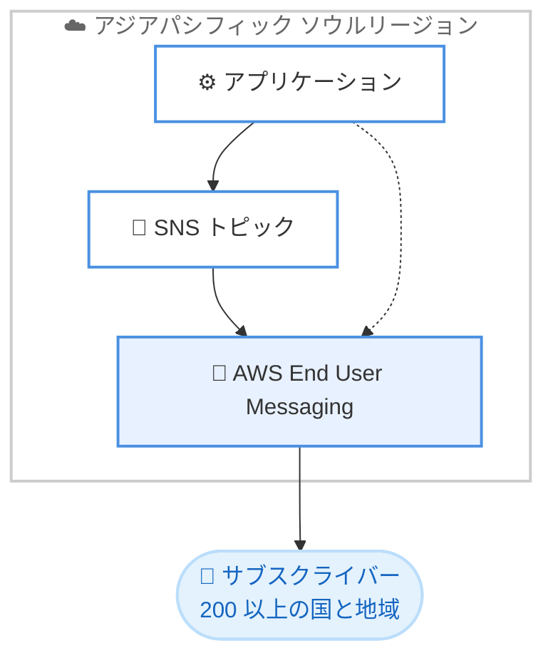

# Amazon SNS - アジアパシフィック (ソウル) リージョンでの SMS 送信サポート

**リリース日**: 2026 年 6 月 18 日
**サービス**: Amazon Simple Notification Service (Amazon SNS)
**機能**: アジアパシフィック (ソウル) リージョンでの SMS 送信

📊 [このアップデートのインフォグラフィックを見る]({INFOGRAPHIC_BASE_URL}/20260618-amazon-sns-supports-sending-sms-seoul-region.html)
<!-- INFOGRAPHIC_BASE_URL は環境変数から取得 -->

## 概要

Amazon SNS は、アジアパシフィック (ソウル) リージョンにおいて SMS (ショートメッセージサービス) の送信に対応しました。このアップデートにより、ソウルリージョンのお客様は 200 以上の国と地域のサブスクライバーに対してテキストメッセージ (SMS) を送信できるようになります。

Amazon SNS は、フルマネージドのパブリッシュ / サブスクライブ (pub/sub) メッセージングサービスです。AWS Lambda、Amazon SQS、Amazon Data Firehose、モバイルデバイス、E メールなどの多様なエンドポイントにメッセージを配信します。今回のリリースにより、ソウルリージョンのお客様は SNS トピックに電話番号をサブスクライブし、AWS End User Messaging を通じて SMS メッセージをブロードキャストできます。

韓国国内にワークロードを持つお客様にとって、データレジデンシーやレイテンシーの観点からソウルリージョン内で SMS 送信を完結できることは重要な意味を持ちます。ワンタイムパスワード (OTP) の配信、トランザクション通知、プロモーションメッセージなど、幅広いユースケースに対応します。

**アップデート前の課題**

- 以前はソウルリージョンの Amazon SNS から直接 SMS を送信できず、別のリージョンを経由する必要があった
- リージョンをまたぐ構成により、アーキテクチャが複雑化し、レイテンシーが増加する可能性があった
- 韓国国内でワークロードを完結させたいデータレジデンシー要件への対応が難しかった

**アップデート後の改善**

- 今回のアップデートにより、ソウルリージョン内で直接 SMS を送信できるようになった
- リージョンをまたぐ構成が不要になり、アーキテクチャがシンプルになった
- ソウルリージョンから 200 以上の国と地域へ SMS を配信できるようになった

## アーキテクチャ図



ソウルリージョンのアプリケーションは、SNS トピック経由でのブロードキャスト送信、または直接の SMS 送信を通じて、AWS End User Messaging から世界中のサブスクライバーへ SMS を配信します。

## サービスアップデートの詳細

### 主要機能

1. **ソウルリージョンからの SMS 送信**
   - アジアパシフィック (ソウル) リージョンの Amazon SNS から直接 SMS を送信可能
   - 200 以上の国と地域のサブスクライバーへ配信可能
   - リージョンをまたぐ構成が不要

2. **トピックへの電話番号サブスクライブ**
   - SNS トピックに電話番号をサブスクライブし、SMS をブロードキャスト送信可能
   - 複数の受信者へ一斉にメッセージを配信
   - pub/sub モデルによる効率的なメッセージ配信

3. **AWS End User Messaging との連携**
   - SMS の配信は AWS End User Messaging を通じて行われる
   - ダイレクト送信 (特定の電話番号への直接送信) にも対応

## 技術仕様

### SMS 送信方式

| 項目 | 詳細 |
|------|------|
| ダイレクト送信 | トピックを使用せず、特定の電話番号へ直接 SMS を送信 |
| トピック経由送信 | SNS トピックにサブスクライブした複数の電話番号へブロードキャスト |
| 配信基盤 | AWS End User Messaging |
| 対応範囲 | 200 以上の国と地域 |

### SMS メッセージタイプ

| タイプ | 用途 |
|------|------|
| Transactional | OTP やトランザクション通知など、高い配信信頼性が求められるメッセージ |
| Promotional | プロモーションやマーケティングなど、コスト最適化を重視するメッセージ |

## 設定方法

### 前提条件

1. アジアパシフィック (ソウル) リージョンで Amazon SNS を利用できる AWS アカウント
2. SMS 送信に必要な IAM 権限 (`sns:Publish` など)
3. 送信先の国や地域によっては、送信者 ID (Sender ID) や専用番号の事前登録が必要

### 手順

#### ステップ1: ダイレクト SMS 送信

```bash
aws sns publish \
  --region ap-northeast-2 \
  --phone-number "+821012345678" \
  --message "お客様のワンタイムパスワードは 123456 です。"
```

ソウルリージョン (`ap-northeast-2`) を指定し、特定の電話番号へ直接 SMS を送信します。`--phone-number` は E.164 形式で指定します。

#### ステップ2: トピック経由のブロードキャスト送信

```bash
# トピックに電話番号をサブスクライブ
aws sns subscribe \
  --region ap-northeast-2 \
  --topic-arn arn:aws:sns:ap-northeast-2:123456789012:MyTopic \
  --protocol sms \
  --notification-endpoint "+821012345678"

# トピックへメッセージを発行
aws sns publish \
  --region ap-northeast-2 \
  --topic-arn arn:aws:sns:ap-northeast-2:123456789012:MyTopic \
  --message "システムメンテナンスのお知らせです。"
```

最初のコマンドで電話番号を SNS トピックにサブスクライブし、2 番目のコマンドでトピックへメッセージを発行することで、サブスクライブされたすべての電話番号へ一斉に SMS を配信します。

## メリット

### ビジネス面

- **データレジデンシー対応**: 韓国国内のソウルリージョンで SMS 送信を完結でき、データの所在に関する要件に対応しやすくなる
- **グローバルリーチ**: 200 以上の国と地域への SMS 配信により、グローバルなユーザーへのリーチが可能
- **顧客体験の向上**: OTP やトランザクション通知を迅速に配信し、ユーザー体験を向上

### 技術面

- **アーキテクチャの簡素化**: リージョンをまたぐ構成が不要になり、システム構成がシンプルになる
- **レイテンシーの低減**: ソウルリージョン内で処理を完結することで、リージョン間通信のオーバーヘッドを削減
- **既存サービスとの統合**: Amazon SNS の pub/sub モデルを活用し、既存のメッセージング基盤に容易に統合可能

## デメリット・制約事項

### 制限事項

- 送信先の国や地域によっては、送信者 ID や専用番号の登録、規制対応が必要
- SMS メッセージにはサイズ制限があり、長いメッセージは複数のメッセージに分割される
- 一部の国ではプロモーション SMS の送信に制限がある

### 考慮すべき点

- SMS 送信にはアカウントの送信制限 (スペンドリミット) が適用される場合があるため、必要に応じて引き上げを申請する
- 配信信頼性が重要なメッセージには Transactional タイプを使用するなど、メッセージタイプの選択が重要
- 各国の通信規制やオプトイン / オプトアウト要件への準拠が必要

## ユースケース

### ユースケース1: ワンタイムパスワード (OTP) の配信

**シナリオ**: 韓国国内のユーザーを対象とした認証システムで、ログイン時の二要素認証用 OTP を SMS で配信する。

**実装例**:
```bash
aws sns publish \
  --region ap-northeast-2 \
  --phone-number "+821098765432" \
  --message "認証コード: 654321 (5 分間有効)" \
  --message-attributes '{"AWS.SNS.SMS.SMSType":{"DataType":"String","StringValue":"Transactional"}}'
```

**効果**: ソウルリージョン内で完結する低レイテンシーかつ高信頼な OTP 配信を実現できる。

### ユースケース2: トランザクション通知のブロードキャスト

**シナリオ**: E コマースサイトで、注文確定や配送状況の更新を複数のユーザーへ一斉に SMS 通知する。

**実装例**:
```bash
aws sns publish \
  --region ap-northeast-2 \
  --topic-arn arn:aws:sns:ap-northeast-2:123456789012:OrderUpdates \
  --message "ご注文の商品が発送されました。追跡番号: 1234567890"
```

**効果**: SNS トピックを活用し、サブスクライブされた多数の顧客へ効率的にトランザクション通知を配信できる。

### ユースケース3: システムアラート通知

**シナリオ**: 運用チームへのシステム障害アラートを SMS で即時通知する。

**実装例**:
```bash
aws sns publish \
  --region ap-northeast-2 \
  --topic-arn arn:aws:sns:ap-northeast-2:123456789012:OpsAlerts \
  --message "[ALERT] 本番環境で CPU 使用率が閾値を超過しました。"
```

**効果**: E メールに依存しない即時性の高いアラート通知により、インシデント対応の初動を早められる。

## 料金

今回のアップデートに伴う SMS 送信は、Amazon SNS の SMS 料金体系に従って課金されます。料金は送信先の国や地域、メッセージタイプ (Transactional / Promotional) によって異なります。最新の料金については、Amazon SNS の料金ページを参照してください。

## 利用可能リージョン

アジアパシフィック (ソウル) リージョン (`ap-northeast-2`)

その他のリージョンでの SMS 送信サポートについては、ドキュメントの「サポートされている国とリージョン」を参照してください。

## 関連サービス・機能

- **AWS End User Messaging**: SMS の配信基盤となるサービス。Amazon SNS の SMS 送信はこのサービスを通じて行われる
- **Amazon SQS**: Amazon SNS と連携し、メッセージのキューイングと処理に利用される
- **AWS Lambda**: SNS トピックのサブスクライバーとして、メッセージ受信時の処理を実行できる
- **Amazon Data Firehose**: SNS から配信されたメッセージをデータストアへストリーミングできる

## 参考リンク

- 📊 [インフォグラフィック]({INFOGRAPHIC_BASE_URL}/20260618-amazon-sns-supports-sending-sms-seoul-region.html)
- [公式発表 (What's New)](https://aws.amazon.com/about-aws/whats-new/2026/06/amazon-sns-supports-sending-sms-seoul-region/)
- [Amazon SNS 製品ページ](https://aws.amazon.com/sns/)
- [ドキュメント: Amazon SNS によるモバイルテキストメッセージング](https://docs.aws.amazon.com/sns/latest/dg/sns-mobile-phone-number-as-subscriber.html)
- [AWS End User Messaging](https://aws.amazon.com/end-user-messaging/)

## まとめ

今回のアップデートにより、アジアパシフィック (ソウル) リージョンの Amazon SNS から直接 SMS を送信できるようになりました。韓国国内のワークロードでデータレジデンシー要件に対応しつつ、200 以上の国と地域へのグローバルな SMS 配信が可能になります。ソウルリージョンで SMS を利用しているお客様は、リージョンをまたぐ既存構成の見直しと、メッセージタイプや送信制限の確認を進めることを推奨します。
