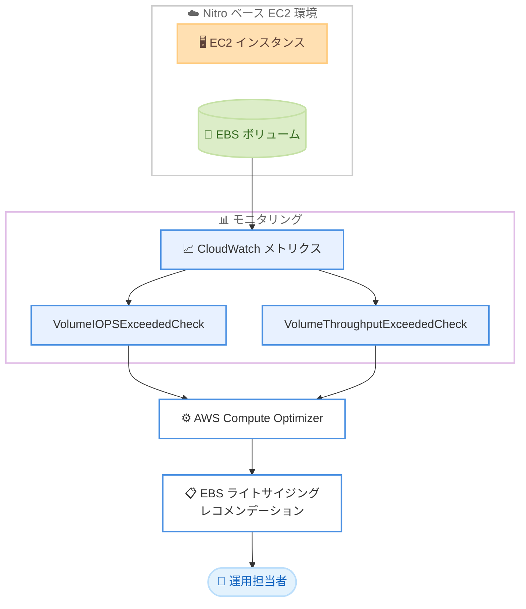

# AWS Compute Optimizer - EBS ボリュームレコメンデーションのパフォーマンスメトリクス拡張

**リリース日**: 2026 年 6 月 18 日
**サービス**: AWS Compute Optimizer
**機能**: EBS ボリュームレコメンデーションへの追加パフォーマンスメトリクスの統合

📊 [このアップデートのインフォグラフィックを見る](https://takech9203.github.io/aws-news-summary/20260618-aws-compute-optimizer-enhances-ebs-recommendations.html)

## 概要

AWS Compute Optimizer は、Amazon EBS ボリュームのライトサイジングレコメンデーションを生成する際に、2 つの新しい Amazon CloudWatch メトリクスを分析対象に追加しました。追加されたメトリクスは `VolumeIOPSExceededCheck` と `VolumeThroughputExceededCheck` です。これらのメトリクスは、ワークロードが任意の 1 分間において、ボリュームにプロビジョニングされた IOPS またはスループットの性能を継続的に超過しようとしたかどうかを示します。

従来の EBS ボリュームレコメンデーションでは、平均的な使用率に基づいたコスト最適化の提案が中心でした。今回のアップデートにより、IOPS やスループットのバースト (急激な負荷上昇) に対する可視性が向上し、お客様はバースト的な高負荷を伴うワークロードに対して、コストとパフォーマンスのバランスをとったライトサイジングの判断を下せるようになります。

この拡張は、EBS ボリュームのパフォーマンスチューニングとコスト最適化を両立させたいインフラ運用担当者やコスト管理担当者にとって有用です。

**アップデート前の課題**

- 平均使用率ベースのレコメンデーションでは、短時間に発生する IOPS やスループットのバーストを把握しにくかった
- プロビジョニング性能を一時的に超過するワークロードを過小プロビジョニング状態と判断しにくく、性能劣化のリスクが見落とされる可能性があった
- コスト削減を優先したダウンサイジングが、バースト時のパフォーマンス低下を招くリスクがあった

**アップデート後の改善**

- `VolumeIOPSExceededCheck` と `VolumeThroughputExceededCheck` により、性能上限への到達状況を分単位で把握できるようになった
- バースト的な高 IOPS / 高スループットを伴うワークロードに対し、性能を考慮したライトサイジング判断が可能になった
- コストとパフォーマンスのトレードオフをより正確に評価できるようになった

## アーキテクチャ図

Nitro ベースの EC2 インスタンスにアタッチされた EBS ボリュームの CloudWatch メトリクスを Compute Optimizer が分析し、性能超過の状況を考慮したライトサイジングレコメンデーションを生成する流れを示しています。

## サービスアップデートの詳細

### 主要機能

1. **VolumeIOPSExceededCheck メトリクスの分析**
   - ワークロードが任意の 1 分間において、プロビジョニングされた IOPS 性能を継続的に超過しようとしたかどうかを示す
   - IOPS バーストの発生状況を把握し、過小プロビジョニングの兆候を検出できる

2. **VolumeThroughputExceededCheck メトリクスの分析**
   - ワークロードが任意の 1 分間において、プロビジョニングされたスループット性能を継続的に超過しようとしたかどうかを示す
   - スループットのボトルネックを可視化し、性能とコストのバランス判断に活用できる

3. **コストとパフォーマンスを両立したレコメンデーション**
   - 上記 2 つのシグナルを取り込むことで、バースト的な高 IOPS / 高スループットのワークロードに対するライトサイジング判断を支援する
   - 平均使用率だけでは見落としがちな性能上限への到達を考慮した推奨が可能になる

## 技術仕様

### 対応ボリューム

| 項目 | 詳細 |
|------|------|
| 対象 | Nitro ベース EC2 インスタンスにアタッチされたすべての EBS ボリューム |
| 除外 | Standard ボリューム |
| 除外 | Multi-Attach が有効なボリューム |
| 分析メトリクス | VolumeIOPSExceededCheck、VolumeThroughputExceededCheck |
| メトリクス料金 | 対応ボリュームについて追加料金なし |

### 追加された CloudWatch メトリクス

| メトリクス名 | 意味 |
|------|------|
| VolumeIOPSExceededCheck | プロビジョニングされた IOPS 性能を超過しようとしたかを示す (分単位) |
| VolumeThroughputExceededCheck | プロビジョニングされたスループット性能を超過しようとしたかを示す (分単位) |

## 設定方法

### 前提条件

1. AWS Compute Optimizer がアカウントまたは組織でオプトインされていること
2. 分析対象の EBS ボリュームが Nitro ベース EC2 インスタンスにアタッチされていること
3. Standard ボリュームおよび Multi-Attach 有効ボリュームは対象外であることを理解していること

### 手順

#### ステップ1: Compute Optimizer のオプトイン

AWS Management Console から AWS Compute Optimizer を開き、まだオプトインしていない場合はオプトインします。Compute Optimizer が対象リソースのメトリクスを分析できるようになります。

#### ステップ2: EBS ボリュームレコメンデーションの確認

Compute Optimizer のコンソールで EBS ボリュームのレコメンデーションを表示します。今回のアップデートにより、IOPS およびスループットの性能超過状況が考慮されたライトサイジング推奨を確認できます。

#### ステップ3: レコメンデーションの評価と適用

バースト的な高負荷を伴うワークロードについて、推奨されたボリューム構成がコストとパフォーマンスのバランスに見合うかを評価し、必要に応じてボリューム設定を変更します。

## メリット

### ビジネス面

- **コスト最適化の精度向上**: 性能超過の状況を踏まえることで、過剰プロビジョニングと過小プロビジョニングの双方を回避しやすくなる
- **追加料金なし**: 対応ボリュームについて、基盤となる CloudWatch メトリクスは追加料金なしで利用できる
- **意思決定の迅速化**: バースト負荷を考慮したレコメンデーションにより、ライトサイジング判断を効率化できる

### 技術面

- **バースト負荷の可視化**: 分単位で性能上限への到達状況を把握できる
- **性能劣化リスクの低減**: ダウンサイジングによるパフォーマンス低下リスクを事前に評価できる
- **既存ワークフローへの統合**: 既存の Compute Optimizer レコメンデーションの仕組みにシームレスに組み込まれている

## デメリット・制約事項

### 制限事項

- Standard ボリュームは対象外
- Multi-Attach が有効なボリュームは対象外
- Nitro ベースではない EC2 インスタンスにアタッチされたボリュームは対象外
- AWS GovCloud (US) リージョンおよび中国リージョンでは利用不可

### 考慮すべき点

- レコメンデーションはあくまで分析に基づく推奨であり、実際の適用前にワークロード特性を確認することが望ましい
- 性能超過の検出は分単位の指標であるため、よりミクロな瞬間的スパイクの評価には別途モニタリングが必要な場合がある

## ユースケース

### ユースケース1: バースト的な I/O を伴うデータベースの最適化

**シナリオ**: 定期的なバッチ処理時に IOPS が急増するデータベースワークロードにおいて、平均使用率だけではプロビジョニング不足が見えにくい。

**効果**: `VolumeIOPSExceededCheck` により性能上限への到達を把握し、バースト時にも性能を維持できる適切なボリューム構成を選択できる。

### ユースケース2: 高スループット分析基盤のコスト見直し

**シナリオ**: 大規模データのスキャンを行う分析ワークロードで、スループットがボトルネックになっているか判断したい。

**効果**: `VolumeThroughputExceededCheck` により、スループット性能の超過状況を確認し、過剰なプロビジョニングの削減または不足分の増強を判断できる。

### ユースケース3: フリート全体のライトサイジング

**シナリオ**: 多数の EBS ボリュームを運用する環境で、コストとパフォーマンスのバランスを横断的に最適化したい。

**効果**: Compute Optimizer のレコメンデーションが性能シグナルを取り込むことで、フリート全体に対する精度の高いライトサイジング判断が可能になる。

## 料金

対応ボリュームについて、基盤となる CloudWatch メトリクス (`VolumeIOPSExceededCheck`、`VolumeThroughputExceededCheck`) は追加料金なしで利用できます。AWS Compute Optimizer の利用自体も無料です。

## 利用可能リージョン

AWS Compute Optimizer が利用可能なすべての AWS リージョンで提供されます。ただし、以下のリージョンは除きます。

- AWS GovCloud (US) リージョン
- 中国リージョン

## 関連サービス・機能

- **Amazon EBS**: 本機能の最適化対象となるブロックストレージサービス
- **Amazon CloudWatch**: 分析の基盤となるパフォーマンスメトリクスを提供
- **Amazon EC2 (Nitro)**: 対象ボリュームがアタッチされるコンピューティング基盤

## 参考リンク

- 📊 [インフォグラフィック](https://takech9203.github.io/aws-news-summary/20260618-aws-compute-optimizer-enhances-ebs-recommendations.html)
- [公式発表 (What's New)](https://aws.amazon.com/about-aws/whats-new/2026/06/aws-compute-optimizer-enhances-ebs-recommendations/)
- [AWS Compute Optimizer ドキュメント](https://docs.aws.amazon.com/compute-optimizer/latest/ug/what-is-compute-optimizer.html)
- [AWS Compute Optimizer 料金ページ](https://aws.amazon.com/compute-optimizer/pricing/)

## まとめ

今回のアップデートにより、AWS Compute Optimizer は IOPS とスループットの性能超過を示す 2 つの CloudWatch メトリクスを取り込み、バースト的な高負荷を伴う EBS ボリュームに対してコストとパフォーマンスを両立したライトサイジングレコメンデーションを提供できるようになりました。EBS ボリュームを多数運用しているお客様は、Compute Optimizer のコンソールでレコメンデーションを確認し、性能シグナルを踏まえた最適化を進めることを推奨します。
