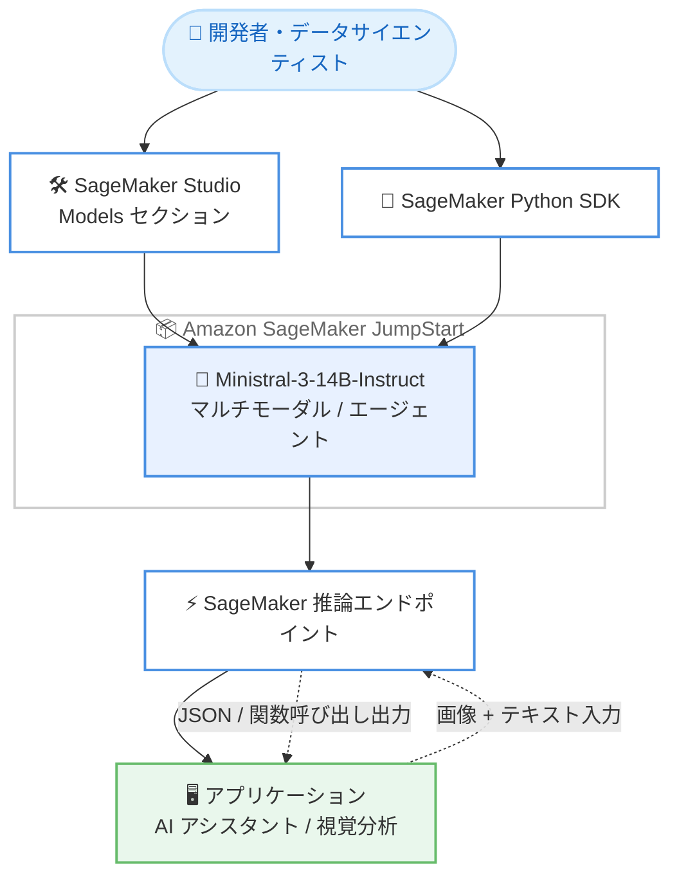

# Amazon SageMaker JumpStart - Ministral-3-14B-Instruct の提供開始

**リリース日**: 2026 年 6 月 18 日
**サービス**: Amazon SageMaker JumpStart
**機能**: Ministral-3-14B-Instruct (マルチモーダル推論・エージェント型 AI 向け基盤モデル)

📊 [このアップデートのインフォグラフィックを見る](https://takech9203.github.io/aws-news-summary/20260618-ministral-3-14b-on-sagemaker-jumpstart.html)
<!-- INFOGRAPHIC_BASE_URL は環境変数から取得 -->

## 概要

AWS は、Mistral AI が開発した基盤モデル Ministral-3-14B-Instruct-2512 を Amazon SageMaker JumpStart で利用できるようになったことを発表しました。これにより、SageMaker JumpStart で提供される基盤モデルのポートフォリオがさらに拡充されます。

このモデルは、14B (140 億) パラメータというコンパクトなアーキテクチャでありながら、フロンティアクラスのマルチモーダル機能を備えています。エッジデプロイ向けに最適化されており、AWS インフラストラクチャ上で高度な AI アシスタント、エージェント型システム、ビジョン対応アプリケーションを構築できます。

Ministral-3-14B-Instruct は、テキストに加えて画像を分析し、視覚的なコンテンツに基づいたインサイトを提供することに優れています。また、ネイティブの関数呼び出し (function calling) と JSON 出力によるエージェント機能、英語、フランス語、スペイン語、ドイツ語、中国語、日本語、韓国語、アラビア語を含む数十言語にわたる多言語理解をサポートします。SageMaker JumpStart を利用することで、お客様はこのモデルを数クリックでデプロイし、それぞれの AI ユースケースに対応できます。

**アップデート前の課題**

- コンパクトかつエッジデプロイに適したサイズで、マルチモーダル (画像 + テキスト) 推論とエージェント機能を両立するモデルの選択肢が限られていた
- 高度な視覚分析やネイティブの関数呼び出しを必要とするアプリケーションでは、大規模で運用コストの高いモデルに依存する必要があった
- 新しい基盤モデルを評価・導入する際に、環境構築やデプロイの手間がかかっていた

**アップデート後の改善**

- 14B パラメータのコンパクトなモデルで、マルチモーダル推論とエージェント機能を AWS 上で利用できるようになった
- SageMaker Studio の Models セクションまたは SageMaker Python SDK から、数クリックでモデルをデプロイできるようになった
- 多言語理解と画像分析を組み合わせた AI アシスタントやエージェント型システムを、AWS マネージドインフラ上で構築できるようになった

## アーキテクチャ図



開発者は SageMaker Studio または Python SDK から JumpStart 経由で Ministral-3-14B-Instruct をデプロイし、推論エンドポイントを通じてマルチモーダル入力の処理やエージェント機能を利用します。

## サービスアップデートの詳細

### 主要機能

1. **マルチモーダル推論 (画像 + テキスト)**
   - テキストに加えて画像を分析し、視覚的なコンテンツに基づくインサイトを提供
   - ビジョン対応アプリケーションの構築が可能

2. **エージェント機能**
   - ネイティブの関数呼び出し (function calling) をサポート
   - 構造化された JSON 出力に対応し、エージェント型システムへの組み込みが容易

3. **多言語理解**
   - 英語、フランス語、スペイン語、ドイツ語、中国語、日本語、韓国語、アラビア語を含む数十言語に対応
   - グローバル向けの AI アシスタント構築に活用可能

4. **コンパクトでエッジ最適化されたアーキテクチャ**
   - 14B パラメータのコンパクトな設計
   - エッジデプロイ向けに最適化

5. **SageMaker JumpStart による簡単なデプロイ**
   - SageMaker Studio の Models セクションから数クリックでデプロイ
   - SageMaker Python SDK によるプログラムからのデプロイにも対応

## 技術仕様

### モデル概要

| 項目 | 詳細 |
|------|------|
| モデル名 | Ministral-3-14B-Instruct-2512 |
| 開発元 | Mistral AI |
| パラメータ数 | 14B (140 億) |
| モダリティ | テキスト + 画像 (マルチモーダル) |
| エージェント機能 | ネイティブ関数呼び出し、JSON 出力 |
| 多言語対応 | 英語、フランス語、スペイン語、ドイツ語、中国語、日本語、韓国語、アラビア語ほか数十言語 |
| 提供方法 | Amazon SageMaker JumpStart |

### API変更履歴

今回のアップデートに直接関連する公開 API の変更は確認されませんでした。SageMaker JumpStart のモデル追加であり、既存の SageMaker デプロイ API を通じて利用します。

## 設定方法

### 前提条件

1. Amazon SageMaker を利用できる AWS アカウント
2. SageMaker Studio ドメインのセットアップ、または SageMaker Python SDK の実行環境
3. モデルのデプロイとエンドポイント作成に必要な IAM 権限
4. 推論エンドポイントに対応するインスタンスタイプのサービスクォータ

### 手順

#### ステップ1: SageMaker Studio からモデルを選択する

SageMaker Studio を開き、Models セクションに移動して Ministral-3-14B-Instruct を選択します。マネジメントコンソール上から数クリックでデプロイを開始できます。

#### ステップ2: SageMaker Python SDK でデプロイする

```python
from sagemaker.jumpstart.model import JumpStartModel

# JumpStart のモデル ID を指定してモデルオブジェクトを作成する
model = JumpStartModel(model_id="<ministral-3-14b-instruct のモデル ID>")

# モデルをデプロイし、推論エンドポイントを作成する
predictor = model.deploy()
```

上記のコードは、JumpStart のモデル ID を指定して Ministral-3-14B-Instruct をデプロイし、推論用のエンドポイントを作成します。正確なモデル ID は SageMaker Studio の Models セクションまたは JumpStart のドキュメントで確認してください。

#### ステップ3: 推論を実行する

デプロイされたエンドポイントに対して、テキストや画像を含むリクエストを送信し、マルチモーダル推論や関数呼び出しによる JSON 出力を取得します。詳細は SageMaker JumpStart のドキュメントを参照してください。

## メリット

### ビジネス面

- **導入の迅速化**: 数クリックでモデルをデプロイでき、AI アプリケーションの開発開始までの時間を短縮できる
- **グローバル対応**: 数十言語をサポートするため、多言語のユーザーを対象としたサービスを単一モデルで構築できる
- **コスト効率**: 14B パラメータのコンパクトなモデルにより、大規模モデルと比較して運用コストを抑えられる可能性がある

### 技術面

- **マルチモーダル対応**: 画像とテキストを組み合わせた推論を単一モデルで実現できる
- **エージェント統合の容易さ**: ネイティブの関数呼び出しと JSON 出力により、エージェント型システムへの組み込みが容易
- **マネージド運用**: SageMaker のマネージドインフラ上でデプロイ・スケーリング・運用を行える

## デメリット・制約事項

### 制限事項

- モデルのデプロイにはインスタンスの起動が伴うため、エンドポイントの稼働時間に応じた費用が発生する
- 利用可能なリージョンやインスタンスタイプは SageMaker JumpStart の対応状況に依存する
- 14B パラメータのモデルであり、より大規模なモデルと比較して特定の高度なタスクでは精度に差が生じる可能性がある

### 考慮すべき点

- 本番利用前に、対象ユースケースでのモデル精度とレイテンシーを評価することを推奨する
- エンドポイントのインスタンスタイプとオートスケーリング設定を、想定されるトラフィックに合わせて調整する必要がある

## ユースケース

### ユースケース1: 視覚対応のカスタマーサポートアシスタント

**シナリオ**: ユーザーが製品の写真をアップロードし、その内容に基づいた問い合わせ対応を行う多言語サポートアシスタントを構築する。

**実装例**:
```
画像 (製品写真) + テキスト (質問) → Ministral-3-14B-Instruct → 視覚分析に基づく回答 (多言語)
```

**効果**: 画像とテキストを組み合わせた問い合わせに対応でき、複数言語のユーザーへ単一モデルでサービスを提供できる。

### ユースケース2: エージェント型ワークフローの自動化

**シナリオ**: 関数呼び出しを利用して外部 API やツールを呼び出し、タスクを自律的に実行するエージェントを構築する。

**実装例**:
```
ユーザー指示 → モデルが関数呼び出しを生成 (JSON) → ツール実行 → 結果を統合して応答
```

**効果**: ネイティブの関数呼び出しと JSON 出力により、信頼性の高いエージェント型ワークフローを実装できる。

### ユースケース3: ドキュメントの視覚的分析

**シナリオ**: 図表や画像を含むドキュメントから情報を抽出し、要約やインサイトを生成する。

**実装例**:
```
ドキュメント画像 → Ministral-3-14B-Instruct → テキスト抽出・要約・インサイト
```

**効果**: テキストだけでは捉えられない視覚情報を含めて分析でき、ドキュメント処理の精度を高められる。

## 料金

Amazon SageMaker JumpStart 経由でデプロイしたモデルの利用には、推論エンドポイントに使用する SageMaker インスタンスの料金が適用されます。料金はインスタンスタイプと稼働時間に基づいて課金されます。詳細は Amazon SageMaker の料金ページを参照してください。

## 利用可能リージョン

利用可能なリージョンは SageMaker JumpStart の対応状況に依存します。最新の対応リージョンについては、SageMaker Studio の Models セクションまたは SageMaker JumpStart のドキュメントで確認してください。

## 関連サービス・機能

- **Amazon SageMaker Studio**: モデルの検索・デプロイ・管理を行う統合開発環境
- **Amazon SageMaker Python SDK**: プログラムからモデルをデプロイ・推論するためのライブラリ
- **Amazon Bedrock**: 基盤モデルを API 経由で利用する代替アプローチ (フルマネージド型)

## 参考リンク

- 📊 [インフォグラフィック](https://takech9203.github.io/aws-news-summary/20260618-ministral-3-14b-on-sagemaker-jumpstart.html)
- [公式発表 (What's New)](https://aws.amazon.com/about-aws/whats-new/2026/06/ministral-3-14b-on-sagemaker-jumpstart/)
- [Amazon SageMaker JumpStart ドキュメント](https://docs.aws.amazon.com/sagemaker/latest/dg/studio-jumpstart.html)
- [Amazon SageMaker 料金ページ](https://aws.amazon.com/sagemaker/pricing/)

## まとめ

Ministral-3-14B-Instruct の SageMaker JumpStart での提供開始により、マルチモーダル推論、エージェント機能、多言語対応をコンパクトなモデルで AWS 上に簡単に導入できるようになりました。視覚分析やエージェント型ワークフローを検討しているチームは、SageMaker Studio または Python SDK からモデルをデプロイし、対象ユースケースでの精度とコストを評価することを推奨します。
