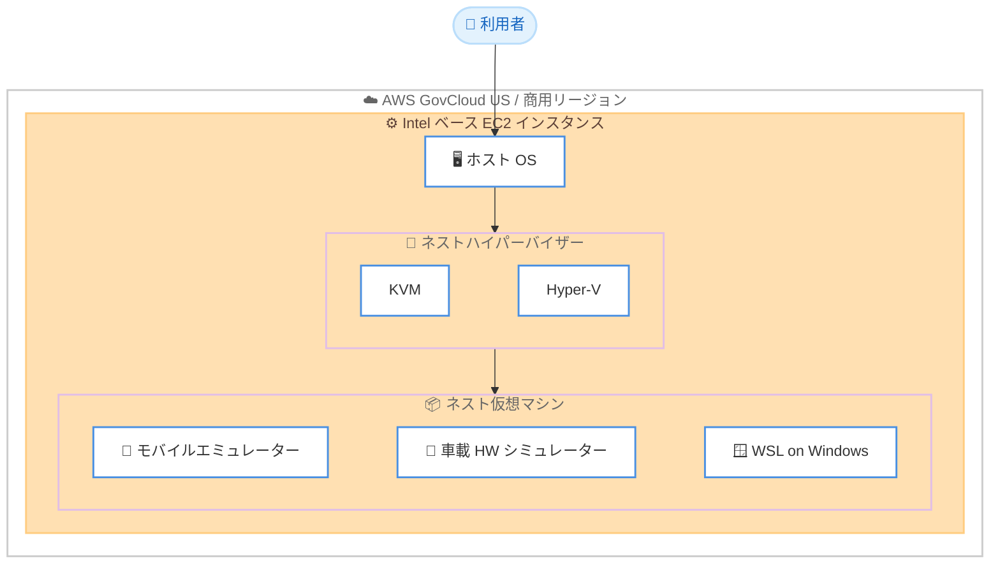

# Amazon EC2 - ネスト仮想化の対応プラットフォーム拡大と AWS GovCloud (US) 対応

**リリース日**: 2026 年 6 月 18 日
**サービス**: Amazon EC2
**機能**: ネスト仮想化 (Nested Virtualization)

📊 [このアップデートのインフォグラフィックを見る](https://takech9203.github.io/aws-news-summary/20260618-nested-virtualization-intel-us-gov-cloud.html)
<!-- INFOGRAPHIC_BASE_URL は環境変数から取得 -->

## 概要

Amazon EC2 のネスト仮想化機能が、より多くの Intel ベースインスタンスと AWS GovCloud (US) リージョンで利用可能になりました。ネスト仮想化を使用すると、お客様は仮想 EC2 インスタンス上で KVM または Hyper-V を実行し、ネストされた仮想環境を構築できます。

今回のアップデートにより、これまで対応していた C8i、M8i、R8i インスタンスに加えて、第 7 世代の Intel インスタンスを中心とした幅広いインスタンスファミリーでネスト仮想化が利用可能になりました。具体的には C7i、R7i、M7i、C7id、R7id、M7id、C7i-flex、R7i-flex、M7i-flex、I7i、C8i-flex、R8i-flex、M8i-flex、X8i が新たに対応しています。

さらに、これまで全ての商用リージョンで提供されていた本機能が、AWS GovCloud (US-East) および AWS GovCloud (US-West) でも利用可能になりました。これにより、規制要件の厳しい米国政府機関やその関連事業者も、ネスト仮想化を活用できるようになります。

**アップデート前の課題**

- ネスト仮想化に対応するインスタンスが C8i、M8i、R8i など限られたインスタンスファミリーのみであり、ワークロードに応じたインスタンス選択の柔軟性が低かった
- フレックスインスタンス (flex) やストレージ最適化インスタンス (I7i)、メモリ最適化の大規模インスタンス (X8i) などでネスト仮想化を利用できなかった
- AWS GovCloud (US) リージョンではネスト仮想化が利用できず、米国政府機関向けワークロードで KVM や Hyper-V を実行できなかった

**アップデート後の改善**

- 第 7 世代を含む幅広い Intel インスタンスファミリーでネスト仮想化が利用可能になり、コストとパフォーマンスの要件に応じたインスタンス選択が可能になった
- フレックスインスタンスやストレージ最適化、大規模メモリインスタンスでもネストされた仮想環境を構築できるようになった
- AWS GovCloud (US-East/US-West) でネスト仮想化が利用可能になり、規制対象の米国政府ワークロードでも対応できるようになった

## アーキテクチャ図



ネスト仮想化により、EC2 インスタンス上で動作するホスト OS 内で KVM や Hyper-V を実行し、その上にさらに仮想マシンを構築できます。

## サービスアップデートの詳細

### 主要機能

1. **対応 Intel インスタンスファミリーの拡大**
   - 既存の対応インスタンス: C8i、M8i、R8i
   - 新たに対応するインスタンス: C7i、R7i、M7i、C7id、R7id、M7id、C7i-flex、R7i-flex、M7i-flex、I7i、C8i-flex、R8i-flex、M8i-flex、X8i
   - コンピューティング最適化、メモリ最適化、汎用、ストレージ最適化、フレックスといった多様なワークロード特性に対応

2. **KVM および Hyper-V のサポート**
   - 仮想 EC2 インスタンス上で KVM (Kernel-based Virtual Machine) を実行可能
   - Microsoft Hyper-V を実行可能
   - ネストされた仮想マシン環境を EC2 上で構築できる

3. **AWS GovCloud (US) リージョンへの対応**
   - AWS GovCloud (US-East) で利用可能
   - AWS GovCloud (US-West) で利用可能
   - 既存の全商用リージョンに加えて提供範囲を拡大

## 技術仕様

### 対応インスタンスファミリー

| 分類 | 対応インスタンス |
|------|------------------|
| 既存対応 | C8i、M8i、R8i |
| 新規対応 (第 7 世代) | C7i、R7i、M7i、C7id、R7id、M7id、C7i-flex、R7i-flex、M7i-flex、I7i |
| 新規対応 (第 8 世代 flex / 大規模) | C8i-flex、R8i-flex、M8i-flex、X8i |

### API 変更履歴

今回のアップデートに直接関連する EC2 API メソッドの追加・変更は確認されていません。ネスト仮想化は対応インスタンスのプラットフォーム単位で提供される機能のため、専用の新規 API は伴いません。

## 設定方法

### 前提条件

1. ネスト仮想化に対応した Intel ベースインスタンスファミリー (C7i、M7i、R7i、I7i、X8i など) を選択する
2. 商用リージョンまたは AWS GovCloud (US-East/US-West) を利用する
3. ネスト環境で実行する KVM または Hyper-V の要件を確認する

### 手順

#### ステップ1: 対応インスタンスの起動

```bash
aws ec2 run-instances \
  --image-id ami-xxxxxxxxxxxxxxxxx \
  --instance-type m7i.4xlarge \
  --key-name my-key-pair \
  --region us-gov-west-1
```

ネスト仮想化に対応したインスタンスタイプ (この例では m7i.4xlarge) を指定して EC2 インスタンスを起動します。AWS GovCloud (US-West) で起動する場合はリージョンに us-gov-west-1 を指定します。

#### ステップ2: ハイパーバイザーのセットアップ

```bash
# KVM の場合 (Linux ホスト)
sudo apt-get update && sudo apt-get install -y qemu-kvm libvirt-daemon-system
sudo kvm-ok
```

ホスト OS 内に KVM をインストールし、kvm-ok コマンドでハードウェア仮想化支援が利用可能であることを確認します。Hyper-V を使用する場合は Windows ホスト上で Hyper-V の役割を有効化します。

#### ステップ3: ネスト仮想マシンの作成

KVM や Hyper-V の管理ツールを使用して、ホスト OS 上にネストされた仮想マシンを作成します。詳細な手順は [Amazon EC2 ネスト仮想化ガイド](https://docs.aws.amazon.com/AWSEC2/latest/UserGuide/amazon-ec2-nested-virtualization.html) を参照してください。

## メリット

### ビジネス面

- **インスタンス選択の柔軟性向上**: コンピューティング最適化、メモリ最適化、ストレージ最適化、フレックスなど多様なインスタンスからワークロードに最適なものを選択できる
- **政府機関ワークロードへの対応**: AWS GovCloud (US) 対応により、規制要件の厳しい米国政府機関やその関連事業者でもネスト仮想化を活用できる
- **コスト最適化**: フレックスインスタンス (flex) を活用することで、定常的に高い CPU 性能を必要としないワークロードのコストを抑えられる

### 技術面

- **既存仮想化資産の活用**: オンプレミスで利用してきた KVM や Hyper-V ベースの環境を EC2 上で再現できる
- **開発・テスト環境の集約**: モバイルエミュレーターや車載ハードウェアシミュレーターなど、ネスト環境を必要とするワークロードをクラウドに集約できる
- **幅広い世代への対応**: 第 7 世代と第 8 世代の Intel インスタンスにまたがって対応するため、移行や検証がしやすい

## デメリット・制約事項

### 制限事項

- ネスト仮想化は対応した Intel ベースインスタンスファミリーでのみ利用可能で、本アップデートに含まれないインスタンスでは利用できない
- リージョンの追加対象は AWS GovCloud (US-East) と AWS GovCloud (US-West) であり、その他のリージョンは既存の商用リージョン提供範囲に準じる
- ネストされた仮想マシンはホストインスタンスのリソースを共有するため、物理ハードウェアと比較してパフォーマンスのオーバーヘッドが生じる

### 考慮すべき点

- ネスト環境を実行するには十分な CPU、メモリ、ストレージ容量を持つインスタンスサイズの選択が必要
- KVM や Hyper-V のライセンスおよびサポート条件は各仮想化ソフトウェアの提供元の規約に従う必要がある

## ユースケース

### ユースケース1: モバイルアプリケーションのエミュレーション

**シナリオ**: モバイルアプリ開発において、多数の端末構成でアプリの動作を検証する必要がある。物理端末の管理は手間がかかる。

**実装例**:
```
M7i または C7i インスタンス上で KVM を実行し、
複数の Android エミュレーターをネスト仮想マシンとして起動
```

**効果**: クラウド上でスケーラブルにエミュレーターを実行でき、テスト環境を柔軟に拡張できる

### ユースケース2: 車載ハードウェアのシミュレーション

**シナリオ**: 自動車開発において、車載 ECU やハードウェアの挙動をシミュレートし、ソフトウェアを検証したい。

**実装例**:
```
R7i などメモリ最適化インスタンス上で Hyper-V または KVM を実行し、
車載ハードウェアシミュレーターをネスト環境で動作
```

**効果**: 物理ハードウェアを用意せずにシミュレーション環境を構築でき、開発サイクルを短縮できる

### ユースケース3: Windows ワークステーション上での WSL 実行

**シナリオ**: Windows ベースの開発ワークステーションを EC2 上に構築し、その中で Windows Subsystem for Linux (WSL) を利用したい。

**実装例**:
```
Intel ベースインスタンス上で Windows を実行し、
ネスト仮想化により WSL を有効化
```

**効果**: クラウド上の Windows 環境で Linux ツールチェーンを利用でき、開発者の作業環境を一元管理できる

## 料金

ネスト仮想化機能そのものに対する追加料金はありません。利用するのは対応した EC2 インスタンスであり、通常の EC2 インスタンス料金 (オンデマンド、Savings Plans、スポットなど) が適用されます。料金の詳細は [Amazon EC2 料金ページ](https://aws.amazon.com/ec2/pricing/) を参照してください。

## 利用可能リージョン

- 全ての商用リージョン (既存)
- AWS GovCloud (US-East) (今回追加)
- AWS GovCloud (US-West) (今回追加)

## 関連サービス・機能

- **Amazon EC2**: ネスト仮想化はホストとなる EC2 インスタンス上で動作する機能
- **AWS GovCloud (US)**: 米国政府機関の規制要件に対応した分離リージョンで、今回新たにネスト仮想化に対応
- **Amazon EC2 フレックスインスタンス**: C7i-flex、M8i-flex などコスト効率の高いインスタンスでもネスト仮想化を利用可能

## 参考リンク

- 📊 [インフォグラフィック](https://takech9203.github.io/aws-news-summary/20260618-nested-virtualization-intel-us-gov-cloud.html)
- [公式発表 (What's New)](https://aws.amazon.com/about-aws/whats-new/2026/06/nested-virtualization-intel-us-gov-cloud/)
- [ドキュメント (Amazon EC2 ネスト仮想化ガイド)](https://docs.aws.amazon.com/AWSEC2/latest/UserGuide/amazon-ec2-nested-virtualization.html)
- [料金ページ (Amazon EC2 Pricing)](https://aws.amazon.com/ec2/pricing/)

## まとめ

今回のアップデートにより、ネスト仮想化が第 7 世代を含む幅広い Intel インスタンスと AWS GovCloud (US) リージョンで利用可能になり、KVM や Hyper-V を用いたネスト環境構築の選択肢が大きく広がりました。モバイルエミュレーション、車載シミュレーション、WSL 実行などのワークロードを持つお客様は、対応インスタンスファミリーの中からコストとパフォーマンスに最適なものを選択することを推奨します。
