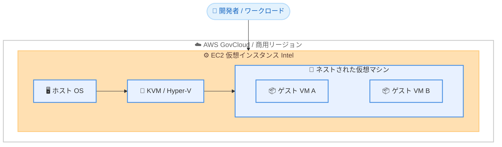

# Amazon EC2 - ネステッドバーチャライゼーションの対応 Intel プラットフォーム拡大と US Gov Cloud リージョン対応

**リリース日**: 2026 年 6 月 18 日
**サービス**: Amazon EC2
**機能**: Nested Virtualization (ネステッドバーチャライゼーション)

📊 [このアップデートのインフォグラフィックを見る](https://takech9203.github.io/aws-news-summary/20260618-nested-virtualization-intel-us-gov-cloud.html)
<!-- INFOGRAPHIC_BASE_URL は環境変数から取得 -->

## 概要

Amazon EC2 のネステッドバーチャライゼーション (Nested Virtualization) が、新たに多数の Intel ベースインスタンスファミリーで利用可能になり、加えて AWS GovCloud (US) リージョンにも対応しました。ネステッドバーチャライゼーションは、仮想 EC2 インスタンス上で KVM や Hyper-V といったハイパーバイザーを実行し、その内部でさらに仮想マシンを起動できる機能です。これにより、物理サーバーを用意することなく、入れ子構造の仮想化環境をクラウド上で構築できます。

今回のアップデートにより、これまで対応していた C8i、M8i、R8i に加えて、C7i、R7i、M7i、C8id、R8id、M8id、C7i-flex、M7i-flex、I7i、C8i-flex、R8i-flex、M8i-flex、X8i といった幅広い Intel インスタンスタイプでネステッドバーチャライゼーションが利用できるようになりました。さらに、これまで全ての商用リージョンで提供されていた本機能が、AWS GovCloud (US-East) および AWS GovCloud (US-West) リージョンでも利用可能になりました。

モバイルアプリケーション向けエミュレーターの実行、自動車向け車載ハードウェアのシミュレーション、Windows ワークステーション上での Windows Subsystem for Linux (WSL) の実行など、ハイパーバイザーへのアクセスを必要とするワークロードを持つ開発者や、政府機関向けの規制環境を扱うお客様にとって、選択肢が大きく広がります。

**アップデート前の課題**

- 以前はネステッドバーチャライゼーションが C8i、M8i、R8i など限られたインスタンスファミリーでしか利用できず、ワークロードに最適なインスタンスを選びにくかった
- 以前は AWS GovCloud (US) リージョンで本機能を利用できず、規制要件のある政府関連ワークロードでクラウド上の入れ子仮想化を活用できなかった
- 以前はストレージ最適化やフレックスインスタンスなど、特定の特性を持つインスタンスでネステッドバーチャライゼーションを使えなかった

**アップデート後の改善**

- 今回のアップデートにより、コンピューティング最適化 (C 系)、汎用 (M 系)、メモリ最適化 (R 系)、ストレージ最適化 (I7i など)、フレックスインスタンス (flex 系) を含む幅広い Intel インスタンスでネステッドバーチャライゼーションが利用可能になった
- 今回のアップデートにより、AWS GovCloud (US-East / US-West) でも本機能が利用可能になり、規制環境のワークロードでも入れ子仮想化を実行できるようになった
- 今回のアップデートにより、ワークロードの特性 (CPU、メモリ、ストレージ、コスト最適化) に応じて最適なインスタンスを選択しながらネステッドバーチャライゼーションを利用できるようになった

## アーキテクチャ図

仮想 EC2 インスタンス上で KVM または Hyper-V を動作させ、その上でさらにゲスト仮想マシンを起動する入れ子構造を表しています。

## サービスアップデートの詳細

### 主要機能

1. **対応 Intel インスタンスファミリーの拡大**
   - これまで対応していた C8i、M8i、R8i に追加して、多数の Intel インスタンスタイプに対応
   - コンピューティング最適化、汎用、メモリ最適化、ストレージ最適化、フレックスインスタンスを横断してサポート
   - ワークロードの要件に合わせた柔軟なインスタンス選択が可能

2. **AWS GovCloud (US) リージョンへの対応**
   - AWS GovCloud (US-East) および AWS GovCloud (US-West) で利用可能に
   - 規制要件の厳しい政府機関や関連業界のワークロードでも入れ子仮想化を実行可能

3. **複数ハイパーバイザーのサポート**
   - 仮想 EC2 インスタンス上で KVM または Hyper-V を実行可能
   - Linux 系および Windows 系の仮想化スタックの双方に対応

## 技術仕様

### 対応インスタンスタイプ

| カテゴリ | インスタンスタイプ |
|------|------|
| 既存対応 | C8i, M8i, R8i |
| 今回追加 (第 7 世代) | C7i, R7i, M7i, C7i-flex, M7i-flex, I7i |
| 今回追加 (第 8 世代) | C8id, R8id, M8id, C8i-flex, R8i-flex, M8i-flex, X8i |

### サポートされるハイパーバイザー

| 項目 | 詳細 |
|------|------|
| KVM | Linux ベースの仮想化スタック向け |
| Hyper-V | Windows ベースの仮想化スタック向け (WSL 含む) |
| 実行基盤 | 仮想 EC2 インスタンス上で動作 |

## メリット

### ビジネス面

- **政府機関ワークロードへの対応**: AWS GovCloud (US) 対応により、規制環境を扱うお客様もクラウド上で入れ子仮想化を活用できる
- **物理サーバー不要**: オンプレミスでハイパーバイザーホストを保有・運用する必要がなく、初期投資と運用負荷を削減できる
- **コスト最適化の柔軟性**: flex インスタンスを含む選択肢が広がり、ワークロードに応じたコスト効率の高い構成を選べる

### 技術面

- **インスタンス選択の自由度向上**: CPU、メモリ、ストレージ、コスト特性に応じて最適なインスタンスファミリーを選択できる
- **多様なハイパーバイザー対応**: KVM と Hyper-V の双方をサポートし、Linux / Windows いずれの仮想化要件にも対応
- **開発・テスト環境の再現性**: エミュレーターやシミュレーション環境をクラウド上で容易に構築・スケールできる

## デメリット・制約事項

### 制限事項

- 対応するのは公式発表で挙げられた Intel インスタンスタイプに限られる
- 仮想インスタンス上での実行が前提となっており、ベアメタルインスタンスに関する記載は本発表には含まれない
- ネストされた仮想マシンを動作させる場合、ホスト側に追加の CPU・メモリリソースが必要となる

### 考慮すべき点

- 入れ子構造の仮想化はネイティブ実行と比べてパフォーマンスのオーバーヘッドが生じる可能性がある
- ワークロードに必要なリソースを見積もり、適切なインスタンスサイズを選定する必要がある

## ユースケース

### ユースケース1: モバイルアプリケーション向けエミュレーター

**シナリオ**: モバイルアプリの CI/CD パイプラインで、Android などのエミュレーターを EC2 上で実行し、自動テストを行う。

**効果**: 物理デバイスやオンプレミスのテストホストを用意することなく、クラウド上でスケーラブルにエミュレーターを実行できる。

### ユースケース2: 車載ハードウェアのシミュレーション

**シナリオ**: 自動車業界の開発チームが、車載 ECU やハードウェア環境を仮想化してシミュレーションを実行する。

**効果**: 開発・検証サイクルを高速化し、ハードウェアの調達コストを抑えながら多数のシミュレーションを並行実行できる。

### ユースケース3: Windows ワークステーション上での WSL 実行

**シナリオ**: EC2 上の Windows ワークステーションで Hyper-V を有効化し、Windows Subsystem for Linux (WSL) を利用する。

**効果**: 開発者が Windows と Linux の双方の環境をクラウド上の単一インスタンスで利用でき、開発環境の標準化が進む。

## 料金

ネステッドバーチャライゼーション機能自体に対する追加料金は発生しません。利用する EC2 インスタンスの通常の料金が適用されます。詳細は EC2 の料金ページを参照してください。

## 利用可能リージョン

全ての商用リージョンに加えて、新たに AWS GovCloud (US-East) および AWS GovCloud (US-West) で利用可能になりました。

## 関連サービス・機能

- **Amazon EC2**: ネステッドバーチャライゼーションを実行する基盤となるコンピューティングサービス
- **AWS GovCloud (US)**: 規制要件に対応した分離されたリージョン環境
- **Windows Subsystem for Linux (WSL)**: Hyper-V を利用したユースケースの一つ

## 参考リンク

- 📊 [インフォグラフィック](https://takech9203.github.io/aws-news-summary/20260618-nested-virtualization-intel-us-gov-cloud.html)
- [公式発表 (What's New)](https://aws.amazon.com/about-aws/whats-new/2026/06/nested-virtualization-intel-us-gov-cloud/)
- [Amazon EC2 料金](https://aws.amazon.com/ec2/pricing/)

## まとめ

今回のアップデートにより、Amazon EC2 のネステッドバーチャライゼーションが幅広い Intel インスタンスファミリーと AWS GovCloud (US) リージョンで利用可能になり、エミュレーターやシミュレーション、WSL などのワークロードに対する選択肢が大きく広がりました。入れ子仮想化を活用しているお客様は、ワークロードの特性に最も適したインスタンスタイプへの移行や、規制環境での新たな活用を検討することをおすすめします。
