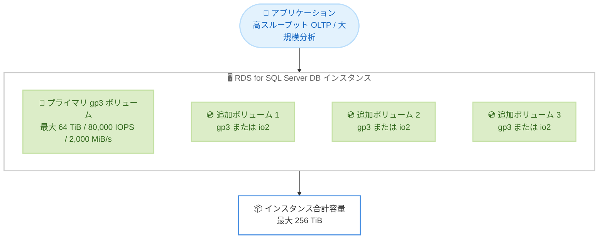

# Amazon RDS for SQL Server - General Purpose (gp3) ボリュームの最大サイズとプロビジョンドパフォーマンスの拡張

**リリース日**: 2026 年 6 月 18 日
**サービス**: Amazon Relational Database Service (Amazon RDS) for SQL Server
**機能**: General Purpose (gp3) ストレージのボリュームレベル上限の引き上げ

📊 [このアップデートのインフォグラフィックを見る](https://takech9203.github.io/aws-news-summary/20260618-rds-sqlserver-increases-gp3-limits.html)
<!-- INFOGRAPHIC_BASE_URL は環境変数から取得 -->

## 概要

Amazon RDS for SQL Server は、General Purpose (gp3) ストレージのボリュームレベルの上限を大幅に引き上げました。今回のアップデートにより、1 つの gp3 ボリュームあたりのサイズは最大 64 TiB (従来の 16 TiB の 4 倍)、プロビジョンド IOPS は最大 80,000 IOPS (従来の 16,000 IOPS の 5 倍)、スループットは最大 2,000 MiB/s (従来の 1,000 MiB/s の 2 倍) までスケールできるようになりました。

この拡張により、お客様は従来よりも大規模な Microsoft SQL Server データベースを Amazon RDS 上で運用できます。高スループットの OLTP システムや大規模な分析ワークロードなど、I/O 要件が厳しいワークロードは、単一ボリュームでより高い IOPS とスループットを活用でき、ストレージ管理をシンプルに保ちながらミッションクリティカルな SQL Server ワークロードのパフォーマンスを向上できます。

さらに、追加ストレージボリュームを構成することで、DB インスタンスあたり最大 3 つの gp3 または io2 ボリュームを追加でき、インスタンスあたりの合計容量を最大 256 TiB まで拡張できます。料金体系に変更はなく、お客様はストレージと、ベースラインのデフォルトを超えてプロビジョニングした追加の IOPS およびスループットに対してのみ料金を支払います。

**アップデート前の課題**

- 1 つの gp3 ボリュームは最大 16 TiB までしかスケールできず、大規模な SQL Server データベースでは容量が不足していた
- プロビジョンド IOPS は単一ボリュームあたり最大 16,000 IOPS に制限され、I/O 集約型ワークロードの性能要件を満たしにくかった
- スループットは単一ボリュームあたり最大 1,000 MiB/s に制限されていた

**アップデート後の改善**

- 1 つの gp3 ボリュームを最大 64 TiB (4 倍) までスケールできるようになった
- プロビジョンド IOPS を単一ボリュームで最大 80,000 IOPS (5 倍) までプロビジョニングできるようになった
- スループットを単一ボリュームで最大 2,000 MiB/s (2 倍) までプロビジョニングできるようになった
- より高い容量・性能を単一ボリュームで実現できるため、ストレージ管理がシンプルになった

## アーキテクチャ図



単一 gp3 ボリュームの上限引き上げに加え、追加ストレージボリュームを組み合わせることで DB インスタンスあたり合計最大 256 TiB まで拡張できる構成を示しています。

## サービスアップデートの詳細

### 主要機能

1. **ボリュームサイズの拡張**
   - 1 つの gp3 ボリュームを最大 64 TiB までスケール可能
   - 従来の 16 TiB 上限の 4 倍
   - 単一ボリュームで大規模データベースを格納できるため、ストレージ構成がシンプルになる

2. **プロビジョンド IOPS の引き上げ**
   - 1 つの gp3 ボリュームで最大 80,000 IOPS までプロビジョニング可能
   - 従来の 16,000 IOPS 上限の 5 倍
   - 高スループットの OLTP システムなど、I/O 要件の厳しいワークロードに対応

3. **スループットの引き上げ**
   - 1 つの gp3 ボリュームで最大 2,000 MiB/s までプロビジョニング可能
   - 従来の 1,000 MiB/s 上限の 2 倍
   - 大規模な分析ワークロードでのシーケンシャル I/O 性能を強化

4. **追加ストレージボリュームとの組み合わせ**
   - DB インスタンスあたり最大 3 つの gp3 または io2 ボリュームを追加可能
   - プライマリと追加ボリュームを合わせてインスタンスあたり合計最大 256 TiB まで拡張可能
   - gp3 と io2 を混在させ、コストとパフォーマンスを最適化できる

## 技術仕様

### gp3 ボリュームレベル上限の比較 (RDS for SQL Server)

| 項目 | 従来の上限 | 新しい上限 | 倍率 |
|------|------------|------------|------|
| ボリュームサイズ | 16 TiB | 64 TiB | 4 倍 |
| プロビジョンド IOPS | 16,000 IOPS | 80,000 IOPS | 5 倍 |
| プロビジョンドスループット | 1,000 MiB/s | 2,000 MiB/s | 2 倍 |
| インスタンス合計容量 (追加ボリューム利用時) | - | 最大 256 TiB | - |

### gp3 ストレージの特性

| 項目 | 詳細 |
|------|------|
| ベースラインパフォーマンス | 3,000 IOPS / 125 MiB/s |
| 性能とサイズの独立性 | IOPS・スループットをストレージ容量とは独立してプロビジョニング可能 |
| 追加プロビジョニング対象 | ベースラインを超える IOPS とスループットのみ課金対象 |
| 追加ボリューム種別 | gp3 または io2 を最大 3 つまで追加可能 |

## 設定方法

### 前提条件

1. Amazon RDS for SQL Server の DB インスタンスを利用していること
2. ストレージタイプが gp3 であること
3. プロビジョニングする IOPS・スループットを十分に活用できる DB インスタンスクラスを選択していること

### 手順

#### ステップ1: 既存インスタンスのストレージを変更する

```bash
aws rds modify-db-instance \
    --db-instance-identifier my-sqlserver-instance \
    --allocated-storage 32768 \
    --storage-type gp3 \
    --iops 40000 \
    --storage-throughput 1500 \
    --apply-immediately
```

このコマンドは、既存の SQL Server DB インスタンスのストレージを 32 TiB (32,768 GiB) に拡張し、プロビジョンド IOPS を 40,000、スループットを 1,500 MiB/s に設定します。`--apply-immediately` により変更を即時適用します。

#### ステップ2: 新規インスタンス作成時に高性能 gp3 を指定する

```bash
aws rds create-db-instance \
    --db-instance-identifier new-sqlserver-instance \
    --engine sqlserver-se \
    --db-instance-class db.r6i.4xlarge \
    --allocated-storage 65536 \
    --storage-type gp3 \
    --iops 80000 \
    --storage-throughput 2000 \
    --master-username admin \
    --master-user-password <パスワード>
```

このコマンドは、64 TiB (65,536 GiB) の gp3 ストレージに最大値である 80,000 IOPS および 2,000 MiB/s のスループットをプロビジョニングした新規 SQL Server インスタンスを作成します。

#### ステップ3: 追加ストレージボリュームを構成する

合計容量を 256 TiB まで拡張する場合は、RDS マネジメントコンソールまたは CLI から追加ストレージボリューム (最大 3 つの gp3 または io2) を構成します。各ボリュームに対して個別にストレージタイプ・サイズ・性能を設定できるため、アクセス頻度の高いデータと低いデータでボリュームを使い分けられます。

## メリット

### ビジネス面

- **大規模ワークロードの集約**: 単一インスタンスで最大 256 TiB を扱えるため、データベースの分割やシャーディングの必要性を低減できる
- **コスト効率**: ベースラインを超えてプロビジョニングした分のみ課金されるため、性能要件に応じた最適なコスト配分が可能
- **料金変更なし**: 上限引き上げに伴う料金体系の変更はなく、追加コストなしで上限拡張の恩恵を受けられる

### 技術面

- **性能スケーラビリティ**: 単一ボリュームで最大 80,000 IOPS / 2,000 MiB/s を確保でき、I/O 集約型ワークロードに対応
- **ストレージ管理の簡素化**: 大容量を単一ボリュームで構成できるため、ボリューム分割による複雑さを軽減
- **柔軟な構成**: 追加ボリュームで gp3 と io2 を混在でき、データアクセスパターンに応じた最適化が可能

## デメリット・制約事項

### 制限事項

- プロビジョニングした IOPS・スループットは、DB インスタンスクラスのネットワーク帯域や EBS 最適化上限を超えて利用することはできない
- インスタンスクラスの上限が低い場合、プロビジョニングした性能をフルに活用できない可能性がある
- 性能を最大限に引き出すには、十分な帯域と IOPS をサポートする現行世代のインスタンスクラスの選択が必要

### 考慮すべき点

- ストレージタイプや性能を変更するとボリュームが `optimizing` 状態となり、変更中は性能が一時的に変動する場合がある
- 1 ボリュームから複数ボリュームへの変更などでは、データ移行に伴い大量の IOPS・スループットを消費し、完了まで時間を要することがある
- IOPS とストレージ (GiB) の比率には制約があるため、プロビジョニング前に要件を確認する

## ユースケース

### ユースケース1: 高スループット OLTP システム

**シナリオ**: 大量のトランザクションを処理する基幹業務システムで、従来の 16,000 IOPS 上限がボトルネックになっていた。

**実装例**:
```
ストレージタイプ: gp3
プロビジョンド IOPS: 80,000
スループット: 2,000 MiB/s
```

**効果**: 単一ボリュームで従来の 5 倍の IOPS を確保し、トランザクション処理のレイテンシーとスループットを改善できる。

### ユースケース2: 大規模分析ワークロード

**シナリオ**: 数十 TiB 規模のデータウェアハウスに対し、複数のボリュームに分割せず単一インスタンスで運用したい。

**実装例**:
```
プライマリ gp3 ボリューム: 64 TiB
追加 gp3 / io2 ボリューム: 最大 3 つ
インスタンス合計容量: 最大 256 TiB
```

**効果**: ストレージ分割の管理オーバーヘッドを抑えつつ、大規模データセットを単一インスタンスで保持できる。

### ユースケース3: コストとパフォーマンスの両立

**シナリオ**: アクセス頻度の高いデータと、アーカイブ用途のコールドデータを同一インスタンスで管理したい。

**実装例**:
```
プライマリ + 追加ボリューム 1: io2 (高頻度アクセスデータ)
追加ボリューム 2 / 3: gp3 (アーカイブデータ)
```

**効果**: ホットデータを高性能な io2 に、コールドデータをコスト効率の高い gp3 に配置し、コストとパフォーマンスを最適化できる。

## 料金

今回のアップデートに伴う料金体系の変更はありません。お客様は、プロビジョニングしたストレージ容量と、ベースライン (3,000 IOPS / 125 MiB/s) を超えてプロビジョニングした追加の IOPS およびスループットに対してのみ料金を支払います。具体的な料金とリージョンごとの提供状況は、Amazon RDS for SQL Server の料金ページを参照してください。

## 利用可能リージョン

リージョンごとの提供状況については、Amazon RDS for SQL Server の料金ページを参照してください。

## 関連サービス・機能

- **Amazon EBS (gp3 / io2)**: RDS のストレージ基盤となるブロックストレージ。今回拡張されたのは gp3 ボリュームの上限
- **Amazon RDS 追加ストレージボリューム**: RDS for SQL Server および Oracle で最大 3 つの追加ボリュームを構成し、合計容量を拡張する機能
- **Amazon RDS ストレージ自動スケーリング**: ストレージ容量を需要に応じて自動拡張する機能で、IOPS とストレージ容量の比率制約が同様に適用される

## 参考リンク

- 📊 [インフォグラフィック](https://takech9203.github.io/aws-news-summary/20260618-rds-sqlserver-increases-gp3-limits.html)
- [公式発表 (What's New)](https://aws.amazon.com/about-aws/whats-new/2026/06/rds-sqlserver-increases-gp3-limits/)
- [Amazon RDS DB インスタンスストレージ (ドキュメント)](https://docs.aws.amazon.com/AmazonRDS/latest/UserGuide/CHAP_Storage.html)
- [Amazon RDS for SQL Server 料金ページ](https://aws.amazon.com/rds/sqlserver/pricing/)

## まとめ

このアップデートにより、Amazon RDS for SQL Server の gp3 ボリュームは単一ボリュームで最大 64 TiB / 80,000 IOPS / 2,000 MiB/s までスケールでき、追加ストレージボリュームと組み合わせてインスタンスあたり最大 256 TiB を実現できます。料金変更なしで大規模かつ I/O 集約型の SQL Server ワークロードに対応できるため、性能不足やストレージ分割に課題を抱えていた場合は、対象インスタンスのストレージ構成の見直しを検討することをお勧めします。
