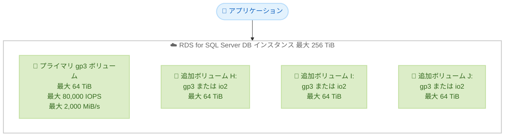

# Amazon RDS for SQL Server - General Purpose (gp3) ボリュームの最大サイズとプロビジョンドパフォーマンスの拡張

**リリース日**: 2026 年 6 月 18 日
**サービス**: Amazon RDS for SQL Server
**機能**: General Purpose (gp3) ストレージボリュームの上限拡張

📊 [このアップデートのインフォグラフィックを見る](https://takech9203.github.io/aws-news-summary/20260618-rds-sqlserver-increases-gp3-limits.html)

## 概要

Amazon RDS for SQL Server は、General Purpose (gp3) ストレージボリュームの最大サイズとプロビジョンドパフォーマンスの上限を大幅に引き上げました。これにより、単一の gp3 ボリュームあたりの最大サイズが従来の 16 TiB から 64 TiB へ、最大プロビジョンド IOPS が 16,000 から 80,000 へ、最大スループットが 1,000 MiB/s から 2,000 MiB/s へと拡張されています。

この拡張は、コストパフォーマンスに優れた gp3 ストレージを使用しながら、より大規模で I/O 要求の高い SQL Server ワークロードを実行したいお客様を対象としています。高スループットの OLTP システムや大規模な分析ワークロードなど、これまで io2 などのプロビジョンド IOPS ストレージへの移行が必要だったケースでも、gp3 のまま要件を満たせる可能性が広がります。

さらに、RDS for SQL Server では追加ストレージボリュームを最大 3 つアタッチできるため、各 gp3 ボリュームを最大 64 TiB までサイズ設定することで、DB インスタンスあたり合計最大 256 TiB のストレージ容量を構成できます。今回のアップデートに伴う料金体系の変更はなく、お客様はストレージ容量と、ベースラインを超えてプロビジョニングした IOPS およびスループットに対してのみ課金されます。

**アップデート前の課題**

- gp3 ボリュームの最大サイズが 16 TiB に制限されており、大規模データベースでは容量が不足する場合があった
- gp3 でプロビジョニングできる最大 IOPS が 16,000、最大スループットが 1,000 MiB/s に制限されていた
- これらの上限を超える性能や容量が必要な場合、io2 などのプロビジョンド IOPS ストレージへの移行を検討する必要があった

**アップデート後の改善**

- 単一の gp3 ボリュームの最大サイズが 64 TiB (従来比 4 倍) に拡張された
- gp3 の最大プロビジョンド IOPS が 80,000 (従来比 5 倍)、最大スループットが 2,000 MiB/s (従来比 2 倍) に拡張された
- 追加ストレージボリュームと組み合わせることで、DB インスタンスあたり最大 256 TiB のストレージ容量を実現できる

## アーキテクチャ図



プライマリ gp3 ボリュームの上限拡張に加え、最大 3 つの追加ストレージボリューム (gp3 または io2) を組み合わせることで、合計最大 256 TiB の容量と高いパフォーマンスを構成できる構成を示しています。

## サービスアップデートの詳細

### 主要機能

1. **最大ボリュームサイズの拡張**
   - 単一の gp3 ボリュームの最大サイズが 16 TiB から 64 TiB (65,536 GiB) に拡張
   - RDS for SQL Server の gp3 ストレージサイズ範囲は 20 GiB から 65,536 GiB

2. **プロビジョンド IOPS の上限拡張**
   - 最大プロビジョンド IOPS が 16,000 から 80,000 に拡張
   - IOPS の範囲は 3,000 から 80,000 (ベースラインは 3,000 IOPS)

3. **プロビジョンドスループットの上限拡張**
   - 最大スループットが 1,000 MiB/s から 2,000 MiB/s に拡張
   - スループットの範囲は 125 MiB/s から 2,000 MiB/s (ベースラインは 125 MiB/s)

4. **追加ストレージボリュームとの組み合わせ**
   - 最大 3 つの追加ストレージボリューム (gp3 または io2) をアタッチ可能
   - 各 gp3 ボリュームを最大 64 TiB にできるため、DB インスタンスあたり合計最大 256 TiB を構成可能

## 技術仕様

### RDS for SQL Server gp3 ストレージのパフォーマンス特性

| 項目 | 値 |
|------|------|
| ストレージサイズ範囲 | 20 GiB - 65,536 GiB (64 TiB) |
| ベースラインパフォーマンス | 3,000 IOPS / 125 MiB/s |
| プロビジョンド IOPS 範囲 | 3,000 - 80,000 IOPS |
| プロビジョンドスループット範囲 | 125 - 2,000 MiB/s |
| ボリュームストライピング | 非対応 (SQL Server は単一ボリューム) |
| DB インスタンスあたり最大容量 | 256 TiB (追加ボリューム最大 3 つ利用時) |

### gp3 のプロビジョニング制約

| 制約項目 | 内容 |
|----------|------|
| スループットと IOPS の最大比率 | 0.25 |
| IOPS と割り当てストレージ (GiB) の最小比率 | 0.5 (RDS for SQL Server) |
| IOPS と割り当てストレージの最大比率 | 500 |

SQL Server はボリュームストライピングに対応していないため、他の DB エンジンのような閾値の概念がなく、任意のストレージサイズで追加の IOPS とスループットをプロビジョニングできます。

## 設定方法

### 前提条件

1. Amazon RDS for SQL Server の DB インスタンスが gp3 ストレージタイプを使用していること
2. プロビジョニングする IOPS およびスループットが本ドキュメントの比率制約を満たすこと
3. DB インスタンスクラスが、プロビジョニングする IOPS とスループットを活用できる帯域幅・IOPS 上限を備えていること

### 手順

#### ステップ1: 既存インスタンスのストレージ設定変更

```bash
aws rds modify-db-instance \
    --db-instance-identifier my-sqlserver-instance \
    --allocated-storage 32768 \
    --iops 60000 \
    --storage-throughput 1500 \
    --apply-immediately
```

このコマンドは、対象の DB インスタンスのストレージを 32 TiB (32,768 GiB) に拡張し、IOPS を 60,000、スループットを 1,500 MiB/s にプロビジョニングします。ストレージタイプを gp3 に変更する場合は `--storage-type gp3` も指定します。

#### ステップ2: 設定値の確認

```bash
aws rds describe-db-instances \
    --db-instance-identifier my-sqlserver-instance \
    --query "DBInstances[0].{Storage:AllocatedStorage,Iops:Iops,Throughput:StorageThroughput,Type:StorageType}"
```

このコマンドは、変更後の割り当てストレージ容量、プロビジョンド IOPS、スループット、ストレージタイプを確認します。ストレージ変更中はインスタンスが `Modifying` 状態となり、完了まで時間がかかる場合があります。

#### ステップ3: インスタンスクラスの帯域幅確認

DB インスタンスクラスによっては、プロビジョニングした IOPS やスループットの最大値を活用できない場合があります。Amazon EBS 最適化インスタンスの帯域幅・IOPS 上限を事前に確認し、ストレージ性能とのバランスを取ってください。

## メリット

### ビジネス面

- **コスト最適化**: io2 などのプロビジョンド IOPS ストレージに移行することなく、gp3 のコスト効率を維持しながら大規模ワークロードに対応できる
- **追加コスト不要**: 今回の上限拡張に伴う料金体系の変更はなく、利用したストレージとベースライン超過分の性能のみに課金される
- **スケーラビリティ**: 単一インスタンスで最大 256 TiB まで拡張でき、データ増加に対応しやすい

### 技術面

- **柔軟なパフォーマンス設定**: ストレージ容量とは独立して IOPS とスループットをプロビジョニングできる
- **高 I/O ワークロード対応**: 最大 80,000 IOPS、2,000 MiB/s により、高スループットの OLTP や大規模分析ワークロードに対応
- **段階的な性能調整**: ベースライン (3,000 IOPS / 125 MiB/s) から必要に応じて性能を引き上げられる

## デメリット・制約事項

### 制限事項

- RDS for SQL Server はボリュームストライピングに対応していないため、他の DB エンジンのようなストライピングによるベースライン性能の自動向上はない
- スループットと IOPS の最大比率は 0.25 に制限される
- IOPS と割り当てストレージ (GiB) の最小比率は 0.5 を満たす必要がある

### 考慮すべき点

- DB インスタンスクラスの帯域幅・IOPS 上限がストレージのプロビジョンド値より低い場合、プロビジョニングした性能を十分に活用できない
- ストレージタイプやボリューム数の変更時は I/O 性能が一時的に低下し、`Modifying` 状態が数時間続く場合がある
- 単一ボリューム構成から追加ボリュームへの構成変更は計画的に実施する必要がある

## ユースケース

### ユースケース1: 大規模 OLTP データベースの統合

**シナリオ**: 16 TiB の上限に達していた基幹業務システムの SQL Server データベースを、単一ボリュームで拡張したい。

**実装例**:
```bash
aws rds modify-db-instance \
    --db-instance-identifier oltp-prod \
    --allocated-storage 49152 \
    --iops 80000 \
    --storage-throughput 2000 \
    --apply-immediately
```

**効果**: 48 TiB の容量と最大性能を gp3 のまま確保でき、ストレージ分割や io2 への移行を回避できます。

### ユースケース2: 大規模分析ワークロードの高スループット化

**シナリオ**: バッチ集計処理でスループットが不足し、処理時間が長期化している。

**実装例**:
```bash
aws rds modify-db-instance \
    --db-instance-identifier analytics-db \
    --storage-throughput 2000 \
    --iops 60000 \
    --apply-immediately
```

**効果**: スループットを最大 2,000 MiB/s まで引き上げ、大量の読み書きを伴う分析処理を高速化できます。

### ユースケース3: 追加ボリュームによる 256 TiB 構成

**シナリオ**: 単一ボリュームの 64 TiB を超える超大規模データベースを 1 インスタンスで運用したい。

**実装例**:
```
プライマリボリューム (gp3, 64 TiB)
+ 追加ボリューム H: (gp3, 64 TiB)
+ 追加ボリューム I: (gp3, 64 TiB)
+ 追加ボリューム J: (gp3, 64 TiB)
= 合計 256 TiB
```

**効果**: アクセス頻度に応じて gp3 と io2 を使い分けながら、合計最大 256 TiB の容量を 1 インスタンスで構成できます。

## 料金

今回のアップデートに伴う料金体系の変更はありません。RDS for SQL Server の gp3 ストレージでは、プロビジョニングしたストレージ容量に加え、ベースライン (3,000 IOPS / 125 MiB/s) を超えてプロビジョニングした IOPS とスループットに対してのみ追加課金されます。ベースライン範囲内の性能には追加料金は発生しません。

詳細な料金はリージョンによって異なるため、Amazon RDS for SQL Server の料金ページを参照してください。

## 利用可能リージョン

具体的な対象リージョンは What's New では明示されていません。リージョン別の提供状況および料金については、Amazon RDS for SQL Server の料金ページを参照してください。

## 関連サービス・機能

- **Amazon RDS Provisioned IOPS SSD (io2 Block Express)**: より低レイテンシ・高 IOPS が必要な場合の選択肢。追加ストレージボリュームで gp3 と併用可能
- **Amazon RDS 追加ストレージボリューム**: RDS for SQL Server と Oracle で利用可能。最大 256 TiB までの容量拡張を実現
- **Amazon RDS ストレージ自動スケーリング**: ストレージ容量を自動的に拡張する機能。gp3 の比率制約が同様に適用される
- **Amazon CloudWatch**: `ReadIOPS`、`WriteIOPS`、`ReadThroughput`、`WriteThroughput` などのメトリクスでストレージ性能を監視

## 参考リンク

- 📊 [インフォグラフィック](https://takech9203.github.io/aws-news-summary/20260618-rds-sqlserver-increases-gp3-limits.html)
- [公式発表 (What's New)](https://aws.amazon.com/about-aws/whats-new/2026/06/rds-sqlserver-increases-gp3-limits/)
- [Amazon RDS DB インスタンスストレージ (ドキュメント)](https://docs.aws.amazon.com/AmazonRDS/latest/UserGuide/CHAP_Storage.html)
- [Amazon RDS 料金ページ](https://aws.amazon.com/rds/pricing/)

## まとめ

今回のアップデートにより、Amazon RDS for SQL Server の gp3 ボリュームは最大 64 TiB、80,000 IOPS、2,000 MiB/s まで拡張され、追加コストなしで大規模かつ高 I/O のワークロードに対応できるようになりました。io2 への移行を検討していたお客様は、まず gp3 での要件充足を再評価することを推奨します。性能を引き上げる際は、DB インスタンスクラスの帯域幅・IOPS 上限とプロビジョニング比率の制約を事前に確認してください。
