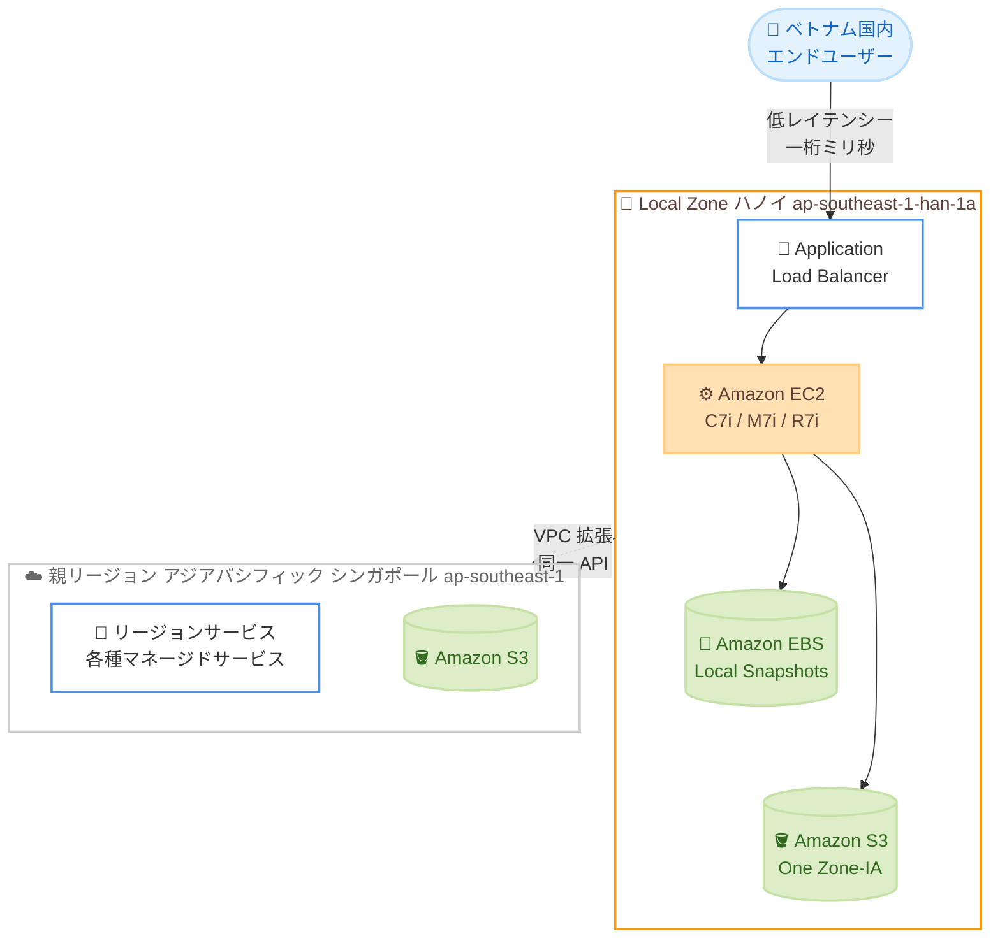

# AWS Local Zones - ベトナム・ハノイの新しい Local Zone を一般提供開始

**リリース日**: 2026 年 6 月 19 日
**サービス**: AWS Local Zones
**機能**: ベトナム・ハノイの AWS Local Zone (ap-southeast-1-han-1a)

📊 [このアップデートのインフォグラフィックを見る](https://takech9203.github.io/aws-news-summary/20260619-aws-local-zones-hanoi-vietnam.html)
<!-- INFOGRAPHIC_BASE_URL は環境変数から取得 -->

## 概要

AWS は、ベトナム・ハノイに新しい AWS Local Zone を一般提供 (GA) として開始したことを発表しました。この Local Zone は、アジアパシフィック (シンガポール) リージョン (ap-southeast-1) を親リージョンとし、ゾーンコード `ap-southeast-1-han-1a` で識別されます。

AWS Local Zones は、コンピューティング、ストレージ、データベースなどの一部の AWS サービスを、エンドユーザーや大都市圏に近い場所に配置するインフラストラクチャの展開形態です。これにより、エンドユーザー向けワークロードで一桁ミリ秒 (single-digit millisecond) のレイテンシーを実現しながら、リージョンと同じ AWS API、ツール、サービスを一貫して利用できます。

今回のハノイ Local Zone は、アジアパシフィックで初めて Amazon S3 と Amazon EBS Local Snapshots をサポートする Local Zone の 1 つであり、データをローカルに保存・バックアップすることで、データレジデンシー (データ所在地) 要件への対応を支援します。ベトナム国内で低レイテンシーやデータレジデンシーが求められるワークロードを持つお客様にとって、有力な選択肢となります。

**アップデート前の課題**

- ベトナム国内のエンドユーザー向けワークロードは、シンガポールなどの親リージョンを利用する必要があり、地理的距離に起因するレイテンシーが発生していた
- ベトナム国内でのデータレジデンシー要件を満たすため、ローカルでのデータ保存・バックアップを実現する選択肢が限られていた
- 低レイテンシーが求められるリアルタイム性の高いアプリケーションや AI/ML 推論ワークロードを、ベトナム国内で稼働させることが難しかった

**アップデート後の改善**

- ハノイの Local Zone により、ベトナム国内のエンドユーザーに対して一桁ミリ秒のレイテンシーを実現できるようになった
- Amazon S3 (One Zone-Infrequent Access) と Amazon EBS Local Snapshots をローカルで利用でき、データレジデンシー要件への対応が容易になった
- リージョンと同じ AWS API、ツール、サービスを利用しながら、ハノイ近郊にワークロードを配置できるようになった

## アーキテクチャ図



ベトナム国内のエンドユーザーはハノイの Local Zone に低レイテンシーでアクセスし、Local Zone は VPC を通じて親リージョン (シンガポール) と同一の API・ツールで連携します。

## サービスアップデートの詳細

### 主要機能

1. **ハノイ Local Zone の一般提供**
   - ゾーンコードは `ap-southeast-1-han-1a`
   - 親リージョンはアジアパシフィック (シンガポール) リージョン (ap-southeast-1)
   - 大都市圏にインフラを配置し、エンドユーザー向けワークロードで一桁ミリ秒のレイテンシーを実現

2. **データレジデンシー対応のストレージサポート**
   - Amazon S3 の One Zone-Infrequent Access ストレージクラスをサポート
   - Amazon EBS Local Snapshots をサポートし、データをローカルに保存・バックアップ可能
   - アジアパシフィックで初めて S3 と EBS Local Snapshots をサポートする Local Zone の 1 つ

3. **幅広いコンピューティング・ネットワーキングサービス**
   - Amazon EC2 (C7i、M7i、R7i インスタンス)
   - Amazon ECS、Amazon EKS によるコンテナワークロード
   - Amazon VPC、AWS Direct Connect、Application Load Balancer

## 技術仕様

### 利用可能なサービスとリソース

| 項目 | 詳細 |
|------|------|
| ゾーンコード | `ap-southeast-1-han-1a` |
| 親リージョン | アジアパシフィック (シンガポール) `ap-southeast-1` |
| EC2 インスタンス | C7i、M7i、R7i |
| Amazon S3 | One Zone-Infrequent Access ストレージクラス |
| Amazon EBS | Local Snapshots、ボリュームタイプ gp3、gp2、io1、sc1、st1 |
| コンテナ | Amazon ECS、Amazon EKS |
| ネットワーキング | Amazon VPC、AWS Direct Connect、Application Load Balancer |

### Local Zone の有効化方法

```bash
# AWS CLI で Local Zone のゾーングループを有効化する
aws ec2 modify-availability-zone-group \
    --group-name ap-southeast-1-han-1 \
    --opt-in-status opted-in \
    --region ap-southeast-1
```

`ModifyAvailabilityZoneGroup` API を使用してハノイの Local Zone をオプトインします。AWS マネジメントコンソールの場合は、AWS Global View の [Regions and Zones] タブから有効化できます。

## 設定方法

### 前提条件

1. アジアパシフィック (シンガポール) リージョン (ap-southeast-1) を利用できる AWS アカウントを保有していること
2. Local Zone を利用する VPC が親リージョンに存在すること
3. Local Zone のオプトインに必要な IAM 権限 (`ec2:ModifyAvailabilityZoneGroup` など) を保有していること

### 手順

#### ステップ1: Local Zone を有効化する

```bash
aws ec2 modify-availability-zone-group \
    --group-name ap-southeast-1-han-1 \
    --opt-in-status opted-in \
    --region ap-southeast-1
```

ハノイの Local Zone をオプトインし、アカウントで利用可能な状態にします。

#### ステップ2: Local Zone にサブネットを作成する

```bash
# Local Zone のゾーンを指定してサブネットを作成する
aws ec2 create-subnet \
    --vpc-id vpc-xxxxxxxx \
    --cidr-block 10.0.100.0/24 \
    --availability-zone ap-southeast-1-han-1a \
    --region ap-southeast-1
```

既存の VPC を Local Zone まで拡張するため、`ap-southeast-1-han-1a` を指定してサブネットを作成します。

#### ステップ3: Local Zone にリソースをデプロイする

作成したサブネットに対して、EC2 インスタンスの起動、EBS ボリュームのアタッチ、Application Load Balancer の配置などを行います。リージョンと同じ AWS API・ツールをそのまま利用できます。

## メリット

### ビジネス面

- **低レイテンシーによる UX 向上**: ベトナム国内のエンドユーザーに対して一桁ミリ秒のレイテンシーを実現し、リアルタイム性の高いアプリケーションの体験を改善できる
- **データレジデンシー要件への対応**: S3 と EBS Local Snapshots によりデータをローカルに保存・バックアップでき、国内のデータ所在地要件を満たしやすくなる
- **市場拡大の支援**: ベトナム市場向けのサービスを、近接したインフラで提供できる

### 技術面

- **一貫した運用**: リージョンと同じ AWS API、ツール、サービスを利用でき、既存の運用やコードを大きく変更せずに展開できる
- **VPC のシームレスな拡張**: 既存の VPC をサブネット追加で Local Zone まで拡張でき、ネットワーク構成を統一できる
- **AI/ML 推論ワークロードへの適合**: 低レイテンシー環境により、エッジ寄りの推論処理を実現しやすい

## デメリット・制約事項

### 制限事項

- 利用できるサービスはリージョンのフルセットではなく、EC2 (C7i/M7i/R7i)、S3 (One Zone-IA)、EBS、ECS、EKS、VPC、Direct Connect、ALB などに限定される
- S3 は One Zone-Infrequent Access ストレージクラスのサポートであり、リージョンの標準ストレージクラスとは可用性特性が異なる
- Local Zone は単一のゾーンであり、複数アベイラビリティーゾーンによる冗長構成はリージョン側で設計する必要がある

### 考慮すべき点

- 利用前に `ModifyAvailabilityZoneGroup` API または AWS Global View からのオプトインが必要
- 料金は Local Zone ごとに設定されるため、利用前に Local Zones の料金ページで確認することが推奨される

## ユースケース

### ユースケース1: 低レイテンシーが求められるオンラインサービス

**シナリオ**: ベトナム国内のユーザーを対象としたゲーム、ストリーミング、リアルタイムコラボレーションアプリケーションを提供する。

**実装例**:
```
ALB (Local Zone) -> EC2 (C7i, Local Zone) -> 親リージョンのマネージドサービス
```

**効果**: 国内ユーザーに対して一桁ミリ秒のレイテンシーを実現し、応答性の高い体験を提供できる。

### ユースケース2: データレジデンシー要件を満たすバックアップ

**シナリオ**: ベトナム国内にデータを保存・バックアップする必要がある規制業界 (金融、公共など) のワークロード。

**実装例**:
```
EC2 (Local Zone) -> EBS Local Snapshots / S3 One Zone-IA (Local Zone)
```

**効果**: データをローカルに保持しながらバックアップを取得でき、データ所在地要件への対応が容易になる。

### ユースケース3: レガシーアプリケーションの移行・モダナイゼーション

**シナリオ**: オンプレミスで稼働している国内向けの業務アプリケーションをクラウドへ移行する。

**実装例**:
```
ECS / EKS (Local Zone) でコンテナ化 -> Direct Connect で社内ネットワークと接続
```

**効果**: 低レイテンシーを維持しつつ段階的にクラウドへ移行・モダナイズでき、ユーザー体験を損なわずに移行できる。

## 料金

AWS Local Zones の料金は、利用する EC2 インスタンス、EBS ボリューム、S3 ストレージ、データ転送などの使用量に応じて課金されます。今回の発表では具体的な金額は提示されていません。詳細は AWS Local Zones の料金ページで確認してください。

## 利用可能リージョン

ベトナム・ハノイの Local Zone (`ap-southeast-1-han-1a`) は、アジアパシフィック (シンガポール) リージョン (ap-southeast-1) を親リージョンとして利用できます。AWS Local Zones は世界 30 以上の大都市圏で提供されています。

## 関連サービス・機能

- **Amazon EC2**: Local Zone 上で C7i、M7i、R7i インスタンスを起動できる
- **Amazon S3 / Amazon EBS**: One Zone-IA ストレージと Local Snapshots により、ローカルでのデータ保存・バックアップを実現
- **Amazon VPC / AWS Direct Connect**: 既存ネットワークを Local Zone まで拡張し、オンプレミスとの接続を構成できる

## 参考リンク

- 📊 [インフォグラフィック](https://takech9203.github.io/aws-news-summary/20260619-aws-local-zones-hanoi-vietnam.html)
- [公式発表 (What's New)](https://aws.amazon.com/about-aws/whats-new/2026/06/aws-local-zones-hanoi-vietnam/)
- [AWS Local Zones (製品ページ)](https://aws.amazon.com/about-aws/global-infrastructure/localzones/)
- [AWS Local Zones ロケーション](https://aws.amazon.com/about-aws/global-infrastructure/localzones/locations/)
- [AWS Local Zones 料金ページ](https://aws.amazon.com/about-aws/global-infrastructure/localzones/pricing/)

## まとめ

ベトナム・ハノイの AWS Local Zone の一般提供開始により、国内のエンドユーザーに対して一桁ミリ秒の低レイテンシーを実現できるようになりました。アジアパシフィックで初めて S3 と EBS Local Snapshots をサポートする Local Zone の 1 つであり、データレジデンシー要件を持つワークロードにとって特に有用です。ベトナム市場向けのサービスを検討している場合は、`ModifyAvailabilityZoneGroup` API でゾーンを有効化し、低レイテンシーやデータレジデンシーが求められるワークロードへの適用を検討してください。
