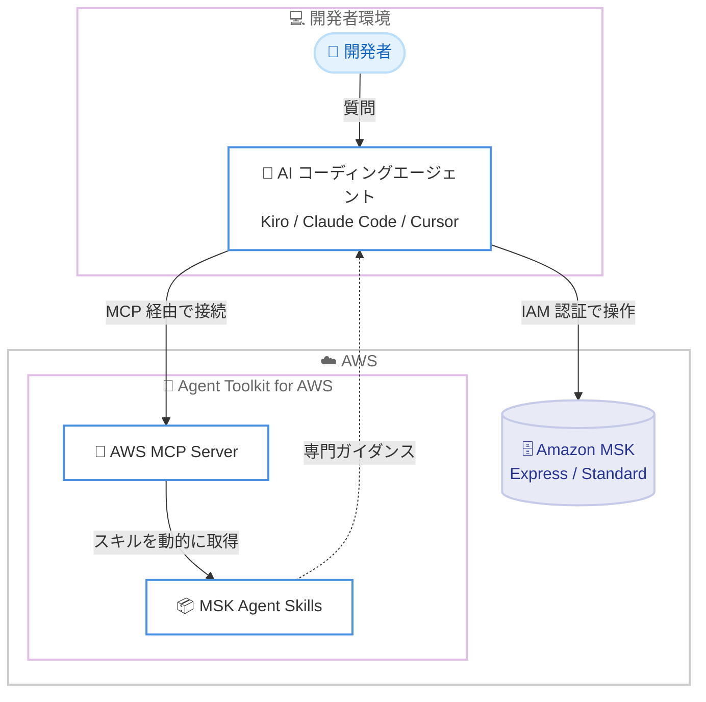

# Amazon MSK - AI Agent Skills

**リリース日**: 2026 年 6 月 22 日
**サービス**: Amazon Managed Streaming for Apache Kafka (Amazon MSK)
**機能**: Amazon MSK 向け AI Agent Skills

📊 [このアップデートのインフォグラフィックを見る](https://takech9203.github.io/aws-news-summary/20260622-amazon-msk-ai-agent-skills.html)
<!-- INFOGRAPHIC_BASE_URL は環境変数から取得 -->

## 概要

Amazon MSK は、AI コーディングアシスタントに対して Amazon MSK の運用に関する専門的かつ最新のガイダンスを提供する AI Agent Skills を提供開始しました。このスキルは、トラブルシューティング、サイジング、構成、モニタリング、外部 Apache Kafka クラスターからの移行といった、一般的な運用タスクに関する専門知識を AI コーディングエージェントに付与します。

これにより、これまで専門的な知見を必要としていた MSK の運用作業を、開発者がコーディングエージェントとの対話を通じて段階的に進められるようになります。たとえば「自分の MSK クラスターにはどのブローカータイプとサイズを使うべきか」「自分の Kafka クラスターは MSK Express と互換性があるか」といった質問を、普段利用しているコーディングエージェントに直接尋ねることができます。

このスキルは、既存の AI コーディングエージェントである Kiro、Claude Code、Cursor で利用できます。利用を開始するには、AWS CLI を使用して Agent Toolkit for AWS を構成し、コーディングエージェントに質問するだけです。チームはこのスキルを活用してクラスターを健全かつ高パフォーマンスに保つとともに、外部 Kafka ワークロードを MSK Express へ移行できます。MSK Express ブローカーは、Apache Kafka を実行する Standard ブローカーと比較して、ブローカーあたり最大 3 倍のスループット、最大 20 倍高速なスケーリング、90% 短縮されたリカバリ時間を実現します。

**アップデート前の課題**

- MSK のサイジングや構成、トラブルシューティングには専門的な知見が必要であり、運用担当者の経験に依存していた
- AI コーディングエージェントを支える基盤モデルの学習データは数か月から数年前のものであることが多く、新しいサービスや最近リリースされた機能に関する正確なガイダンスを得にくかった
- 外部 Kafka クラスターから MSK への移行は、互換性確認や手順の検討に手間がかかり、専門知識を要する作業だった

**アップデート後の改善**

- 普段利用しているコーディングエージェントに質問するだけで、MSK の運用タスクに関する専門的かつ最新のガイダンスを得られる
- トラブルシューティング、サイジング、構成、モニタリング、移行といった一般的な運用タスクが、段階的なガイドに従って進められる
- 外部 Kafka ワークロードの MSK Express への移行が、互換性チェックを含めてエージェントの支援を受けながら実施できる

## アーキテクチャ図



開発者はコーディングエージェントに質問を投げ、エージェントは Agent Toolkit for AWS の MCP Server を介して MSK 向けスキルを動的に取得し、専門的なガイダンスに基づいて MSK の運用や移行を支援します。

## サービスアップデートの詳細

### 主要機能

1. **MSK 運用タスク向けの専門ガイダンス**
   - トラブルシューティング、サイジング、構成、モニタリングといった一般的な運用タスクに対し、専門的かつ最新のガイダンスを提供する
   - クラスターを健全で高パフォーマンスな状態に保つための支援を、対話形式で受けられる
   - 「自分の MSK クラスターにはどのブローカータイプとサイズを使うべきか」といった質問に応答する

2. **外部 Kafka クラスターからの移行支援**
   - 外部の Apache Kafka クラスターから MSK への移行に関するガイダンスを提供する
   - 「自分の Kafka クラスターは MSK Express と互換性があるか」といった互換性チェックを支援する
   - これまで専門知識を要した移行作業を、段階的なガイドに沿って進められる

3. **既存コーディングエージェントとの連携**
   - Kiro、Claude Code、Cursor といった既存の AI コーディングエージェントでそのまま利用できる
   - Agent Toolkit for AWS の一部として提供され、AWS MCP Server を通じて必要なスキルが動的に読み込まれる
   - スキルは必要なときにのみ取得されるため、不要なコンテキストを消費しない

## 技術仕様

### Agent Toolkit for AWS の構成要素

AI Agent Skills は、Agent Toolkit for AWS の一部として提供されます。Agent Toolkit for AWS は、AI コーディングエージェントが AWS 上でアプリケーションを構築、デプロイ、管理するためのツール、知識、ガードレールを提供します。

| 構成要素 | 詳細 |
|----------|------|
| AWS MCP Server | Model Context Protocol (MCP) を通じてエージェントに AWS へのアクセスを提供するマネージドサーバー。単一エンドポイントで CloudWatch メトリクスと IAM ベースのアクセス制御を提供 |
| Agent skills | 特定の AWS タスクを完了させるための手順、コードスクリプト、参照資料をまとめたキュレーション済みパッケージ。オンデマンドで読み込まれる |
| Plugins | Claude Code および Codex 向けの単一インストールパッケージ。AWS MCP Server 構成とスキルセットをバンドル |
| Rules files | プロジェクトレベルの設定ファイル。エージェントの動作に関するガードレールや設定を定義 |

### MSK Express ブローカーのメリット

外部 Kafka ワークロードを MSK Express へ移行した場合、Apache Kafka を実行する Standard ブローカーと比較して以下の利点があります。

| 項目 | 改善内容 |
|------|----------|
| スループット | ブローカーあたり最大 3 倍 |
| スケーリング速度 | 最大 20 倍高速 |
| リカバリ時間 | 90% 短縮 |

### 認証とアクセス制御

AWS MCP Server は、すべてのリクエストに 2 つのグローバル条件コンテキストキー (`aws:ViaAWSMCPService` および `aws:CalledViaAWSMCP`) を自動的に付与します。これにより、IAM ポリシーで MCP 経由のアクションと直接の API 呼び出しを区別できます。認証と認可には既存の AWS IAM ロールとポリシーが使用され、利用可能なリソースとアクションを完全に制御できます。

### API変更履歴

今回のアップデートは、Agent Toolkit for AWS を通じて提供される AI Agent Skills の追加であり、Amazon MSK の API 自体への変更を伴うものではありません。

## 設定方法

### 前提条件

1. Kiro、Claude Code、Cursor のいずれかの AI コーディングエージェントを利用していること
2. AWS CLI がインストールおよび構成されていること
3. MSK へのアクセスに必要な権限を持つ AWS IAM ロールまたは認証情報を保有していること

### 手順

#### ステップ1: Agent Toolkit for AWS を構成する

AWS CLI を使用して、利用中のコーディングエージェント向けに Agent Toolkit for AWS を構成します。構成の具体的な手順は、Agent Toolkit for AWS のドキュメントを参照してください。

{この手順により、コーディングエージェントが AWS MCP Server に接続し、MSK 向けスキルを動的に取得できるようになります。}

#### ステップ2: コーディングエージェントに質問する

構成が完了したら、普段利用しているコーディングエージェントに対して MSK に関する質問を投げます。

```text
What broker type and size should I use for my MSK cluster?
Is my Kafka cluster compatible with MSK Express?
```

{この例では、ブローカータイプとサイズの選定、および外部 Kafka クラスターの MSK Express 互換性についてエージェントに尋ねています。エージェントは MSK 向けスキルに基づいて専門的なガイダンスを返します。}

## メリット

### ビジネス面

- **専門知識への依存の低減**: これまで専門的な知見を必要とした MSK の運用や移行作業を、コーディングエージェントの支援を受けて開発者自身が進められる
- **追加料金なしで利用可能**: Agent Toolkit for AWS は追加料金なしで利用でき、エージェントが操作する AWS リソースの標準料金のみが発生する
- **移行の促進**: 外部 Kafka ワークロードの MSK Express への移行を支援し、より高いパフォーマンスとコスト効率の実現を後押しする

### 技術面

- **最新かつ正確なガイダンス**: 基盤モデルの学習データが古い場合でも、最新の MSK のサービス情報やベストプラクティスに基づくガイダンスを得られる
- **既存ワークフローを維持**: ツールを切り替えたり新しいワークフローを学んだりすることなく、既存のコーディングエージェントでそのまま利用できる
- **セキュリティと可視性**: 既存の IAM ロールとポリシーで認証・認可を制御でき、CloudTrail で API 呼び出しを監査できる

## デメリット・制約事項

### 制限事項

- AI Agent Skills は、MCP に対応した AI コーディングエージェント (Kiro、Claude Code、Cursor など) の利用を前提とする
- スキルが提供するのはガイダンスであり、実際の運用判断や操作は利用者の責任で実施する必要がある

### 考慮すべき点

- エージェントが AWS リソースを操作する場合は、最小権限の原則に従って IAM ロールのスコープを必要最小限に絞ることが推奨される
- 移行や構成変更を実行する前に、エージェントの提案内容を検証することが望ましい

## ユースケース

### ユースケース1: MSK クラスターのサイジング

**シナリオ**: 新規に MSK クラスターを構築するチームが、ワークロードに適したブローカータイプとサイズを判断できずにいる。

**実装例**:
```text
What broker type and size should I use for my MSK cluster?
```

**効果**: エージェントが MSK 向けスキルに基づいて適切なブローカータイプとサイズの選定を支援し、過剰プロビジョニングや性能不足を回避できる。

### ユースケース2: 外部 Kafka クラスターから MSK Express への移行

**シナリオ**: 自己管理の Apache Kafka クラスターを運用するチームが、MSK Express への移行を検討している。

**実装例**:
```text
Is my Kafka cluster compatible with MSK Express?
```

**効果**: 互換性チェックと移行手順のガイダンスにより、ブローカーあたり最大 3 倍のスループット、最大 20 倍高速なスケーリング、90% 短縮されたリカバリ時間といった MSK Express の利点を活用した移行を進められる。

### ユースケース3: 運用中クラスターのトラブルシューティング

**シナリオ**: 本番運用中の MSK クラスターでパフォーマンス低下や異常が発生し、原因を切り分けたい。

**実装例**:
```text
Why is my MSK cluster experiencing high consumer lag?
```

**効果**: トラブルシューティングとモニタリングに関するスキルに基づき、エージェントが原因の切り分けと対処をガイドし、クラスターを健全な状態に保つ手助けをする。

## 料金

AI Agent Skills を含む Agent Toolkit for AWS は、追加料金なしで利用できます。エージェントがプロビジョニングまたは操作する AWS リソースに対して、標準の AWS 料金のみが発生します。Amazon MSK の利用料金については、MSK の料金ページを参照してください。

## 利用可能リージョン

AI Agent Skills は Agent Toolkit for AWS を通じて提供されます。Amazon MSK および MSK Express の利用可能リージョンについては、AWS の公式リージョン表を参照してください。

## 関連サービス・機能

- **Amazon MSK Express**: 外部 Kafka ワークロードの移行先となるブローカータイプ。Standard ブローカーと比較して高いスループット、高速なスケーリング、短いリカバリ時間を提供
- **Agent Toolkit for AWS**: AI Agent Skills を提供する基盤。AWS MCP Server、スキル、プラグイン、ルールファイルで構成される
- **Kiro / Claude Code / Cursor**: MSK Agent Skills を利用できる AI コーディングエージェント

## 参考リンク

- 📊 [インフォグラフィック](https://takech9203.github.io/aws-news-summary/20260622-amazon-msk-ai-agent-skills.html)
- [公式発表 (What's New)](https://aws.amazon.com/about-aws/whats-new/2026/06/amazon-msk-ai-agent-skills)
- [Agent Toolkit for AWS ドキュメント](https://docs.aws.amazon.com/agent-toolkit/latest/userguide/what-is-agent-toolkit.html)
- [Amazon MSK ドキュメント](https://docs.aws.amazon.com/msk/)

## まとめ

今回のアップデートにより、Amazon MSK の運用や外部 Kafka からの移行といった専門知識を要する作業を、Kiro、Claude Code、Cursor といった既存の AI コーディングエージェントを通じて段階的に進められるようになりました。追加料金なしで利用できるため、まずは Agent Toolkit for AWS を AWS CLI で構成し、MSK のサイジングや MSK Express への移行可否についてコーディングエージェントに質問してみることを推奨します。
