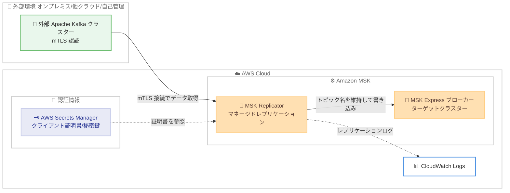

# Amazon MSK Replicator - 外部 Apache Kafka クラスターからの mTLS 認証サポート

**リリース日**: 2026 年 6 月 22 日
**サービス**: Amazon Managed Streaming for Apache Kafka (Amazon MSK)
**機能**: MSK Replicator の相互 TLS (mTLS) 認証サポート

📊 [このアップデートのインフォグラフィックを見る](https://takech9203.github.io/aws-news-summary/20260622-amazon-msk-replicator-mtls-support.html)
<!-- INFOGRAPHIC_BASE_URL は環境変数から取得 -->

## 概要

Amazon MSK Replicator が、外部 Apache Kafka クラスターから Amazon MSK Express ブローカーへのデータレプリケーションにおいて、相互 TLS (mTLS) 認証をサポートしました。ここでいう外部 Apache Kafka クラスターには、オンプレミス環境、AWS 上の自己管理型クラスター、他のクラウドプロバイダー上のクラスターが含まれます。

MSK Replicator は、Kafka クラスター間のデータレプリケーションを自動化するフルマネージド機能です。カスタムのレプリケーション基盤やオープンソースツールを運用する必要がなく、データとコンシューマーグループオフセットの非同期レプリケーションを提供します。これまで、MSK Replicator が外部 Apache Kafka クラスターへの接続でサポートしていた認証方式は SASL/SCRAM のみでした。今回のアップデートにより、mTLS によるクライアント認証を必須とするクラスターも、MSK Replicator のレプリケーション元として利用できるようになりました。

この機能により、mTLS 認証で構成された外部 Apache Kafka クラスターを運用するお客様は、MSK Express ブローカーへのワークロード移行、MSK Express ベースのクラスターをフェイルオーバーまたはバックアップ先とした災害復旧 (DR)、ハイブリッドおよびマルチクラウド環境にまたがるデータ配信を実現できます。本機能は MSK Express ブローカーが利用可能なすべての AWS リージョンでサポートされます。

**アップデート前の課題**

- 外部 Apache Kafka クラスターへの接続では SASL/SCRAM 認証のみがサポートされており、mTLS によるクライアント認証を必須とするクラスターは MSK Replicator のレプリケーション元として利用できなかった
- mTLS 認証で構成されたクラスターから MSK Express ブローカーへ移行する際、認証方式の変更や独自のレプリケーション基盤の構築が必要だった
- セキュリティ要件として証明書ベースの相互認証を求められる環境では、マネージドなレプリケーション手段を選択できなかった

**アップデート後の改善**

- mTLS 認証を使用する外部 Apache Kafka クラスターから、認証方式を変更することなく MSK Express ブローカーへデータをレプリケーションできるようになった
- mTLS クラスターを対象とした MSK Express ブローカーへの移行、DR、ハイブリッド/マルチクラウドでのデータ配信が、マネージド機能だけで実現可能になった
- 元の Kafka トピック名の維持、無限レプリケーションループの自動回避、コンシューマーグループオフセットの双方向同期といった MSK Replicator の既存メリットを、mTLS 環境でもそのまま享受できるようになった

## アーキテクチャ図



mTLS 認証で構成された外部 Apache Kafka クラスターから、MSK Replicator が Secrets Manager に保管したクライアント証明書を使って接続し、MSK Express ブローカーへデータをレプリケーションする構成を示しています。

## サービスアップデートの詳細

### 主要機能

1. **mTLS 認証によるレプリケーション元接続**
   - 外部 Apache Kafka クラスターへの接続認証として、従来の SASL/SCRAM に加えて mTLS (相互 TLS) をサポート
   - mTLS では、クライアントとサーバーが互いに証明書を提示して認証を行うため、証明書ベースの相互認証を必須とするクラスターにも対応
   - クライアント証明書と秘密鍵は AWS Secrets Manager に保管し、レプリケーター作成時に Secret の ARN を指定する

2. **元のトピック名の維持と無限ループの自動回避**
   - レプリケーション時に元の Kafka トピック名をそのまま維持できるため、移行先でアプリケーションのトピック名変更が不要
   - 双方向レプリケーション構成においても、無限レプリケーションループを自動的に回避する

3. **コンシューマーグループオフセットの双方向同期**
   - コンシューマーグループオフセットを双方向に同期し、プロデューサーとコンシューマーを順序に依存せず独立してクラスター間で移動可能
   - これにより、シームレスなアプリケーションのカットオーバー (切り替え) を実現

4. **フルマネージドな運用**
   - レプリケーションに必要なリソースを自動的にスケールし、容量の監視やスケーリングは不要
   - カスタムコードの記述、独自インフラの管理、クロスリージョンネットワーキングの設定が不要

## 技術仕様

### 認証方式の比較

| 認証方式 | レプリケーション元 (外部 Kafka) | 概要 |
|------|------|------|
| SASL/SCRAM | サポート (従来から) | ユーザー名とパスワードによる認証。認証情報を Secrets Manager に保管 |
| mTLS | サポート (今回追加) | クライアント証明書と秘密鍵による相互 TLS 認証。証明書を Secrets Manager に保管 |

### API 変更履歴

| 日付 | サービス | 変更内容 |
|------|----------|----------|
| 2026/06/22 | [kafka](https://awsapichanges.com/archive/changes/d33e4c-kafka.html) | 2 updated methods - `CreateReplicator` と `DescribeReplicator` の `KafkaClusters.ClientAuthentication` に `MTLS` (SecretArn) フィールドを追加 |

`CreateReplicator` および `DescribeReplicator` の `ClientAuthentication` 構造に、以下のように `MTLS` オプションが追加されました。

```json
{
  "KafkaClusters": [
    {
      "ClientAuthentication": {
        "SaslScram": {
          "Mechanism": "SHA256",
          "SecretArn": "string"
        },
        "MTLS": {
          "SecretArn": "string"
        }
      }
    }
  ]
}
```

`MTLS.SecretArn` には、クライアント証明書と秘密鍵を保管した AWS Secrets Manager の Secret ARN を指定します。

## 設定方法

### 前提条件

1. レプリケーション元の Apache Kafka クラスターが mTLS 認証で構成されていること (Kafka バージョン 2.8.1 以上が推奨)
2. 外部クラスターと AWS 間にネットワーク接続 (AWS Direct Connect、Site-to-Site VPN、VPC ピアリング、Transit Gateway など) が確立されていること
3. ターゲットとなる MSK Express ブローカーのクラスター (IAM 認証有効) が作成済みであること
4. mTLS 用のクライアント証明書と秘密鍵を保管した AWS Secrets Manager の Secret、および SSL ハンドシェイク用のルート CA 証明書が用意されていること
5. レプリケーター実行用の IAM ロール (`kafka.amazonaws.com` を信頼) が作成済みであること

### 手順

#### ステップ 1: 認証情報を Secrets Manager に保管する

mTLS 用のクライアント証明書と秘密鍵を AWS Secrets Manager に保管します。

```bash
aws secretsmanager create-secret \
  --name AmazonMSK_external_kafka_mtls \
  --secret-string file://mtls-client-credentials.json
```

外部 Kafka クラスターへの mTLS 接続に使用するクライアント証明書および秘密鍵を Secret として登録します。MSK Replicator はこの Secret を参照して相互認証を行います。

#### ステップ 2: クラスター定義ファイルで mTLS を指定する

レプリケーター作成時に渡す `kafka-clusters.json` で、外部 Apache Kafka クラスターの `ClientAuthentication` に `MTLS` を指定します。

```json
{
  "ApacheKafkaCluster": {
    "ApacheKafkaClusterId": "your-source-cluster-id",
    "BootstrapBrokerString": "broker1:9094,broker2:9094"
  },
  "VpcConfig": {
    "SecurityGroupIds": ["sg-xxxxxxxx"],
    "SubnetIds": ["subnet-xxxxxxxx", "subnet-yyyyyyyy"]
  },
  "ClientAuthentication": {
    "MTLS": {
      "SecretArn": "arn:aws:secretsmanager:region:account-id:secret:AmazonMSK_external_kafka_mtls"
    }
  },
  "EncryptionInTransit": {
    "EncryptionType": "TLS",
    "RootCaCertificate": "arn:aws:secretsmanager:region:account-id:secret:root-ca-secret"
  }
}
```

レプリケーション元の外部 Kafka クラスターへ mTLS で接続するための設定です。`MTLS.SecretArn` にステップ 1 で作成した Secret の ARN を指定します。

#### ステップ 3: レプリケーターを作成する

`create-replicator` コマンドでレプリケーターを作成します。

```bash
aws kafka create-replicator \
  --replicator-name external-kafka-to-express \
  --kafka-clusters file://kafka-clusters.json \
  --replication-info-list file://replication-info.json \
  --service-execution-role-arn arn:aws:iam::account-id:role/MSKReplicatorRole \
  --log-delivery file://log-delivery.json
```

クラスター定義、レプリケーション設定、ログ配信設定を指定してレプリケーターを作成します。元のトピック名を維持する場合は、`replication-info.json` 内の `TopicReplication.TopicNameConfiguration.Type` を `IDENTICAL` に設定します。

## メリット

### ビジネス面

- **セキュリティ要件への適合**: 証明書ベースの相互認証を必須とするセキュリティポリシー下でも、マネージド機能でレプリケーションを実現できる
- **移行コストの削減**: 既存の mTLS クラスターの認証方式を変更せずに MSK Express ブローカーへ移行でき、移行プロジェクトの工数とリスクを低減
- **事業継続性の向上**: MSK Express ベースのクラスターをフェイルオーバーまたはバックアップ先とした災害復旧構成を構築できる

### 技術面

- **運用負荷の低減**: カスタムのレプリケーション基盤やオープンソースツールの構築・運用が不要
- **シームレスなカットオーバー**: コンシューマーグループオフセットの双方向同期により、プロデューサーとコンシューマーを任意の順序で移行できる
- **アプリケーション変更の最小化**: 元のトピック名を維持できるため、移行先でのトピック名変更が不要

## デメリット・制約事項

### 制限事項

- mTLS 認証によるレプリケーションは、ターゲットが MSK Express ブローカーの場合にサポートされる
- 本機能は MSK Express ブローカーが利用可能な AWS リージョンに限定される
- MSK クラスター間のレプリケーションでは、レプリケーション元とターゲットのクラスターが同一 AWS アカウントにある必要がある (外部 Kafka からのレプリケーションとは要件が異なる)

### 考慮すべき点

- 外部クラスターと AWS 間のネットワーク接続 (Direct Connect、VPN、VPC ピアリング、Transit Gateway 等) を別途構成し、IP ルーティングと DNS 解決を検証する必要がある
- mTLS 用のクライアント証明書には有効期限があるため、証明書のローテーションと Secrets Manager の更新運用を計画する必要がある
- レプリケーションの遅延 (`MessageLag`、`ReplicationLatency` など) を CloudWatch メトリクスで監視し、カットオーバーのタイミングを判断する

## ユースケース

### ユースケース 1: 他クラウドの mTLS Kafka からの移行

**シナリオ**: 他クラウドプロバイダー上で mTLS 認証を必須とする自己管理型 Apache Kafka を運用しており、Amazon MSK Express ブローカーへ移行したい。

**実装例**:
```
外部 Kafka (mTLS) → MSK Replicator → MSK Express ブローカー
- TopicNameConfiguration: IDENTICAL でトピック名を維持
- コンシューマーグループオフセットを双方向同期
```

**効果**: 認証方式を変更せずに移行でき、コンシューマーオフセット同期によりアプリケーションをシームレスにカットオーバーできる。

### ユースケース 2: オンプレミス Kafka を対象とした災害復旧

**シナリオ**: オンプレミスの mTLS Kafka クラスターを主系として運用し、AWS 上の MSK Express ブローカーをバックアップ/フェイルオーバー先としたい。

**実装例**:
```
オンプレミス Kafka (mTLS) → MSK Replicator → MSK Express ブローカー (DR サイト)
- 障害発生時に MSK Express ブローカーへフェイルオーバー
```

**効果**: 独自の DR 基盤を構築せずに、マネージド機能でクラウド側のフェイルオーバー先を維持できる。

### ユースケース 3: ハイブリッド/マルチクラウドでのデータ配信

**シナリオ**: 複数の環境にまたがるアプリケーションに対し、mTLS で保護された Kafka データを AWS 側へ配信して分析や集約に利用したい。

**実装例**:
```
外部 Kafka (mTLS) → MSK Replicator → MSK Express ブローカー → 下流の分析処理
```

**効果**: ハイブリッドおよびマルチクラウド環境でセキュアにデータを配信し、AWS 上でのデータ集約と活用を実現できる。

## 料金

MSK Replicator の利用には、レプリケーションされたデータ量 (GB 単位) に基づく料金と、レプリケーション対象クラスターの基盤リソースに関連する料金が発生します。mTLS 認証のサポート自体に追加料金はありません。クライアント証明書を保管する AWS Secrets Manager、レプリケーションログを配信する Amazon CloudWatch Logs などの関連サービスにはそれぞれの料金が適用されます。正確な料金は、利用するリージョンとデータ量に応じて Amazon MSK の料金ページで確認してください。

## 利用可能リージョン

本機能は、Amazon MSK Express ブローカーが利用可能なすべての AWS リージョンでサポートされます。最新の対応リージョンは公式ドキュメントを参照してください。

## 関連サービス・機能

- **Amazon MSK Express ブローカー**: レプリケーションのターゲットとなる、運用負荷を軽減した MSK のブローカータイプ
- **AWS Secrets Manager**: mTLS 用のクライアント証明書・秘密鍵、ルート CA 証明書を安全に保管
- **Amazon CloudWatch**: レプリケーションのログ配信、および `MessageLag`、`ReplicationLatency` などのメトリクス監視
- **AWS Direct Connect / Site-to-Site VPN / Transit Gateway**: 外部 Kafka クラスターと AWS 間のネットワーク接続

## 参考リンク

- 📊 [インフォグラフィック](https://takech9203.github.io/aws-news-summary/20260622-amazon-msk-replicator-mtls-support.html)
- [公式発表 (What's New)](https://aws.amazon.com/about-aws/whats-new/2026/06/amazon-msk-replicator-mtls-support)
- [AWS Blog: Migrate third-party and self-managed Apache Kafka clusters to Amazon MSK Express brokers with Amazon MSK Replicator](https://aws.amazon.com/blogs/big-data/migrate-third-party-and-self-managed-apache-kafka-clusters-to-amazon-msk-express-brokers-with-amazon-msk-replicator/)
- [ドキュメント: Amazon MSK Replicator](https://docs.aws.amazon.com/msk/latest/developerguide/msk-replicator.html)
- [API 変更履歴 (awsapichanges.com)](https://awsapichanges.com/archive/changes/d33e4c-kafka.html)

## まとめ

今回のアップデートにより、mTLS 認証を必須とする外部 Apache Kafka クラスターからも、マネージドな MSK Replicator を使って MSK Express ブローカーへデータをレプリケーションできるようになりました。証明書ベースの相互認証が求められる環境での移行、災害復旧、ハイブリッド/マルチクラウドでのデータ配信が大幅に容易になります。mTLS クラスターからの MSK 移行を検討している場合は、Secrets Manager への証明書登録とネットワーク接続の準備から着手し、AWS Blog のウォークスルーを参照して構成を進めることを推奨します。
