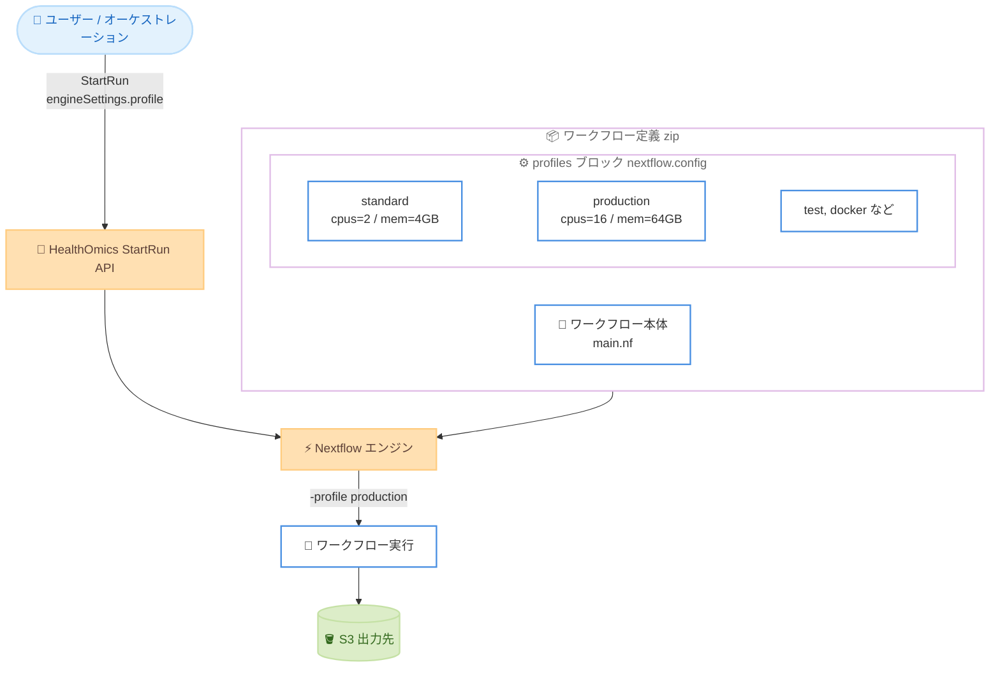

# AWS HealthOmics - Nextflow プロファイルのサポート

**リリース日**: 2026年6月22日
**サービス**: AWS HealthOmics
**機能**: Nextflow プロファイル (Nextflow profiles)

📊 [このアップデートのインフォグラフィックを見る](https://takech9203.github.io/aws-news-summary/20260622-aws-healthomics-nextflow-profiles.html)
<!-- INFOGRAPHIC_BASE_URL は環境変数から取得 -->

## 概要

AWS HealthOmics が Nextflow プロファイル (Nextflow profiles) のサポートを開始しました。これにより、お客様は実行時 (run time) に事前定義された実行設定を有効化できるようになります。Nextflow プロファイルは、再利用可能な設定をあらかじめ定義しておき、実行のタイミングでそれらを選択する仕組みです。ワークフローのソースコードを変更することなく、実行設定を簡単に切り替えられます。

AWS HealthOmics は、HIPAA 適格 (HIPAA-eligible) なフルマネージドのバイオインフォマティクスワークフローサービスです。ゲノム解析をはじめとするライフサイエンス分野の大規模データ処理を、インフラ管理の負担なく実行できます。今回のアップデートにより、リソース制限や実行オプションといったプラットフォーム固有の設定を、ワークフローの中核ロジックからきれいに分離できるようになりました。

特に nf-core ワークフローを利用しているお客様にとって価値が大きく、これらのパイプラインがあらかじめ同梱している組み込みプロファイル (built-in profiles) や機関固有のプロファイル (institutional profiles) をそのまま有効化できます。開発環境と本番環境で別々のワークフロー定義を作成する必要がなくなります。

**アップデート前の課題**

- 開発環境と本番環境で異なる実行設定 (CPU、メモリ、入力データなど) を使い分けるには、ワークフロー定義そのものを編集するか、別々の定義を複数管理する必要がありました
- リソース制限や実行オプションといったプラットフォーム固有の設定が、ワークフローの中核ロジックと混在していました
- nf-core ワークフローに同梱されたプロファイルを HealthOmics 上でそのまま活用できませんでした
- 設定変更のたびに手動でファイルを編集するため、ヒューマンエラーが発生しやすい状況でした

**アップデート後の改善**

- 実行時に `engineSettings` の `profile` キーでプロファイル名を指定するだけで、ソースコードを変更せずに実行設定を切り替えられます
- プラットフォーム固有の設定をワークフローの中核ロジックから明確に分離できます
- nf-core ワークフローの組み込みプロファイルや機関固有のプロファイルをそのまま有効化できます
- 開発設定と本番設定を、別々のワークフロー定義を作成せずに切り替えられます

## アーキテクチャ図



ユーザーは StartRun 時に `engineSettings.profile` でプロファイル名を渡し、HealthOmics はワークフロー定義内の `profiles` ブロックから該当する設定を選択して Nextflow エンジンに `-profile` フラグとして適用します。

## サービスアップデートの詳細

### 主要機能

1. **実行時のプロファイル選択**
   - StartRun API の `engineSettings` マップに `profile` キーを指定することで、1 つ以上のプロファイルを有効化できます
   - HealthOmics は内部的に Nextflow エンジンへ `-profile` フラグを渡します
   - すべての HealthOmics サポート対象 Nextflow バージョンでプロファイルを利用できます

2. **複数プロファイルの合成と優先順位**
   - カンマ区切り (例: `"test,docker"`) で複数のプロファイルを指定できます
   - Nextflow はコマンドラインで指定された順序でプロファイルを適用します。設定が競合する場合、後に指定されたプロファイルが先のものを上書きします
   - 上記の例では `test` が先に適用され、その後 `docker` が適用されるため、`docker` の設定が優先されます
   - Nextflow バージョン 26 未満では、コマンドライン順ではなく設定ファイルでの定義順に適用されます

3. **nf-core ワークフローとの親和性**
   - nf-core パイプラインに同梱された組み込みプロファイルや機関固有のプロファイルをそのまま有効化できます
   - プロファイルにはパラメータ、プロセスディレクティブ、`includeConfig` 文、マニフェストの上書き (`manifest.nextflowVersion` を含む) を含められます

4. **デフォルトプロファイルの挙動**
   - プロファイルを指定しない場合、ワークフロー定義の `profiles` 配下に `standard` が定義されていれば `standard` が使用されます
   - `standard` が定義されていない場合は、トップレベルのデフォルト設定が使用されます
   - 明示的に指定した実行パラメータは、プロファイルで定義されたパラメータ値よりも優先されます

## 技術仕様

### engineSettings の主要キー

StartRun リクエストの `engineSettings` マップで指定できる主なキーは以下のとおりです。

| キー | 値の例 | 動作 | バージョンサポート |
|------|--------|------|---------------------|
| profile | カンマ区切りのプロファイル名 | 1 つ以上の Nextflow 設定プロファイルを有効化 | すべての Nextflow バージョン |
| engineVersion | "24.10.8", "25.10.0", "26.04.0" など | 実行に使用する Nextflow バージョンを固定 | すべての Nextflow バージョン |
| syntaxVersion | "v1", "v2" | 構文パーサーを選択 | v26.04.0 以降。v25.10.0 以前は "v1" のみ |
| outputFormat | "json", "text", "none" | エンジンの標準出力サマリーの形式を指定 | v26.04.0 以降 |
| agentMode | "true", "false", "0", "1" | Nextflow エージェントモードを制御 | v26.04.0 以降 |

### nextflow.config でのプロファイル定義

プロファイルは `nextflow.config` の `profiles` ブロックで定義します。

```groovy
profiles {
    standard {
        process.cpus = 2
        process.memory = '4 GB'
    }

    production {
        process.cpus = 16
        process.memory = '64 GB'
        params.input = 's3://bucket/production-data.bam'
    }
}
```

### API 変更履歴

| 日付 | サービス | 変更内容 |
|------|----------|----------|
| 2026/06/22 | [Amazon Omics](https://awsapichanges.com/archive/changes/d33e4c-omics.html) | 4 updated api methods - StartRun などのワークフロー実行系メソッドの更新 (同日にエフェメラルストレージ対応も追加) |
| 2026/06/11 | [Amazon Omics](https://awsapichanges.com/archive/changes/b3f27b-omics.html) | 1 updated api methods - ListRuns API レスポンスへの workflowName 追加 |

プロファイル機能は StartRun API の `engineSettings` パラメータを通じて利用します。

## 設定方法

### 前提条件

1. AWS HealthOmics で Nextflow エンジンのプライベートワークフローを利用していること
2. ワークフロー定義 zip ファイルの `nextflow.config` 内に `profiles` ブロックが定義されていること (HealthOmics は外部ソースからのプロファイル定義の取得をサポートしません)
3. StartRun を実行する IAM サービスロールと、出力先となる S3 バケットが用意されていること

### 手順

#### ステップ1: nextflow.config にプロファイルを定義

ワークフロー定義 zip 内の `nextflow.config` に、用途別のプロファイルを定義します。上記「技術仕様」の `profiles` ブロックの例を参照してください。開発用の軽量設定と本番用の高リソース設定を分けて定義します。

#### ステップ2: 単一プロファイルを指定して実行

```bash
aws omics start-run \
  --workflow-id {{workflow-id}} \
  --role-arn {{role-arn}} \
  --output-uri s3://{{bucket-name}}/{{prefix}}/ \
  --engine-settings '{"profile": "production"}'
```

`--engine-settings` に JSON で `profile` キーを渡すと、HealthOmics が Nextflow エンジンへ `-profile production` を適用します。ワークフロー定義を一切変更せずに本番用設定で実行できます。

#### ステップ3: 複数プロファイルを合成して実行

```bash
aws omics start-run \
  --workflow-id {{workflow-id}} \
  --role-arn {{role-arn}} \
  --output-uri s3://{{bucket-name}}/{{prefix}}/ \
  --engine-settings '{"profile": "test,docker"}'
```

カンマ区切りで複数のプロファイルを指定します。この例では `test` を適用した後に `docker` を適用するため、設定が競合する項目は `docker` 側が優先されます。適用されたエンジン設定は GetRun のレスポンスにある `engineSettings` フィールドで確認できます。

## メリット

### ビジネス面

- **開発から本番への移行を高速化**: 別々のワークフロー定義を維持する必要がなくなり、開発設定から本番設定へのスケールアップにかかる時間を削減できます
- **ヒューマンエラーの削減**: 設定変更のたびに手動でファイルを編集する必要がなくなり、編集ミスに起因するエラーを減らせます
- **ワークフローの移植性向上**: nf-core などのコミュニティパイプラインを、同梱のプロファイルごとそのまま HealthOmics に持ち込めます

### 技術面

- **関心の分離**: プラットフォーム固有の設定 (リソース制限、実行オプション) を、ワークフローの中核ロジックから明確に分離できます
- **柔軟な設定合成**: 複数プロファイルをカンマ区切りで合成し、優先順位を制御しながら設定を組み合わせられます
- **既存資産の活用**: nf-core の組み込みプロファイルや機関固有のプロファイルをそのまま再利用できます

## デメリット・制約事項

### 制限事項

- プロファイルはワークフロー定義 zip ファイル内に定義する必要があります。HealthOmics は外部ソースからのプロファイル定義の取得をサポートしません
- 存在しないプロファイル名を指定すると、HealthOmics は検証エラー (validation error) を返します
- `syntaxVersion`、`outputFormat`、`agentMode` など一部のエンジン設定は Nextflow v26.04.0 以降でのみ有効です (それ以前のバージョンでは無視されます)

### 考慮すべき点

- Nextflow バージョン 26 未満では、プロファイルの適用順序がコマンドライン順ではなく設定ファイルでの定義順になるため、複数プロファイルの上書き挙動に注意が必要です
- プロファイルを利用する際は、`manifest.nextflowVersion` でワークフロー定義の Nextflow バージョンを固定し、実行間でプロファイルの適用挙動を一貫させることが推奨されます
- 明示的に指定した実行パラメータはプロファイル定義の値よりも優先されるため、意図しない上書きに注意してください

## ユースケース

### ユースケース1: 開発環境と本番環境の切り替え

**シナリオ**: 同一のゲノム解析パイプラインを、開発時には小さなテストデータと低リソースで、本番時には大規模データと高リソースで実行したい。

**実装例**:
```bash
# 開発実行 (低リソース・テストデータ)
aws omics start-run --workflow-id {{workflow-id}} \
  --role-arn {{role-arn}} --output-uri s3://{{bucket}}/dev/ \
  --engine-settings '{"profile": "standard"}'

# 本番実行 (高リソース・本番データ)
aws omics start-run --workflow-id {{workflow-id}} \
  --role-arn {{role-arn}} --output-uri s3://{{bucket}}/prod/ \
  --engine-settings '{"profile": "production"}'
```

**効果**: 1 つのワークフロー定義を使い回しながら、実行時の指定だけで環境を切り替えられます。

### ユースケース2: nf-core パイプラインの同梱プロファイル活用

**シナリオ**: nf-core/rnaseq などのコミュニティパイプラインを HealthOmics で実行し、パイプラインが同梱するテストプロファイルとコンテナプロファイルを組み合わせて使いたい。

**実装例**:
```bash
aws omics start-run --workflow-id {{workflow-id}} \
  --role-arn {{role-arn}} --output-uri s3://{{bucket}}/nfcore/ \
  --engine-settings '{"profile": "test,docker"}'
```

**効果**: パイプラインを改変せずに、コミュニティ標準のプロファイルをそのまま適用して動作確認や本番実行ができます。

### ユースケース3: 機関固有プロファイルによる標準化

**シナリオ**: 研究機関内の複数チームが共通のワークフローを使う際に、機関固有のリソースポリシーやリトライ戦略を共通プロファイルとして適用したい。

**実装例**:
```bash
aws omics start-run --workflow-id {{workflow-id}} \
  --role-arn {{role-arn}} --output-uri s3://{{bucket}}/team-a/ \
  --engine-settings '{"profile": "institution"}'
```

**効果**: 機関共通の設定を 1 つのプロファイルに集約し、各チームが実行時に指定するだけで設定を標準化できます。

## 料金

Nextflow プロファイルのサポート自体に追加料金はありません。AWS HealthOmics のワークフロー実行は、従来どおり実行に使用したコンピュートリソース (vCPU、メモリ、GPU) の使用時間と、実行ストレージの使用量に基づいて課金されます。プロファイルによってリソース設定 (CPU、メモリなど) を変更した場合、その設定に応じた実行コストが発生します。

正確な料金は AWS HealthOmics の料金ページを参照してください。

## 利用可能リージョン

AWS HealthOmics が利用可能なすべてのリージョンで提供されます。

- 米国東部 (バージニア北部)
- 米国西部 (オレゴン)
- 欧州 (フランクフルト、アイルランド、ロンドン)
- イスラエル (テルアビブ)
- アジアパシフィック (シンガポール、ソウル)

## 関連サービス・機能

- **AWS HealthOmics ワークフロー**: プロファイル機能はプライベートワークフローおよび nf-core ベースのワークフローの実行制御に利用します
- **Amazon S3**: ワークフローの入力データ取得と出力結果の保存に使用します。プロファイルで入力パスを切り替える際にも S3 URI を指定します
- **AWS IAM**: StartRun 実行時のサービスロールにより、HealthOmics が S3 などのリソースへアクセスする権限を制御します
- **エフェメラルストレージ (scratch storage)**: 同日 (2026年6月22日) に追加された `/tmp` へのローカルエフェメラルストレージマウント機能と組み合わせて、I/O 集約的なタスクのパフォーマンスを最適化できます

## 参考リンク

- 📊 [インフォグラフィック](https://takech9203.github.io/aws-news-summary/20260622-aws-healthomics-nextflow-profiles.html)
- [公式発表 (What's New)](https://aws.amazon.com/about-aws/whats-new/2026/06/aws-healthomics-nextflow-profiles/)
- [ドキュメント: Start a run / engine settings](https://docs.aws.amazon.com/omics/latest/dev/starting-a-run.html#start-run-api-engine-settings)
- [ドキュメント: Use Nextflow profiles](https://docs.aws.amazon.com/omics/latest/dev/workflow-definition-nextflow.html#nextflow-profiles)

## まとめ

AWS HealthOmics の Nextflow プロファイルサポートにより、ワークフロー定義を変更することなく実行時に設定を切り替えられるようになり、開発から本番への移行やコミュニティパイプラインの活用が大幅に容易になりました。プラットフォーム固有の設定を中核ロジックから分離したい場合や、nf-core ワークフローを HealthOmics で運用しているお客様は、まず `nextflow.config` に用途別の `profiles` ブロックを定義し、StartRun の `engineSettings` で指定するところから始めることを推奨します。
