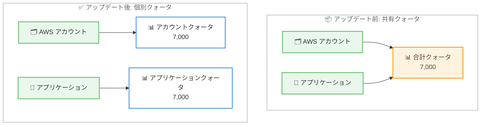

# AWS IAM Identity Center - AWS アカウントとアプリケーションの個別クォータ対応

**リリース日**: 2026 年 6 月 22 日
**サービス**: AWS IAM Identity Center
**機能**: AWS アカウントとアプリケーションに対する個別クォータ

📊 [このアップデートのインフォグラフィックを見る](https://takech9203.github.io/aws-news-summary/20260622-aws-identity-center-separate-quotas.html)
<!-- INFOGRAPHIC_BASE_URL は環境変数から取得 -->

## 概要

AWS IAM Identity Center は、1 つの IAM Identity Center インスタンスで構成できる AWS アカウント数とアプリケーション数に対して、個別のクォータをサポートするようになりました。これまで AWS アカウントとアプリケーションは合計で 1 つのクォータ (7,000) を共有していましたが、今回のアップデートにより、それぞれが独立したクォータを持つようになります。

デフォルトでは、AWS アカウントを最大 7,000、アプリケーションを最大 7,000 まで、それぞれ独立して構成できます。これにより、一方を多く使用してももう一方の容量を消費することがなくなります。クォータは AWS Service Quotas コンソールから引き上げをリクエストできます。

すでにより高い上限を付与されているお客様には、アカウントとアプリケーションの両方に対して同じ上限が自動的に適用され、追加の操作は必要ありません。このアップデートは、IAM Identity Center が利用可能なすべての AWS リージョンで提供されます。

**アップデート前の課題**

- AWS アカウントとアプリケーションが合計 7,000 という単一のクォータを共有していたため、アカウントを多く構成するとアプリケーションを構成できる余地が減っていた
- 数千の AWS アカウントを運用する組織では、アカウントがクォータ容量の大部分を消費し、新しいアプリケーションのオンボーディングが制限される可能性があった
- アカウントとアプリケーションの増加見込みを 1 つの上限値の中で調整する必要があった

**アップデート後の改善**

- AWS アカウントとアプリケーションがそれぞれ独立したクォータ (各 7,000) を持つようになった
- 一方のリソースを多く使用しても、もう一方の容量を消費しなくなった
- 数千の AWS アカウントを運用する組織でも、アカウントのクォータ容量を消費せずにアプリケーションをオンボーディングできるようになった

## アーキテクチャ図



アップデート前は AWS アカウントとアプリケーションが単一の合計クォータ (7,000) を共有していましたが、アップデート後はそれぞれが独立したクォータ (各 7,000) を持つように変更されました。

## サービスアップデートの詳細

### 主要機能

1. **個別クォータの分離**
   - AWS アカウントとアプリケーションのクォータが分離され、それぞれ独立して管理されるようになった
   - デフォルトで AWS アカウントは最大 7,000、アプリケーションは最大 7,000 まで構成可能
   - 一方のリソース使用量がもう一方の利用可能容量に影響しない

2. **クォータの引き上げ**
   - AWS Service Quotas コンソールから、アカウントとアプリケーションそれぞれのクォータ引き上げをリクエスト可能
   - クォータ引き上げリクエストは管理アカウントまたは委任された管理者アカウントから行う必要がある

3. **既存上限の自動移行**
   - すでにより高い上限を付与されているお客様には、アカウントとアプリケーションの両方に同じ上限が自動的に適用される
   - お客様による追加の操作は不要

## 技術仕様

### IAM Identity Center の追加クォータ

公式ドキュメントの「Additional quotas」に記載されているクォータは以下のとおりです。今回のアップデートにより、「構成可能な AWS アカウントまたはアプリケーションの総数」のクォータが、アカウントとアプリケーションに対して個別に適用されるようになりました。

| 項目 | デフォルトクォータ | 引き上げ可否 |
|------|------|------|
| 構成可能な AWS アカウントの総数 | 7,000 | 可能 |
| 構成可能なアプリケーションの総数 | 7,000 | 可能 |
| アカウントあたりの IAM Identity Center インスタンス数 | 1 | 不可 |
| 信頼されたトークン発行者の総数 | 10 | 不可 |
| 単一の IAM Identity Center インスタンスで有効化できる AWS リージョン数 | 3 | 可能 |

注: このクォータは AWS アカウントとアプリケーションに個別に適用されます。最大 7,000 アカウントと最大 7,000 アプリケーションを構成できます。

### 関連する権限

クォータ引き上げリクエストは、AWS Organizations の管理アカウント、または IAM Identity Center の委任管理者アカウントから実行する必要があります。

## 設定方法

### 前提条件

1. AWS Organizations が有効化され、IAM Identity Center インスタンスが構成されていること
2. クォータ引き上げを実施する場合、管理アカウントまたは委任された管理者アカウントへのアクセス権を持っていること
3. AWS Service Quotas コンソールへのアクセス権を持っていること

### 手順

#### ステップ1: 現在のクォータを確認する

```bash
aws service-quotas list-service-quotas \
  --service-code sso \
  --region us-east-1
```

IAM Identity Center (サービスコード `sso`) の現在のクォータ値を一覧表示します。アカウントとアプリケーションそれぞれのクォータ値を確認できます。

#### ステップ2: クォータ引き上げをリクエストする

```bash
aws service-quotas request-service-quota-increase \
  --service-code sso \
  --quota-code <対象のクォータコード> \
  --desired-value 10000
```

指定したクォータコードに対して、希望する値 (この例では 10,000) への引き上げをリクエストします。アカウント用とアプリケーション用のクォータコードはそれぞれ異なるため、引き上げたい対象に応じて指定します。

#### ステップ3: リクエストのステータスを確認する

引き上げリクエストの承認状況は、AWS Service Quotas コンソール、または `list-requested-service-quota-change-history` API で確認できます。承認後、新しいクォータ値が適用されます。

## メリット

### ビジネス面

- **スケーラビリティの向上**: 数千の AWS アカウントを運用する大規模組織でも、アカウント容量を気にせずアプリケーションをオンボーディングできる
- **計画の簡素化**: アカウントとアプリケーションの増加見込みを別々に管理できるため、容量計画が立てやすくなる
- **追加コストなし**: クォータの分離はリソース管理上の改善であり、利用に追加料金は発生しない

### 技術面

- **クォータの独立性**: 一方のリソース使用量がもう一方の利用可能容量に影響しないため、予期しないクォータ枯渇のリスクが低減する
- **自動移行**: 既存の高い上限を持つお客様は手動の設定変更なしに恩恵を受けられる
- **柔軟な引き上げ**: アカウントとアプリケーションそれぞれを必要に応じて個別に引き上げられる

## デメリット・制約事項

### 制限事項

- AWS アカウントとアプリケーションの構成数のクォータ以外にも、パーミッションセット数やリージョン数など他のクォータが存在し、それらは別途管理が必要
- クォータ引き上げリクエストは管理アカウントまたは委任された管理者アカウントからのみ実行可能
- 1 アカウントあたりの IAM Identity Center インスタンス数は 1 のまま変更されない

### 考慮すべき点

- クォータの引き上げには AWS Service Quotas を通じたリクエストと承認のプロセスが必要
- 大規模環境 (50,000 ユーザー、10,000 グループ、500 パーミッションセット超) では、管理に AWS CLI や API の利用が推奨される
- IAM Identity Center API には合計 20 TPS のスロットリング制限があるため、大量のリソース操作時は考慮が必要

## ユースケース

### ユースケース1: 大規模マルチアカウント環境でのアプリケーションオンボーディング

**シナリオ**: 5,000 を超える AWS アカウントを AWS Organizations で運用する大企業が、IAM Identity Center で多数の SaaS アプリケーションを SSO 連携したい。

**実装例**:
```
AWS アカウント: 5,000 (アカウントクォータ 7,000 内)
アプリケーション: 3,000 (アプリケーションクォータ 7,000 内)
→ 両者が独立しているため、アカウント数に関係なくアプリケーションを追加可能
```

**効果**: アカウントのクォータ容量を消費せずに、必要なアプリケーションを継続的にオンボーディングできる。

### ユースケース2: アプリケーション中心の SSO 統合基盤

**シナリオ**: 比較的少数の AWS アカウントを運用しつつ、多数の社内・外部アプリケーションへの SSO アクセスを IAM Identity Center に集約したい。

**実装例**:
```
AWS アカウント: 500
アプリケーション: 6,500
→ アプリケーションが 7,000 に近づいた場合、Service Quotas から個別に引き上げをリクエスト
```

**効果**: アプリケーションのクォータのみを引き上げることで、アカウント側に影響を与えずに SSO 統合を拡張できる。

### ユースケース3: 容量計画とクォータ監視

**シナリオ**: 急成長中の組織で、アカウントとアプリケーションの増加を別々にモニタリングし、事前にクォータ引き上げを準備したい。

**実装例**:
```
CloudWatch / Service Quotas で各クォータの使用率を監視
アカウント使用率: 80% → アカウントクォータの引き上げを申請
アプリケーション使用率: 40% → 引き上げ不要
```

**効果**: それぞれのリソースの増加傾向に応じて、必要なクォータのみを適切なタイミングで引き上げられる。

## 料金

このアップデートはクォータの分離に関する改善であり、機能自体の利用に追加料金は発生しません。AWS IAM Identity Center 自体も追加料金なしで利用できます。クォータの引き上げにも料金はかかりません。

## 利用可能リージョン

AWS IAM Identity Center が利用可能なすべての AWS リージョンで提供されます。

## 関連サービス・機能

- **AWS Organizations**: IAM Identity Center は AWS Organizations と統合して、組織内の複数 AWS アカウントへのアクセスを一元管理する。クォータ引き上げは管理アカウントまたは委任された管理者アカウントから行う
- **AWS Service Quotas**: アカウントとアプリケーションのクォータ引き上げリクエストを管理するサービス
- **パーミッションセット**: IAM Identity Center で AWS アカウントへのアクセスを定義する仕組み。アカウントクォータとは別にパーミッションセット数のクォータが存在する

## 参考リンク

- 📊 [インフォグラフィック](https://takech9203.github.io/aws-news-summary/20260622-aws-identity-center-separate-quotas.html)
- [公式発表 (What's New)](https://aws.amazon.com/about-aws/whats-new/2026/06/aws-identity-center-separate-quotas/)
- [ドキュメント (Quotas and limits in IAM Identity Center)](https://docs.aws.amazon.com/singlesignon/latest/userguide/limits.html)
- [IAM Identity Center 製品ページ](https://aws.amazon.com/iam/identity-center/)
- [Service Quotas でのクォータ引き上げリクエスト](https://docs.aws.amazon.com/servicequotas/latest/userguide/request-quota-increase.html)

## まとめ

今回のアップデートにより、IAM Identity Center で AWS アカウントとアプリケーションが独立したクォータ (各 7,000) を持つようになり、大規模なマルチアカウント環境でもアプリケーションのオンボーディングが容量制約を受けにくくなりました。既存の高い上限を持つお客様には自動的に同じ上限が適用されるため特別な対応は不要ですが、急成長する組織では Service Quotas で各クォータの使用状況を監視し、必要に応じて個別に引き上げを計画することを推奨します。
