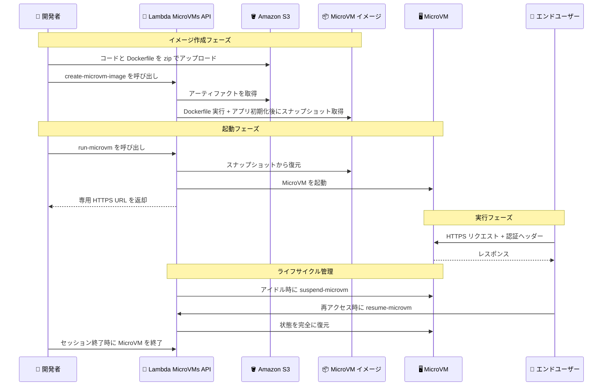

# AWS Lambda - MicroVMs

**リリース日**: 2026 年 6 月 22 日
**サービス**: AWS Lambda
**機能**: AWS Lambda MicroVMs

📊 [このアップデートのインフォグラフィックを見る](https://takech9203.github.io/aws-news-summary/20260622-aws-lambda-microvms.html)
<!-- INFOGRAPHIC_BASE_URL は環境変数から取得 -->

## 概要

AWS は、ユーザーや AI が生成したコードを隔離された環境で実行するための新しいサーバーレスコンピューティングプリミティブ「AWS Lambda MicroVMs」を発表しました。MicroVMs は、VM レベルの分離、ほぼ瞬時の起動および再開速度、そしてセッションの状態保持を同時に提供します。これにより、ユーザーやジョブごとに専用のコンピューティング環境を割り当て、仮想化インフラストラクチャを管理することなく、また「分離」「速度」「状態保持」のいずれかを犠牲にすることなく、コードを安全に実行できます。

MicroVMs は、エンドユーザーや AI が提供したコードを実行するマルチテナントアプリケーションに適しています。具体的には、インタラクティブなコーディング環境、データ分析プラットフォーム、コーディングアシスタント、脆弱性スキャンプラットフォームなどが想定されています。各 MicroVM には専用の HTTPS URL が割り当てられ、HTTP/2、gRPC、WebSockets をサポートします。

MicroVMs は、Lambda Function の月間 15 兆回を超える呼び出しを支える Firecracker 仮想化技術の上に構築されています。利用を開始するには、Dockerfile から MicroVM イメージを作成し、そのイメージから MicroVM を起動します。実行を最大 8 時間にわたって一時停止 (suspend) および再開 (resume) でき、アイドル時のコストを抑えながら、エンドユーザーが戻ってきたときにほぼ瞬時に応答できる状態を維持できます。

**アップデート前の課題**

従来、ユーザーや AI が生成したコードを安全に実行するための環境構築には、いくつかのトレードオフが存在していました。

- 強力な分離を実現するために、お客様自身が仮想化インフラストラクチャやネットワーク設定を構築・管理する必要があった
- コンテナベースのアプローチでは起動が速い一方で、VM レベルの分離やフルオペレーティングシステムの機能を得にくかった
- アイドル状態の環境を維持し続けると無駄なコストが発生し、停止すると状態 (メモリやディスク) が失われるため、「分離」「速度」「状態保持」のいずれかを犠牲にする必要があった

**アップデート後の改善**

今回のアップデートにより、これらのトレードオフを解消できます。

- インフラストラクチャを管理することなく、ユーザーやジョブごとに VM レベルで分離された専用のコンピューティング環境を割り当てられるようになった
- スナップショットからの再開により、マルチギガバイトのセッションでもほぼ瞬時に起動・再開できるようになった
- アイドル時に MicroVM を一時停止してメモリとディスクの状態を保持したままコストを削減し、トラフィックが戻ると状態をそのまま復元できるようになった

## アーキテクチャ図



上図は、MicroVM イメージの作成から MicroVM の起動、エンドユーザーへの専用 HTTPS エンドポイント提供、そして一時停止・再開・終了までのライフサイクルの流れを示しています。

## サービスアップデートの詳細

### 主要機能

1. **スナップショットベースの高速起動 (Rapid startup)**
   - MicroVM は事前に初期化されたスナップショットから再開するため、アプリケーションの初期化処理をスキップできる
   - コールドブートではなくスナップショットからの復元のため、マルチギガバイトのセッションでもほぼ瞬時に起動する
   - インストール済みパッケージ、ロード済みモデル、ファイルセットなどがそのまま保持される

2. **ライフサイクル制御 (Lifecycle control)**
   - MicroVM の一時停止 (suspend)、再開 (resume)、終了 (terminate) をプログラムから明示的に、または設定可能なアイドルポリシーによって自動で制御できる
   - アイドル時に MicroVM を一時停止すると、メモリとディスクの状態を保持したままコストを削減できる
   - トラフィックが戻るとメモリとディスクの状態が完全に復元され、クライアント側からは「中断がなかったかのように」処理が継続する

3. **柔軟なネットワーキング (Flexible networking)**
   - 各 MicroVM に専用の HTTPS エンドポイントが割り当てられ、ロードバランサーやイングレスインフラストラクチャは不要
   - 設定可能なポートでの受信トラフィックに対応し、HTTP/2、gRPC、WebSockets をサポート
   - サービス提供の JWE 認証を使用し、送信 (egress) はパブリックインターネットアクセスや VPC アクセスを設定可能

4. **柔軟なリソース割り当て (Flexible resource allocation)**
   - 各 MicroVM をベースライン (平均的な使用量) に合わせてプロビジョニングし、ピーク時にはベースラインの最大 4 倍まで垂直スケールできる
   - MicroVM の実行中はベースライン料金を支払い、ベースラインを超える分はアクティブに使用した時間のみ課金される

## 技術仕様

### MicroVM のリソースと制限

| 項目 | 詳細 |
|------|------|
| アーキテクチャ | ARM64 |
| vCPU | 最大 16 vCPU |
| メモリ | 最大 32 GB |
| ディスク | 最大 32 GB |
| 最大実行時間 | 最大 8 時間 |
| 一時停止・再開 | 最大 8 時間にわたって suspend / resume が可能 |
| 垂直スケール | 設定したベースラインの最大 4 倍まで |
| 基盤技術 | Firecracker 仮想化 (Lambda Function の月間 15 兆回超の呼び出しを支える技術) |
| 対応プロトコル | HTTP/2、gRPC、WebSockets |
| 認証 | サービス提供の JWE 認証 (`X-aws-proxy-auth` ヘッダー) |

### 主要な API オペレーション

| オペレーション | 説明 |
|------|------|
| `create-microvm-image` | Dockerfile とコードから MicroVM イメージを作成し、初期化済み環境のスナップショットを取得する |
| `run-microvm` | スナップショットから MicroVM を起動し、専用 HTTPS エンドポイントを返す |
| `suspend-microvm` | 実行中の MicroVM を一時停止し、状態を保持したままコストを削減する |
| `resume-microvm` | 一時停止した MicroVM をメモリ・ディスク状態を保ったまま再開する |

### アイドルポリシーの設定例

```json
{
  "maxIdleDurationSeconds": 900,
  "suspendedDurationSeconds": 300,
  "autoResumeEnabled": true
}
```

上記の例では、15 分 (900 秒) のアイドル状態が続くと自動的に一時停止し、次のリクエストで自動的に再開します。

## 設定方法

### 前提条件

1. コードと Dockerfile を格納する Amazon S3 バケット
2. イメージビルド用の IAM ロール (build role) と MicroVM 実行用の IAM ロール (execution role)
3. MicroVMs を利用可能なリージョンの AWS アカウント

### 手順

#### ステップ1: コードと Dockerfile を準備して S3 にアップロード

```dockerfile
FROM public.ecr.aws/lambda/microvms:al2023-minimal
RUN dnf install -y python3 python3-pip && dnf clean all
WORKDIR /app
COPY requirements.txt .
RUN pip install --no-cache-dir -r requirements.txt
COPY app.py .
EXPOSE 5000
CMD ["gunicorn", "--bind", "0.0.0.0:5000", "app:app"]
```

アプリケーションコードと上記の Dockerfile を zip アーカイブにまとめ、Amazon S3 にアップロードします。Dockerfile は MicroVMs 用のベースイメージ (例: `public.ecr.aws/lambda/microvms:al2023-minimal`) を起点に、必要なパッケージとアプリケーションを組み込みます。

#### ステップ2: MicroVM イメージを作成

```bash
aws lambda-microvms create-microvm-image \
  --code-artifact uri=<path/to/s3/artifact.zip> \
  --name <VM_image_name> \
  --base-image-arn arn:aws:lambda:us-east-1:aws:microvm-image:al2023-1 \
  --build-role-arn <IAM role ARN>
```

このコマンドは、S3 上のアーティファクトをもとに Lambda が Dockerfile を実行してアプリケーションを起動し、初期化済み環境のスナップショットを取得します。ビルドログは CloudWatch の `/aws/lambda/microvms/<image-name>` にストリーミングされ、完了するとイメージの ARN とバージョン番号が割り当てられます。

#### ステップ3: MicroVM を起動してトラフィックを送信

```bash
aws lambda-microvms run-microvm \
  --image-identifier arn:aws:lambda:<region>:<acct>:microvm-image:my-image \
  --execution-role-arn arn:aws:iam::<acct>:role/MicroVMExecutionRole \
  --idle-policy '{"maxIdleDurationSeconds":900,"suspendedDurationSeconds":300,"autoResumeEnabled":true}'
```

このコマンドは、スナップショットから MicroVM を起動します。ネットワーク設定は不要で、Lambda が一意の ID を割り当て、アプリケーションがスナップショットから起動済みの状態で専用エンドポイント URL を返します。クライアントは、CLI で生成した短期的な認証トークンを `X-aws-proxy-auth` ヘッダーに付与して、この HTTPS エンドポイントへリクエストを送信します。

## メリット

### ビジネス面

- **インフラ管理の排除**: 仮想化インフラストラクチャやロードバランサー、イングレス基盤を構築・運用することなく、分離された実行環境をユーザーやジョブごとに提供できる
- **アイドルコストの削減**: アイドル時に MicroVM を一時停止することで、状態を保持したまま実行コストを抑えられる
- **AI ワークロードへの最適化**: AI が生成したコードを安全に隔離して実行できるため、コーディングアシスタントや AI サンドボックスなどの新しいプロダクトを迅速に構築できる

### 技術面

- **VM レベルの分離**: フルオペレーティングシステムの機能 (システムパッケージのインストールやファイルシステムのマウントなど) を持つ、テナント間で強力に分離された環境を提供する
- **状態保持と高速再開**: メモリ、ディスク、実行中のプロセスをセッション期間中保持し、スナップショットからの再開によりほぼ瞬時に復元する
- **柔軟なリソーススケール**: ベースラインでプロビジョニングしつつ、ピーク時はベースラインの最大 4 倍まで垂直スケールでき、超過分はアクティブな時間のみ課金される

## デメリット・制約事項

### 制限事項

- 利用可能リージョンが 5 リージョンに限定されている (US East バージニア北部・オハイオ、US West オレゴン、アジアパシフィック東京、欧州アイルランド)
- アーキテクチャは ARM64 に限定される
- 1 つの MicroVM あたり最大 16 vCPU、32 GB メモリ、32 GB ディスク、最大実行時間 8 時間という上限がある

### 考慮すべき点

- 初期化時に一意のコンテンツを生成したり、ネットワーク接続を確立したり、一時的なデータをロードするアプリケーションは、互換性のためにサービス提供のフックと統合が必要になる場合がある
- イベント駆動型やリクエスト/レスポンス型のワークロードには引き続き Lambda Function が適しており、MicroVMs とは相互補完的な関係にある。ユースケースに応じて使い分けが必要
- ビルドには Dockerfile を S3 にアップロードする運用が前提となるため、CI/CD パイプラインへの組み込みを検討する

## ユースケース

### ユースケース1: インタラクティブなコーディング環境

**シナリオ**: SaaS 型のオンライン IDE で、各ユーザーにコードの編集・実行ができる隔離環境を提供したい。ユーザーが離席している間はコストを抑えつつ、戻ってきたときには即座に作業を再開させたい。

**実装例**:
```
ユーザーログイン時: run-microvm でユーザー専用 MicroVM を起動
アイドル 15 分後: アイドルポリシーにより自動 suspend
再アクセス時: autoResumeEnabled により自動 resume (状態を完全復元)
```

**効果**: ユーザーごとに強力に分離された環境を提供しつつ、アイドル時のコストを削減し、セッションの作業状態をそのまま維持できる。

### ユースケース2: AI 生成コードの実行サンドボックス

**シナリオ**: コーディングアシスタントが生成したコードを安全に実行・検証したい。信頼できないコードがホスト環境やほかのテナントに影響を与えないようにする必要がある。

**実装例**:
```
AI がコード生成 -> run-microvm で使い捨ての MicroVM を起動
-> HTTPS エンドポイント経由でコードを実行・結果取得
-> セッション終了時に MicroVM を終了してリソースを解放
```

**効果**: VM レベルの分離によって AI 生成コードを安全に隔離実行でき、ジョブごとに新鮮な環境を高速に立ち上げられる。

### ユースケース3: 脆弱性スキャンプラットフォーム

**シナリオ**: マルチテナントのセキュリティスキャンサービスで、各スキャンジョブを隔離された環境で実行し、テナント間のデータ漏洩を防ぎたい。

**実装例**:
```
スキャンジョブ受付 -> ジョブ専用 MicroVM を run-microvm で起動
-> 隔離環境内でスキャンツールを実行
-> 結果を取得後に MicroVM を終了
```

**効果**: ジョブごとに独立した実行環境を確保することでテナント間の分離を担保しつつ、スナップショットからの高速起動でスループットを向上できる。

## 料金

MicroVMs は、リソースの割り当てと実際の使用量に基づいた料金モデルを採用しています。MicroVM の実行中はプロビジョニングしたベースラインのコンピューティングリソースに対して課金され、ワークロードがベースラインを超えた場合は、追加リソースのアクティブな使用時間のみに対して課金されます。アイドル状態の MicroVM を一時停止すると、状態を保持したまま実行コストを削減できます。

具体的な料金は AWS Lambda の料金ページを参照してください。

| 状態 | 課金の考え方 |
|--------|------------------|
| 実行中 (ベースライン内) | プロビジョニングしたベースラインリソースに対して課金 |
| 実行中 (ベースライン超過) | 超過分の追加リソースをアクティブに使用した時間のみ課金 |
| 一時停止中 (suspended) | 状態を保持したままアイドルコストを大幅に削減 |

## 利用可能リージョン

AWS Lambda MicroVMs は、以下の 5 リージョンで利用可能です。

- 米国東部 (バージニア北部)
- 米国東部 (オハイオ)
- 米国西部 (オレゴン)
- アジアパシフィック (東京)
- 欧州 (アイルランド)

## 関連サービス・機能

- **AWS Lambda Functions**: イベント駆動型・リクエスト/レスポンス型のワークロードに適した従来の Lambda 実行モデル。MicroVMs とは相互補完的に使い分ける
- **Firecracker**: MicroVMs の基盤となる軽量仮想化技術。Lambda Function の月間 15 兆回超の呼び出しを支える
- **Amazon S3**: コードと Dockerfile を格納するアーティファクトの保管先
- **Amazon ECR Public**: MicroVMs 用のベースイメージ (`public.ecr.aws/lambda/microvms`) の提供元
- **Amazon CloudWatch**: イメージビルド時のログ (`/aws/lambda/microvms/<image-name>`) の出力先
- **AWS CloudFormation / AWS CDK / Agent Toolkit for AWS**: MicroVMs を構築・管理するためのデプロイ手段

## 参考リンク

- 📊 [インフォグラフィック](https://takech9203.github.io/aws-news-summary/20260622-aws-lambda-microvms.html)
- [公式発表 (What's New)](https://aws.amazon.com/about-aws/whats-new/2026/06/aws-lambda-microvms/)
- [AWS Blog](https://aws.amazon.com/blogs/aws/run-isolated-sandboxes-with-full-lifecycle-control-aws-lambda-introduces-microvms)
- [ドキュメント](https://docs.aws.amazon.com/lambda/latest/dg/lambda-microvms-guide.html)
- [料金ページ](https://aws.amazon.com/lambda/pricing/)

## まとめ

AWS Lambda MicroVMs は、ユーザーや AI が生成したコードを安全に実行するための新しいサーバーレスコンピューティングプリミティブであり、これまでトレードオフの関係にあった「分離」「速度」「状態保持」を同時に実現します。インタラクティブなコーディング環境、AI サンドボックス、脆弱性スキャンなど、マルチテナントでコードを実行するアプリケーションを構築している場合は、まず Dockerfile から MicroVM イメージを作成し、東京リージョンを含む利用可能リージョンで MicroVM を起動して、アイドルポリシーによるコスト最適化を含めた挙動を検証することをお勧めします。
