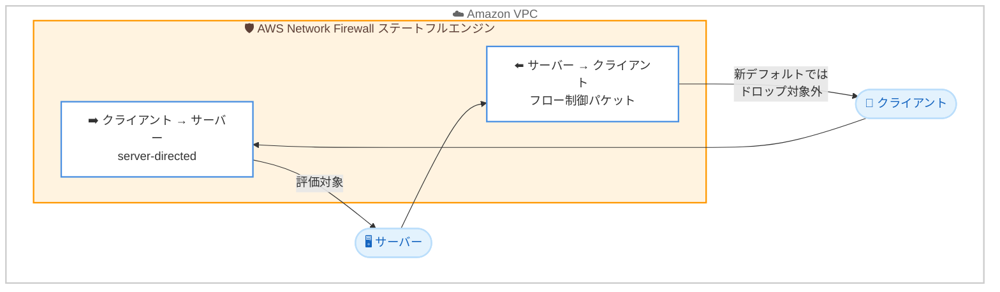

# AWS Network Firewall - デフォルトドロップアクションの変更による接続信頼性の向上

**リリース日**: 2026 年 6 月 22 日
**サービス**: AWS Network Firewall
**機能**: 新規ファイアウォールポリシーのデフォルトステートフルアクションの変更

📊 [このアップデートのインフォグラフィックを見る](https://takech9203.github.io/aws-news-summary/20260622-aws-network-firewall-updates-default-drop-action.html)
<!-- INFOGRAPHIC_BASE_URL は環境変数から取得 -->

## 概要

AWS Network Firewall は、新規に作成されるすべてのファイアウォールポリシーのデフォルトステートフルアクションを「Application drop established (server-directed only)」に変更しました。これは従来のデフォルトであった「Application drop established (bidirectional)」(旧称: Application layer drop established) を置き換えるものです。新規ポリシーを作成する際、このメリットを得るための追加操作は不要です。

AWS Network Firewall は、Amazon VPC 全体にネットワーク保護を展開するためのマネージドサービスです。従来の双方向 (bidirectional) のデフォルト設定では、サーバーからクライアントへの正当な TCP パケット (ウィンドウ更新、キープアライブ、リセットなど) を意図せずドロップしてしまう可能性がありました。この挙動は断続的な接続失敗を引き起こし、原因の特定が難しいという問題がありました。

今回のアップデートにより、より安全なデフォルト動作となる「server-directed only (サーバー方向のみ)」が採用され、クライアント方向への正当なフロー制御パケットがドロップされなくなりました。これにより、接続の信頼性が向上し、診断が困難だった断続的な障害を回避できます。本アップデートは、AWS Network Firewall が提供されるすべての AWS リージョンで利用可能です。

**アップデート前の課題**

- 従来のデフォルト設定 (bidirectional) では、サーバーからクライアントへの正当な TCP パケット (ウィンドウ更新、キープアライブ、リセット) が意図せずドロップされる可能性があった
- このパケットドロップにより、断続的な接続失敗が発生していた
- 障害が間欠的に発生するため、根本原因の特定とトラブルシューティングが困難だった

**アップデート後の改善**

- 新規ポリシーのデフォルトが「server-directed only」となり、サーバー方向のトラフィックのみがドロップ対象となった
- クライアント方向への正当なフロー制御パケットがドロップされなくなり、接続の信頼性が向上した
- 追加の設定なしで、新規作成ポリシーは安全なデフォルト動作の恩恵を受けられるようになった

## アーキテクチャ図



新しいデフォルト動作では、ステートフルエンジンはサーバー方向 (server-directed) のトラフィックのみをドロップ評価の対象とし、サーバーからクライアントへのウィンドウ更新やキープアライブなどのフロー制御パケットはドロップされません。

## サービスアップデートの詳細

### 主要機能

1. **デフォルトステートフルアクションの変更**
   - 新規作成されるすべてのファイアウォールポリシーのデフォルトが「Application drop established (server-directed only)」に変更された
   - 従来のデフォルトであった「Application drop established (bidirectional)」(旧称: Application layer drop established) を置き換える
   - 既存のファイアウォールポリシーの設定は変更されない (新規ポリシーにのみ適用)

2. **サーバー方向のみの評価 (server-directed only)**
   - established 状態の接続に対して、クライアントからサーバーへの方向のトラフィックのみをドロップ対象とする
   - サーバーからクライアントへの正当な TCP フロー制御パケット (ウィンドウ更新、キープアライブ、リセット) はドロップされない
   - これにより断続的な接続失敗が回避される

3. **PQC フラグメント化 TLS ハンドシェイクへの対応**
   - ポスト量子暗号 (PQC) のフラグメント化された TLS ハンドシェイクをサポートするために双方向 (bidirectional) 設定が必要な既存環境については、ドキュメントを参照する必要がある
   - 双方向設定を継続する、または TCP ドロップルールに `to_server` フラグを追加して正当なフロー制御パケットがブロックされないようにする選択肢がある

## 技術仕様

### デフォルトアクションの比較

| 項目 | 従来のデフォルト | 新しいデフォルト |
|------|------------------|------------------|
| アクション名 | Application drop established (bidirectional) | Application drop established (server-directed only) |
| 旧称 | Application layer drop established | - |
| 評価方向 | 双方向 (クライアント ⇔ サーバー) | サーバー方向のみ (クライアント → サーバー) |
| サーバー → クライアントのフロー制御パケット | ドロップされる可能性あり | ドロップされない |
| 接続信頼性 | 断続的な障害のリスクあり | 向上 |
| 適用対象 | - | 新規作成ポリシーのみ |

### ステートフルアクションの動作

| 用語 | 説明 |
|------|------|
| established | TCP ハンドシェイク (SYN / SYN-ACK / ACK) を完了し、確立された接続上のトラフィック |
| server-directed | クライアントからサーバーへ向かう方向のトラフィックを評価対象とする |
| bidirectional | クライアントとサーバーの双方向のトラフィックを評価対象とする |
| フロー制御パケット | ウィンドウ更新、キープアライブ、リセットなど、TCP 接続の維持に必要なパケット |

### API 変更履歴

今回のアップデートは新規ファイアウォールポリシーのデフォルト動作の変更であり、API メソッドの追加や変更は確認されていません。

## 設定方法

### 前提条件

1. AWS Network Firewall が利用可能なリージョンであること
2. ファイアウォールポリシーを作成または管理する権限を持つ IAM ユーザーまたはロール
3. Suricata 互換ルールの評価順序に関する基本的な理解

### 手順

#### ステップ 1: 新規ポリシーの作成

新規にファイアウォールポリシーを作成する場合、追加操作なしでデフォルトのステートフルアクションが「server-directed only」となります。新しい安全なデフォルト動作を活用するために特別な設定は不要です。

#### ステップ 2: 既存環境で双方向設定が必要かの確認

ポスト量子暗号 (PQC) のフラグメント化された TLS ハンドシェイクをサポートするために双方向設定が必要な場合は、AWS の公式ドキュメントを参照してください。双方向設定を維持するか、TCP ドロップルールに `to_server` フラグを追加することで、正当なフロー制御パケットのブロックを回避できます。

```
# Suricata 互換ルールの例: to_server フラグを使用してサーバー方向のみを対象とする
drop tcp any any -> any any (flow:to_server, established; sid:1; rev:1;)
```

上記のルールは、established 状態の接続のうち、サーバーへ向かう (to_server) 方向の TCP トラフィックのみをドロップ対象とします。これにより、サーバーからクライアントへのフロー制御パケットはドロップされません。

#### ステップ 3: 評価順序の管理

Suricata 互換ルールの評価順序を適切に管理することで、意図したトラフィック制御を実現できます。詳細は AWS Network Firewall のドキュメントを参照してください。

## メリット

### ビジネス面

- **接続信頼性の向上**: 断続的な接続失敗が回避され、アプリケーションの安定稼働につながる
- **運用コストの削減**: 診断が困難だった間欠障害のトラブルシューティング工数を削減できる
- **追加コストなし**: デフォルト動作の変更であり、新規ポリシー作成時に追加操作や追加料金は発生しない

### 技術面

- **正当なフロー制御パケットの保護**: ウィンドウ更新、キープアライブ、リセットなどの TCP パケットがドロップされなくなる
- **安全なデフォルト**: 新規ポリシーは初めからより安全な設定が適用される
- **柔軟な調整**: PQC など特定の要件がある場合は、双方向設定や `to_server` フラグで調整可能

## デメリット・制約事項

### 制限事項

- 本変更は新規作成されるファイアウォールポリシーにのみ適用され、既存ポリシーの設定は変更されない
- PQC のフラグメント化された TLS ハンドシェイクをサポートするために双方向設定が必要な環境では、追加の設定確認が必要

### 考慮すべき点

- 既存環境で双方向設定に依存している場合は、デフォルト変更の影響を理解した上で運用する必要がある
- 双方向設定が必要なケースでは、AWS の公式ドキュメントに従って適切に設定を行うこと

## ユースケース

### ユースケース 1: 一般的な VPC ネットワーク保護

**シナリオ**: Amazon VPC 内のワークロードに対して新規にファイアウォールポリシーを作成し、ステートフルなトラフィック制御を行う。

**実装例**:
```
新規ファイアウォールポリシーを作成 → デフォルトで server-directed only が適用される
```

**効果**: 追加設定なしで、サーバーからクライアントへの正当なフロー制御パケットがドロップされず、接続の信頼性が確保される。

### ユースケース 2: 断続的な接続障害の解消

**シナリオ**: 従来の双方向設定により、長時間接続でウィンドウ更新やキープアライブがドロップされ、断続的な切断が発生していた。

**実装例**:
```
新規ポリシーへ移行、または既存ポリシーを server-directed only に変更
```

**効果**: フロー制御パケットがドロップされなくなり、長時間接続の安定性が向上する。

### ユースケース 3: PQC フラグメント化 TLS ハンドシェイクのサポート

**シナリオ**: ポスト量子暗号 (PQC) を利用しており、フラグメント化された TLS ハンドシェイクをサポートするために双方向の評価が必要。

**実装例**:
```
bidirectional 設定を維持、または TCP ドロップルールに flow:to_server フラグを追加
```

**効果**: PQC のフラグメント化された TLS ハンドシェイクをサポートしつつ、正当なフロー制御パケットのブロックを回避できる。

## 料金

本アップデートはデフォルトステートフルアクションの変更であり、追加料金は発生しません。AWS Network Firewall の料金体系に変更はなく、従来どおりファイアウォールエンドポイントの稼働時間と処理トラフィック量に基づいて課金されます。詳細は AWS Network Firewall の料金ページを参照してください。

## 利用可能リージョン

AWS Network Firewall が提供されるすべての AWS リージョンで利用可能です。

## 関連サービス・機能

- **Amazon VPC**: AWS Network Firewall は Amazon VPC 内にネットワーク保護を展開する
- **Suricata 互換ルール**: ステートフルルールは Suricata 互換のルール構文を使用し、評価順序の管理が可能
- **AWS Firewall Manager**: 複数アカウント・複数 VPC にわたるファイアウォールポリシーの一元管理に利用できる

## 参考リンク

- 📊 [インフォグラフィック](https://takech9203.github.io/aws-news-summary/20260622-aws-network-firewall-updates-default-drop-action.html)
- [公式発表 (What's New)](https://aws.amazon.com/about-aws/whats-new/2026/06/aws-network-firewall-updates-default-drop-action)
- [AWS Network Firewall ドキュメント](https://docs.aws.amazon.com/network-firewall/latest/developerguide/what-is-aws-network-firewall.html)
- [AWS Network Firewall 料金ページ](https://aws.amazon.com/network-firewall/pricing/)

## まとめ

今回のアップデートにより、AWS Network Firewall の新規ファイアウォールポリシーは、より安全な「server-directed only」をデフォルトのステートフルアクションとして採用します。これにより、サーバーからクライアントへの正当なフロー制御パケットのドロップに起因する断続的な接続障害を回避できます。新規ポリシーでは追加操作なしでこのメリットを得られますが、PQC のフラグメント化された TLS ハンドシェイクをサポートするために双方向設定が必要な既存環境については、公式ドキュメントを参照して適切に設定を確認することを推奨します。
