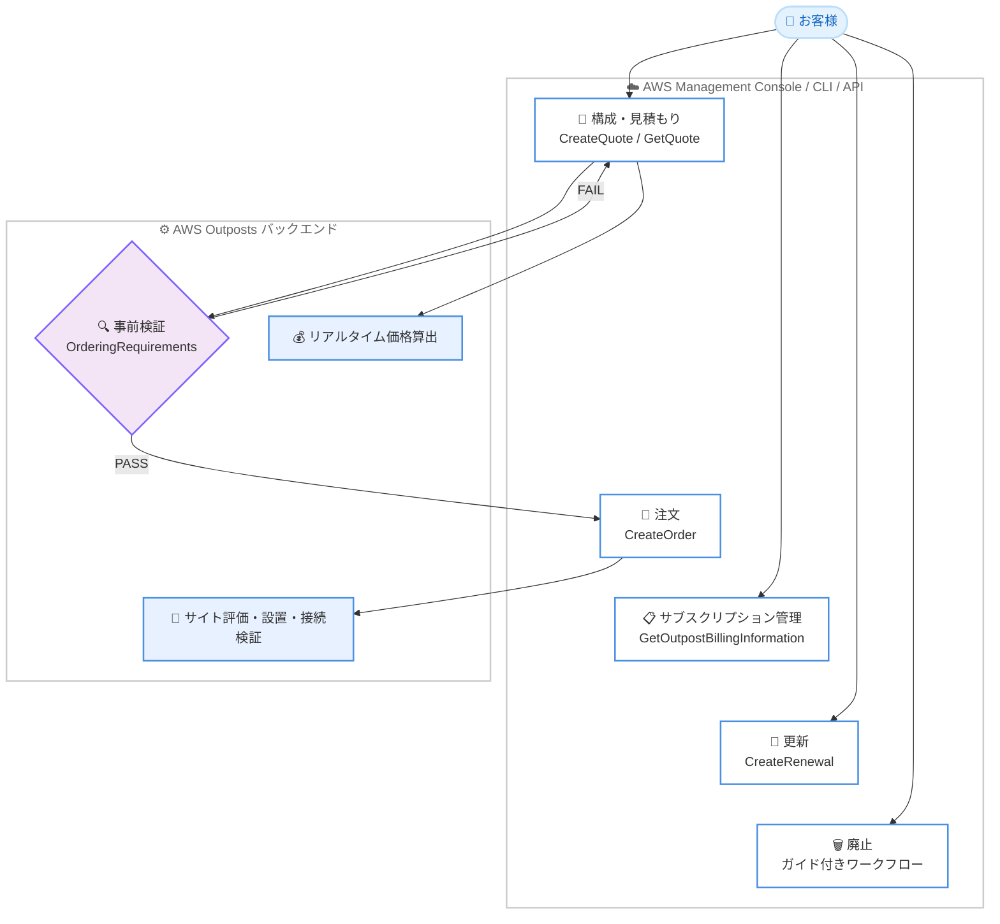

# AWS Outposts - セルフサービスライフサイクル管理

**リリース日**: 2026 年 6 月 22 日
**サービス**: AWS Outposts
**機能**: セルフサービスライフサイクル管理機能 (Self-Service Lifecycle Management)

📊 [このアップデートのインフォグラフィックを見る](https://takech9203.github.io/aws-news-summary/20260622-aws-outposts-self-service-lifecycle-management.html)
<!-- INFOGRAPHIC_BASE_URL は環境変数から取得 -->

## 概要

AWS は、AWS Outposts のライフサイクル全体をお客様自身で管理できるセルフサービス機能を発表しました。今回のアップデートにより、構成 (Configuration)、見積もり (Quoting)、注文 (Ordering)、サブスクリプション管理 (Subscription Management)、更新 (Renewal)、廃止 (Decommissioning) の各操作を、AWS Management Console、AWS CLI、AWS API から直接実行できるようになりました。

これまで Outposts のライフサイクル管理は AWS のチームに依存しており、見積もりの取得や契約情報の確認、廃止のたびに AWS への問い合わせが必要でした。今回提供される新しい構成・見積もりツールは、複数の支払いオプションと契約期間にわたるリアルタイムのコスト見積もりを生成し、注文を送信する前にアカウントおよびリージョンの制約を事前に提示します。生成された見積もりはコンソール上でそのまま注文に変換でき、新規デプロイと容量追加の両方に対応します。

サブスクリプションの詳細 (契約期間の開始日・終了日、請求情報) はコンソールおよびプログラムから参照可能です。契約期間の終了が近づくと、新しい契約期間と支払いオプションでの更新、またはリソースのクリーンアップを伴うガイド付きワークフローでの廃止を、いずれもセルフサービスで実行できます。本機能は AWS Outposts をサポートするすべての商用 AWS リージョンで利用可能です。

**アップデート前の課題**

- 見積もりの取得、注文、契約情報の確認、廃止のたびに AWS のチームへの問い合わせが必要だった
- 支払いオプションや契約期間ごとのコストを比較するために、AWS とのやり取りに時間がかかった
- アカウントの準備状況やリージョンの制約が、注文プロセスの後段になって判明することがあった
- サブスクリプションの契約期間や請求情報を確認するために AWS への問い合わせが必要だった

**アップデート後の改善**

- 構成・見積もり・注文・サブスクリプション管理・更新・廃止のすべてをコンソール、CLI、API からセルフサービスで実行できるようになった
- 構成・見積もりツールが、複数の支払いオプションと契約期間にわたるコストを数秒でリアルタイムに算出するようになった
- 注文送信前にアカウント準備状況の不足やリージョンの制約を事前に検出できるようになった
- サブスクリプションの契約期間や請求情報をコンソールおよび `GetOutpostBillingInformation` API で参照できるようになった

## アーキテクチャ図



お客様はコンソール、CLI、API から見積もりを作成し、事前検証を通過した見積もりを注文に変換します。AWS はその後、サイト評価、設置、接続検証を実施します。

## サービスアップデートの詳細

### 主要機能

1. **構成・見積もりツール (Configuration & Quoting)**
   - 構成を作成し、リアルタイムのコスト見積もりを確認した上で、コンソールまたは API から注文できる
   - 複数の構成、支払いオプション、契約期間にわたるコストをリアルタイムに比較できる
   - 注文送信前にアカウント準備状況の不足やリージョンの制約を事前に検証する
   - 見積もりは数秒で生成され、有効期間は 30 日間。有効期限切れの見積もりは現在の価格で再生成できる
   - 新規デプロイと容量追加の両方に対応し、容量追加の場合は既存 Outpost の情報が事前に入力される
   - 出力には推奨ラック構成、すべての支払いオプションのコスト見積もり、契約期間、ダウンロード可能な PDF が含まれる

2. **注文 (Ordering)**
   - 見積もりを注文に変換する。注文後は注文内容を変更できない
   - 前提条件: サイトに関連付けられた Outpost の作成、有効な AWS Enterprise Support または AWS Unified Operations プラン、完全なサイト詳細 (運用・配送先住所、ラックの物理的特性)
   - 注文後、AWS が責任共有モデルに基づきサイト評価、設置、接続検証を実施する

3. **サブスクリプション管理 (Subscription Management)**
   - 契約期間は 1 年、3 年、5 年から選択
   - 契約期間の開始日・終了日、支払い条件、前払い費用、月額料金をコンソールおよび CLI/API で参照できる
   - 容量追加を行った場合は複数のサブスクリプションが表示される
   - コンソールの [Billing] タブでステータス (Active、Pending) でフィルタリングし、CSV をダウンロードできる

4. **更新 (Renewal)**
   - 契約終了日の 3 か月前から更新可能
   - 元の契約とは異なる契約期間・支払いオプションを選択できる
   - 前払い (全額前払い・一部前払い) は送信時に課金され、月額料金は更新開始日から発生する

5. **廃止 (Decommissioning)**
   - 契約期間中いつでも実行可能
   - EC2 インスタンス、AWS RAM 共有、仮想インターフェイスなどのアクティブなリソースを確認できる
   - リソースの自動削除 (Delete Resources) または手動削除を選択できるガイド付きワークフロー
   - 自動削除を選択した場合、AWS はデータのスナップショットを取得せず、削除後はリソースを復元できない
   - AWS は廃止前に EBS スナップショットの作成を推奨 (親リージョンに保存され、同一の KMS キーで暗号化される)

## 技術仕様

### サブスクリプションと支払いオプション

| 項目 | 詳細 |
|------|------|
| 契約期間 | 1 年、3 年、5 年 (`ONE_YEAR`、`THREE_YEARS`、`FIVE_YEARS`) |
| 支払いオプション | 全額前払い、前払いなし、一部前払い (`ALL_UPFRONT`、`NO_UPFRONT`、`PARTIAL_UPFRONT`) |
| 見積もり有効期間 | 30 日間 |
| 更新可能時期 | 契約終了日の 3 か月前から |
| 容量タイプ | EC2、EBS、S3 |

### API 変更履歴

| 日付 | サービス | 変更内容 |
|------|----------|----------|
| 2026/06/09 | [outposts](https://awsapichanges.com/archive/changes/6ed721-outposts.html) | 6 new 3 updated api methods - セルフサービスの見積もり・注文 API を追加。`CreateQuote`、`GetQuote`、`UpdateQuote`、`DeleteQuote`、`ListQuotes`、`ListOrderableInstanceTypes` を新規追加。`CreateRenewal`、`GetOutpostBillingInformation`、`GetRenewalPricing` を更新 |
| 2026/06/16 | [outposts](https://awsapichanges.com/archive/changes/e078c6-outposts.html) | 2 updated api methods - 見積もりからの注文作成をサポート。`CreateOrder` と `GetOrder` に `QuoteIdentifier` / `QuoteOptionIdentifier` を追加 |

### 主要 API メソッド

| メソッド | 用途 |
|---------|------|
| `CreateQuote` / `UpdateQuote` / `GetQuote` / `ListQuotes` / `DeleteQuote` | 見積もりの作成・更新・取得・一覧・削除 |
| `ListOrderableInstanceTypes` | 注文可能なインスタンスタイプの一覧取得 (世代フィルタ対応) |
| `CreateOrder` / `GetOrder` | 見積もりからの注文作成・注文状況の取得 |
| `GetOutpostBillingInformation` | サブスクリプションと請求情報の取得 |
| `GetRenewalPricing` / `CreateRenewal` | 更新価格の取得・更新の作成 |

### サブスクリプション情報の取得 (CLI 例)

```bash
aws outposts get-outpost-billing-information \
    --outpost-identifier op-1234567890abcdefg
```

レスポンスには `SubscriptionId`、`SubscriptionType` (`ORIGINAL` / `RENEWAL` / `CAPACITY_INCREASE`)、`SubscriptionStatus`、`OrderIds`、開始日・終了日、`MonthlyRecurringPrice`、`UpfrontPrice` などが JSON 形式で含まれます。

## 設定方法

### 前提条件

1. サイトに関連付けられた Outpost が作成済みであること
2. 有効な AWS Enterprise Support または AWS Unified Operations プランに加入していること
3. 完全なサイト詳細 (運用・配送先住所、ラックの物理的特性) が登録されていること
4. 必要に応じて IAM ポリシーで見積もり生成や `GetOutpostBillingInformation` へのアクセスを制限すること

### 手順

#### ステップ 1: 見積もりの作成

```bash
aws outposts create-quote \
    --country-code "JP" \
    --requested-capacities '[{"QuoteCapacityType":"EC2","Unit":"vCPU","Quantity":960}]' \
    --requested-payment-options "ALL_UPFRONT" "NO_UPFRONT" \
    --requested-payment-terms "THREE_YEARS" "ONE_YEAR" \
    --description "New Outpost for Tokyo DC"
```

新規デプロイまたは容量追加の構成を指定して見積もりを作成します。レスポンスには支払いオプションと契約期間ごとの価格 (`UpfrontPrice`、`MonthlyRecurringPrice`)、推奨ラック構成、注文要件の検証結果 (`OrderingRequirements`) が含まれます。

#### ステップ 2: 見積もり内容の確認と検証

```bash
aws outposts get-quote --quote-identifier "<QuoteId>"
```

見積もりの詳細を取得し、`OrderingRequirements` の各項目の `Status` (`PASS` / `FAIL` / `EXEMPT`) を確認します。`FAIL` がある場合は、Enterprise Support の有無や住所、ラックの物理的特性などの不足を解消します。

#### ステップ 3: 注文への変換

```bash
aws outposts create-order \
    --outpost-identifier "<OutpostId>" \
    --quote-identifier "<QuoteId>" \
    --quote-option-identifier "<QuoteOptionIdentifier>" \
    --payment-option "ALL_UPFRONT" \
    --payment-term "THREE_YEARS"
```

検証を通過した見積もりオプションを注文に変換します。注文後は内容を変更できないため、送信前に支払い条件と構成を確認してください。注文送信後、AWS がサイト評価、設置、接続検証を実施します。

## メリット

### ビジネス面

- **調達リードタイムの短縮**: AWS チームへの問い合わせを待たずに、数秒で見積もりを取得し注文できる
- **コストの透明性向上**: 複数の支払いオプションと契約期間にわたるコストを事前に比較し、最適な選択ができる
- **計画の容易化**: ダウンロード可能な PDF 見積もりにより、社内承認や予算策定がしやすくなる

### 技術面

- **API による自動化**: 見積もり、注文、サブスクリプション参照、更新を API/CLI から自動化できる
- **事前検証によるエラー削減**: 注文送信前にアカウント準備状況やリージョン制約を検出し、手戻りを防げる
- **ガイド付き廃止**: アクティブなリソースを確認しながらクリーンアップでき、安全に Outpost を廃止できる

## デメリット・制約事項

### 制限事項

- 注文後は注文内容を変更できない
- 世代の異なるハードウェアは混在できない (例: C7i/M8i を第 1 世代に追加することはできない)
- 容量追加にはサブスクリプションの残存期間が 30 日以上必要。月単位 (month-to-month) のサブスクリプションは先に更新が必要
- ストレージの削減や個別ホストの廃止 (容量削減) はサポートされない
- EBS と S3 は固定ティアでプロビジョニングされ、要求量は切り上げられる
- 最小構成あり: 第 1 世代の新規注文は EBS なしで 4 コンピュートホスト、EBS ありで 2 ホスト。第 2 世代の新規注文は最小 960 vCPU。容量追加は 3 コンピュートホストまたは任意のストレージティア増加

### 考慮すべき点

- 自動削除では AWS はスナップショットを取得しないため、廃止前に必要な EBS スナップショットを作成しておくこと
- 廃止しても残存する支払い義務は取り消されず、月単位の課金は日割り計算されない。追加課金を避けるには次回請求日の少なくとも 5 日前に廃止リクエストを送信すること
- 価格情報は機密性が高いため、`GetOutpostBillingInformation` へのアクセスを IAM で制限することを検討する
- 容量計画ではインスタンスファミリーごとに少なくとも N+1 のホストをプロビジョニングすることが推奨される

## ユースケース

### ユースケース 1: 新規 Outpost の迅速な調達

**シナリオ**: 国内データセンターにオンプレミス環境を構築する企業が、複数の支払いプランを比較しながら Outpost を発注したい。

**実装例**:
```
1. CreateQuote で複数の支払いオプション・契約期間の見積もりを取得
2. PDF をダウンロードして社内で予算承認
3. CreateOrder で承認済みオプションを注文
```

**効果**: AWS チームとのやり取りを待たずに数秒で見積もりを取得し、社内承認後すぐに発注できる。

### ユースケース 2: 容量追加の自動化

**シナリオ**: 既存 Outpost のワークロード増加に伴い、運用チームが定期的に容量を追加する必要がある。

**実装例**:
```
1. 既存 Outpost ID を指定して CreateQuote (既存情報が事前入力される)
2. 残存期間に合わせて日割りされたコストを確認
3. CreateOrder で容量追加を発注
```

**効果**: 既存サブスクリプションの残存期間に合わせて日割りされたコストを把握しながら、API 経由で容量追加を自動化できる。

### ユースケース 3: 契約更新と廃止の計画的な管理

**シナリオ**: 契約終了が近づく複数の Outpost について、更新するものと廃止するものを判断したい。

**実装例**:
```
1. GetOutpostBillingInformation で契約終了日を確認
2. 更新する場合: GetRenewalPricing で価格確認後、CreateRenewal を実行
3. 廃止する場合: EBS スナップショット作成後、ガイド付きワークフローで廃止
```

**効果**: 契約情報をプログラムで把握し、更新と廃止を計画的にセルフサービスで実行できる。

## 料金

セルフサービスライフサイクル管理機能の利用に追加料金はかかりません。AWS Outposts の料金は、選択した構成、支払いオプション (全額前払い、前払いなし、一部前払い)、契約期間 (1 年、3 年、5 年) に基づきます。構成・見積もりツールでは、これらの組み合わせごとの前払い費用 (`UpfrontPrice`) と月額料金 (`MonthlyRecurringPrice`) をリアルタイムで確認できます。

正確な料金は構成内容により異なるため、構成・見積もりツールで生成される見積もり、または AWS Outposts の料金ページを参照してください。

## 利用可能リージョン

AWS Outposts をサポートするすべての商用 AWS リージョンで利用可能です。

## 関連サービス・機能

- **Amazon EC2**: Outpost 上で稼働するコンピュート。廃止時のリソースクリーンアップ対象に含まれる
- **Amazon EBS / Amazon S3 on Outposts**: 見積もりで指定するストレージ容量タイプ。EBS は必須、S3 は任意
- **AWS Resource Access Manager (RAM)**: Outpost の共有。廃止時のクリーンアップ対象に含まれる
- **AWS IAM**: 見積もり生成や請求情報 API へのアクセス制御に使用
- **AWS Enterprise Support / AWS Unified Operations**: 注文の前提条件となるサポートプラン

## 参考リンク

- 📊 [インフォグラフィック](https://takech9203.github.io/aws-news-summary/20260622-aws-outposts-self-service-lifecycle-management.html)
- [公式発表 (What's New)](https://aws.amazon.com/about-aws/whats-new/2026/06/aws-outposts-self-service-lifecycle-management)
- [AWS Blog: Simplify AWS Outposts lifecycle management](https://aws.amazon.com/blogs/compute/simplify-aws-outposts-lifecycle-management/)
- [AWS Outposts 製品ページ](https://aws.amazon.com/outposts/)
- [AWS Outposts 料金ページ](https://aws.amazon.com/outposts/rack/pricing/)

## まとめ

今回のアップデートにより、AWS Outposts のライフサイクル全体 (構成・見積もり・注文・サブスクリプション管理・更新・廃止) を、コンソール、CLI、API からセルフサービスで管理できるようになりました。AWS チームへの問い合わせに依存していた従来の調達プロセスが大幅に簡素化され、コストの透明性と自動化の両面でメリットがあります。Outposts を運用中または導入を検討しているお客様は、新しい構成・見積もりツールで複数の支払いオプションを比較し、API による調達・更新の自動化を検討することをお勧めします。
