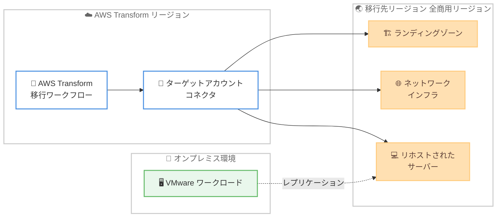

# AWS Transform for migrations - 移行先リージョンの全商用リージョンへの拡大

**リリース日**: 2026 年 6 月 22 日
**サービス**: AWS Transform
**機能**: AWS Transform for migrations の移行先リージョン (Migration Target Region) サポート拡大

📊 [このアップデートのインフォグラフィックを見る](https://takech9203.github.io/aws-news-summary/20260622-aws-transform-migrations-region-expansion.html)
<!-- INFOGRAPHIC_BASE_URL は環境変数から取得 -->

## 概要

AWS Transform for migrations が、すべての AWS 商用リージョンを移行先リージョン (Migration Target Region) としてサポートするようになりました。移行先リージョンとは、移行されたリソースがデプロイされる AWS リージョンを指し、ランディングゾーン、ネットワークインフラストラクチャ、サーバーのリホストが含まれます。

AWS Transform for migrations は、VMware ワークロードなどのオンプレミス環境を AWS へ移行するプロセスを、エージェント主導で自動化するサービスです。移行計画の立案、ネットワーク構成の設計、ランディングゾーンの構築、サーバーのリホストまでの一連の作業を AWS Transform が支援します。今回のアップデートにより、お客様は任意の商用リージョンにワークロードをデプロイできるようになり、データレジデンシー (データの所在地) 要件への対応が容易になりました。

今回新たに追加された移行先リージョンは、米国東部 (北カリフォルニア)、アフリカ (ケープタウン)、アジアパシフィック (バンコク)、アジアパシフィック (香港)、アジアパシフィック (ハイデラバード)、アジアパシフィック (ジャカルタ)、アジアパシフィック (クアラルンプール)、アジアパシフィック (メルボルン)、アジアパシフィック (ニュージーランド)、アジアパシフィック (台北)、カナダ (カルガリー)、欧州 (ミラノ)、欧州 (スペイン)、欧州 (チューリッヒ)、メキシコ (ケレタロ)、中東 (テルアビブ) の 16 リージョンです。移行先リージョンの選択は、AWS Transform for migrations のワークフロー内で利用できます。

**アップデート前の課題**

このアップデート以前は、移行先として選択できるリージョンが限られていました。

- 移行されたリソース (ランディングゾーン、ネットワークインフラ、リホストされたサーバー) を一部のリージョンにしかデプロイできなかった
- データレジデンシー要件のある国や地域のリージョンが移行先として選択できず、規制対応が難しいケースがあった
- 移行先リージョンが対象外の場合、AWS Transform 以外の手段で移行を検討する必要があった

**アップデート後の改善**

今回のアップデートにより、移行先リージョンの選択肢が大幅に拡大しました。

- すべての AWS 商用リージョンを移行先として選択できるようになった
- データレジデンシー要件に合わせて、データを保管すべき国や地域のリージョンにワークロードをデプロイできるようになった
- ローカルなコンプライアンスやレイテンシー要件に合わせた移行先の選択が可能になった

## アーキテクチャ図



AWS Transform の移行ワークフローからターゲットアカウントコネクタを介して、選択した移行先リージョンにランディングゾーン、ネットワークインフラ、リホストされたサーバーがデプロイされます。サーバーのレプリケーションデータは、ソース環境からターゲットアカウントおよびリージョンへ直接転送されます。

## サービスアップデートの詳細

### 主要機能

1. **全 AWS 商用リージョンの移行先サポート**
   - 移行されたリソースのデプロイ先として、すべての AWS 商用リージョンを選択できるようになった
   - 移行先リージョンには、ランディングゾーン、ネットワークインフラストラクチャ、サーバーリホストが含まれる
   - データレジデンシー要件への対応が容易になった

2. **ワークフロー内でのターゲットリージョン選択**
   - 移行先リージョンの選択は、AWS Transform for migrations のワークフロー内に組み込まれている
   - コネクタ作成時にターゲット AWS リージョンを指定する
   - 単一アカウント移行とマルチアカウント移行の両方に対応

3. **新規追加された 16 リージョン**
   - 北米、アフリカ、アジアパシフィック、欧州、中東、メキシコの幅広い地域をカバー
   - 既存のサポート対象リージョンに加えて、商用リージョン全体に拡大

## 技術仕様

### 新規追加された移行先リージョン

| 地域 | リージョン |
|------|------------|
| 北米 | 米国東部 (北カリフォルニア)、カナダ (カルガリー)、メキシコ (ケレタロ) |
| アフリカ | アフリカ (ケープタウン) |
| アジアパシフィック | バンコク、香港、ハイデラバード、ジャカルタ、クアラルンプール、メルボルン、ニュージーランド、台北 |
| 欧州 | ミラノ、スペイン、チューリッヒ |
| 中東 | テルアビブ |

### 移行に関わるアカウントの役割

| アカウント | 説明 |
|------------|------|
| AWS Transform アカウント | AWS Transform をセットアップする AWS Organization 内のメンバーアカウント。AWS Transform ワークスペースが実行される。管理アカウントである必要はない |
| コネクタターゲットアカウント | AWS Transform コネクタが構成されるアカウント。移行タイプによって異なる |
| ターゲットアカウント | ワークロードが移行される AWS アカウント。単一アカウント移行ではコネクタターゲットアカウントと同一、マルチアカウント移行では移行先となる各メンバーアカウント |

### リージョン間のデータ転送に関する注意

移行先 AWS リージョンが AWS Transform のリージョンと異なる場合、一部のデータが AWS リージョン間で転送されます。なお、サーバーのレプリケーションデータは、ソース環境からターゲットアカウントおよびリージョンへ直接転送されます。

## 設定方法

### 前提条件

1. AWS Organization 内のメンバーアカウントに AWS Transform ワークスペースがセットアップされていること
2. ターゲット AWS アカウントに、移行されたインフラストラクチャをサポートするために必要な権限、クォータ、構成が備わっていること
3. マルチアカウント移行の場合、組織管理アカウントまたは AWS Transform MGN と CloudFormation StackSets の両方に登録された委任管理者 (Delegated Administrator) アカウントへの接続

### 手順

#### ステップ 1: 移行タイプの選択

単一アカウント移行 (すべてのワークロードを 1 つのターゲットアカウントに移行) か、マルチアカウント移行 (複数のターゲットアカウントに移行) かを選択します。マルチアカウント移行では、最小権限の原則に従い委任管理者アカウントの利用が推奨されます。

#### ステップ 2: ターゲットアカウントとリージョンの指定

**ジョブプラン**ペインで**ターゲットアカウントの接続**を展開し、**コネクタの作成または選択**を選びます。続いて、ターゲットの AWS アカウントと AWS リージョンを指定します。ここで全商用リージョンの中から移行先リージョンを選択できます。

```text
# 指定する項目
- ターゲット AWS アカウント
- ターゲット AWS リージョン (移行先リージョン)
- 暗号化キー (Amazon S3 マネージドキーまたは独自の KMS キー)
```

ターゲット AWS リージョンがディスカバリ AWS リージョンと異なる場合、AWS Transform はデータを AWS リージョン間で転送します。

#### ステップ 3: コネクタの承認と利用

検証リンクをコピーしてターゲット AWS アカウントの管理者に共有し、接続リクエストの承認を依頼します。承認後、作成したコネクタを一覧から選択して**コネクタを使用**を選び、**AWS Transform に送信**します。コネクタ承認時には、AWS Transform に対してネットワーク構成の管理、CloudFormation スタックのデプロイ、ランディングゾーンインフラのプロビジョニングなどの権限が付与されます。

## メリット

### ビジネス面

- **データレジデンシー要件への対応**: データを保管すべき国や地域のリージョンにワークロードをデプロイできるため、各国の規制やコンプライアンス要件を満たしやすくなる
- **移行プロジェクトの選択肢拡大**: これまで移行先として選べなかったリージョンが利用可能になり、AWS Transform を活用できる移行プロジェクトの範囲が広がる
- **グローバル展開の柔軟性**: エンドユーザーに近いリージョンへの移行により、サービス品質やユーザー体験の向上が期待できる

### 技術面

- **既存ワークフローへの統合**: 移行先リージョンの選択が AWS Transform for migrations のワークフローに組み込まれており、追加の手間なく利用できる
- **一貫した移行プロセス**: ランディングゾーン、ネットワークインフラ、サーバーリホストを含む一連のリソースを、選択した移行先リージョンに統一してデプロイできる
- **レイテンシー最適化**: ユーザーやデータソースに近いリージョンを選択することで、ネットワークレイテンシーを低減できる

## デメリット・制約事項

### 制限事項

- 対象は AWS 商用リージョンのみであり、中国リージョンや AWS GovCloud (US) は本アップデートの対象外
- 移行先 AWS リージョンが AWS Transform のリージョンと異なる場合、一部のデータが AWS リージョン間で転送される
- コネクタタイプは新機能による権限変更時に更新される場合がある (現行のターゲットアカウントコネクタタイプはバージョン 2.0)

### 考慮すべき点

- リージョン間のデータ転送が発生する場合、データ転送に関する料金や転送時間を考慮する必要がある
- コネクタセットアップ時にターゲット AWS アカウントに作成される Amazon S3 バケットは、デフォルトでは HTTPS のみのアクセス (SecureTransport) を強制しないため、必要に応じてバケットポリシーを更新する
- 移行先リージョンで利用したいサービスやインスタンスタイプが、そのリージョンで提供されているかを事前に確認する必要がある

## ユースケース

### ユースケース 1: データレジデンシー要件のある国へのワークロード移行

**シナリオ**: 国内のデータ保護規制により、特定の国のリージョンにデータを保管する必要がある企業が、オンプレミスの VMware ワークロードを AWS へ移行する。

**実装例**:
```text
1. AWS Transform for migrations のワークフローを開始
2. ターゲットアカウントコネクタの作成時に、規制要件を満たすリージョン
   (例: アジアパシフィック (ジャカルタ)、欧州 (スペイン) など) を選択
3. 選択したリージョンにランディングゾーンとワークロードをデプロイ
```

**効果**: データレジデンシー要件を満たしながら、自動化された移行プロセスを活用できる。

### ユースケース 2: エンドユーザーに近いリージョンへの移行によるレイテンシー改善

**シナリオ**: 東南アジアや中東の顧客向けにサービスを提供する企業が、ユーザーに近いリージョンへワークロードを移行してレイテンシーを改善したい。

**実装例**:
```text
1. ターゲットリージョンとして、アジアパシフィック (バンコク)、
   アジアパシフィック (クアラルンプール)、中東 (テルアビブ) などを選択
2. AWS Transform でサーバーリホストとネットワークインフラを構築
```

**効果**: エンドユーザーに地理的に近いリージョンで稼働させることで、ネットワークレイテンシーを低減し、ユーザー体験を向上できる。

### ユースケース 3: 新規リージョンへのグローバル拡張

**シナリオ**: 欧州での事業拡大に伴い、欧州 (ミラノ) や欧州 (チューリッヒ) など、これまで AWS Transform の移行先として選択できなかったリージョンへ既存ワークロードを展開したい。

**実装例**:
```text
1. マルチアカウント移行を選択し、委任管理者アカウントを使用
2. 各事業地域に対応する移行先リージョンを指定
3. ランディングゾーンとワークロードを各リージョンに統一的にデプロイ
```

**効果**: 拡大する事業地域に合わせて、一貫した移行プロセスでグローバルにワークロードを展開できる。

## 料金

AWS Transform for migrations の利用自体に追加料金は発生しません。移行先リージョンの拡大に伴う追加料金もありません。ただし、移行されたワークロードが利用する各 AWS サービス (Amazon EC2、Amazon VPC、AWS Control Tower など) の利用料金は、選択した移行先リージョンの料金体系に従って発生します。また、移行先 AWS リージョンが AWS Transform のリージョンと異なる場合、一部のデータが AWS リージョン間で転送され、データ転送料金が発生する可能性があります。

詳細な料金については、各 AWS サービスの料金ページを参照してください。

## 利用可能リージョン

AWS Transform for migrations の移行先リージョンとして、すべての AWS 商用リージョンがサポートされます。今回新たに追加された移行先リージョンは以下の 16 リージョンです。

- 米国東部 (北カリフォルニア)
- アフリカ (ケープタウン)
- アジアパシフィック (バンコク)
- アジアパシフィック (香港)
- アジアパシフィック (ハイデラバード)
- アジアパシフィック (ジャカルタ)
- アジアパシフィック (クアラルンプール)
- アジアパシフィック (メルボルン)
- アジアパシフィック (ニュージーランド)
- アジアパシフィック (台北)
- カナダ (カルガリー)
- 欧州 (ミラノ)
- 欧州 (スペイン)
- 欧州 (チューリッヒ)
- メキシコ (ケレタロ)
- 中東 (テルアビブ)

サポートされる移行先リージョンの最新の一覧は、公式ドキュメントを参照してください。

## 関連サービス・機能

- **AWS Application Migration Service (MGN)**: AWS Transform for migrations のサーバーリホストで利用される、サーバー移行を自動化するサービス
- **AWS Control Tower**: ランディングゾーンの構築とガバナンス管理に利用される
- **AWS Migration Acceleration Program (MAP)**: 移行プロジェクトを支援するプログラム。MPE ID を指定することで MAP タグが移行リソースに適用される
- **AWS CloudFormation StackSets**: マルチアカウント移行において、複数アカウントへのリソースデプロイに利用される

## 参考リンク

- 📊 [インフォグラフィック](https://takech9203.github.io/aws-news-summary/20260622-aws-transform-migrations-region-expansion.html)
- [公式発表 (What's New)](https://aws.amazon.com/about-aws/whats-new/2026/06/aws-transform-migrations-region-expansion/)
- [ドキュメント (Connect target AWS accounts and regions)](https://docs.aws.amazon.com/transform/latest/userguide/transform-vmware-connect-target-account.html#transform-vmware-cta-supported-regions)
- [AWS Migration Acceleration Program](https://aws.amazon.com/migration-acceleration-program/)

## まとめ

今回のアップデートにより、AWS Transform for migrations はすべての AWS 商用リージョンを移行先としてサポートし、データレジデンシー要件への対応やグローバル展開がより柔軟になりました。移行プロジェクトを計画しているお客様は、規制要件やレイテンシー要件に応じて最適な移行先リージョンを選択できます。VMware ワークロードなどの移行を検討している場合は、AWS Transform for migrations のワークフローで移行先リージョンの選択肢を確認することをお勧めします。
